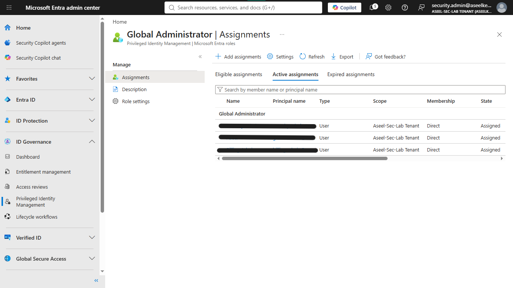
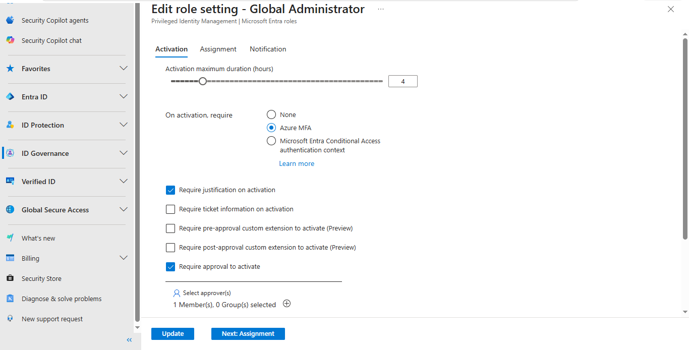
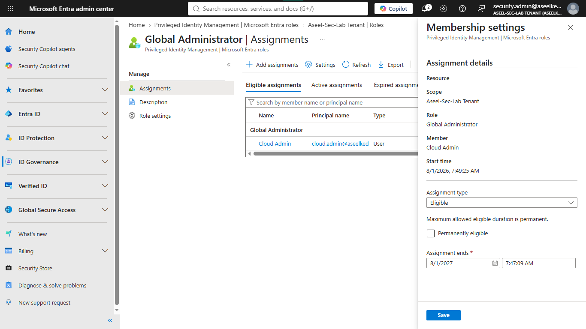
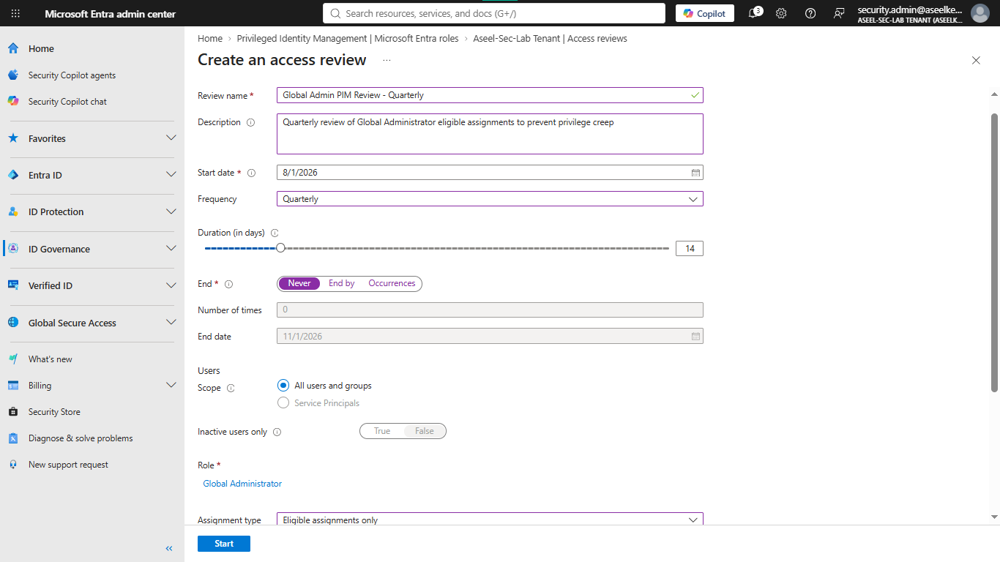
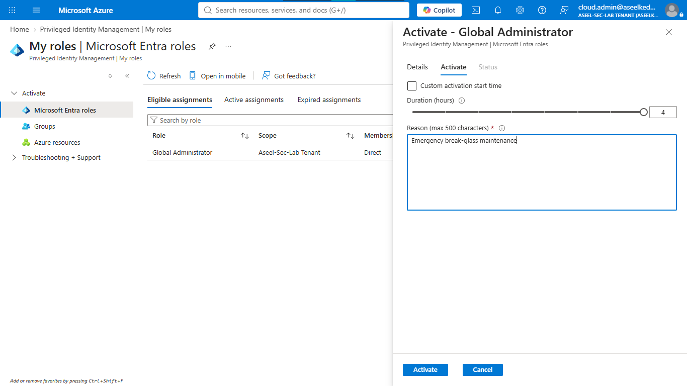
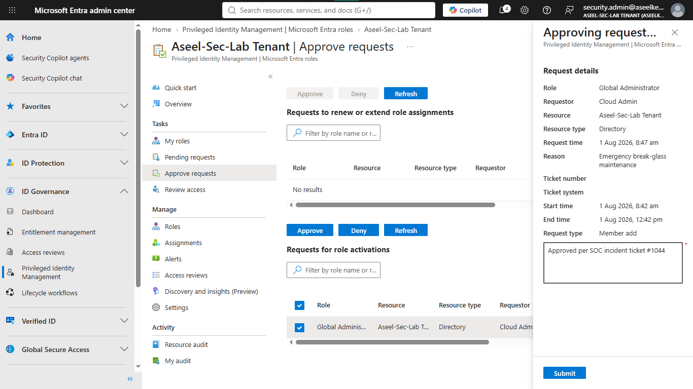

# Lab 01: Implementing Privileged Identity Management (PIM)

## Objective
This lab demonstrates how to secure a Microsoft Entra ID and Azure environment by eliminating standing privileges for highly sensitive administrative roles. By following this guide, you will configure Privileged Identity Management (PIM) to enforce Just-In-Time (JIT) access, multi-factor authentication (MFA), approval workflows, and continuous access lifecycle governance.

## Security Architecture Concepts
- Principle of Least Privilege: Reducing the surface area for attack by ensuring administrators only have access when necessary.
- Just-In-Time (JIT) Access: Providing elevated permissions for a limited duration.
- Identity Lifecycle Governance: Implementing automated review cycles to ensure access is periodically audited.

**Tools/Services Used:** Microsoft Entra ID, Privileged Identity Management (PIM), Azure Multi-Factor Authentication (MFA).

## Prerequisites
- An active Azure Subscription and a Microsoft Entra ID tenant.
- Microsoft Entra ID P2 licenses activated and assigned to admin users.
- Two dedicated test accounts created in your tenant (with 'Usage Location' set):
    - `securityadmin`: Designated approver for access requests.
    - `cloudadmin`: Standard IT operations account requesting elevation.

## Implementation Guide
### Task 1: Baseline Privilege Assessment
1. Log into the [Microsoft Entra admin center](https://entra.microsoft.com).
2. In the top search bar, type `Privileged Identity Management` and click on it.
3. On the left menu, under **Manage**, click on **Microsoft Entra roles**.
4. On the left menu, under **Manage**, click on **Roles**.
5. Search for the "Global Administrator" role and click on it.
6. Review the "Active assignments" tab to identify accounts with permanent standing access.

### Task 2: PIM Role Settings and Workflow Configuration
1. In the PIM **Microsoft Entra roles** blade, click on **Settings** in the left menu.
2. In the list of roles, search for `Global Administrator` and click on it.
3. Click the **Edit** button at the top of the screen.
4. On the **Activation** tab, configure the following:
    - **Maximum duration (hours):** Change the slider to `4`.
    - **Require justification on active assignment:** Check the box.
    - **Require approval to activate:** Check the box.
5. Click **Select approvers**, search for your `securityadmin` account, select it, and click **Select**.
6. Click the **Update** button at the bottom.

### Task 3: Eligible Role Assignment Implementation
1. Go back to PIM > **Microsoft Entra roles** > **Roles**.
2. Search for `Global Administrator` and click on it.
3. Click **+ Add assignments** at the top.
4. Under **Select member(s)**, click the blue link "No member selected".
5. Search for your `cloudadmin` test account, click it, and click **Select**.
6. Click **Next** at the bottom.
7. On the **Settings** tab, ensure **Assignment type** is set to **Eligible**.
8. Click **Assign**.

### Task 4: Azure Resource Role PIM Configuration
1. Navigate to the main Privileged Identity Management overview page.
2. Under **Manage**, select **Azure resources**, and click on your subscription.
3. Click **Roles**, search for the "Owner" role, and click on it.
4. Click **+ Add assignments**, select `cloudadmin` as the member, and click **Next**.
5. Set the **Assignment type** to **Eligible**, uncheck **Permanently eligible**, set the **End Date** to 90 days from today, and click **Assign**.

### Task 5: Access Review and Alert Configuration
1. Go back to PIM > **Microsoft Entra roles**.
2. On the left menu, under **Manage**, click on **Access reviews**.
3. Click **+ New** at the top and configure the following:
    - **Review name:** Monthly Global Admin Review
    - **Frequency:** Select **Monthly**.
    - **End:** Select **Never**.
    - **Scope:** Select **Users and Groups**.
    - **Review role:** Select **Global Administrator**.
    - **Reviewers:** Select **Selected users or groups**.
    - Click **Select reviewers**, find your `securityadmin` account, select it, and click **Select**.
4. Scroll to the bottom and click **Start**.

## Testing and Verification
1. Open a Private/Incognito window and authenticate as `cloudadmin` at [portal.azure.com](https://portal.azure.com).
2. Navigate to **Privileged Identity Management** > **My roles**.
3. Click **Activate** for the Global Administrator role, provide a business justification (e.g., "Need to review security logs for an alert"), and submit.

4. Switch to the `securityadmin` session, navigate to **Privileged Identity Management** > **Approve requests** > **Microsoft Entra roles**.
5. Select the pending request from `cloudadmin`, click **Approve**, and enter a ticket reference (e.g., INC-9942).

6. Return to the `cloudadmin` session, refresh **My roles**, and verify the role appears under "Active assignments" with a 4-hour limit.

## References
- [Microsoft Entra Privileged Identity Management Documentation](https://learn.microsoft.com/en-us/entra/id-governance/privileged-identity-management/pim-configure)
