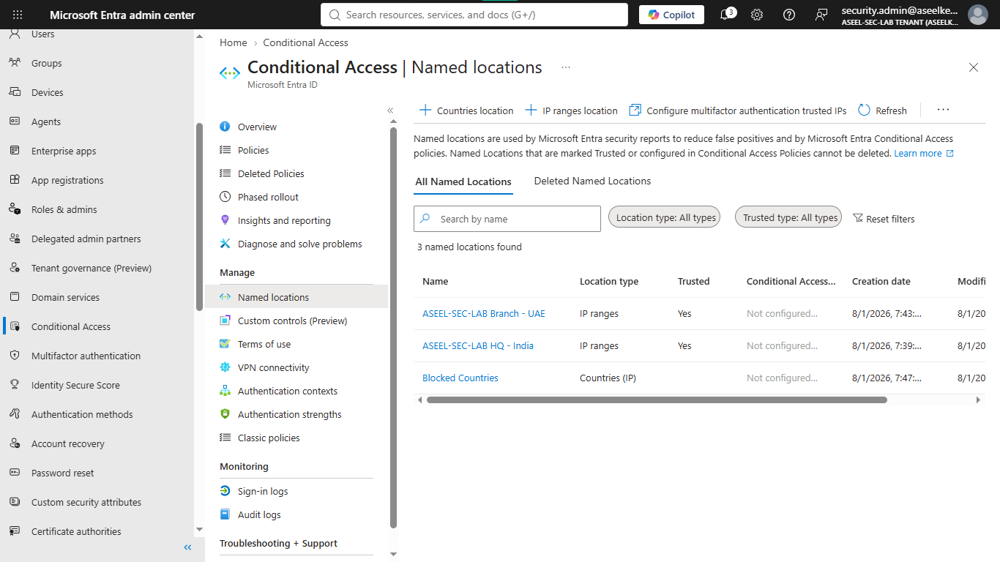
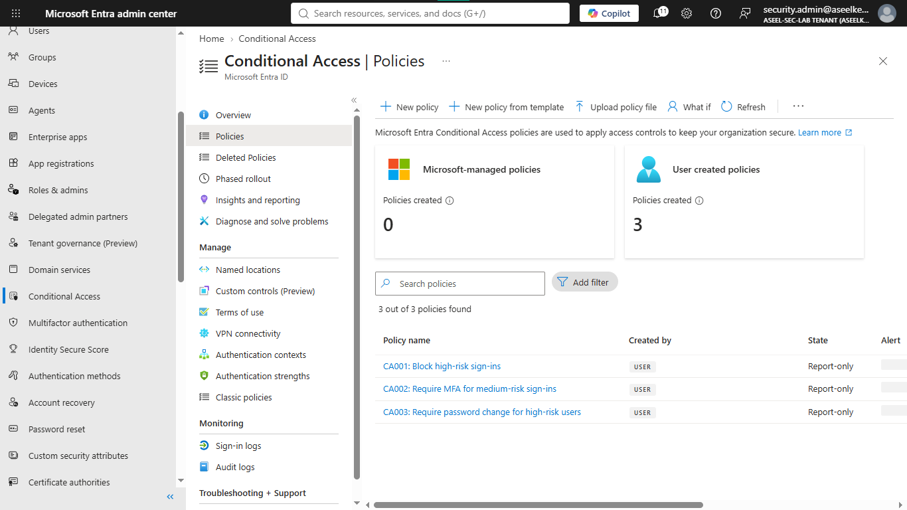
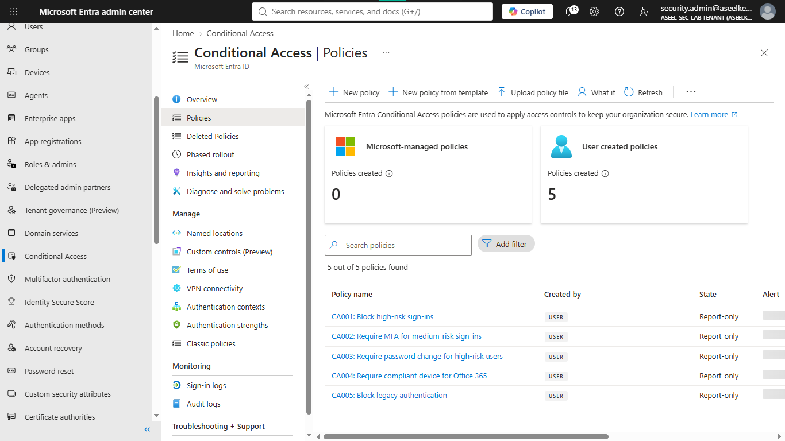
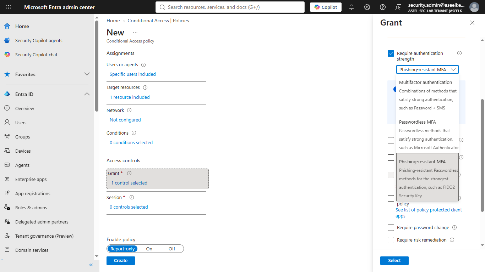
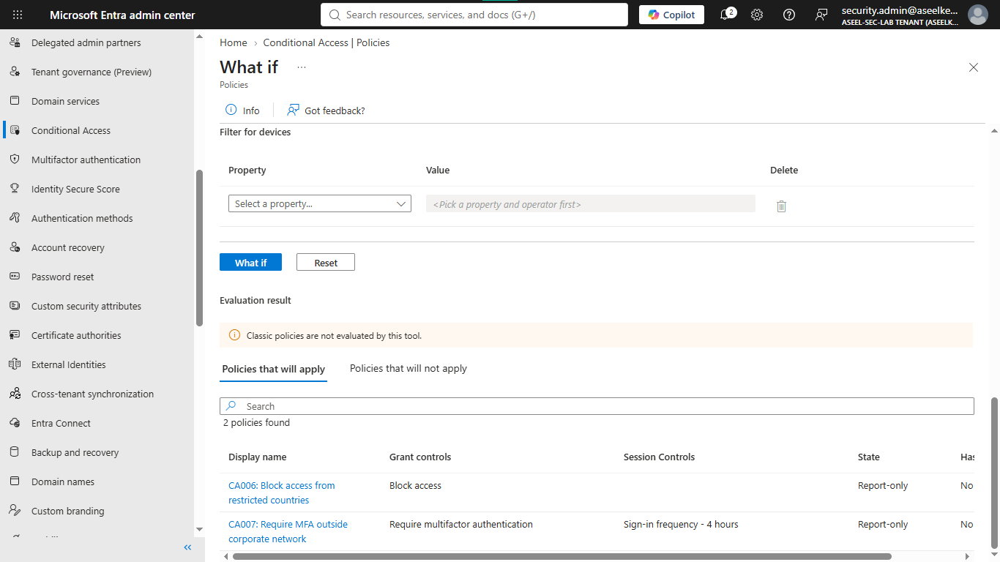
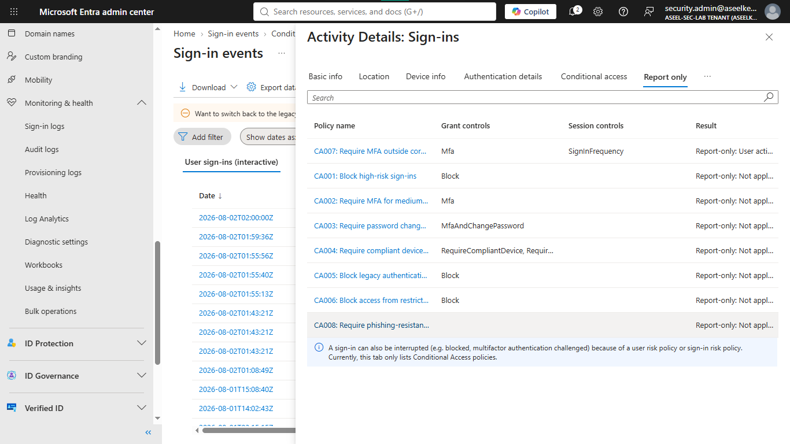
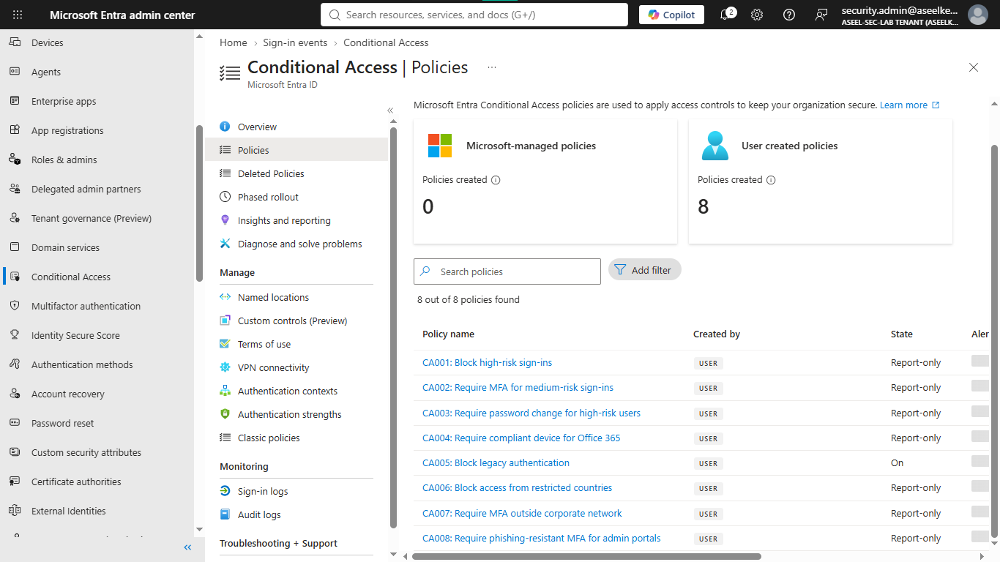

# Lab 02: Layered Conditional Access Strategy

## Objective
This lab demonstrates how to design and implement a layered Conditional Access (CA) strategy in Microsoft Entra ID to mitigate credential stuffing and unauthorized access. You will configure location-based restrictions, enforce compliant devices for sensitive applications, and apply risk-based controls to automatically block or challenge suspicious sign-ins.

## Security Architecture Concepts
- Risk-Based Access Control: Automating responses to sign-in and user risk signals.
- Zero Trust Perimeter: Enforcing security policies based on location, device compliance, and user context.
- Legacy Authentication Blocking: Removing vulnerable protocols that bypass modern MFA.

**Tools/Services Used:** Microsoft Entra ID, Conditional Access Policies, Microsoft Intune, Identity Protection.

## Prerequisites
- Microsoft Entra ID P2 license (required for Identity Protection risk-based policies).
- Microsoft Intune license (for device compliance integration).
- Designated test user accounts and a "Break Glass" administrative account for exclusion.

## Implementation Guide
### Task 1: Define Corporate and Restricted Networks
1. Sign in to the [Microsoft Entra admin center](https://entra.microsoft.com/).
2. Navigate to **Protection** > **Conditional Access** > **Named locations**.
3. Click **+ IP ranges location** to create "Contoso HQ - Seattle":
    - Name: `Contoso HQ - Seattle`
    - Check: `Mark as trusted location`
    - IP range: `203.0.113.0/24`
    - Click **Create**.
4. Click **+ IP ranges location** to create "Contoso Branch - London":
    - Name: `Contoso Branch - London`
    - Check: `Mark as trusted location`
    - IP range: `192.0.2.0/24`
    - Click **Create**.
5. Click **+ Countries location** to create "Blocked Countries":
    - Name: `Blocked Countries`
    - Select: `Determine location by IP address`
    - Choose: Select high-risk regions (e.g., North Korea, Iran, Russia, China).
    - Check: `Include unknown countries and regions`
    - Click **Create**.

### Task 2: Configure Risk-Based Access Controls
1. Navigate to **Conditional Access** > **Policies** > **+ New policy**.
2. Configure "CA001 Block high-risk sign-ins":
    - Name: `CA001 Block high-risk sign-ins`
    - Users: Include `All users`, Exclude `CA-Exclusions-BreakGlass`.
    - Target resources: `All resources`.
    - Conditions: `Sign-in risk` > `High`.
    - Grant: `Block access`.
    - Enable policy: `Report-only`. Click **Create**.
3. Configure "CA002 Require MFA for medium-risk sign-ins":
    - Name: `CA002 Require MFA for medium-risk sign-ins`
    - Users: Include `All users`, Exclude `CA-Exclusions-BreakGlass`.
    - Conditions: `Sign-in risk` > `Medium`.
    - Grant: `Require multifactor authentication`.
    - Enable policy: `Report-only`. Click **Create**.
4. Configure "CA003 Require password change for high-risk users":
    - Name: `CA003 Require password change for high-risk users`
    - Users: Include `All users`, Exclude `CA-Exclusions-BreakGlass`.
    - Conditions: `User risk` > `High`.
    - Grant: `Require multifactor authentication` AND `Require password change`.
    - Enable policy: `Report-only`. Click **Create**.

### Task 3: Enforce Device Compliance and Block Legacy Auth
1. Configure "CA004 Require compliant device":
    - Name: `CA004 Require compliant device for Office 365`
    - Users: Include `Standard-Employees`.
    - Target resources: `Office 365 Exchange Online` and `SharePoint Online`.
    - Conditions: `Locations` > `Any location`, Exclude `All trusted locations`.
    - Grant: `Require device to be marked as compliant` OR `Require Microsoft Entra hybrid joined device`.
    - Enable policy: `Report-only`. Click **Create**.
2. Configure "CA005 Block legacy authentication":
    - Name: `CA005 Block legacy authentication`
    - Users: Include `All users`, Exclude `CA-Exclusions-BreakGlass`.
    - Conditions: `Client apps` > Check `Exchange ActiveSync clients` and `Other clients`.
    - Grant: `Block access`.
    - Enable policy: `Report-only`. Click **Create**.

### Task 4: Apply Location-Based Restrictions
1. Configure "CA006 Block access from restricted countries":
    - Name: `CA006 Block access from restricted countries`
    - Conditions: `Locations` > Include `Selected locations` > `Blocked Countries`.
    - Grant: `Block access`.
    - Enable policy: `Report-only`. Click **Create**.
2. Configure "CA007 Require MFA outside corporate network":
    - Name: `CA007 Require MFA outside corporate network`
    - Conditions: `Locations` > `Any location`, Exclude `All trusted locations`.
    - Grant: `Require multifactor authentication`.
    - Session: `Sign-in frequency` > `4 Hours`.
    - Enable policy: `Report-only`. Click **Create**.

## Testing and Verification
1. Navigate to **Conditional Access** > **What If**.
2. Select a test user and set the Network Country to a restricted region (e.g., China).
3. Execute the simulation and verify that `CA006` applies and successfully blocks the simulated sign-in.
4. Navigate to **Entra ID** > **Monitoring** > **Sign-in logs**.
5. Select a test user's sign-in event and review the "Report-only" tab to verify policies evaluated correctly in the background.
6. Once validated, toggle policies from "Report-only" to "On" in the Conditional Access policy list.

## References
- [Microsoft Conditional Access Documentation](https://learn.microsoft.com/en-us/entra/identity/conditional-access/)
