# Lab 03: Authentication Methods and Passwordless Authentication

## Objective
This lab demonstrates a phased rollout of passwordless authentication to reduce password-related support tickets and mitigate SMS-based phishing. You will enforce FIDO2/Passkey for administrators, implement number matching for Microsoft Authenticator, and utilize Temporary Access Passes (TAP) for secure onboarding.

## Security Architecture Concepts
- Passwordless Authentication: Eliminating password-related risks by using FIDO2/Passkeys.
- MFA Fatigue Mitigation: Using number matching to ensure the user is actively engaged during sign-in.
- Secure Bootstrapping: Using Temporary Access Passes (TAP) to provision credentials without initial passwords.

**Tools/Services Used:** Microsoft Entra ID, Microsoft Authenticator, FIDO2/Passkey.

## Prerequisites
- Microsoft Entra ID P1 or P2 license.
- Authentication Policy Administrator or Global Administrator role.
- Designated privileged group (`No-SMS-Voice-Auth`) to exclude from telephony methods.

## Implementation Guide
### Task 1: Authentication Method Registration Analysis
1. Sign in to the [Microsoft Entra admin center](https://entra.microsoft.com/).
2. On the far-left menu, click on **Protection**, then click on **Authentication methods**.
3. Under the "Activity" section on the left, click on **User registration details**.
4. Review the dashboard to identify users registered for Multi-Factor Authentication (MFA) and those unprotected.
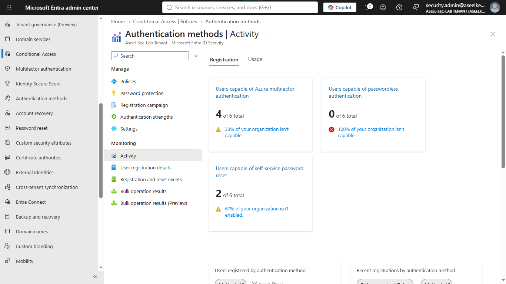

### Task 2: Microsoft Authenticator Policy Configuration
1. On the left menu, click on **Policies** (under Authentication methods).
2. Click on **Microsoft Authenticator** from the list.
3. On the **Enable and Target** tab:
    - Click the toggle to switch **Enable** to `Yes`.
    - Set **Target** to `All users`.
    - Change **Authentication mode** to `Any`.
4. Click on the **Configure** tab.
5. Set **Require number matching for push notifications** to `Enabled`.
6. Click **Save** at the bottom.
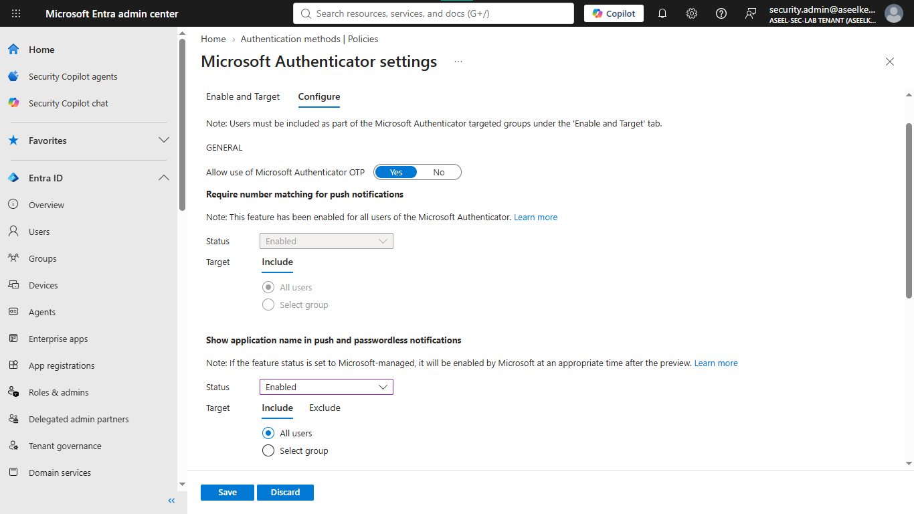

### Task 3: Telephony Authentication Restriction Configuration
1. Go back to the **Policies** list.
2. Click on **SMS**.
3. Toggle **Enable** to `Yes`.
4. Ensure the **Target** says `All users`.
5. Click on the **Exclude** tab.
6. Click **Add groups**, search for your Admin test group (`No-SMS-Voice-Auth`), select it, and click **Select**.
7. Click **Save** at the bottom. Repeat this for the **Voice call** policy.
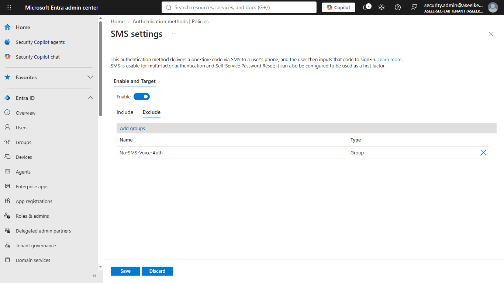

### Task 4: Temporary Access Pass (TAP) Policy Implementation
1. Go back to the **Policies** list and click on **Temporary Access Pass**.
2. Toggle **Enable** to `Yes` and target `All users`.
3. Click the **Configure** tab and ensure the following:
    - **Minimum lifetime:** 1 hour
    - **Maximum lifetime:** 8 hours
    - **Default lifetime:** 1 hour
    - **Require one-time use:** No
4. Click **Save**.
5. To generate a TAP: Go to **Identity** > **Users** > **All users**. Click on the name of your test user.
6. On the left menu, click **Authentication methods**, then click **+ Add authentication method**.
7. Select **Temporary Access Pass**, set the duration, and click **Add**. Copy the passcode.
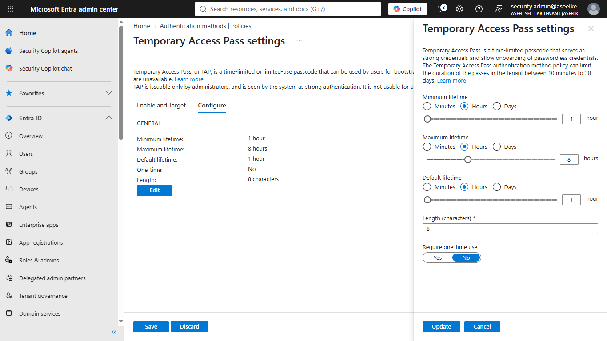
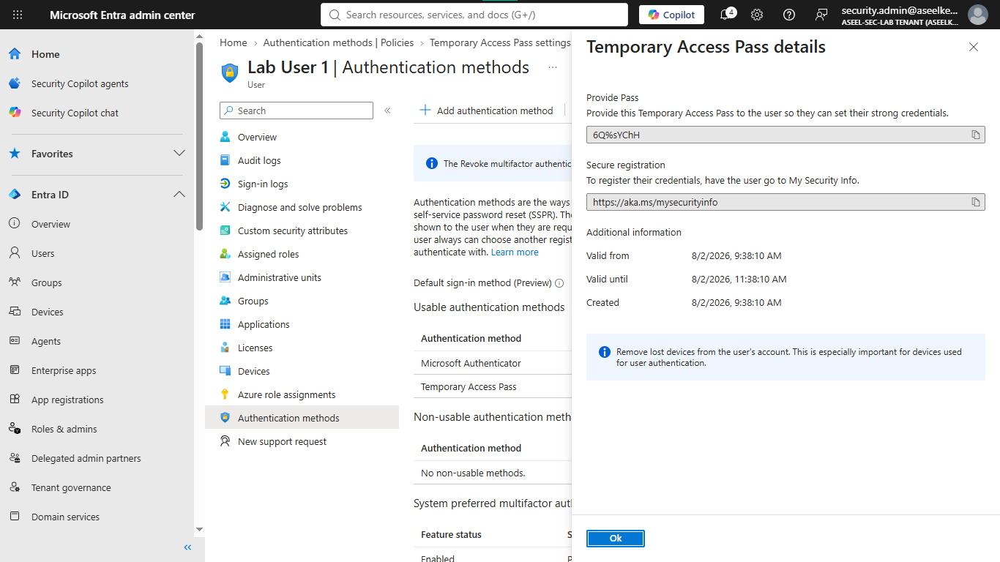

### Task 5: Passkey (FIDO2) Policy Implementation
1. Go back to **Protection** > **Authentication methods** > **Policies**.
2. Click on **Passkey (FIDO2)**.
3. Toggle **Enable** to `Yes`.
4. Click the **Configure** tab.
5. Under "Passkey profiles", click on the **Default passkey profile**.
6. Set **Passkey types** to `Device-bound`, **Enforce attestation** to `Yes`, and **Target specific AAGUIDs** to `Allow`.
7. Click **+ Add AAGUID**, add `Windows Hello`, and hit **Save**.
8. Repeat to add `Microsoft Authenticator` AAGUID and hit **Save**.
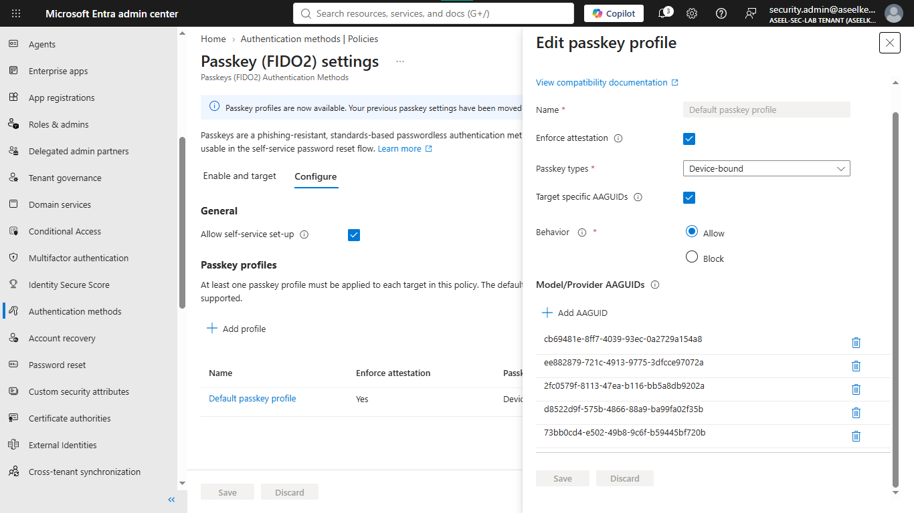

### Task 6: Authentication Registration Campaign Configuration
1. On the left menu under Authentication methods, click **Registration campaign**.
2. Click **Edit** at the top.
3. Change the **State** dropdown to `Enabled`.
4. Set "Authentication method" to `Microsoft Authenticator`.
5. Set "Days allowed to snooze" to `1`.
6. Set "Include" to `All users`.
7. Click **Save**.
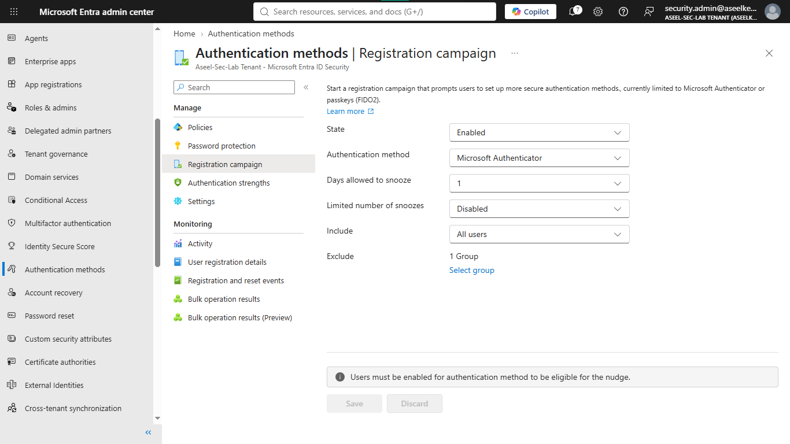

## Testing and Verification
1. Open a new Incognito window, go to `https://aka.ms/mysecurityinfo`, and log in using your test user with the Temporary Access Pass code.
2. Register the account in the Microsoft Authenticator app on your phone.
3. Select the account in the app and enable "Phone sign-in".
4. Sign out and sign back in; verify it asks for the number matching code instead of a password.
5. Sign out, and sign back into `https://aka.ms/mysecurityinfo` as an admin in the blocked group (Task 3); ensure "Phone/Text message" is blocked.
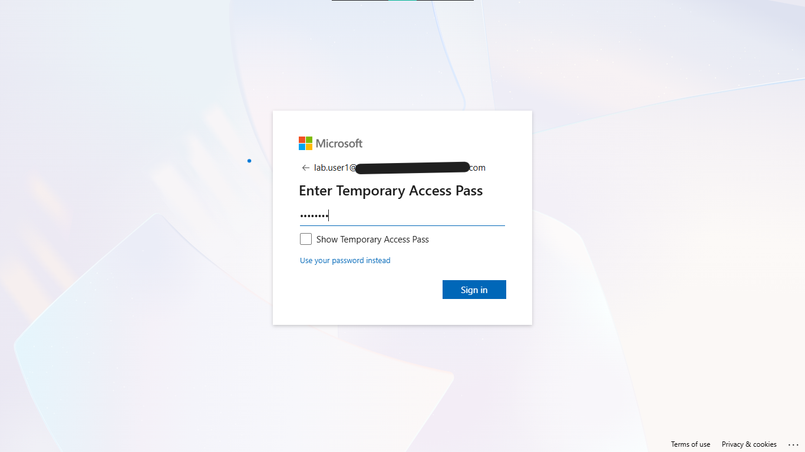
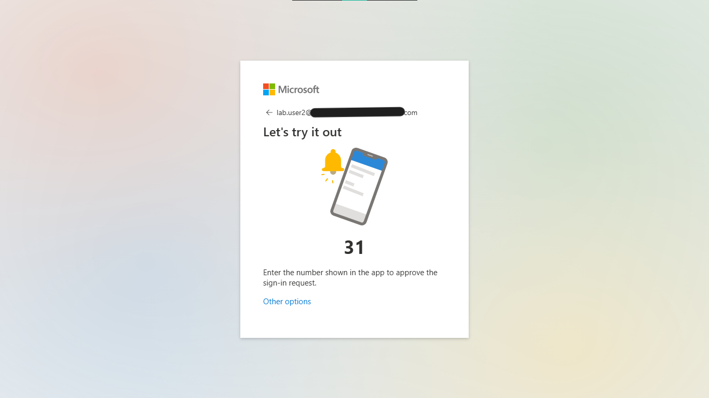
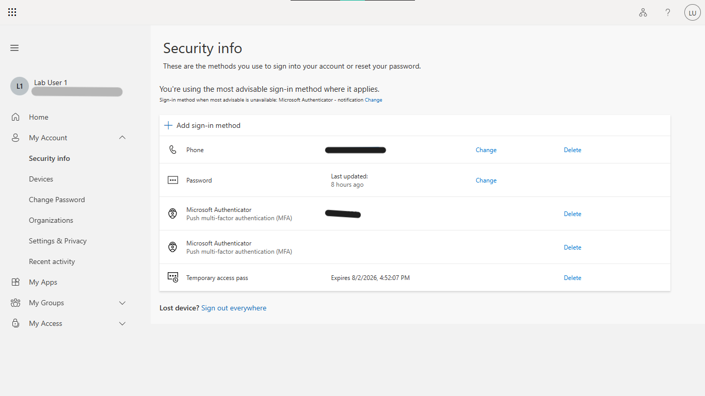
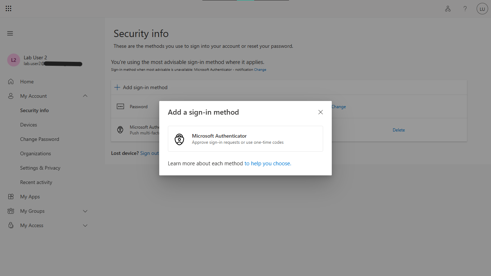

## References
- [Microsoft Passwordless Authentication Documentation](https://learn.microsoft.com/en-us/entra/identity/authentication/concept-authentication-passwordless)
