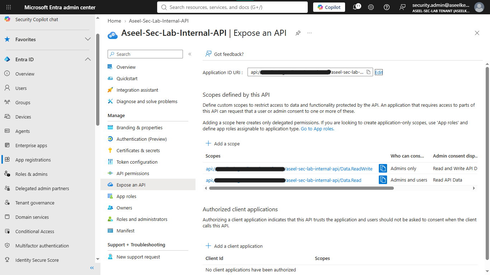
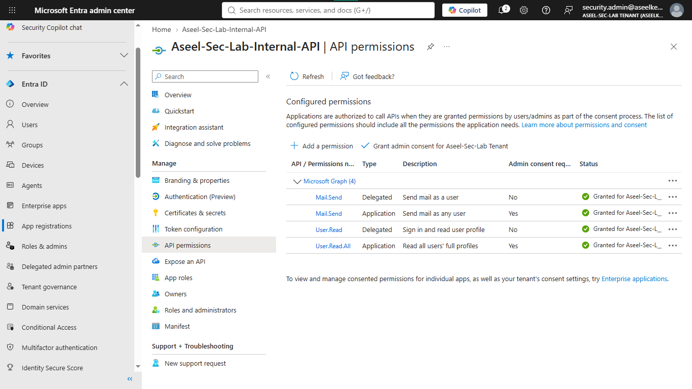
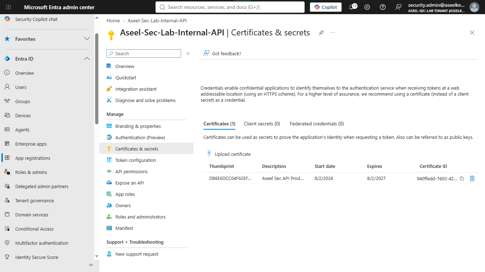
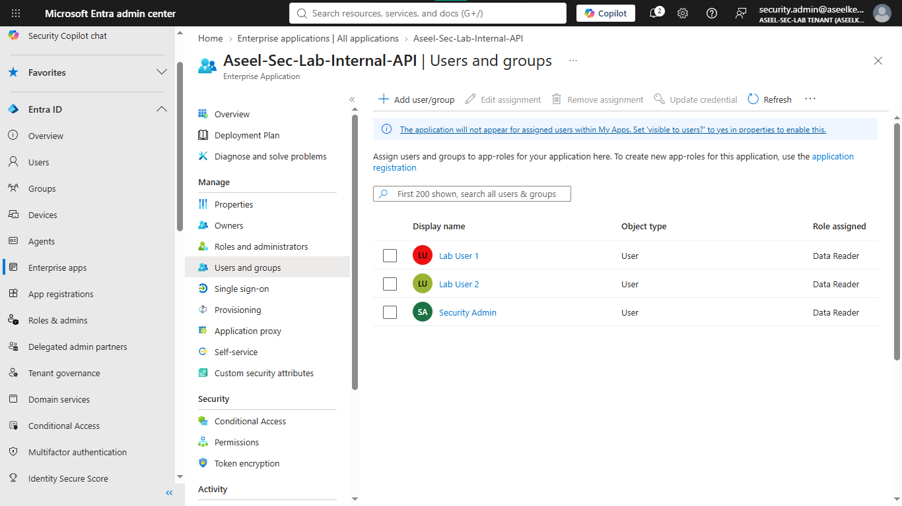
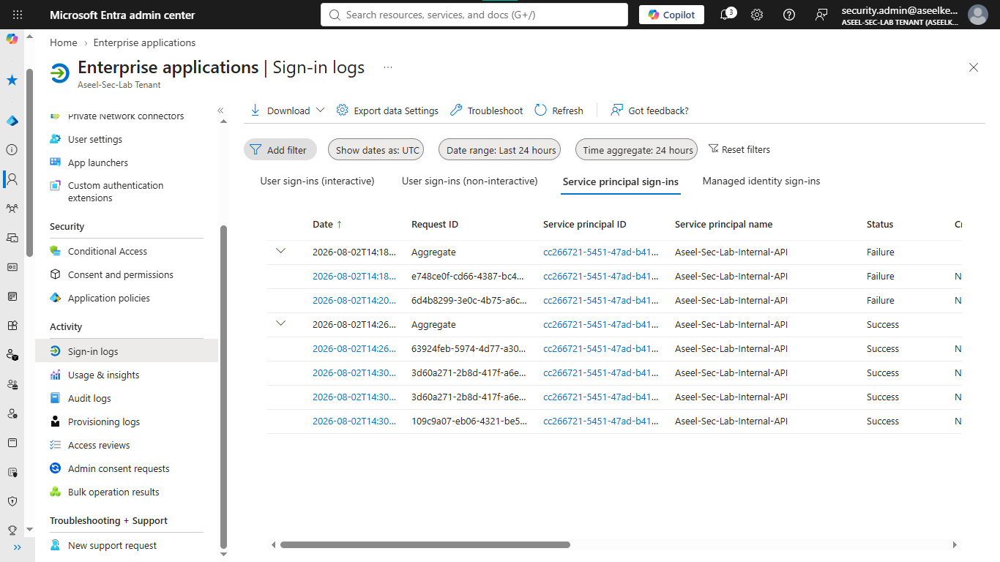
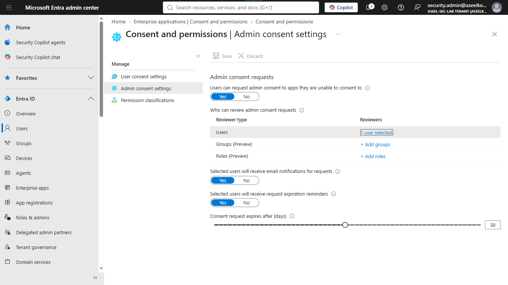
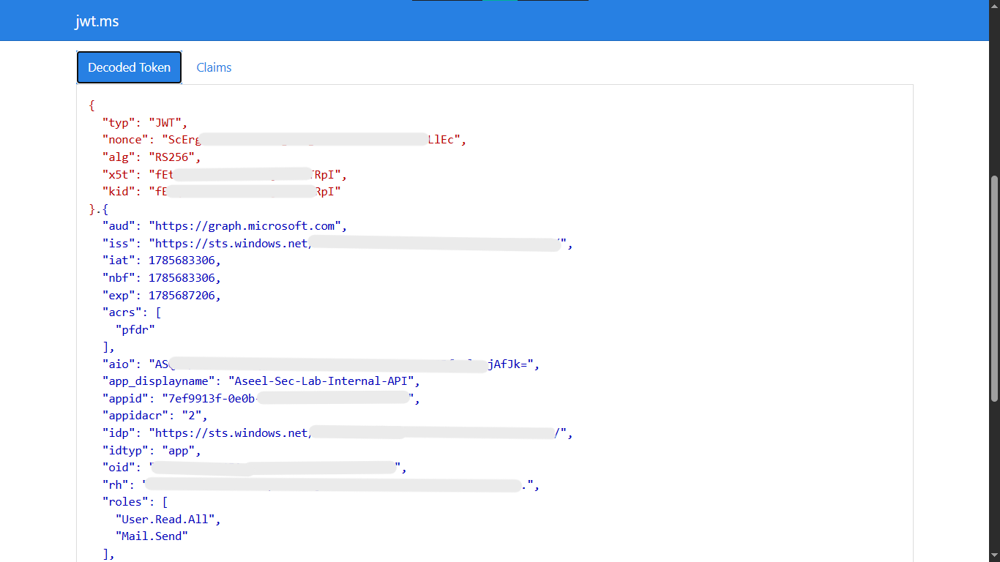

# Lab 04: Enterprise Applications and Application Registrations

## Objective
This lab demonstrates how to register an application, implement strict role-based access control (RBAC), enforce certificate-based authentication (CBA) to eliminate client secrets, and lock down tenant-wide consent to prevent shadow IT.

## Security Architecture Concepts
- Identity-Based Security: Replacing vulnerable client secrets with certificate-based authentication.
- Least Privilege: Defining explicit delegated and application permissions for Microsoft Graph.
- Shadow IT Mitigation: Restricting tenant-wide application registration and user consent.

**Tools/Services Used:** Microsoft Entra ID, Microsoft Graph API, OpenSSL, PowerShell.

## Prerequisites
- Microsoft Entra ID tenant.
- Global Administrator or Application Administrator role.
- OpenSSL and PowerShell installed.

## Implementation Guide
### Task 1: Application Registration and Configuration
1. Log in to the [Microsoft Entra admin center](https://entra.microsoft.com/).
2. On the left-hand menu, click **Identity**, then **Applications**, and select **App registrations**.
3. Click the **+ New registration** button.
4. **Name:** `Contoso-Internal-API`.
5. **Supported account types:** Select the top option (Accounts in this organizational directory only).
6. **Redirect URI:** Change the dropdown to **Web** and type `https://api.contoso.com/auth/callback`. Click **Register**.
7. **Set Up Login Rules:** On the left menu, click **Authentication**. Under "Web", click **Add URI** and type `https://localhost:5001/auth/callback`. Scroll down to "Implicit grant and hybrid flows", check the box for **ID tokens**, and click **Save**.
8. **Create Custom Permissions:** On the left menu, click **Expose an API**. Next to "Application ID URI", click **Add** and click **Save**.
9. Click **+ Add a scope** and create `Data.Read` (Admins and users).
10. Click **+ Add a scope** and create `Data.ReadWrite` (Admins only).

### Task 2: Microsoft Graph API Permission Assignment
1. On the left menu, click **API permissions**.
2. Click **+ Add a permission**, then select **Microsoft Graph**.
3. Click **Delegated permissions**, search for `User.Read` and `Mail.Send`, and check the boxes.
4. Click **Application permissions**, search for `User.Read.All` and `Mail.Send`, and check the boxes.
5. Click **Add permissions**.
6. **Crucial Security Step:** At the top of the screen, click **Grant admin consent for [Your Directory Name]** and click **Yes**.

### Task 3: Certificate-Based Authentication (CBA) Implementation
1. Open Git Bash on your computer.
2. Run: `openssl req -x509 -newkey rsa:2048 -keyout contoso-api-key.pem -out contoso-api-cert.pem -days 365 -nodes -subj "/CN=Contoso-Internal-API/O=Contoso Ltd"`
3. Go to the Entra website. On the left menu of your app, click **Certificates & secrets**.
4. Click the **Certificates** tab, then **Upload certificate**, browse to `contoso-api-cert.pem`, and click **Add**.
5. Ensure the **Client secrets** tab is completely empty.

### Task 4: Application Role (RBAC) Configuration
1. On the left menu, click **App roles**.
2. Click **+ Create app role**.
    - **Display name:** `Data Reader`
    - **Allowed member types:** `Users/Groups`
    - **Value:** `Data.Reader`
    - **Description:** `Can read data`
    - Click **Apply**.
3. To assign: Click **Home** (top left), click **Enterprise applications**, search for and click `Contoso-Internal-API`.
4. On the left menu, click **Users and groups**.
5. Click **+ Add user/group**, select a test user, select the `Data Reader` role, and click **Assign**.

### Task 5: Application Security Auditing
1. While still in the **Enterprise applications** menu for your app, look at the left sidebar and scroll to **Sign-in logs**.
2. Click the **Service Principal sign-ins** tab to view application-level logins.

### Task 6: Tenant-Wide Application and Consent Restrictions
1. Go back to the main Microsoft Entra ID overview page.
2. Expand **Users** on the left menu and click **User settings**.
3. Under "App registrations", switch **Users can register applications** to `No` and click **Save**.
4. Go back to **Enterprise applications** on the left menu.
5. Click **Consent and permissions**.
6. Under "User consent settings", click **Do not allow user consent**.
7. Under "Admin consent settings", switch to `Yes` and select your admin account as the reviewer. Click **Save**.

## Testing and Verification
1. In Git Bash, run: `openssl pkcs12 -export -out contoso-api-cert.pfx -inkey contoso-api-key.pem -in contoso-api-cert.pem -passout pass:`
2. Run the PowerShell script provided in the lab to authenticate using the `.pfx` certificate and get an access token.
3. Paste the token into `jwt.ms` to verify the `roles` claim matches the assigned permissions.

## References
- [Microsoft Entra App Registration Documentation](https://learn.microsoft.com/en-us/entra/identity-platform/quickstart-register-app)
