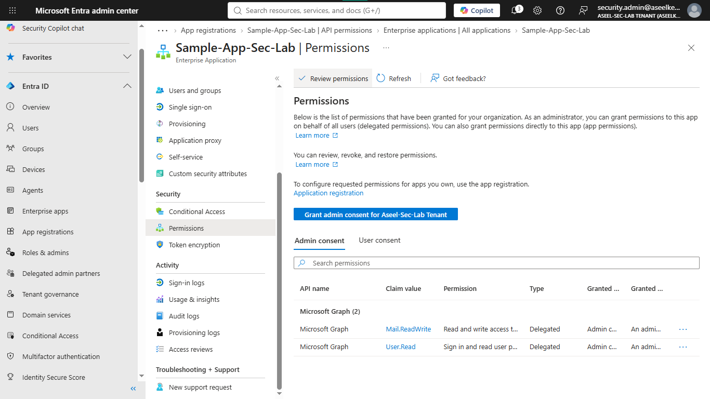
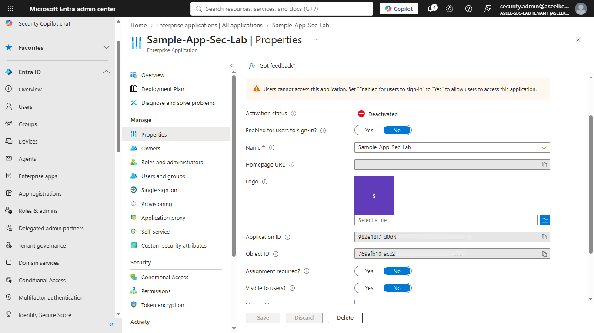
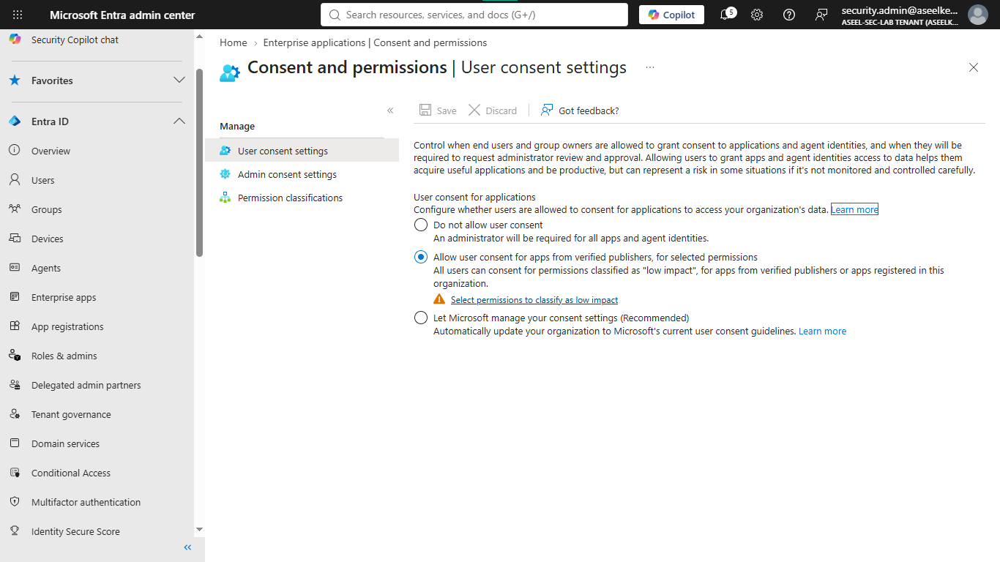
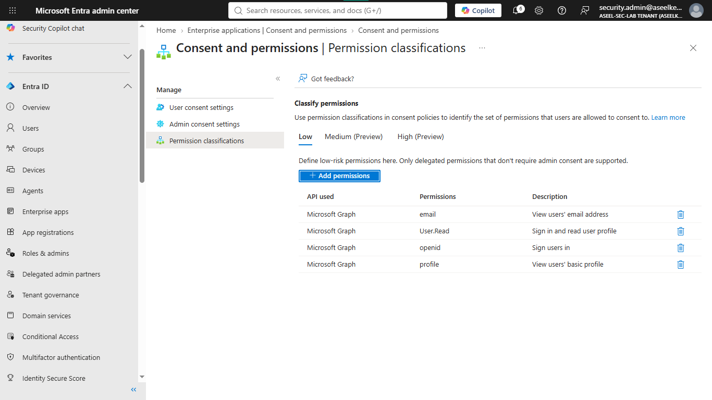
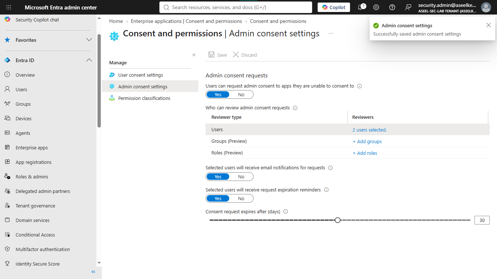
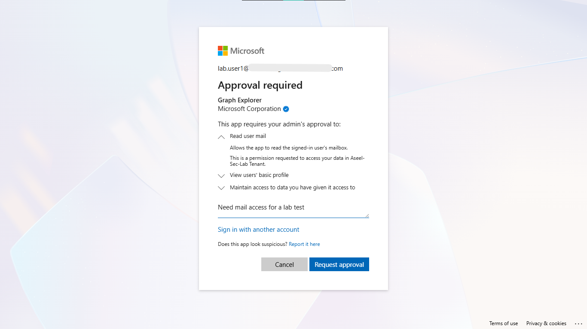

# Lab 05: OAuth Permission Grants and Consent Governance

## Objective
To secure the Microsoft Entra ID environment against illicit consent grant attacks by auditing existing permissions, revoking malicious access, and implementing a risk-based consent workflow.

## Security Architecture Concepts
- Illicit Consent Grant Mitigation: Detecting and blocking malicious OAuth applications.
- Identity Governance: Auditing and managing third-party application permissions.
- Administrative Consent Workflows: Balancing user productivity with security oversight.

**Tools/Services Used:** Microsoft Entra ID, Enterprise Applications, Microsoft Graph API.

## Prerequisites
- Global Administrator or Cloud Application Administrator role.

## Implementation Guide
### Task 1: OAuth Permission Grant Audit
1. Sign in to the [Microsoft Entra admin center](https://entra.microsoft.com/).
2. On the left menu, click **Identity**, then click **Applications**, and select **Enterprise applications**.
3. Under "Manage", click **All applications**.
4. Identify apps that do not have a blue checkmark (publisher verification).
5. Click on the suspicious app, then on the left menu, click **Permissions**.
6. Review for dangerous scopes (e.g., `Mail.ReadWrite`).

### Task 2: Malicious Application Containment
1. On the suspicious app's page, click **Properties** on the left menu.
2. Toggle "Enabled for users to sign-in?" from `Yes` to `No`.
3. Click **Save** at the top.

### Task 3: User Consent Policy Restriction
1. Go back to **Enterprise applications** on the left menu.
2. Under the "Security" section, click **Consent and permissions**.
3. Click **User consent settings**.
4. Select the option: **Allow user consent for apps from verified publishers, for selected permissions**.
5. Click **Save** at the top.

### Task 4: Permission Risk Classification
1. In the **Consent and permissions** menu, click **Permission classifications**.
2. Click **+ Add permissions** and select `Microsoft Graph`.
3. Select `User.Read`, `email`, `openid`, `profile`.
4. Click **Add permissions**.

### Task 5: Administrative Consent Workflow Implementation
1. In the **Consent and permissions** menu, click **Admin consent settings**.
2. Set "Users can request admin consent to apps they are unable to consent to" to `Yes`.
3. Click **+ Select users** and select your own admin account.
4. Ensure **email notifications** and **expiration reminders** are both set to `Yes`.
5. Click **Save**.

### Task 6: Testing and Verification
1. Open a new "Private" or "Incognito" window.
2. Go to [Graph Explorer](https://developer.microsoft.com/en-us/graph/graph-explorer).
3. Sign in as a normal, non-admin test user.
4. Add `/messages` to the URL (`https://graph.microsoft.com/v1.0/me/messages`) and click **Run query**.
5. Click the **Modify permissions** tab, find `Mail.Read`, and click **Consent**.
6. Verify the "Approval required" screen appears.

## References
- [Microsoft Entra OAuth Consent Documentation](https://learn.microsoft.com/en-us/entra/identity/enterprise-apps/configure-user-consent)
