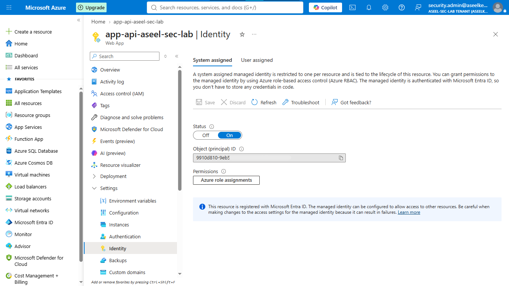
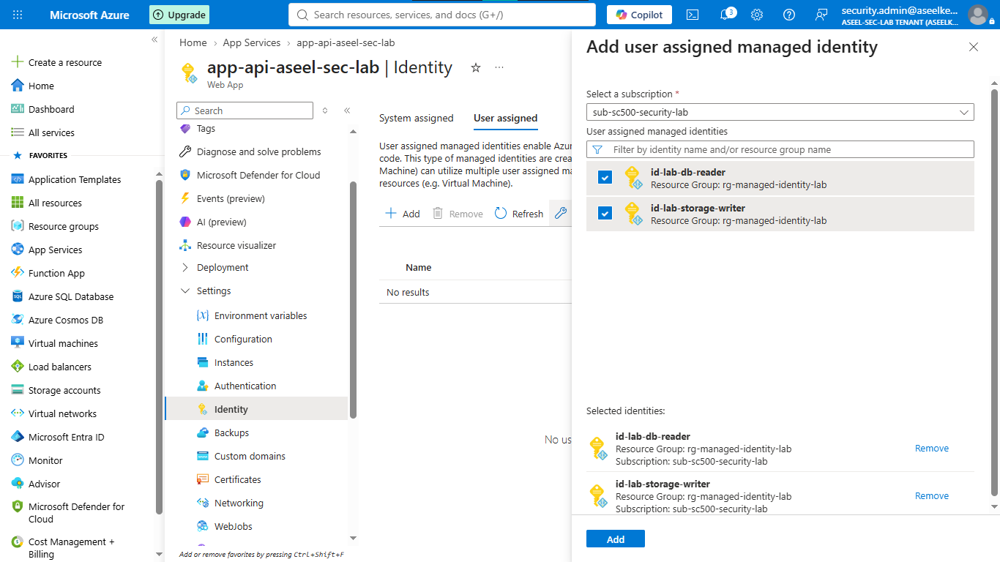
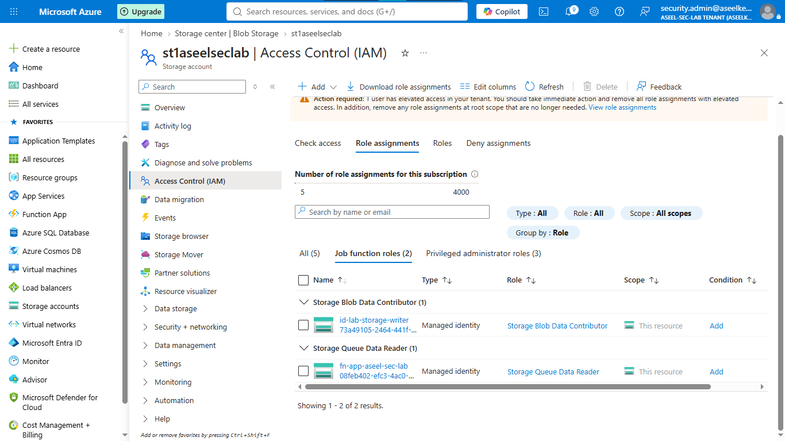
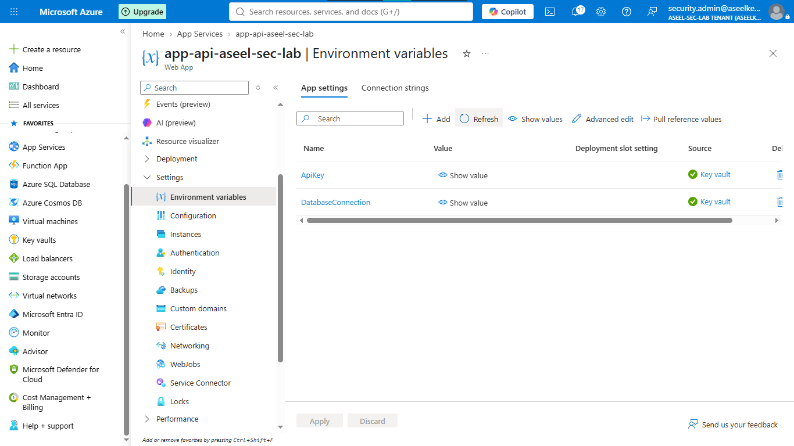

# Lab 06: Managed Identities for Azure Resources

## Objective
This lab demonstrates how to implement a zero-trust identity architecture within an Azure environment by eliminating hardcoded credentials and shared secrets across applications. You will migrate to Microsoft Entra ID Managed Identities and establish secure access patterns using RBAC and Key Vault references.

## Security Architecture Concepts
- Identity-Based Access: Binding Entra ID identities directly to Azure resources.
- Least Privilege: Granular RBAC roles applied specifically to service identities rather than broad administrative access.
- Secure Bootstrapping: Leveraging Managed Identities to eliminate the need for hardcoded credentials in application code.

**Tools/Services Used:** Microsoft Entra ID, System-Assigned Managed Identity, User-Assigned Managed Identity, Azure Key Vault, Azure App Service, Azure Function App, Azure Storage.

## Prerequisites
- Azure subscription.
- Basic knowledge of Azure App Service, Function Apps, and Key Vault.

## Implementation Guide
### Task 1: Web and Function App Identity Configuration
1. Log into the [Azure Portal](https://portal.azure.com).
2. **Create a Resource Group:**
    - In the top search bar, type `Resource groups` and click on it.
    - Click the blue **Create** button.
    - Resource group name: `rg-managed-identity-lab`.
    - Region: `Central India`.
    - Click **Review + create**, then **Create**.
3. **Build the Web App:**
    - In the search bar, type `App Services` and click it.
    - Click **Create** and select **Web App**.
    - Resource Group: `rg-managed-identity-lab`.
    - Name: `app-contoso-api-[your-name]`.
    - Publish: `Code`, Runtime stack: `.NET 8 (LTS)`, Operating System: `Linux`, Region: `Central India`.
    - Pricing plan: Click **Explore pricing plans**, select `Free F1`, and click **Select**.
    - Click **Review + create**, then **Create**. Wait for deployment, then click **Go to resource**.
    - **Give it an ID Card:** On the left menu, scroll to **Settings** and click **Identity**. Under the **System assigned** tab, switch Status to `On`. Click **Save** > **Yes**.
    
4. **Build the Function App:**
    - Search for `Storage accounts` and click **Create**. Resource group: `rg-managed-identity-lab`, name: `stcontosolab[initials]`, Region: `Central India`, Standard performance with LRS. Click **Review + create** > **Create**.
    - Search for `Function App` and click **Create**.
    - Hosting option: `Consumption (Windows)`.
    - Resource Group: `rg-managed-identity-lab`.
    - Name: `func-contoso-processor-[initials]`, Region: `Central India`, Runtime stack: `.NET 8 (isolated worker model)`. Click **Review + create** > **Create**. Wait for deployment, then click **Go to resource**.
    - **Give it an ID Card:** Go to **Settings** > **Identity** on the left menu. Turn System assigned status to `On` and click **Save**.

### Task 2: User-Assigned Managed Identity Provisioning
1. Search for `Managed Identities` and click **Create**.
    - Resource Group: `rg-managed-identity-lab`.
    - Region: `Central India`.
    - Name: `id-contoso-db-reader`. Click **Review + create** > **Create**.
2. Repeat the process to create `id-contoso-storage-writer`.
3. **Assign to Web App:** Go to your Web App > **Settings** > **Identity** > **User assigned** tab. Click **+ Add**, select both `id-contoso-db-reader` and `id-contoso-storage-writer`, and click **Add**.
4. **Assign to Function App:** Go to your Function App > **Settings** > **Identity** > **User assigned** tab. Click **+ Add**, select `id-contoso-db-reader`, and click **Add**.

### Task 3: Resource Access Control Configuration
1. **Create Digital Safe (Key Vault):**
    - Search for `Key vaults` and click **Create**.
    - Resource Group: `rg-managed-identity-lab`.
    - Name: `kv-contoso-lab-[initials]`, Region: `Central India`.
    - Tab: **Access configuration** > Permission model: `Azure role-based access control (RBAC)`.
    - Click **Review + create** > **Create**. Click **Go to resource**.
2. **Give Permissions to the Safe:**
    - Inside Key Vault, click **Access control (IAM)** on the left.
    - Click **Add** > **Add role assignment**.
    - Search for `Key Vault Secrets User`, click **Next**.
    - Select `Managed identity` > **+ Select members**. Choose `App Service` and pick your Web App. Click **Select**.
    - Click **Review + assign** twice.
3. **Give Permissions to the Storage:**
    - Go to your Storage account > **Access control (IAM)** > **Add role assignment**.
    - Search for `Storage Blob Data Contributor`, click **Next**.
    - Select `Managed identity` > **+ Select members**. Look under `User-assigned managed identity` and select `id-contoso-storage-writer`. Assign it.
    - Repeat the process, assign `Storage Queue Data Reader` to the Function App's `System-assigned managed identity`.

### Task 4: Key Vault Secret Integration
1. **Give Yourself Permission First:**
    - Go to Key Vault > **Access control (IAM)** > **Add role assignment**.
    - Search for `Key Vault Secrets Officer`, click **Next**.
    - Click **+ Select members** and search for your own email address/user account. Select it and click **Review + assign**.
2. **Add the Secrets:**
    - In Key Vault, click **Secrets** on the left menu.
    - Click **+ Generate/Import**.
    - Name: `DatabaseConnectionString`, Value: `Server=tcp:contoso-sql.database.windows.net;Database=ContosoDb;Authentication=Active Directory Managed Identity;`. Click **Create**.
    - Click **+ Generate/Import**. Name: `ApiKey`, Value: `sk-contoso-api-key-12345`. Click **Create**.
3. **Tell the Web App where to look:**
    - Go to your App Service (Web App).
    - Click **Environment variables** under the **Settings** menu.
    - Click **+ Add**.
    - Name: `DatabaseConnection`, Value: `@Microsoft.KeyVault(VaultName=YOUR_VAULT_NAME;SecretName=DatabaseConnectionString)`. Click **Apply**.
    - Click **+ Add**. Name: `ApiKey`, Value: `@Microsoft.KeyVault(VaultName=YOUR_VAULT_NAME;SecretName=ApiKey)`. Click **Apply**.
    - Click **Apply** at the bottom of the main page to save everything.

### Task 5: Clean Up
1. Search for `Resource groups`.
2. Click on your `rg-managed-identity-lab`.
3. Click the **Delete resource group** icon at the top.
4. Type the exact name of the group into the warning box and click **Delete**.

## Testing and Verification
1. Verify the Web App environment variables show a green checkmark indicating successful Key Vault reference resolution.

## References
- [Microsoft Managed Identities Documentation](https://learn.microsoft.com/en-us/entra/identity/managed-identities-azure-resources/overview)
