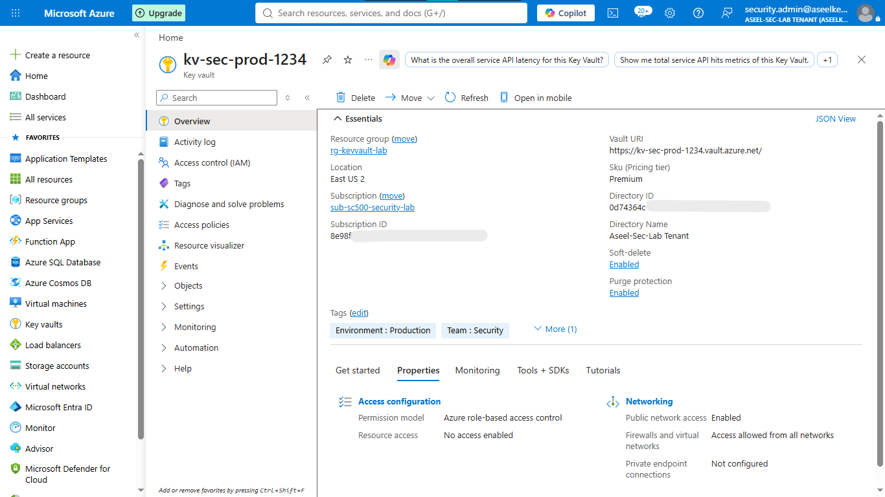
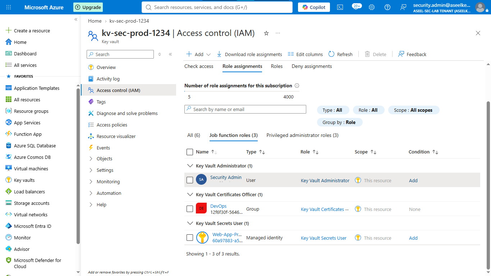
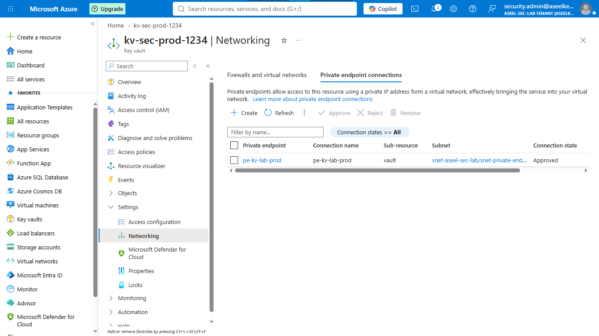
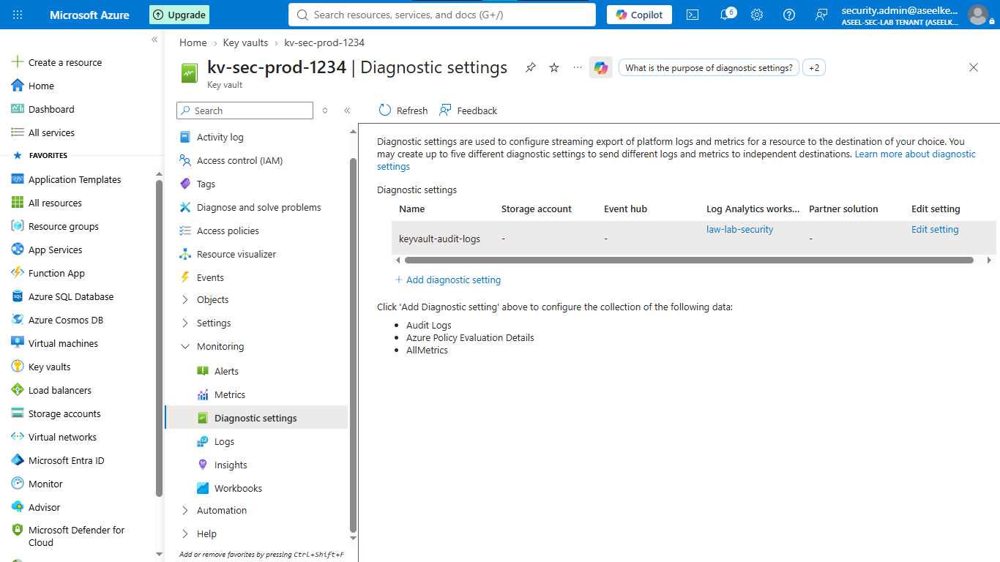
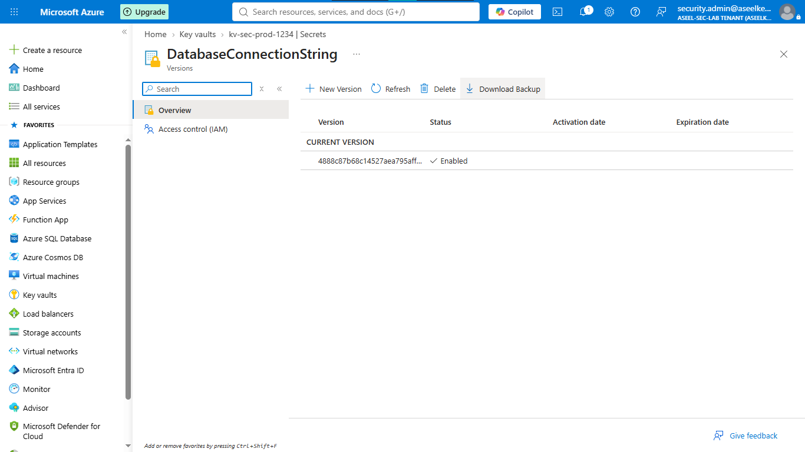

# Lab 07: Production-Grade Key Vault Infrastructure

## Objective
This lab demonstrates the deployment and hardening of a production-grade Azure Key Vault in compliance with zero-trust architecture. You will centralize secret management, implement hardware security module (HSM)-backed protection, and enforce strict access boundaries using RBAC and network isolation.

## Security Architecture Concepts
- Secure Key Vault Infrastructure: Utilizing HSM-backed protection for cryptographic materials.
- Network Isolation: Using Private Endpoints to prevent public internet exposure.
- Separation of Duties: Using RBAC roles to ensure granular, distinct permissions.

**Tools/Services Used:** Microsoft Entra ID, Azure Key Vault, Azure Monitor, Private Link.

## Prerequisites
- Azure subscription with Contributor or Owner permissions.
- Basic knowledge of Azure Virtual Networks.

## Implementation Guide
### Task 1: Azure Key Vault Deployment
1. Log into the [Azure Portal](https://portal.azure.com).
2. In the top search bar, type **Key vaults** and press Enter.
3. Click **+ Create**.
4. **Basics tab:**
    - Resource group: Click **Create new**, name it `rg-student-security-lab`, and click OK.
    - Key vault name: `kv-student-[random-numbers]`.
    - Region: `East US 2`.
    - Pricing tier: `Premium` (for HSM-backed protection).
    - Soft-delete: Checked (90 days).
    - Purge protection: Checked.
5. Click **Next** to go to the **Access configuration** tab.
6. Select **Azure role-based access control (recommended)**.
7. Click **Review + create**, then **Create**.

### Task 2: Access Control (RBAC) Implementation
1. Once deployed, click **Go to resource**.
2. On the left-hand menu, click **Access control (IAM)**.
3. Click **+ Add** > **Add role assignment**.
4. Search for `Key Vault Administrator`, click **Next**.
5. Click **+ Select members**, search for your own name/email, click it, and click **Select**.
6. Click **Review + assign**.

### Task 3: Private Endpoint Network Isolation
1. On the left-hand menu, scroll to **Settings** and click **Networking**.
2. Change access to **Disable public access** and click **Apply**.
3. Click the **Private endpoint connections** tab at the top.
4. Click **+ Create**, name it `pe-student-vault`, click **Next: Resource**.
5. Click **Next: Virtual Network**. Select your Virtual Network and Subnet.
6. Click **Next: DNS**, ensure **Integrate with private DNS zone** says `Yes`.
7. Click **Review + create**, then **Create**.

### Task 5: Diagnostic Logging and Alert Configuration
1. **Make a tape room:** Search for `Log Analytics workspaces` > **Create** > Resource group: `rg-student-security-lab`, Name: `law-student-security`, Region: `East US 2` > **Review + create** > **Create**.
2. **Turn on the cameras:** Go back to your Key Vault > **Diagnostic settings** (under Monitoring) > **+ Add diagnostic setting**.
3. Name it `vault-security-logs`, check `AuditEvent`, `AzurePolicyEvaluationDetails`, and `AllMetrics`.
4. Check **Send to Log Analytics workspace**, select the `law-student-security` workspace, and click **Save**.
5. **Set the alarm:** Under Monitoring, click **Alerts** > **+ Create** > **Alert rule**.
6. Select `ServiceApiResult` signal, filter by `StatusCode` == `403`. Set to check every 1 minute looking back 5 minutes.

### Task 6: Key Vault Disaster Recovery Configuration
1. **Create a second safe:** Follow Task 1 in a different region (e.g., Central US). Name it `kv-student-backup-[random-numbers]`.
2. **Assign access:** Follow Task 2 on the new vault to give yourself `Key Vault Administrator`.
3. **Make a secret:** On the original vault, go to **Secrets** > **+ Generate/Import**. Name: `MyTopSecretPassword`, Value: `[fake-password]`.
4. **Download backup:** Click the secret > click the version > **Download Backup**.
5. **Restore:** Go to the backup vault > **Secrets** > **Restore Backup**, upload the downloaded file.

## Testing and Verification
1. Attempt to access Key Vault from a public connection to verify the 403 Forbidden error.
2. Verify that restricted roles correctly deny unauthorized actions.
3. Confirm secret functionality in the DR Key Vault after backup/restore.

## References
- [Azure Key Vault Security Best Practices](https://learn.microsoft.com/en-us/azure/key-vault/general/security-features)
