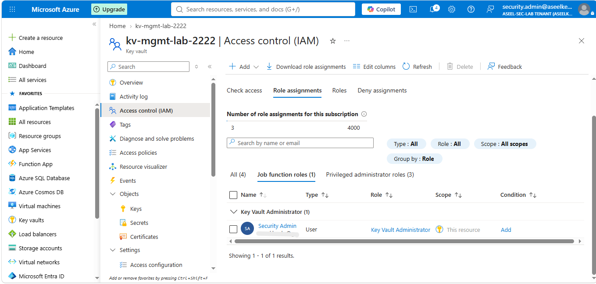
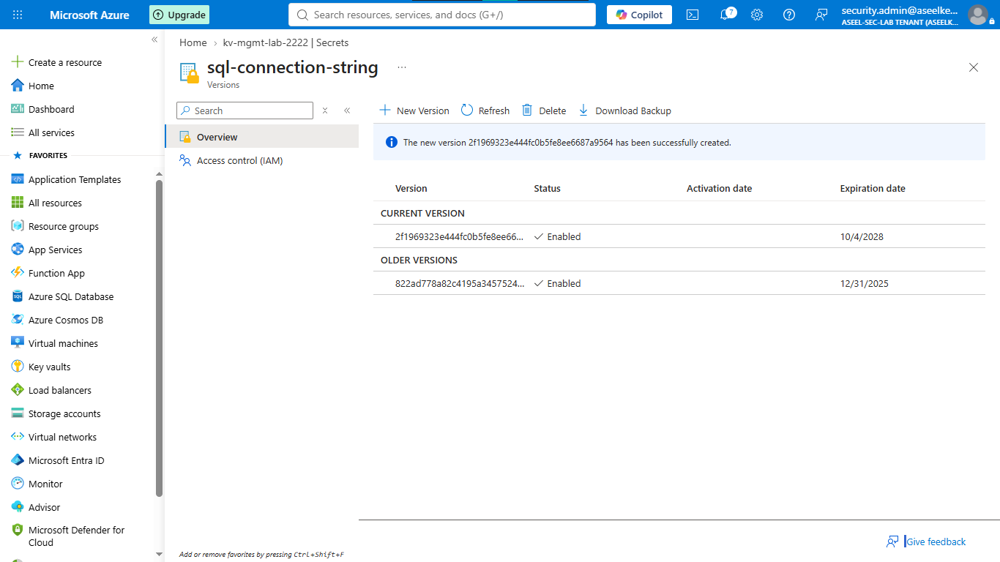
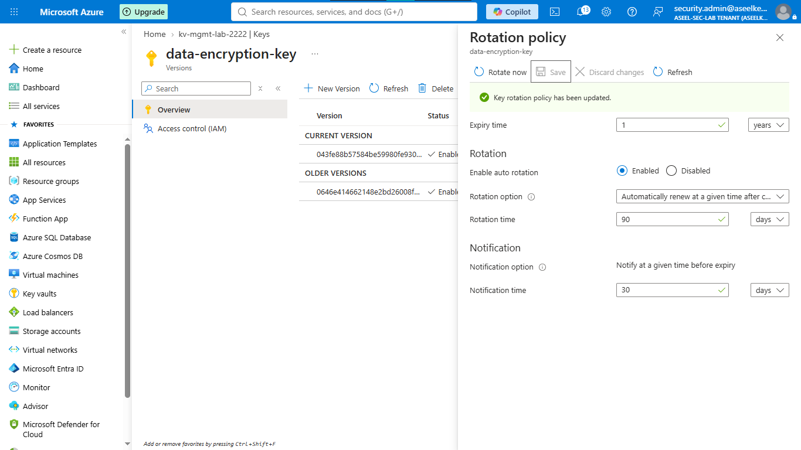
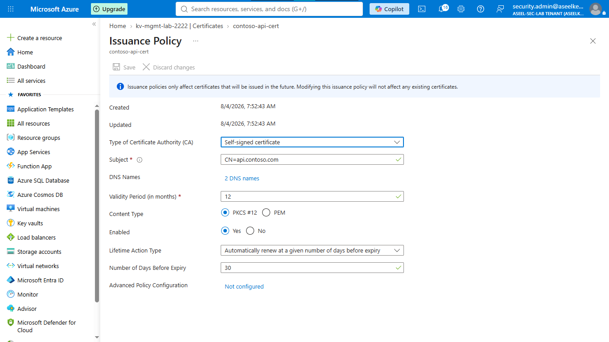
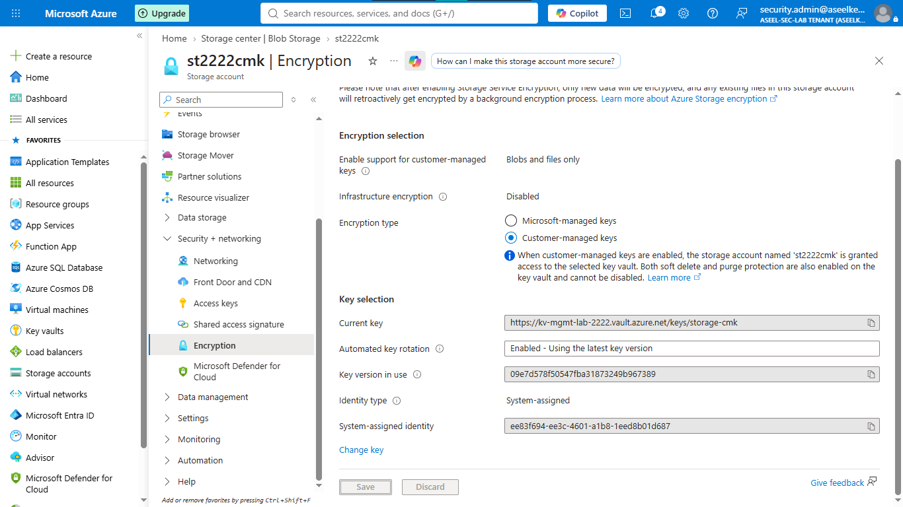

# Lab 08: Secrets, Keys, and Certificates Management

## Objective
This lab demonstrates the implementation of automated rotation policies, enforced expiration lifecycles, and certificate auto-renewal mechanisms to harden identity and cryptographic infrastructure, aligning with SOC best practices.

## Security Architecture Concepts
- Cryptographic Lifecycle Management: Automated rotation and versioning for secrets, keys, and certificates.
- Automated Governance: Enforcing security policies to prevent outages and security exposure due to expired credentials.
- Customer-Managed Keys (CMK): Maintaining strict control over data encryption at rest.

**Tools/Services Used:** Azure Key Vault, Azure Storage, OpenSSL, Event Grid.

## Prerequisites
- Azure Subscription with Contributor access.
- Azure CLI and OpenSSL installed.

## Implementation Guide
### Task 1: Key Vault Deployment and Administration
1. In the Azure Portal, search for **Key vaults** > **+ Create**.
2. **Basics tab:** Resource group: `rg-contoso-lab`, Name: `my-secure-vault-[random-numbers]`, Pricing tier: `Premium`.
3. **Access configuration:** Select `Azure role-based access control (recommended)`.
4. Click **Review + create** > **Create**. Go to the resource.
5. On the left menu, click **Access control (IAM)** > **+ Add** > **Add role assignment**.
6. Search for `Key Vault Administrator`, click **Next**, select yourself, and finish the assignment.

### Task 2: Secret Management and Versioning
1. On the left menu, click **Secrets** > **+ Generate/Import**.
2. Name: `database-password`, Value: `[fake-password]`.
3. Check **Set expiration date** (one year from today) > **Create**.
4. To rotate: Click the secret name > **+ New Version**, add a new value/date > **Create**.

### Task 3: Cryptographic Key Lifecycle Management
1. On the left menu, click **Keys** > **+ Generate/Import**.
2. Name: `my-encryption-key`, Key type: `RSA-HSM`, Size: `2048` > **Create**.
3. Click the key name > **Rotation policy** (left menu).
4. Enable rotation policy, set to `90 Days after creation`, and **Save**.

### Task 4: Certificate Lifecycle Configuration
1. On the left menu, click **Certificates** > **+ Generate/Import**.
2. Name: `my-website-cert`, Subject: `CN=mywebsite.com`.
3. Select **Automatically renew...**, set to `30` days before expiry > **Create**.

### Task 5: Customer-Managed Key (CMK) Encryption Configuration
1. **Create Storage:** Search for **Storage accounts** > **+ Create**. Resource group: `rg-contoso-lab`, name: `mystorage[initials][date]` > **Review** > **Create**.
2. **Robot Identity:** Go to your Storage account > **Identity** (left menu) > toggle System assigned to `On` > **Save**.
3. **Permissions:** Go to Key Vault > **Access control (IAM)** > **+ Add** > **Add role assignment**.
4. Search for `Key Vault Crypto Service Encryption User`, click **Next**.
5. Select **Managed identity**, click **+ Select members**, choose `Storage account`, pick your storage account > **Select** > **Review + assign**.
6. **Turn on Encryption:** Go to Storage Account > **Encryption** (left menu). Select **Customer-managed keys (CMK)**.
7. Click **Select a key vault and key**, choose your vault and key > **Select** > **Save**.

## Testing and Verification
1. Validate secret version history to confirm that rotation does not break access to the latest version.
2. Verify that disabling the CMK key in Key Vault immediately prevents storage data access.

## References
- [Azure Key Vault Secrets Management Documentation](https://learn.microsoft.com/en-us/azure/key-vault/secrets/about-secrets)
