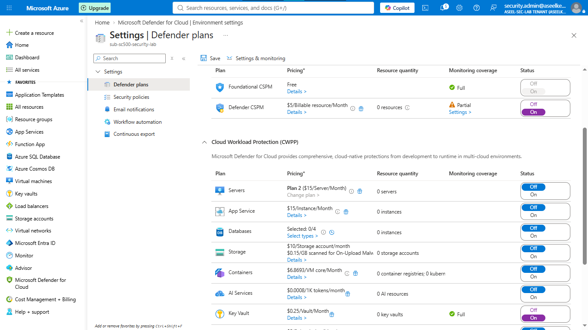
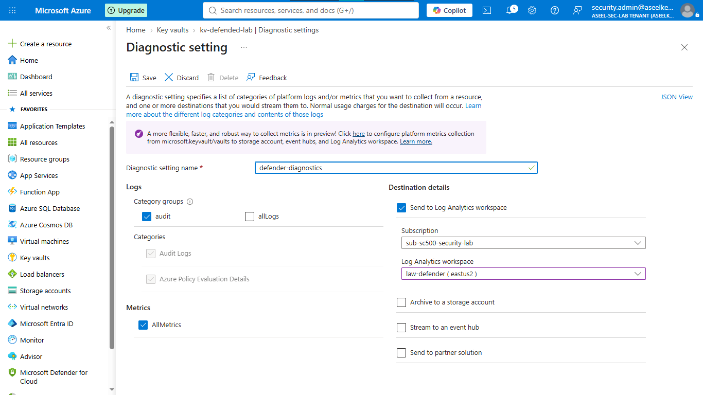
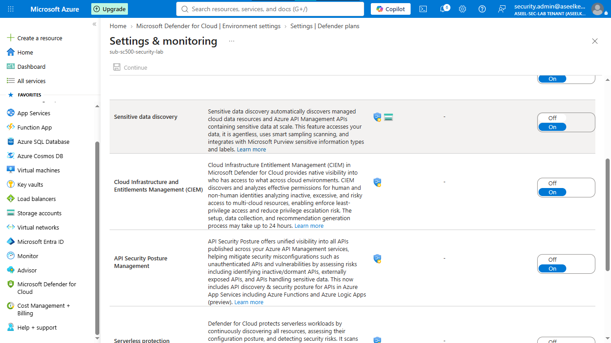
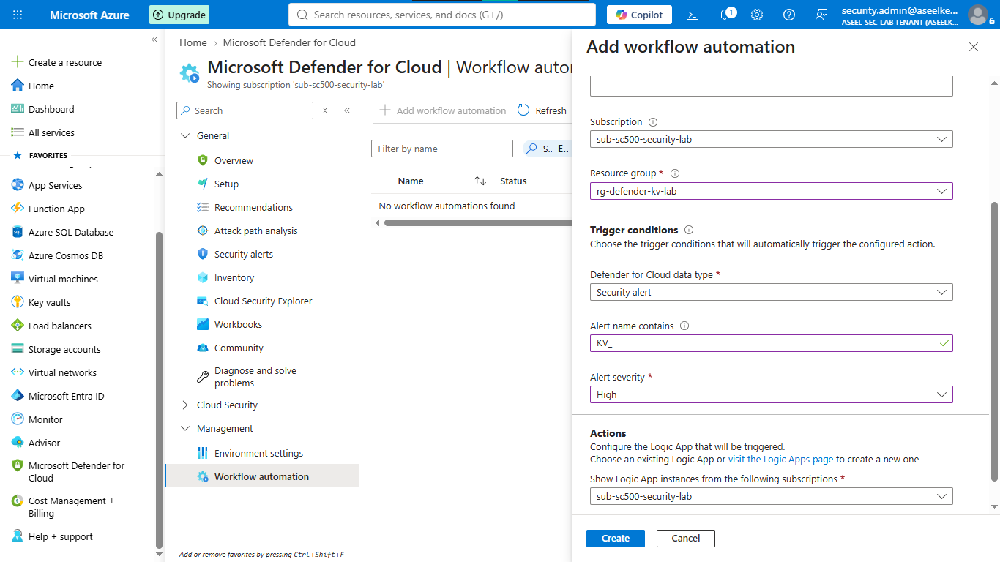
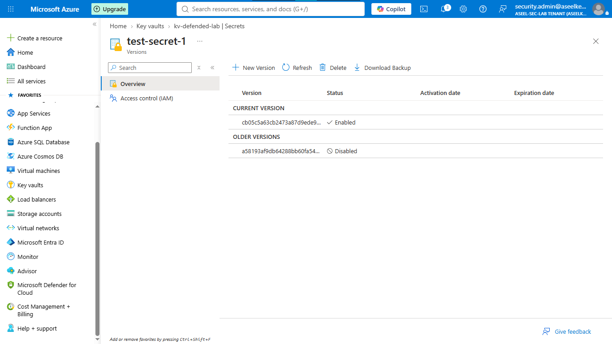

# Lab 09: Defender for Key Vault and Secret Scanning

## Objective
This lab demonstrates the investigation of suspicious Key Vault access patterns, the configuration of comprehensive security protection, and the implementation of automated response workflows for credential exposure events identified by Defender for Cloud.

## Security Architecture Concepts
- Threat Detection: Using ML-based analytics to identify suspicious access to Key Vaults.
- Secret Scanning: Identifying exposed credentials in source code and configurations using CSPM.
- Automated Response (SOAR): Integrating Defender alerts with workflow automation to mitigate threats.

**Tools/Services Used:** Microsoft Defender for Cloud, Azure Key Vault, Log Analytics, KQL.

## Prerequisites
- Azure subscription with Microsoft Defender for Cloud plans enabled.
- Azure CLI authentication.
- Security Administrator role.

## Implementation Guide
### Task 1: Microsoft Defender for Key Vault Configuration
1. In the Azure Portal search bar, type **Microsoft Defender for Cloud** and click on it.
2. Click **Environment settings** (under Management).
3. Click your Azure Subscription name.
4. Set **Key Vault** plan to `On`.
5. Set **Defender CSPM** plan to `On`.
6. Click **Save**.

### Task 2: Key Vault Security Baseline Configuration
1. Search for **Key Vaults** > **+ Create**.
2. Resource group: `rg-defender-lab` (Create new).
3. Name: `kv-secure-[initials][date]`.
4. Pricing: `Standard`.
5. Access configuration: `Azure role-based access control (RBAC)`.
6. Click **Review + create** > **Create**.
7. **Turn on the cameras:** Go to the Key Vault > **Diagnostic settings** > **+ Add diagnostic setting**. Name it `defender-diagnostics`, check `auditEvent` and `AllMetrics`, select your Log Analytics workspace, and click **Save**.

### Task 3: Sensitive Data Discovery Configuration
1. Go back to **Microsoft Defender for Cloud** > **Environment settings** > your subscription.
2. In the Defender CSPM row, click **Settings** in the "Monitoring coverage" column.
3. Under "Sensitive data discovery", toggle to `On`.
4. Click **Continue**, then **Save**.

### Task 4: Security Incident Simulation
1. Click the **>_** (Cloud Shell) icon at the top of Azure. Choose `Bash`.
2. Set vault name: `KV_NAME="kv-secure-[your-vault-name]"`.
3. Paste and run the simulation loop to create 20 fake secrets.
4. Paste and run the simulation loop to mass-enumerate secrets (this mimics a hacker).
*Note: Defender alerts may take time to populate.*

### Task 5: Workflow Automation Configuration
1. Go to **Microsoft Defender for Cloud** > **Workflow automation** (under Management).
2. Click **+ Add workflow automation**.
3. Name: `stop-vault-hackers`.
4. Trigger conditions: `Alert severity` = `High`.
5. Alert name contains: `KV_`.
6. Set an action (e.g., Logic App) to respond to these alerts.
7. Click **Create**.

### Task 6: Credential Remediation
1. Go to your Key Vault > **Secrets**.
2. Click on the compromised secret (e.g., `test-secret-1`).
3. Click **+ New Version**, add a new safe value > **Create**.
4. Click on the old compromised version, toggle **Enabled** to `No`, and click **Save**.

## Testing and Verification
1. Execute KQL queries in Log Analytics to correlate attack simulation with audit log activity.
2. Verify that Defender alerts are generated and trigger the automated workflow.

## References
- [Microsoft Defender for Key Vault Documentation](https://learn.microsoft.com/en-us/azure/defender-for-cloud/defender-for-key-vault-introduction)
