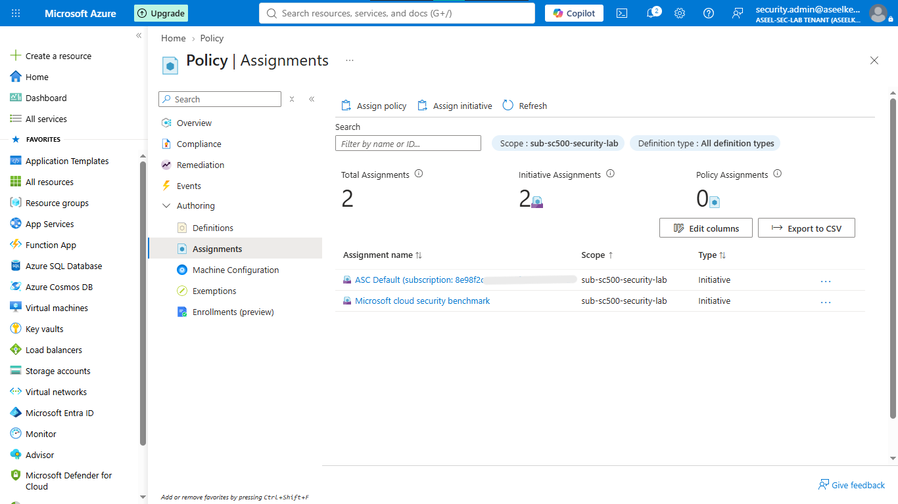
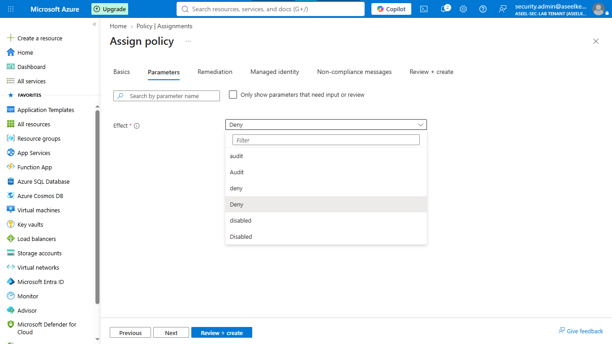
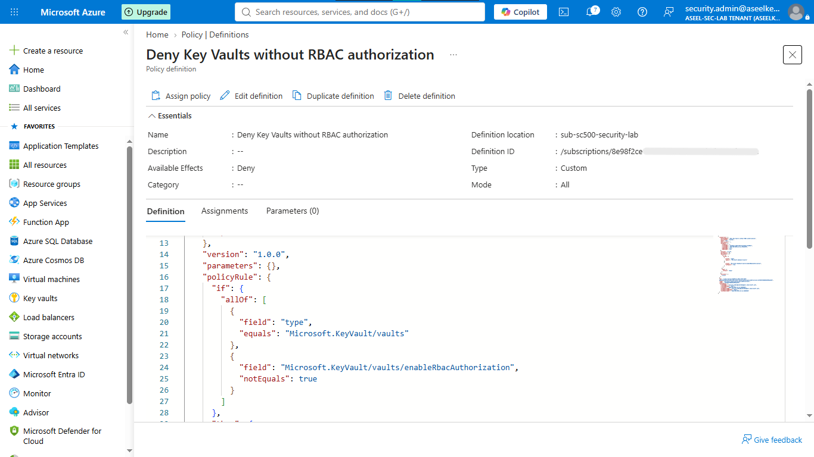
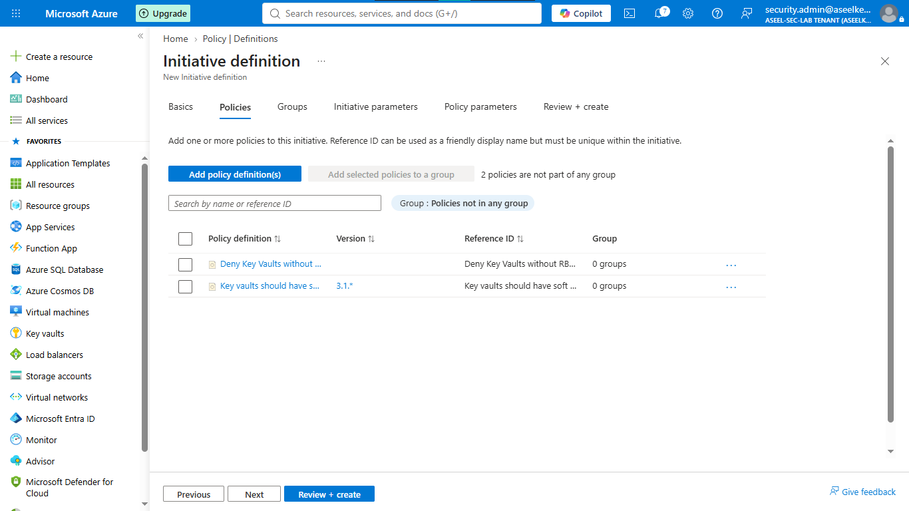
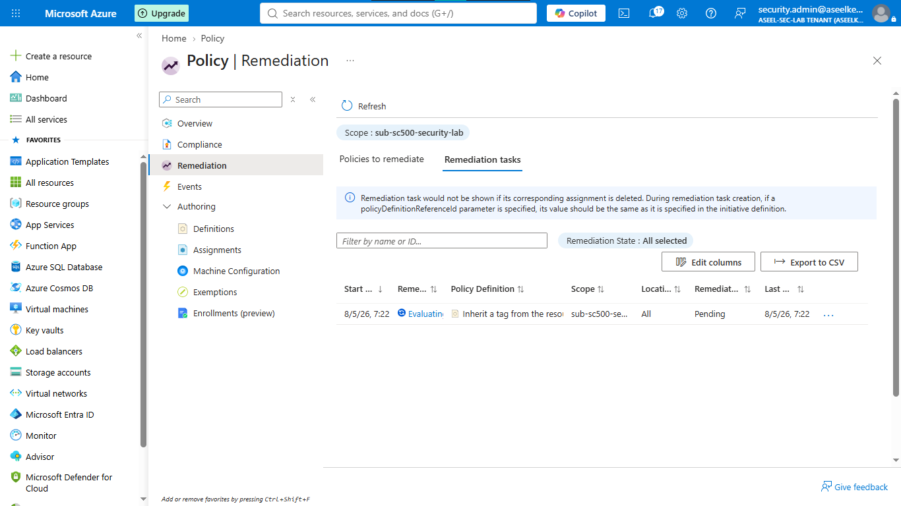

# Lab 10: Azure Policy for Security Governance

## Objective
Implement Azure Policy to proactively enforce security baselines at scale, create custom governance rules for Key Vault identity management, and deploy automated remediation tasks to maintain compliance.

## Security Architecture Concepts
- Compliance Guardrails: Preventing misconfigurations via "Deny" effects.
- Security-as-Code: Using custom JSON policy definitions for granular control.
- Automated Remediation: Using Managed Identities to automatically fix non-compliant resources.

**Tools/Services Used:** Azure Policy, JSON, Managed Identities.

## Prerequisites
- Active Azure subscription with Owner or Policy Administrator permissions.

## Implementation Guide
### Task 1: Security Benchmark Initiative Assignment
1. Log in to the Azure Portal.
2. In the global search bar, type **Policy** and click it.
3. Under "Authoring", click **Assignments**.
4. Click **Assign initiative** at the top.
5. **Scope:** Click **...** and select your Azure Subscription.
6. **Initiative definition:** Click **...**, search for `Microsoft cloud security benchmark`, select it, and click **Add**.
7. Click **Review + Create**, then **Create**.


### Task 2: Proactive Configuration Enforcement
1. Go back to **Policy > Assignments**.
2. Click **Assign policy**.
3. **Scope:** Select your Subscription.
4. **Policy definition:** Click **...**, search for `Storage account public access should be disallowed`, select it, and click **Add**.
5. Click **Next** until you reach the **Parameters** tab.
6. Change the **Effect** dropdown to `Deny`.
7. Click **Review + Create**, then **Create**.


### Task 3: Custom Security Policy Definition
1. In the Policy service, under Authoring, click **Definitions**.
2. Click **+ Policy definition**.
3. **Definition location:** Select your subscription.
4. **Name:** `Enforce-KeyVault-RBAC`.
5. Under **Policy rule**, paste the following JSON:
```json
{
  "mode": "All",
  "policyRule": {
    "if": {
      "allOf": [
        { "field": "type", "equals": "Microsoft.KeyVault/vaults" },
        { "field": "Microsoft.KeyVault/vaults/enableRbacAuthorization", "notEquals": true }
      ]
    },
    "then": { "effect": "deny" }
  }
}
```
6. Click **Save**.


### Task 4: Security Baseline Initiative Bundling
1. Go back to **Definitions**, click **+ Initiative definition**.
2. Name: `Contoso Security Baseline`.
3. Click **Add policy definition** and add the custom policy created in Task 3.
4. Click **Save**.
5. Assign this initiative to the subscription.


### Task 5: Security Policy Exemption Configuration
1. Find a policy assignment that is currently blocking a test Resource Group.
2. Click on the assignment, click **Exemptions** at the top.
3. Click **+ Create exemption**.
4. Scope to the specific testing Resource Group, set exemption type to `Waiver`, and click **Create**.


### Task 6: Automated Remediation Task Execution
1. Assign a policy that requires specific tags (e.g., `DataClassification`).
2. Ensure **Create a Managed Identity** is enabled.
3. Once the policy is assigned, go to the assignment, click **Remediation**, and click **+ Create remediation task** to automatically tag existing resources.


## Testing and Verification
1. Attempt to create a storage account with public access enabled to verify the "Deny" policy functionality.
2. Navigate to the "Remediation" section in the Policy dashboard to confirm tasks have successfully updated resources.

## References
- [Azure Policy Documentation](https://learn.microsoft.com/en-us/azure/governance/policy/overview)
