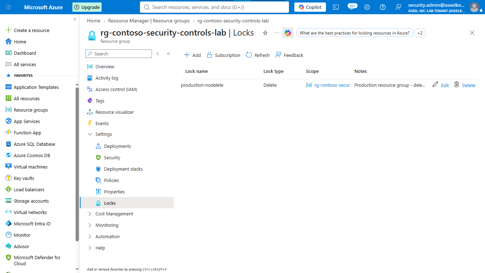
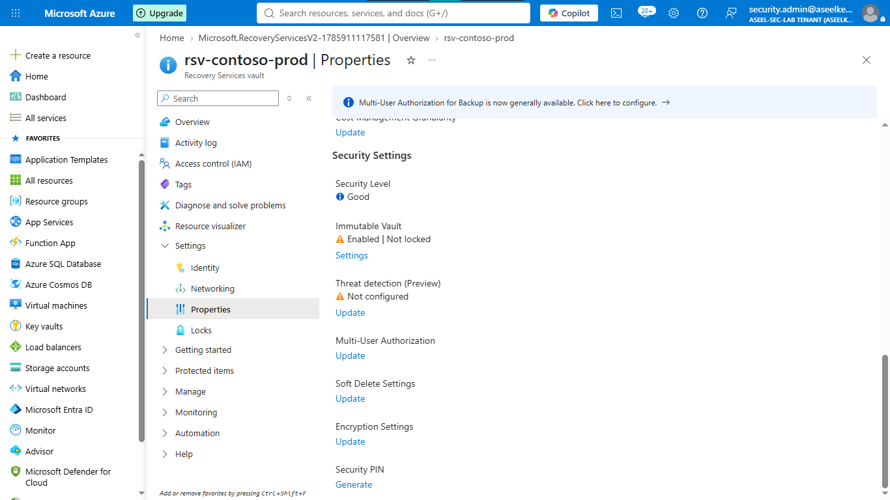
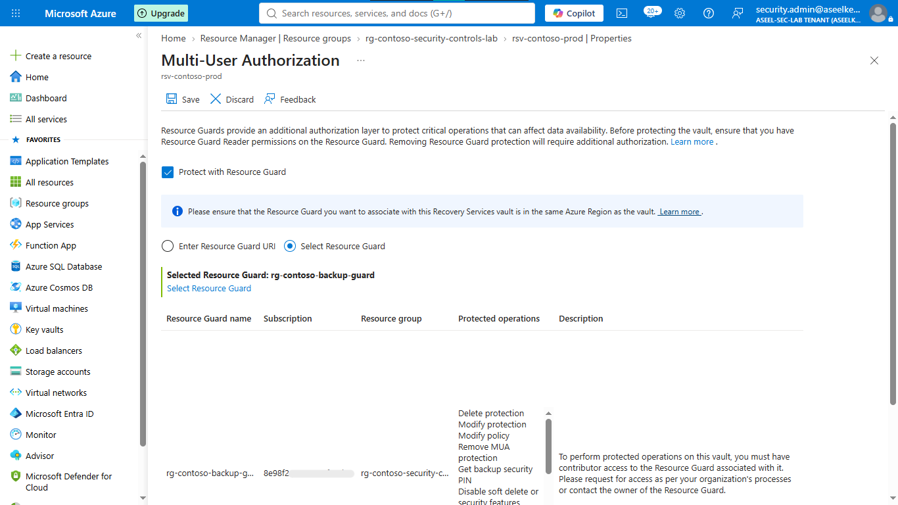
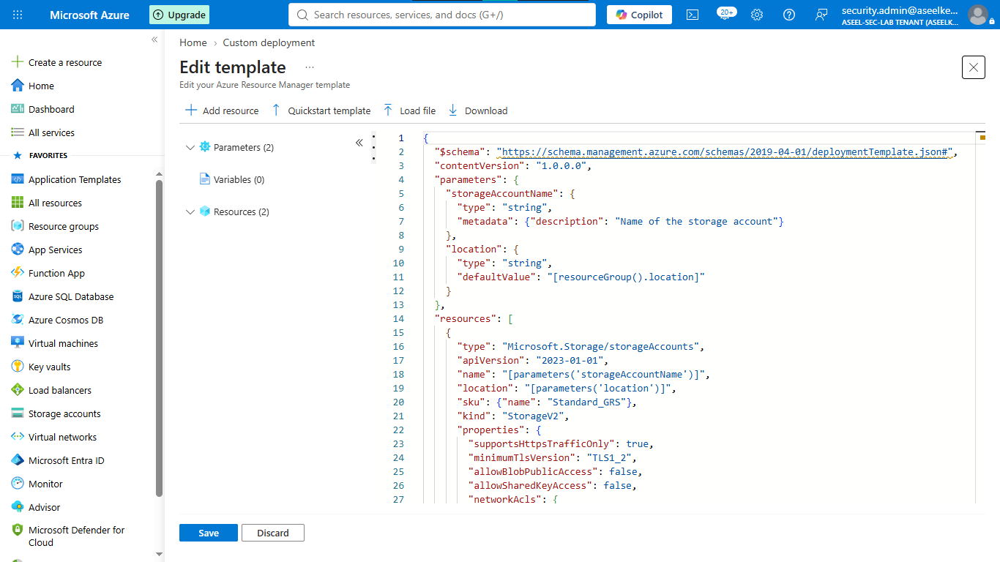
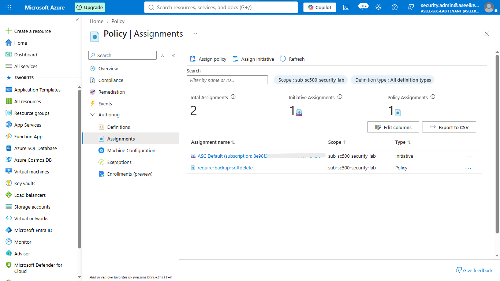
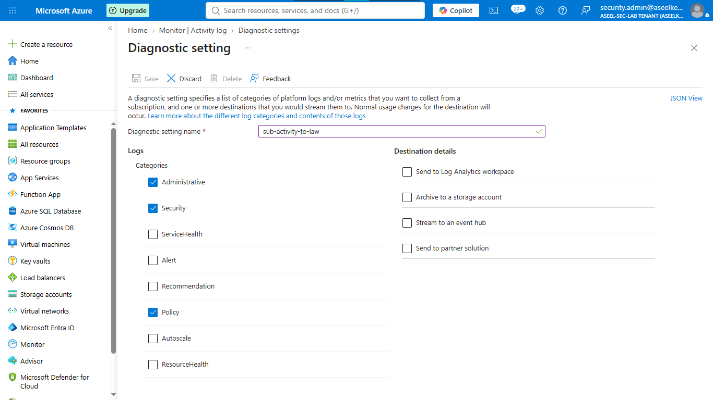

# Lab 12: Backup Security, Resource Locks, and IaC Governance

## Objective
Implement defense-in-depth security controls to mitigate ransomware and insider threats by enforcing resource locks, secure backup policies (MUA, Immutability), Infrastructure as Code (IaC) governance, and centralized SOC monitoring.

## Security Architecture Concepts
- Ransomware Mitigation: Using immutable and soft-deleted backups.
- Insider Threat Protection: Enforcing Multi-User Authorization (MUA) for destructive operations.
- Infrastructure Governance: Protecting IaC deployments using Policy and automated security scanning.

**Tools/Services Used:** Azure Backup, Recovery Services Vault, Azure Policy, ARM Templates.

## Implementation Guide
### Task 1: Resource Lock Implementation
1. Go to **Resource groups** > **+ Create**, Name: `rg-security-lab`, Region: `East US`.
2. Click on the new `rg-security-lab`.
3. Left menu > **Settings** > **Locks** > **+ Add**.
4. Name: `DoNotDelete`, Lock type: `Delete`, Note: `Stops hackers from deleting our lab`.
5. Click **OK**.

### Task 2: Immutable Backup Policy Configuration
1. Search for **Recovery Services vaults** > **+ Create**.
2. Resource group: `rg-security-lab`, Name: `my-secure-vault-123`, Region: `East US`.
3. Go to the vault > **Settings** > **Properties** > **Security Settings** (Update link).
4. **Soft Delete:** Enable for VM/SQL. Retention period: `14 days`.
5. **Always-ON:** Check this box (prevents disabling).
6. **Immutability:** Check to enable, keep as `Unlocked`. Click **Save**.

### Task 3: Multi-User Authorization (MUA) Implementation
1. Search for **Resource Guards** > **+ Create**. Resource group: `rg-security-lab`, Name: `my-backup-guard`.
2. Go to your Recovery Services vault > **Settings** > **Properties** > **Multi-User Authorization** (Update link).
3. Select **Protect with Resource Guard**, choose `my-backup-guard`. Click **Save**.

### Task 4: Infrastructure as Code (IaC) Deployment
1. Search for **Deploy a custom template** > **Build your own template in the editor**.
2. Paste the provided JSON template for a secure storage account (enforcing HTTPS, TLS 1.2, and blocking public access).
3. Save, select `rg-security-lab` Resource group, name the storage account, and click **Create**.

### Task 5: Security Baseline Policy Enforcement
1. Go to **Policy** > **Definitions** > **+ Policy definition**.
2. Name: `require-backup-softdelete`, paste the JSON policy rule denying Recovery Services vaults that do not have `AlwaysON` soft delete enabled.
3. Save, go to **Assignments** > **Assign policy**, apply to subscription.

### Task 6: SOC Monitoring and Alerting Configuration
1. Create a Log Analytics workspace: `my-security-logs-123` in `rg-security-lab`.
2. Search for **Monitor** > **Activity log** > **Export Activity Logs** > **+ Add diagnostic setting**.
3. Name: `SendLogsToRoom`, check `Administrative`, `Security`, `Policy`, send to your workspace.
4. Alerts: Go to **Monitor** > **Alerts** > **+ Create** > **Alert rule**, select the `Delete lock` signal, create an Action Group for email, and save.

## Testing and Verification
1. Attempt to delete a locked resource and verify the action is blocked.
2. Hunt for unauthorized lock deletion events in Log Analytics using KQL.

## References
- [Azure Backup Security Documentation](https://learn.microsoft.com/en-us/azure/backup/backup-azure-security-feature-cloud)
