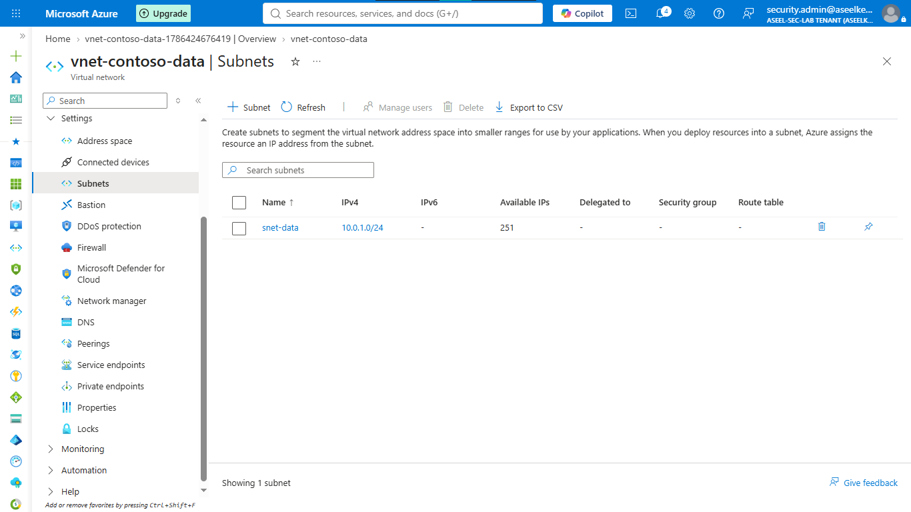
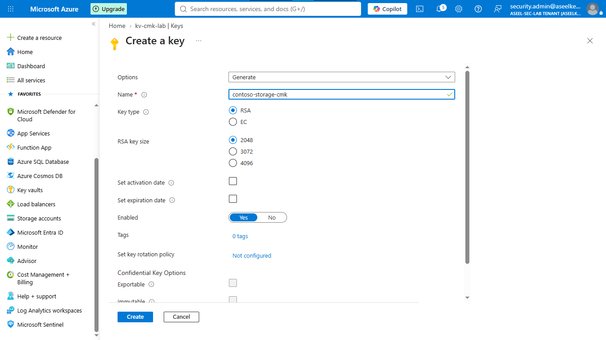
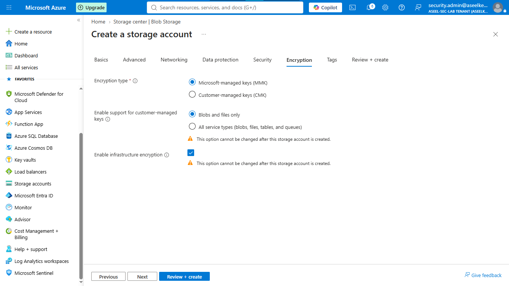
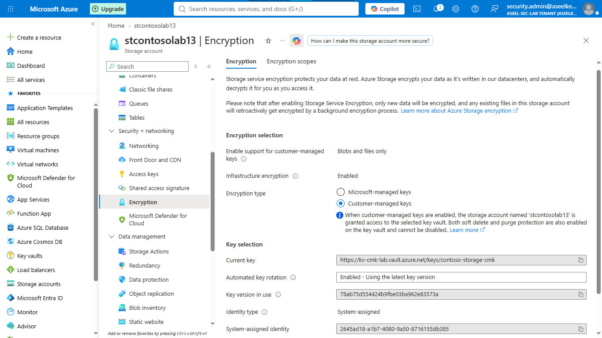
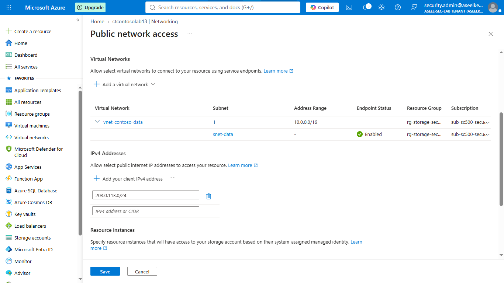
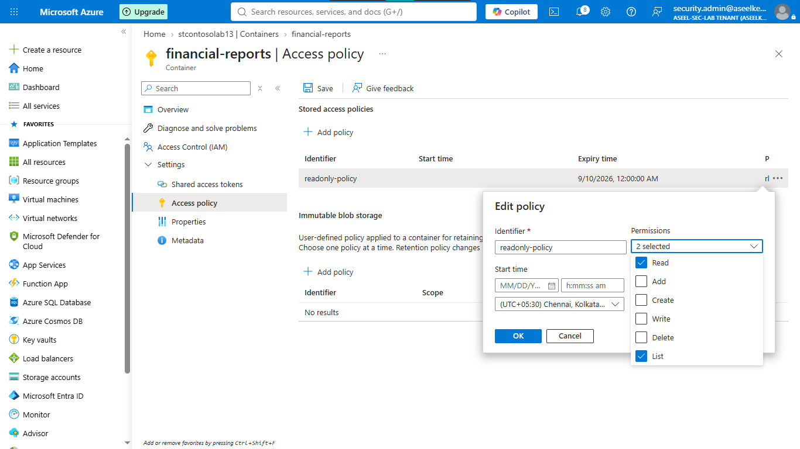
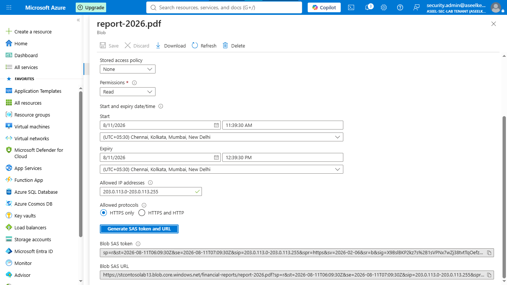
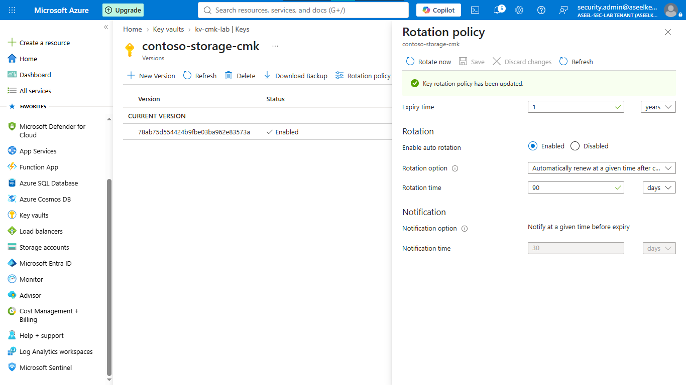

# Lab 13: Storage Account Security and Encryption

## Objective
Implement a secure storage architecture utilizing customer-managed keys (CMK), infrastructure encryption, network isolation, and granular access policies.

## Security Architecture Concepts
- Data-at-Rest Protection: Implementing double encryption (CMK and infrastructure encryption).
- Network Isolation: Restricting storage access to authorized virtual networks.
- Secure Access Delegation: Utilizing Shared Access Signatures (SAS) for time-limited, scoped access.

**Tools/Services Used:** Azure Storage, Azure Key Vault, Virtual Network, Service Endpoints.

## Prerequisites
- Active Azure Subscription.
- Basic knowledge of Azure Networking and Key Vault.

## Implementation Guide
### Task 1: Network Infrastructure Provisioning
1. Log in to the [Azure Portal](https://portal.azure.com).
2. Search for **Resource groups** > **+ Create**. Name: `rg-sc500-storage-security`, Region: `East US`.
3. Search for **Virtual networks** > **+ Create**.
    - Resource Group: `rg-sc500-storage-security`, Name: `vnet-contoso-data`.
    - IP Addresses: Set to `10.0.0.0/16`.
    - Subnets: Edit default subnet. Name: `snet-data`, Range: `10.0.1.0/24`.
    - **Service Endpoints:** Under Subnet settings, check `Microsoft.Storage`.
4. Click **Save** > **Review + create** > **Create**.

### Task 2: Key Vault and Encryption Provisioning
1. Search for **Key vaults** > **+ Create**.
    - Resource Group: `rg-sc500-storage-security`, Name: `kv-student-cmk-[initials][numbers]`.
    - Access configuration: Select `Vault access policy`.
    - Click **Review + create** > **Create**.
2. Go to the Key Vault > **Keys** (left menu) > **+ Generate/Import**.
    - Name: `contoso-storage-cmk`, Type: `RSA`, Size: `2048`.
    - Click **Create**.

3. Search for **Storage accounts** > **+ Create**.
    - Resource Group: `rg-sc500-storage-security`, Name: `studentstorage[numbers]`.
    - **Advanced:** Uncheck "Allow enabling public access on containers" and "Enable storage account key access".
    - **Encryption:** Check "Enable infrastructure encryption".
    - Click **Review + create** > **Create**.

### Task 3: Access Control and Firewall Configuration
1. Go to the new Storage Account > **Encryption** (left menu).
    - Select **Customer-managed keys (CMK)**.
    - Select your Key Vault and the `contoso-storage-cmk` key.
    - Identity type: `System-assigned`. Click **Save**.

2. Go to **Networking** (left menu).
    - Select **Enabled from selected virtual networks and IP addresses**.
    - Under Virtual networks, click **+ Add existing virtual network** > `vnet-contoso-data` > `snet-data` > **Add**.
    - Under Firewall, add authorized IP `203.0.113.0/24`.
    - Check "Allow Azure services on the trusted services list". Click **Save**.

### Task 4: SAS Token Implementation
1. Go to **Networking** (Storage Account) and temporarily add your client IP address to access the account.
2. Go to **Configuration** and temporarily set "Allow storage account key access" to `Enabled`.
3. Go to **Containers** > **+ Container** > Name: `financial-reports` > **Create**.
4. Inside the container, go to **Access policy** > **+ Add policy** > Name: `readonly-policy` > Permissions: `Read`, `List` > Expiry: `30 days`.

5. Upload a test file (e.g., `report-2024.pdf`).
6. Click the file > **Generate SAS** > Permissions: `Read`, Expiry: `1 hour`, Allowed IP: `203.0.113.0-203.0.113.255`, HTTPS only.
7. Click **Generate SAS token and URL**.

### Task 5: Lifecycle and Key Rotation Configuration
1. Go to your Key Vault > **Keys** > `contoso-storage-cmk`.
2. Go to **Rotation policy** (left menu).
3. Check **Enable auto rotation**, set Expiry to `1 Year`.
4. Add lifetime action: **Rotate** > `90 Days after creation`.
5. Add lifetime action: **Notify** > `30 Days before expiry`.
6. Click **Save**.

7. Go back to your Storage Account > **Configuration** and set "Allow storage account key access" back to `Disabled`.

## Testing and Verification
1. Verify encryption is set to CMK.
2. Attempt to access the storage account from an unauthorized network to confirm firewall blockage.
3. Validate SAS token access within the authorized IP range and expiration time.

## References
- [Azure Storage Security Best Practices](https://learn.microsoft.com/en-us/azure/storage/blobs/security-recommendations)
