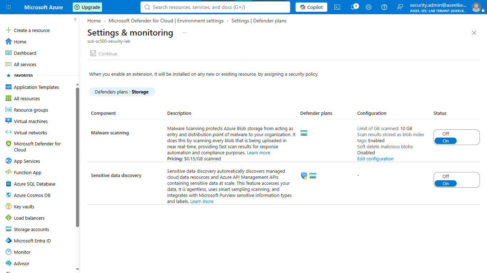
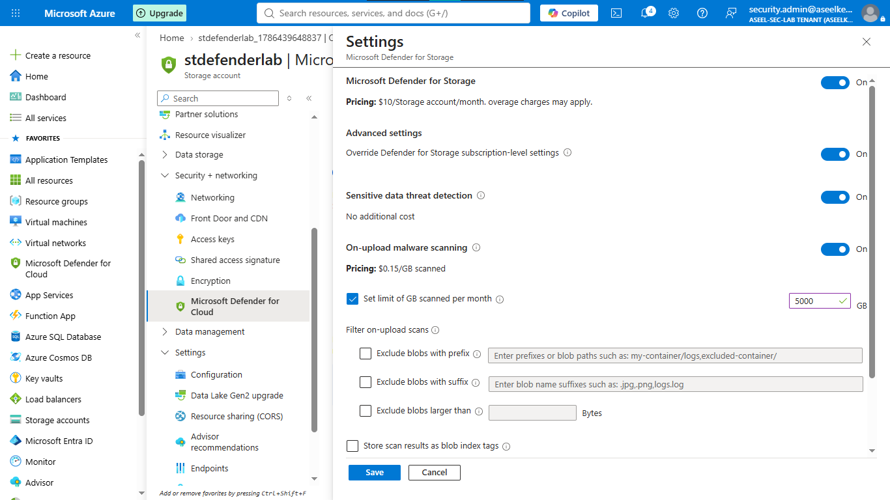
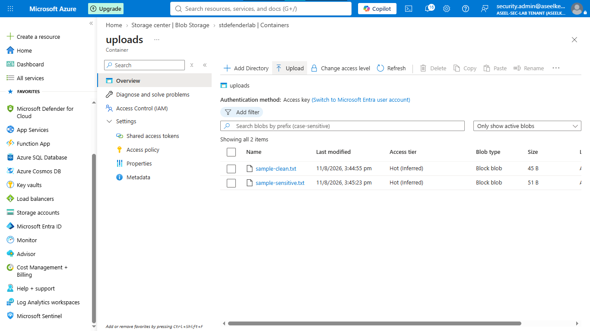
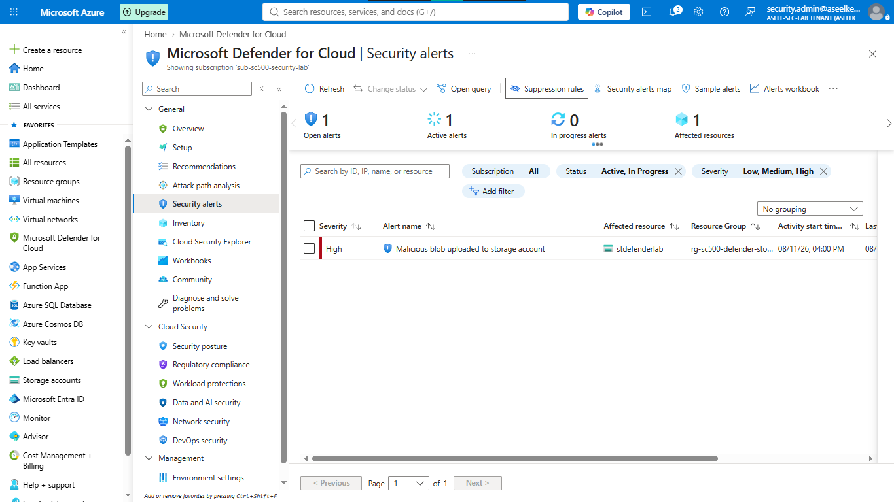
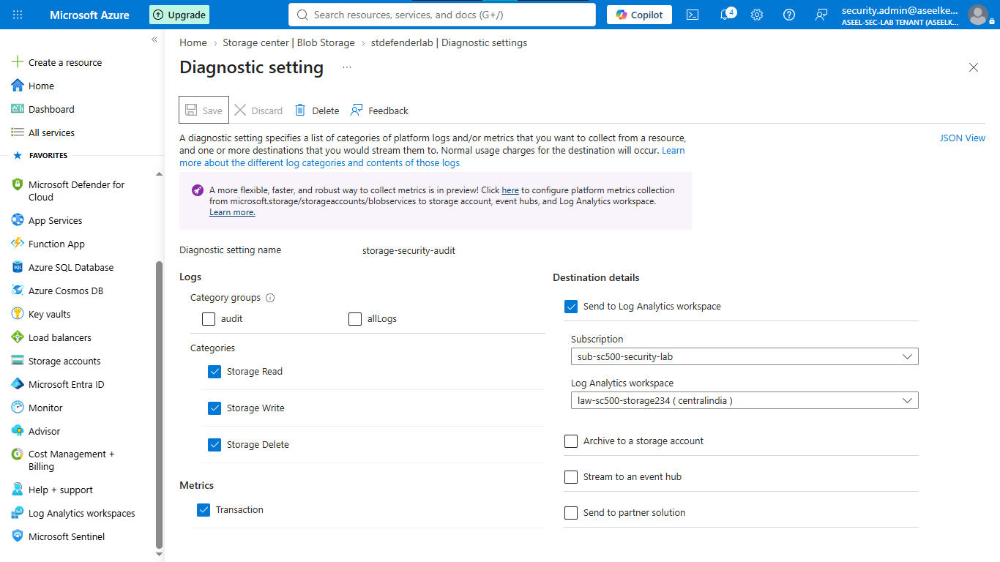

# Lab 14: Defender for Storage Threat Protection

## Objective
Configure Microsoft Defender for Storage to detect malicious file uploads, sensitive data exposure, and unauthorized access attempts using automated scanning and threat intelligence.

## Security Architecture Concepts
- Threat Detection: Using ML-based analytics to identify malicious access and data exfiltration.
- Near Real-time Malware Scanning: Automated scanning of uploaded files for known malware.
- Sensitive Data Discovery: Automated assessment of blob contents for sensitive data (PII/Financial).

**Tools/Services Used:** Microsoft Defender for Cloud, Azure Storage, Log Analytics.

## Prerequisites
- Azure subscription with Defender for Cloud plans enabled.

## Implementation Guide
### Task 1: Microsoft Defender Configuration
1. Search for **Microsoft Defender for Cloud** > **Environment settings**.
2. Select your Azure Subscription.
3. Find the **Storage** plan and set to `On`.
4. Click **Settings** in the "Coverage" column.
5. Set **On-upload malware scanning** to `On`.
6. Set **Sensitive data threat detection** to `On`.
7. Click **Save**.

### Task 2: Storage Account Provisioning
1. Search for **Storage accounts** > **+ Create**.
    - Resource Group: `rg-sc500-defender-storage`.
    - Name: `stdefenderlab[initials][numbers]` (Lowercase/numbers only).
    - Redundancy: `Locally-redundant storage (LRS)`.
2. Click **Review + create** > **Create**.

### Task 3: Scanning Threshold Configuration
1. Go to your Storage Account > **Microsoft Defender for Cloud** (under Security + networking).
2. Click **Settings**.
3. Ensure **Enable Microsoft Defender for Storage** is `On`.
4. In the "Malware scanning" section, set **Cap GB per month** to `5000`.
5. Click **Save**.

### Task 4: Data Upload and Testing
1. Go to **Containers** (under Data storage) > **+ Container** > Name: `uploads`.
2. Create two local files: `sample-sensitive.txt` (containing fake SSN/CC data) and `sample-clean.txt`.
3. Upload both files to the `uploads` container.

### Task 5: Security Incident Simulation
1. Create a local file named `eicar.txt` containing the EICAR test virus string: `X5O!P%@AP[4\PZX54(P^)7CC)7}$EICAR-STANDARD-ANTIVIRUS-TEST-FILE!$H+H*`.
2. Upload `eicar.txt` to the `uploads` container.

### Task 6: Alert Investigation
1. Search for **Microsoft Defender for Cloud** > **Security alerts**.
2. Monitor for a high-severity alert: "Malicious blob uploaded to storage account".
3. Click the alert to view incident details and remediation steps.

### Task 7: Diagnostic Logging Configuration
1. Search for **Log Analytics workspaces** > **+ Create**.
    - Resource Group: `rg-sc500-defender-storage`, Name: `law-sc500-storage`.
2. Go to your Storage Account > **Diagnostic settings** (under Monitoring).
3. Click on **blob** > **+ Add diagnostic setting**.
    - Name: `storage-security-audit`.
    - Check: `StorageRead`, `StorageWrite`, `StorageDelete`, `Transaction`.
    - Select **Send to Log Analytics workspace**, choose your workspace.
4. Click **Save**.

## Testing and Verification
1. Verify the EICAR upload triggered a Defender alert.
2. Confirm logs are populated in the Log Analytics workspace by running basic KQL queries.

## References
- [Microsoft Defender for Storage Documentation](https://learn.microsoft.com/en-us/azure/defender-for-cloud/defender-for-storage-introduction)
