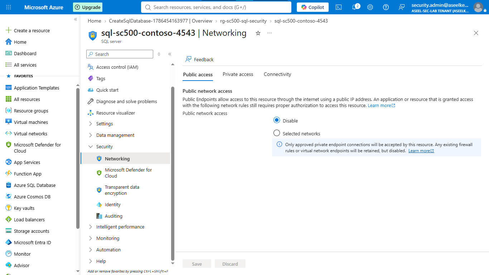
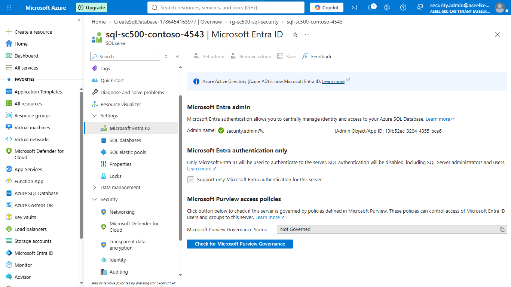
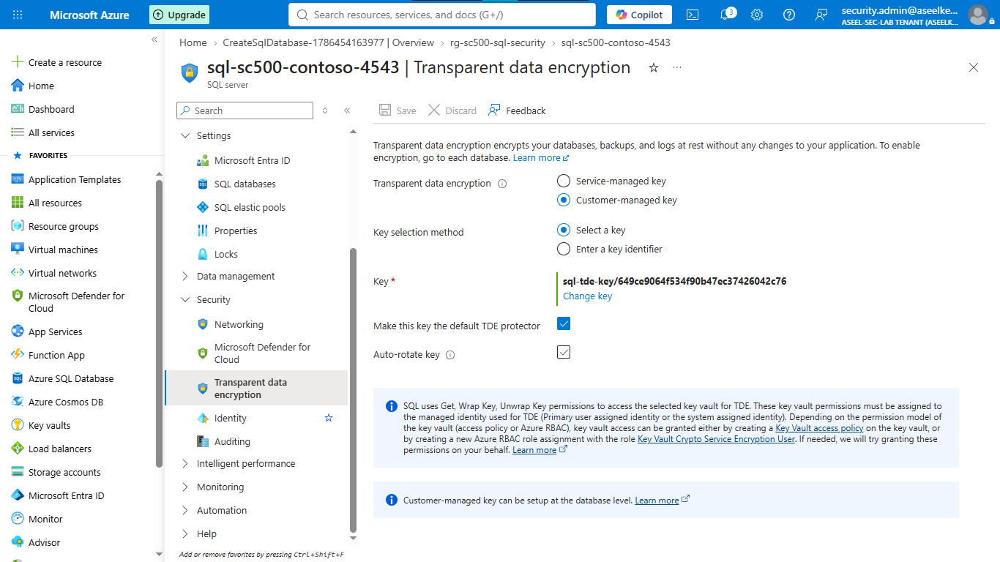
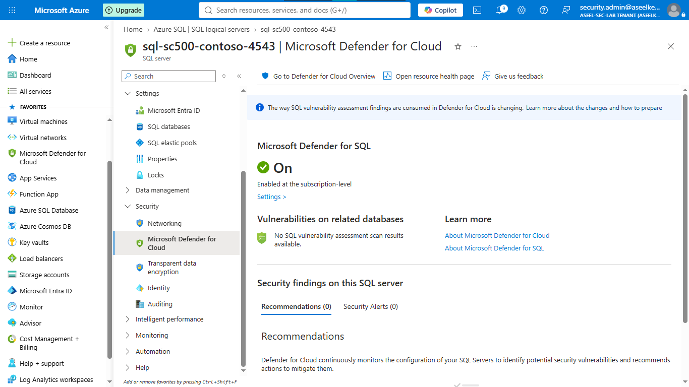
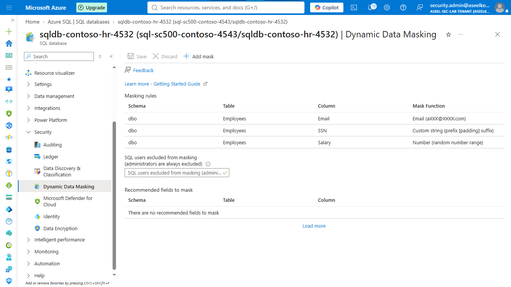
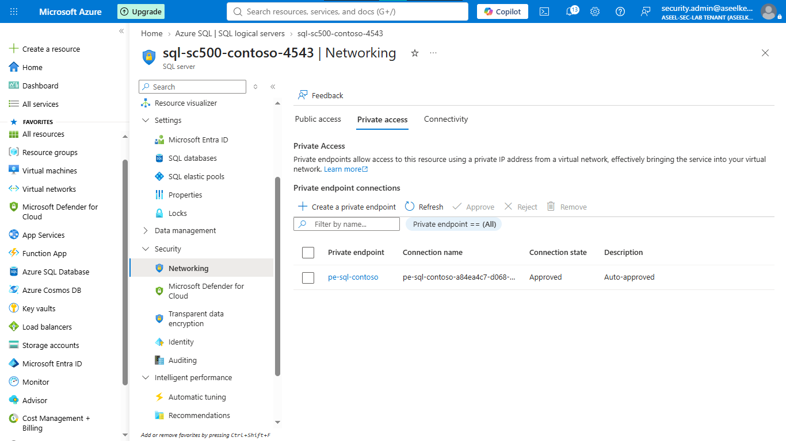

# Lab 15: Azure SQL Security

## Objective
Harden Azure SQL Database by enforcing Microsoft Entra authentication, implementing Customer-Managed Key (CMK) encryption, configuring auditing, and applying dynamic data masking.

## Security Architecture Concepts
- Identity-Based Access: Replacing SQL authentication with Microsoft Entra ID.
- Data-at-Rest Protection: Enforcing TDE with CMK housed in Azure Key Vault.
- Data Privacy: Applying Dynamic Data Masking for non-privileged users.
- Network Isolation: Using Private Endpoints to eliminate public internet exposure.

**Tools/Services Used:** Azure SQL Database, Microsoft Entra ID, Azure Key Vault, Private Link, Dynamic Data Masking.

## Prerequisites
- Active Azure Subscription.
- Basic knowledge of Azure SQL and Key Vault.

## Implementation Guide
### Task 1: Database Environment Provisioning
1. Search for **Resource groups** > **+ Create**. Name: `rg-sc500-sql-security`.
2. Search for **SQL databases** > **+ Create**.
    - Resource Group: `rg-sc500-sql-security`.
    - Server: Create new (`sql-sc500-contoso-[numbers]`).
    - Authentication: `Use SQL authentication` (temporary), Admin: `sqladmincontoso`.
    - Compute: `Basic` tier.
3. **Networking:** Set to `No access` (public network disabled).
4. Click **Review + create** > **Create**.

### Task 2: Microsoft Entra Authentication Implementation
1. Go to the SQL Server > **Microsoft Entra ID** (left menu).
2. Click **Set admin** and select your Azure account.
3. Check **Support Microsoft Entra authentication only**.
4. Click **Save**.

### Task 3: Transparent Data Encryption (TDE) Configuration
1. Create a Key Vault (`kv-sc500-sqltde-[numbers]`) with `Vault access policy`.
2. Go to Key Vault > **Keys** > **+ Generate/Import** > Name: `sql-tde-key`.
3. Go to SQL Server > **Identity** > Set System assigned identity to `On`.
4. Go to Key Vault > **Access policies** > **+ Create**. Select `Get`, `List`, `Unwrap Key`, `Wrap Key`. Assign to the SQL server principal.
5. Go to SQL Server > **Transparent data encryption** > **Customer-managed key**. Select your vault and `sql-tde-key`. Click **Save**.

### Task 4: Auditing and Threat Protection Configuration
1. Go to SQL Server > **Auditing** (Security section).
2. Enable **Azure SQL Auditing**, select your Log Analytics workspace (`law-sc500-sql`). Click **Save**.
3. Go to **Microsoft Defender for Cloud** (under Security) > **Enable Microsoft Defender for SQL**.
4. Configure **Vulnerability Assessment** to use a storage account and enable recurring scans. Click **Save**.

4. Click **Save**.

### Task 6: Network Isolation Implementation
1. Search for **Virtual networks** > **+ Create**. Name: `vnet-contoso-sql`.
2. Create subnets: `snet-app` (10.0.0.0/24) and `snet-private-endpoint` (10.0.1.0/24).
3. Go to SQL Server > **Networking** > **Private access** > **+ Create a private endpoint**.
4. Connect to `vnet-contoso-sql` and `snet-private-endpoint`.
5. Disable public network access on the SQL Server.

## Testing and Verification
1. Validate connectivity via the Private Endpoint using approved VNet resources.
2. Verify masking rules by querying masked columns with a non-privileged test user.

## References
- [Azure SQL Security Documentation](https://learn.microsoft.com/en-us/azure/azure-sql/database/security-overview)
