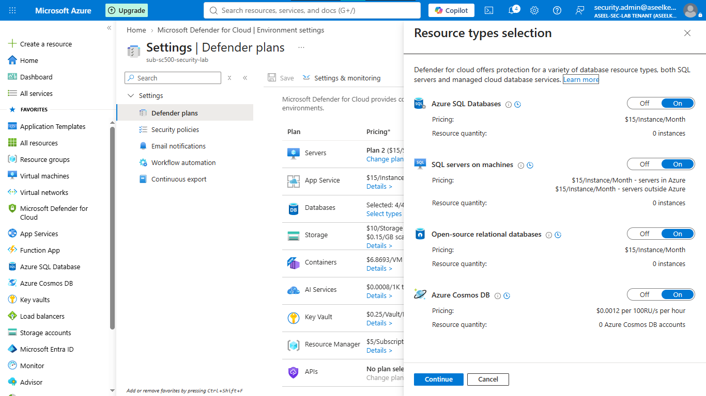
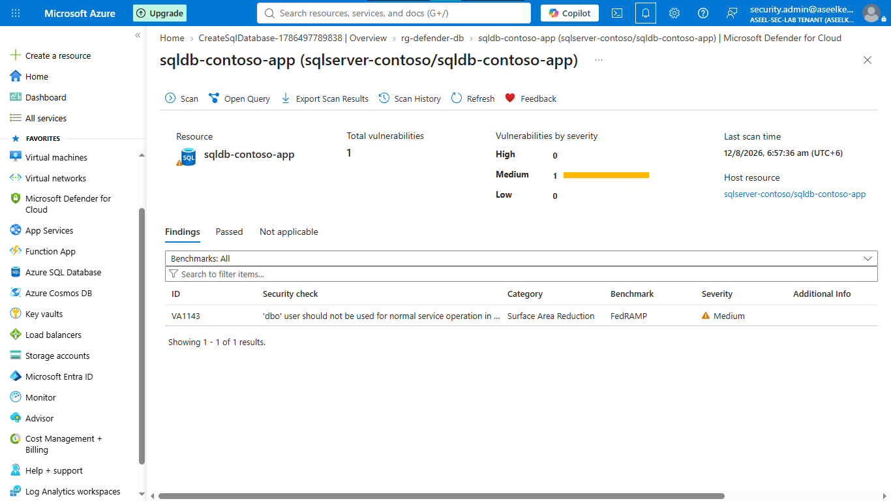
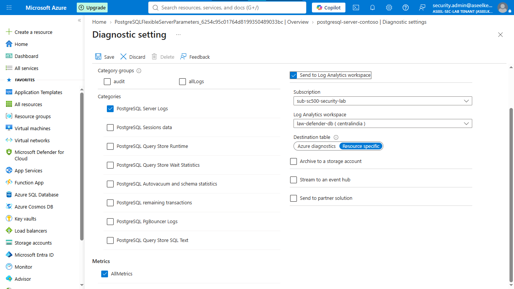
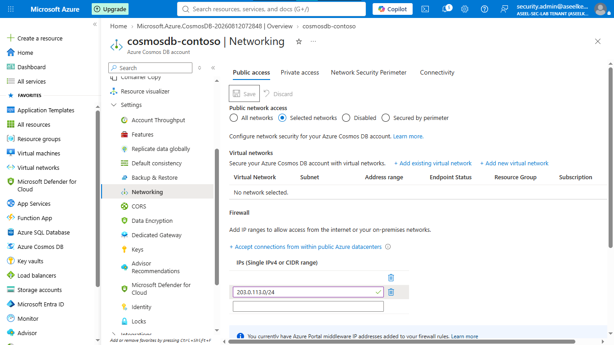
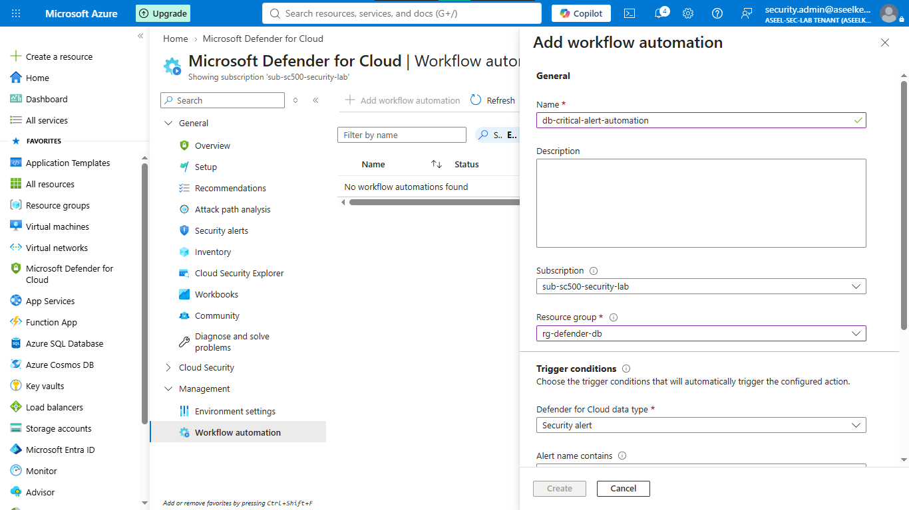

# Lab 16: Defender for Databases

## Objective
Configure Microsoft Defender for Cloud to provide threat protection and vulnerability assessment for SQL Server, PostgreSQL, and Cosmos DB instances.

## Security Architecture Concepts
- Database Threat Protection: Detecting anomalous activities (SQL injection, brute force) using advanced analytics.
- Vulnerability Assessment: Proactively identifying configuration weaknesses in database environments.
- Automated Response: Integrating Defender alerts with workflow automation.

**Tools/Services Used:** Microsoft Defender for Cloud, Azure SQL, PostgreSQL, Cosmos DB.

## Prerequisites
- Azure subscription with Defender for Cloud enabled.

## Implementation Guide
### Task 1: Microsoft Defender Configuration
1. Search for **Microsoft Defender for Cloud** > **Environment settings**.
2. Select your Azure Subscription.
3. Enable **Databases** plan.
4. Click **Select types** and ensure all database services (SQL, PostgreSQL, Cosmos DB) are checked.
5. Click **Save**.

### Task 2: SQL Server Vulnerability Assessment
1. Create a SQL server and database.
2. Go to the SQL server > **Microsoft Defender for Cloud** > **Configure**.
3. Select a storage account for vulnerability assessment results.
4. Enable **Periodic recurring scans**.
5. Run an initial scan from the database's **Vulnerability assessment** menu.

### Task 3: PostgreSQL Security Telemetry
1. Create an Azure Database for PostgreSQL flexible server.
2. Set `pgms_wait_sampling.query_capture_mode` to `all` in **Server parameters**.
3. Go to **Diagnostic settings** > **+ Add diagnostic setting**.
4. Check `PostgreSQL logs`, `AllMetrics`, and send to your Log Analytics workspace.

### Task 4: Cosmos DB Hardening
1. Create an Azure Cosmos DB (NoSQL) account.
2. During creation, check **Disable local authentication**.
3. Go to **Networking** > **Firewall rules** > Add your authorized IP address.
4. Configure **Diagnostic settings** to send `DataPlaneRequests`, `QueryRuntimeStatistics`, and `ControlPlaneRequests` to Log Analytics.

### Task 5: Automated SOC Workflow Engineering
1. Go to **Microsoft Defender for Cloud** > **Workflow automation**.
2. Click **+ Add workflow automation**.
3. Name: `db-critical-alert-automation`, Alert severity: `High`.
4. Leave "Alert name contains" blank to trigger on all critical alerts.
5. Select a Logic App to handle the automated response.
6. Click **Create**.

## Testing and Verification
1. Verify Defender plans are active.
2. Confirm vulnerability assessment scans are operational.
3. Trigger a simulation (if applicable) to verify alert generation.

## References
- [Microsoft Defender for Databases Documentation](https://learn.microsoft.com/en-us/azure/defender-for-cloud/defender-for-databases-introduction)
