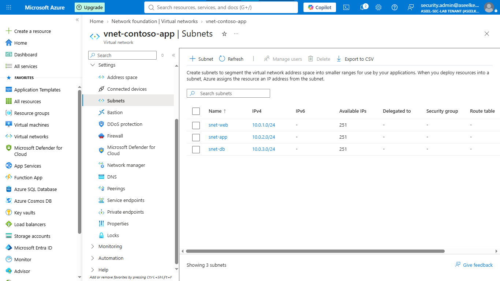
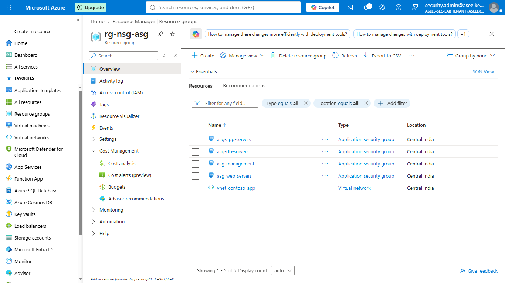
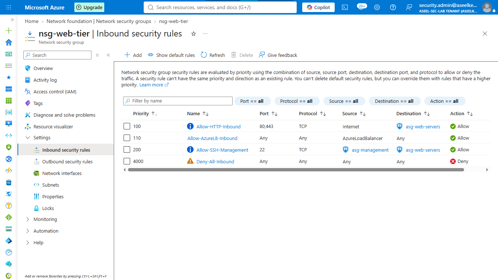
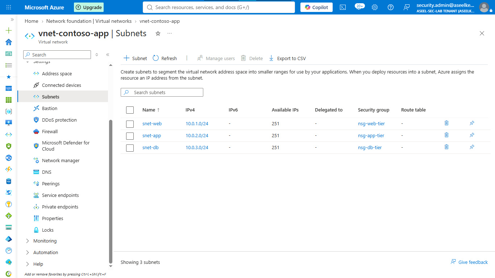
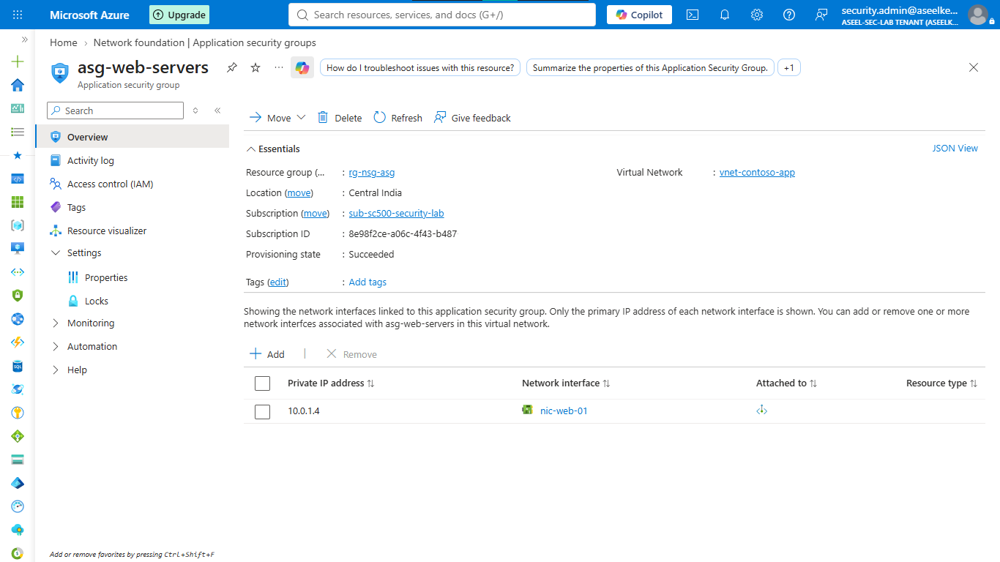
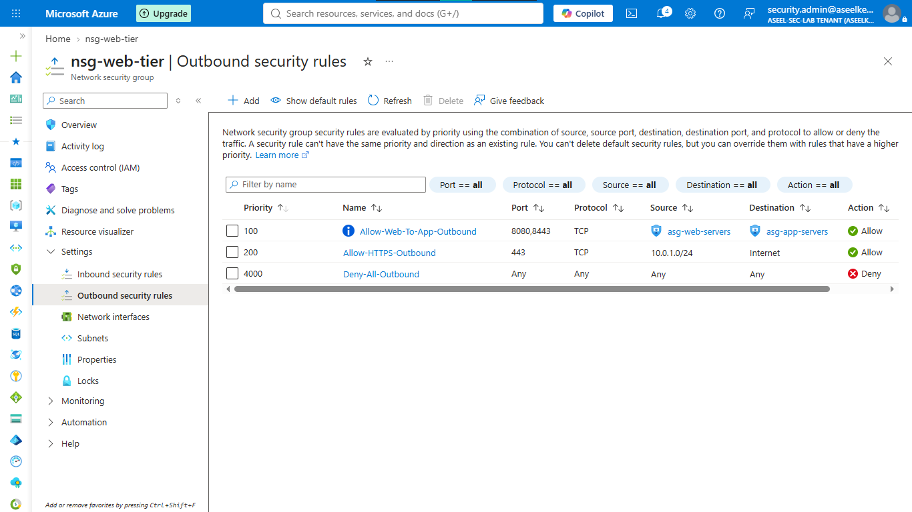

# Lab 17: Network Security Groups (NSG) and Application Security Groups (ASG)

## Objective
Implement network-level segmentation using NSGs and ASGs to enforce traffic flow control based on application tiers, adhering to the principle of least privilege.

## Security Architecture Concepts
- Network Segmentation: Dividing the virtual network into security tiers (Web, App, DB).
- Identity-Based Tagging: Using ASGs as logical security identifiers rather than raw IP addresses.
- Zero-Trust Networking: Default-deny inbound and outbound traffic posture.

**Tools/Services Used:** Virtual Networks, NSGs, ASGs, Network Watcher.

## Prerequisites
- Basic knowledge of Azure Networking and Subnet architecture.

## Implementation Guide
### Task 1: Network Infrastructure Provisioning
1. Search for **Resource groups** > **+ Create**. Name: `rg-sc500-nsg-asg`, Region: `East US`.
2. Search for **Virtual networks** > **+ Create**.
    - Resource Group: `rg-sc500-nsg-asg`, Name: `vnet-contoso-app`, Region: `East US`.
    - IP Space: `10.0.0.0/16`.
    - Subnets: Add `snet-web` (10.0.1.0/24), `snet-app` (10.0.2.0/24), `snet-db` (10.0.3.0/24).
3. Click **Review + create** > **Create**.

### Task 2: Application Security Group (ASG) Provisioning
1. Search for **Application security groups** > **+ Create**.
2. Create the following groups in `rg-sc500-nsg-asg`:
    - `asg-web-servers`
    - `asg-app-servers`
    - `asg-db-servers`
    - `asg-management`

### Task 3: Network Security Group (NSG) Rule Configuration
1. Search for **Network security groups** > **+ Create**. Name: `nsg-web-tier`.
2. Add Inbound rules:
    - `Allow-HTTP-Inbound`: Src: Internet, Dst ASG: `asg-web-servers`, Port: 80,443, Action: Allow, Priority: 100.
    - `Allow-AzureLB-Inbound`: Src: AzureLoadBalancer, Dst: *, Action: Allow, Priority: 110.
    - `Allow-SSH-Management`: Src ASG: `asg-management`, Dst ASG: `asg-web-servers`, Port: 22, Action: Allow, Priority: 200.
    - `Deny-All-Inbound`: Any-to-Any, Priority: 4000, Action: Deny.
3. Repeat for `nsg-app-tier` and `nsg-db-tier` with appropriate port restrictions (App: 8080/8443, DB: 1433/5432).

### Task 4: ASG and NSG Association
1. Search for **Virtual networks** > `vnet-contoso-app` > **Subnets**.
2. Associate `snet-web` with `nsg-web-tier`.
3. Associate `snet-app` with `nsg-app-tier`.
4. Associate `snet-db` with `nsg-db-tier`.

5. Associate NICs (simulating servers) with their respective ASGs.

### Task 5: Network Security Rule Verification
1. Navigate to a test VM > **Networking**.
2. Click **Effective security rules** to verify that the custom rules and default deny rules are applied correctly.

### Task 6: Egress Traffic Restriction
1. Go to each NSG > **Outbound security rules**.
2. Add restrictive outbound rules, ensuring the Web tier can only reach the App tier (for internal requests) and specific HTTPS internet endpoints for updates, while the Database tier denies all outbound internet traffic.

## Testing and Verification
1. Verify rule application using "Effective security rules".
2. Simulate traffic flows (or use network diagnostic tools) to confirm only permitted traffic paths exist.

## References
- [Azure NSG and ASG Documentation](https://learn.microsoft.com/en-us/azure/virtual-network/network-security-groups)
