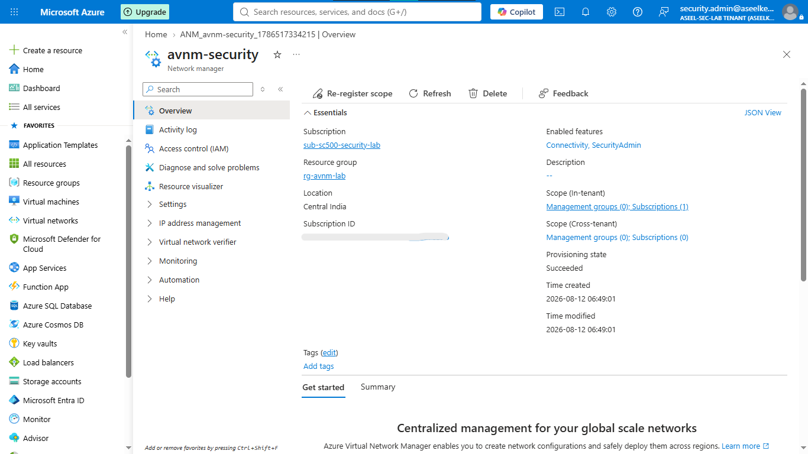
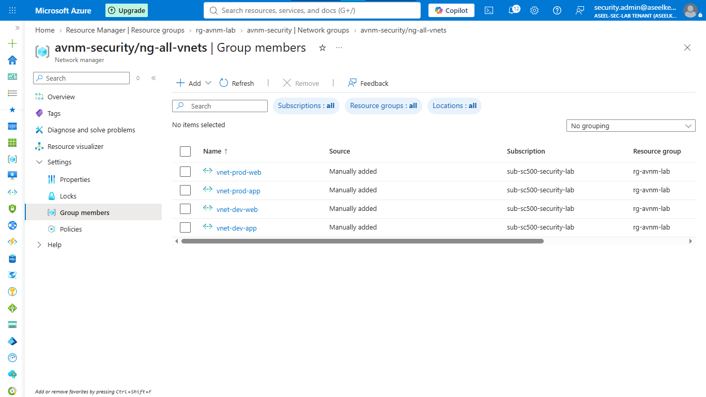
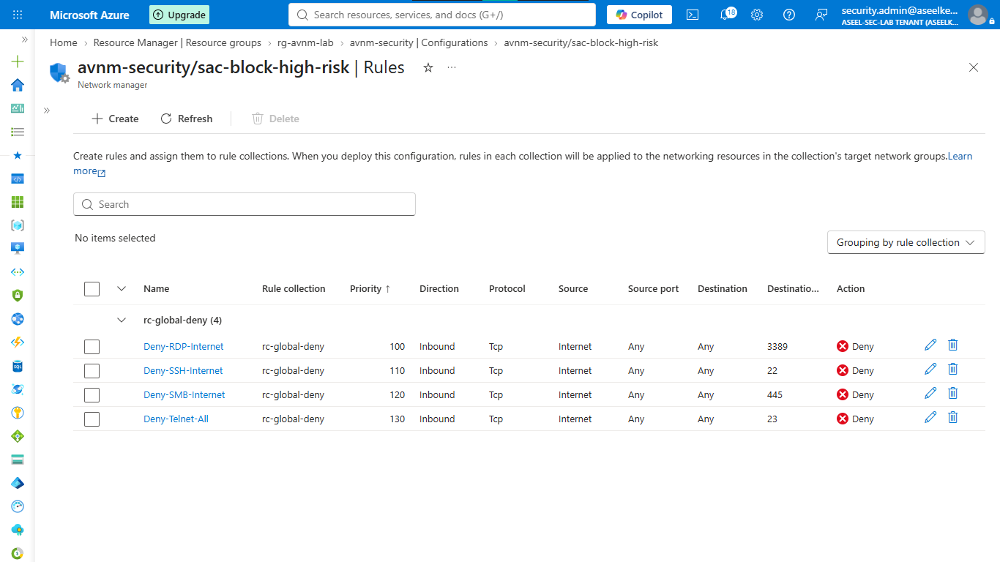
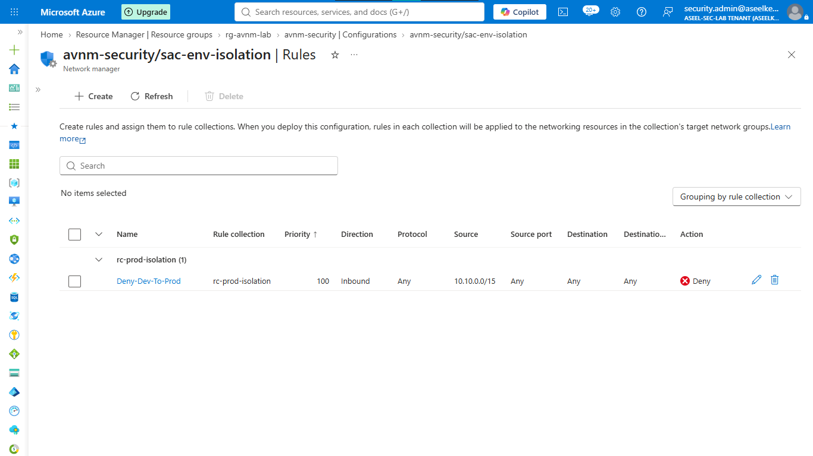
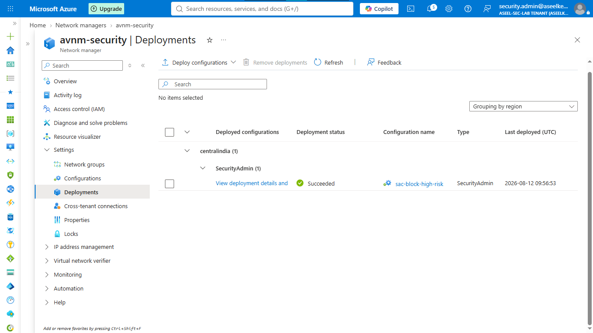
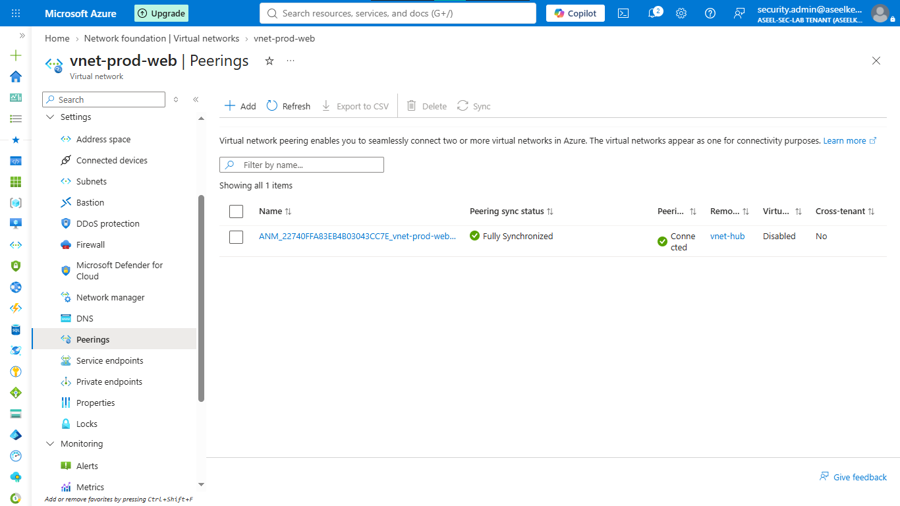

# Lab 18: Centralized Network Governance with Azure Virtual Network Manager

## Objective
Implement global network governance using Azure Virtual Network Manager (AVNM) to enforce centralized security policies, environment segmentation, and hub-and-spoke connectivity.

## Security Architecture Concepts
- Centralized Governance: Managing security policies across subscriptions from a single control plane.
- Global Policy Enforcement: Using Security Admin rules evaluated before local NSGs to ensure mandatory security controls.
- Logical Segmentation: Managing scalable environment isolation using Network Groups.

**Tools/Services Used:** Azure Virtual Network Manager (AVNM), Virtual Network.

## Prerequisites
- Azure subscription.

## Implementation Guide
### Task 1: Foundational Scaffolding
1. Deploy foundational Virtual Networks to simulate a multi-environment architecture.

### Task 2: Logical Grouping
1. Deploy Azure Virtual Network Manager.

2. Create Network Groups and assign VNets as static members based on environment.

### Task 3: Global Security Admin Rules
1. Create a Security Admin configuration to globally block high-risk ports (e.g., RDP, SSH, SMB) across all networks.

### Task 4: Environment Isolation
1. Add isolation rules to block cross-environment traffic (e.g., Dev to Prod) using CIDR summarization.

### Task 5: Regional Deployment
1. Commit the Security Admin configuration to the target regions.

### Task 6: Hub-and-Spoke Connectivity
1. Configure connectivity to centralize routing, hub-and-spoke topology, and optionally enable spoke-to-spoke communication.

## Testing and Verification
1. Verify AVNM-managed peering connections in the VNet settings.
2. Confirm that global deny rules for high-risk ports are active on resources.

## References
- [Azure Virtual Network Manager Documentation](https://learn.microsoft.com/en-us/azure/virtual-network-manager/overview)
