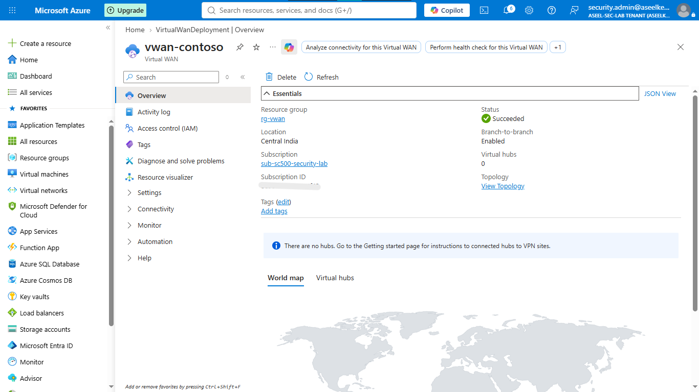
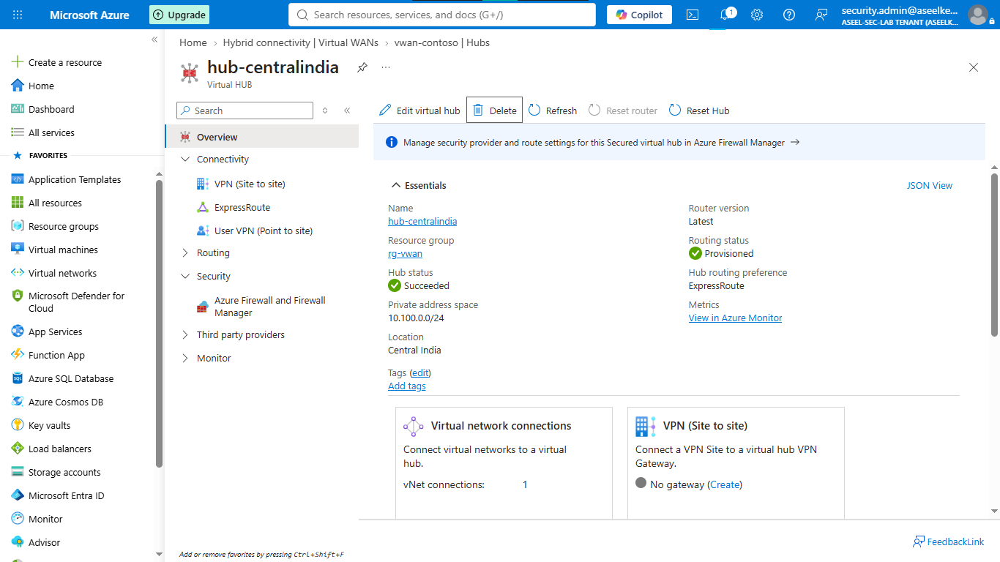
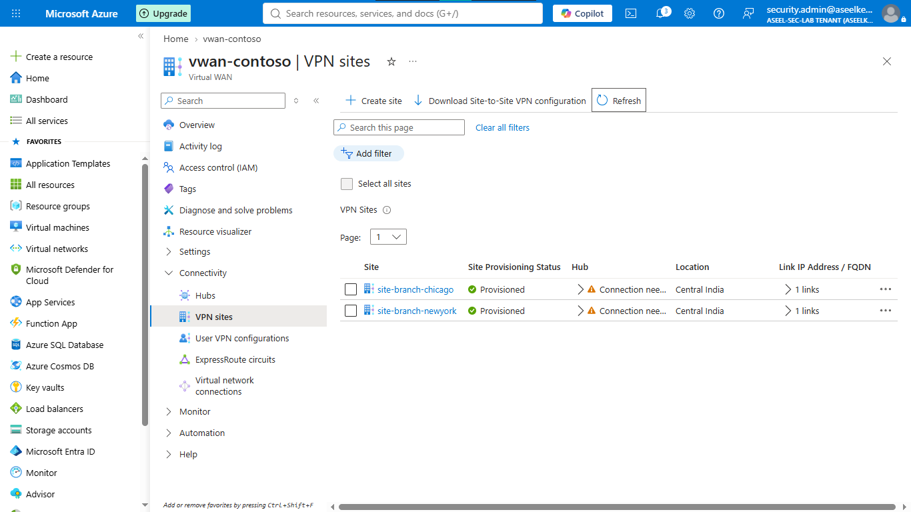
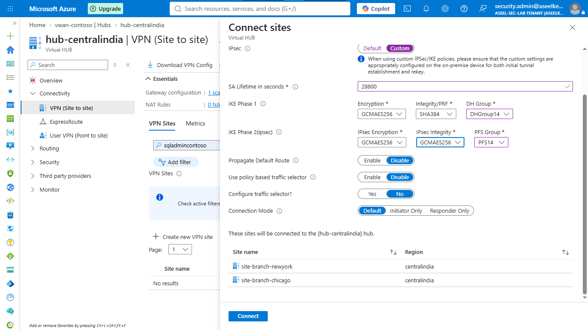
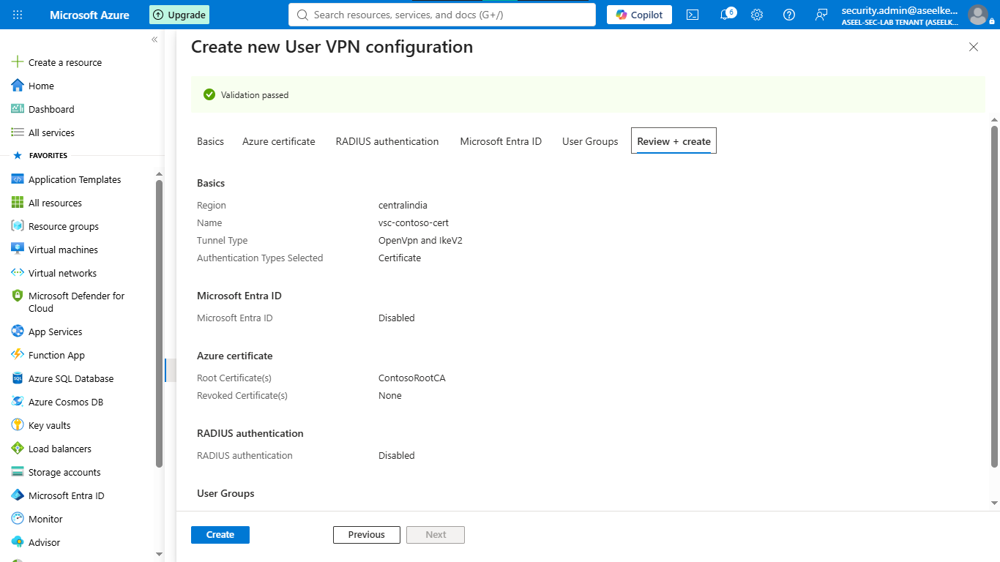
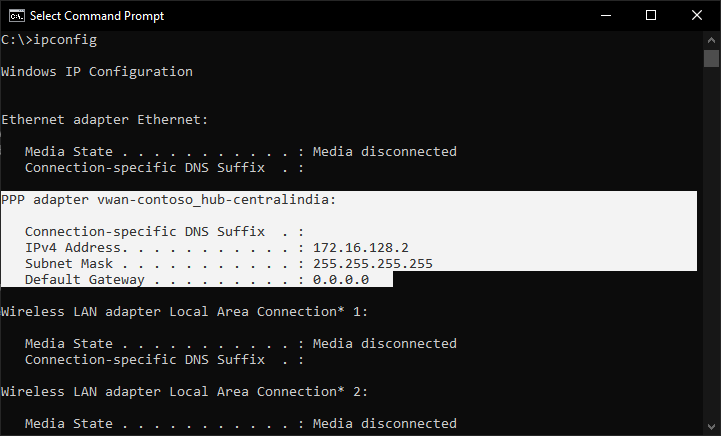
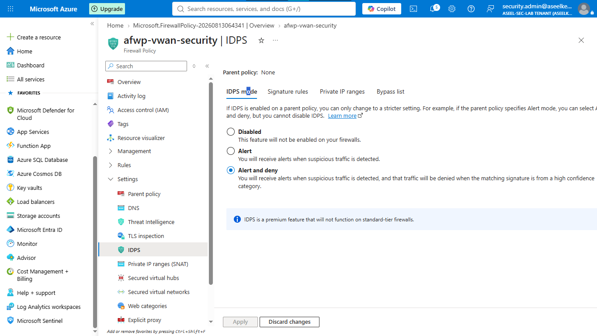
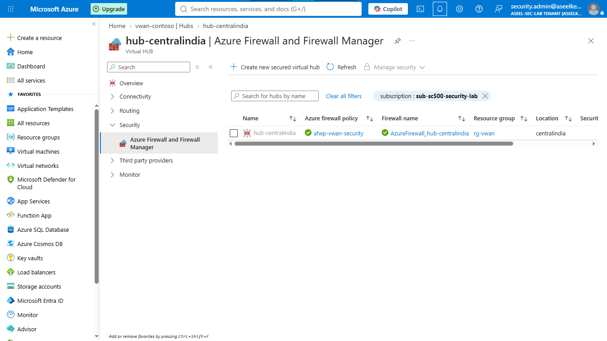
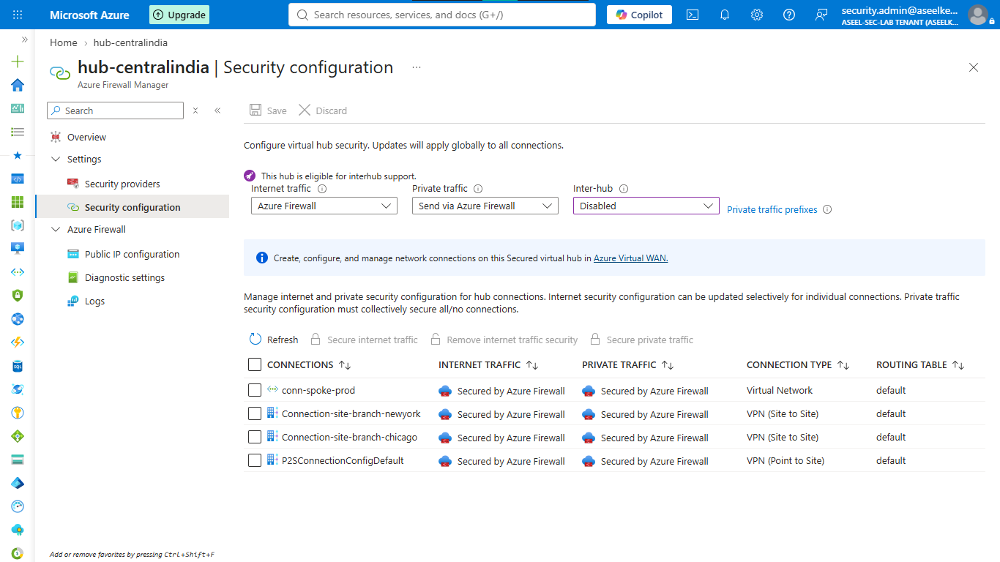
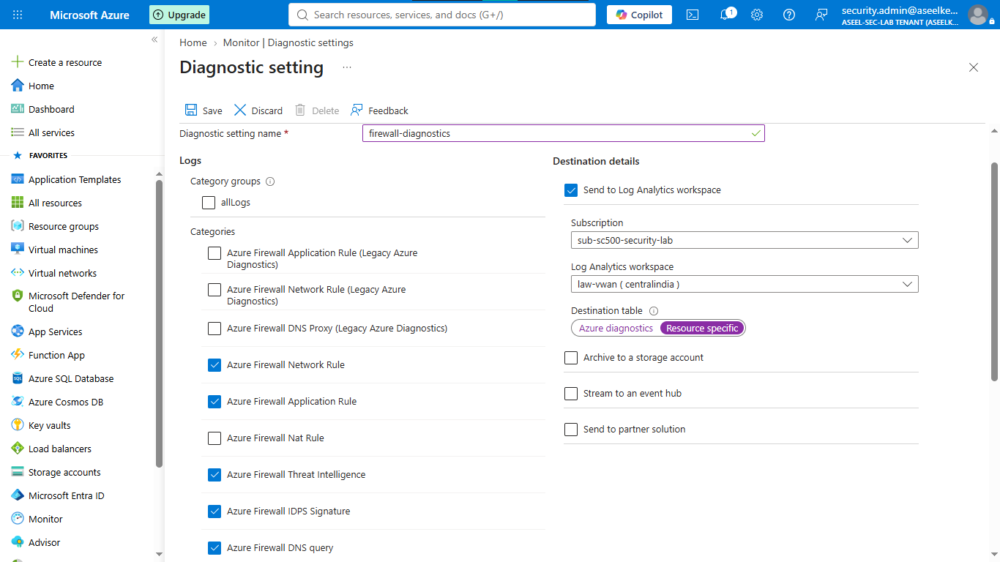

# Lab 19: Virtual WAN and VPN Security

## Objective
Establish a secure, scalable hub-and-spoke network architecture connecting multiple branch offices and remote users using Virtual WAN, Site-to-Site VPN, and Azure Firewall for centralized traffic inspection.

## Security Architecture Concepts
- Secure Connectivity: Implementing IPsec-encrypted Site-to-Site and Point-to-Site VPNs.
- Centralized Inspection: Forcing all branch and remote traffic through a central hub firewall.
- Zero-Trust Access: Validating remote users via certificate-based authentication (CBA).

**Tools/Services Used:** Azure Virtual WAN, Site-to-Site VPN, Point-to-Site VPN, Azure Firewall, Log Analytics.

## Prerequisites
- Active Azure Subscription.

## Implementation Guide
### Task 1: Virtual WAN Infrastructure Provisioning
1. Search for **Virtual WANs** > **+ Create**.
    - Resource Group: `rg-sc500-vwan`, Name: `vwan-contoso`, Type: `Standard`.
2. Go to the Virtual WAN > **Hubs** > **+ New Hub**.
    - Name: `hub-centralindia`, Address space: `10.100.0.0/24`.
3. Wait for hub deployment (approx. 30 mins).

### Task 2: Site-to-Site VPN Configuration
1. Go to Virtual WAN > **VPN sites** > **+ Create site**.
    - New York: `site-branch-newyork`, Private address space: `192.168.1.0/24`, Link: `link-ny`, IP: `203.0.113.10`.
    - Chicago: `site-branch-chicago`, Private address space: `192.168.2.0/24`, Link: `link-chi`, IP: `203.0.113.20`.
2. Go to Hub > **VPN (Site to site)**. Select sites, click **Connect VPN sites**.
3. Configure PSK and custom IPsec policy (GCMAES256 encryption/integrity).

### Task 3: Point-to-Site VPN Implementation
1. Go to Virtual WAN > **User VPN configurations** > **+ Create**.
    - Auth: `Certificate`. Upload root certificate (exported from local PowerShell).
2. Go to Hub > **User VPN (Point to site)**. Select the configuration.
3. Client address pool: `172.16.0.0/16`.
4. Download VPN profile, install on test client, and verify connectivity.

### Task 4: Azure Firewall Deployment
1. Create a **Firewall Policy** (`afwp-vwan-security`), Premium tier.
2. Define Network/Application rules (e.g., Deny Telnet, Alert/Deny IDPS).
3. Go to Virtual WAN > **Security configuration** > **Convert to secure virtual hub**.
4. Attach `afwp-vwan-security` policy.

### Task 5: Routing Intent Configuration
1. Go to Hub > **Routing Intent and policies**.
2. Set Internet Traffic to `Azure Firewall`.
3. Set Private Traffic to `Azure Firewall`.

### Task 6: Diagnostic Logging Configuration
1. Create a **Log Analytics workspace**.
2. Go to Firewall > **Diagnostic settings** > **+ Add**.
3. Check Application/Network Rule, Threat Intel, IDPS, DNS logs. Send to workspace.

## Testing and Verification
1. Verify VPN tunnel status in Virtual WAN.
2. Confirm firewall rule enforcement using test traffic.
3. Validate logs in Log Analytics.

## References
- [Azure Virtual WAN Documentation](https://learn.microsoft.com/en-us/azure/virtual-wan/virtual-wan-about)
