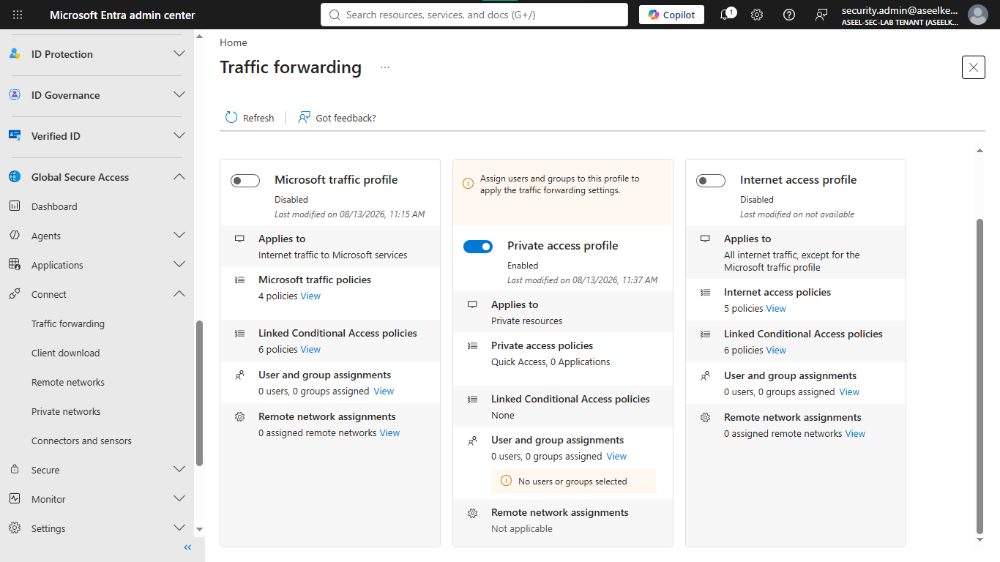
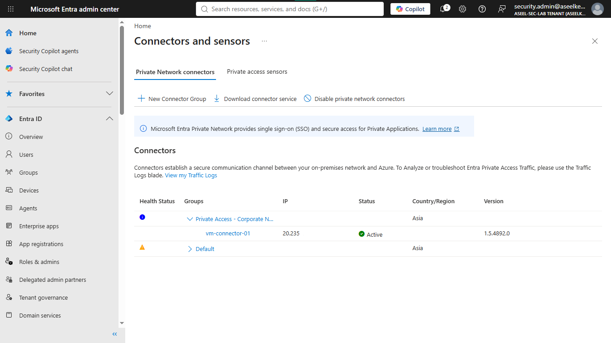
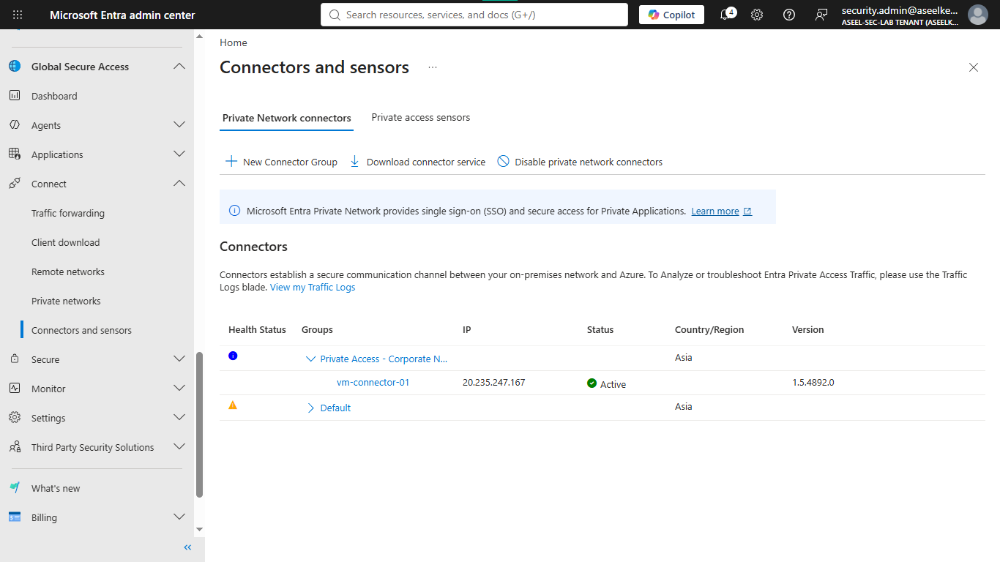
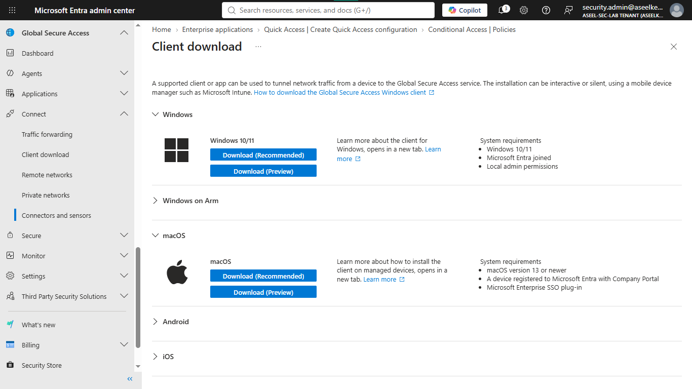
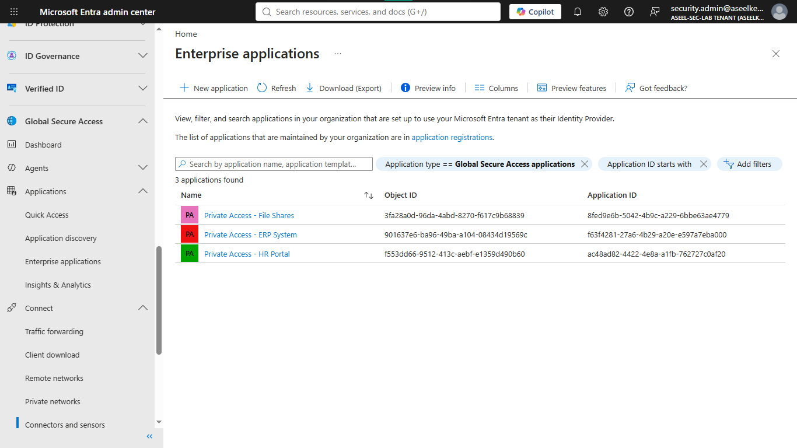
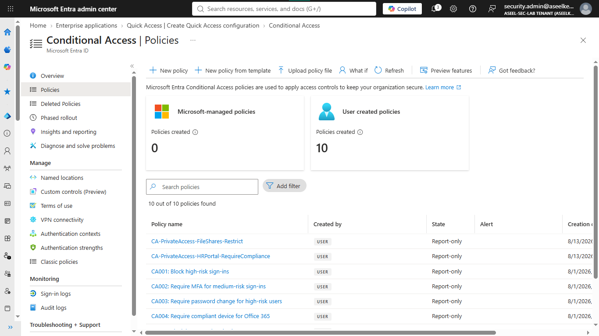
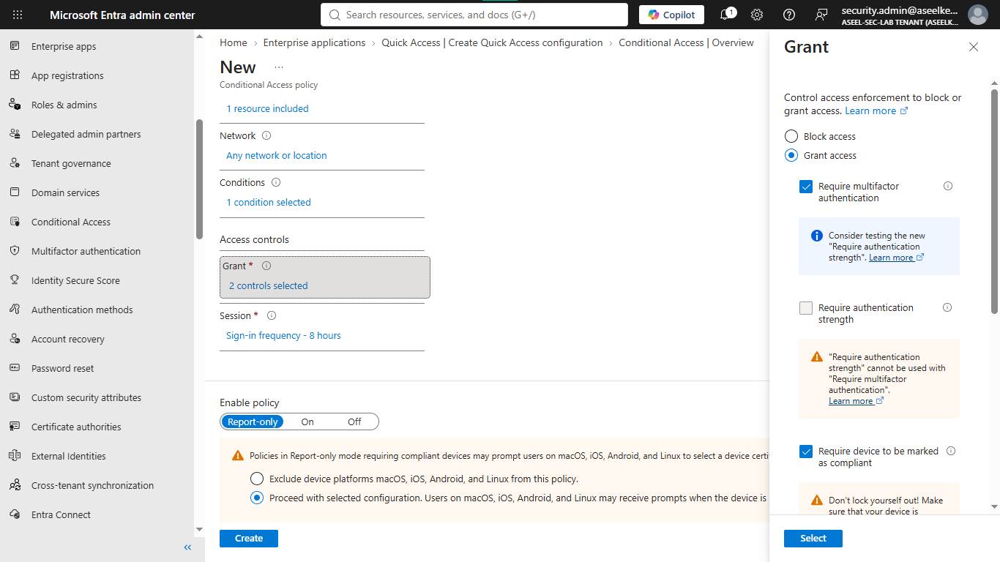
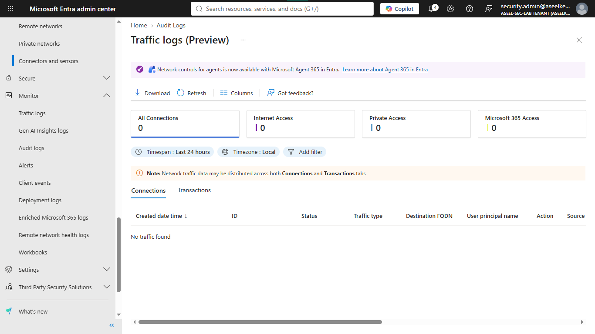

# Lab 20: Microsoft Entra Private Access

## Objective
Implement Zero Trust Network Access (ZTNA) using Microsoft Entra Private Access to secure internal applications by replacing traditional VPNs with application-specific, identity-aware access.

## Security Architecture Concepts
- ZTNA (Zero Trust Network Access): Granting access to applications based on identity and device state, not network perimeter.
- App-Level Segmentation: Restricting access to specific applications rather than entire subnets.
- Identity-Aware Proxying: Routing traffic through Microsoft Entra ID for advanced security controls.

**Tools/Services Used:** Microsoft Entra ID (Global Secure Access), Connector Service, Conditional Access.

## Prerequisites
- Microsoft Entra ID tenant.
- Virtual network simulation setup (VMs, subnets).

## Implementation Guide
### Task 1: Private Access Profile Configuration
1. Log in to the [Microsoft Entra admin center](https://entra.microsoft.com/).
2. Navigate to **Global Secure Access** > **Connect** > **Traffic forwarding**.
3. Enable **Private access profile**.

### Task 2: Corporate Network Simulation
1. Create a VNet (`vnet-onprem-sim`) with subnets: `snet-hr`, `snet-erp`, `snet-fileshares`, `snet-connector`.
2. Create a Windows Server VM (`vm-connector-01`) in `snet-connector`.

### Task 3: Connector Service Implementation
1. RDP into `vm-connector-01`.
2. In the Entra admin center, go to **Global Secure Access** > **Connect** > **Connectors**.
3. Download and install the Microsoft Entra Private Network Connector.
4. Authenticate during installation to link the VM to your Entra ID tenant.
5. Create a **Connector Group** (`Private Access - Corporate Network`) and assign the connector.

### Task 4: Application Segment Definition
1. In Entra admin center, go to **Global Secure Access** > **Applications** > **Enterprise applications**.
2. Click **New application** > **Add application segment**.
3. Define segments for internal apps (e.g., HR Portal, ERP, File Shares) using their internal IP/Port.

### Task 5: Conditional Access Policy Implementation
1. Go to **Protection** > **Conditional Access** > **Policies**.
2. Create a new policy (e.g., `CA-HR-Portal-Strict`).
3. Set **Target resources** to the Private Access application created.
4. Under **Grant**, enforce **Require multifactor authentication** and **Require device to be marked as compliant**.
5. Set to **Report-only** mode initially for testing.

### Task 6: Traffic Log Analysis
1. Navigate to **Global Secure Access** > **Monitor** > **Traffic logs**.
2. Review logs to ensure traffic is correctly routed through the connector and policy blocks/allows are recorded.

## Testing and Verification
1. Attempt to access the HR portal from a non-compliant device to verify access is blocked.
2. Confirm that MFA is triggered when accessing protected resources.

## References
- [Microsoft Entra Private Access Documentation](https://learn.microsoft.com/en-us/entra/global-secure-access/overview-private-access)
