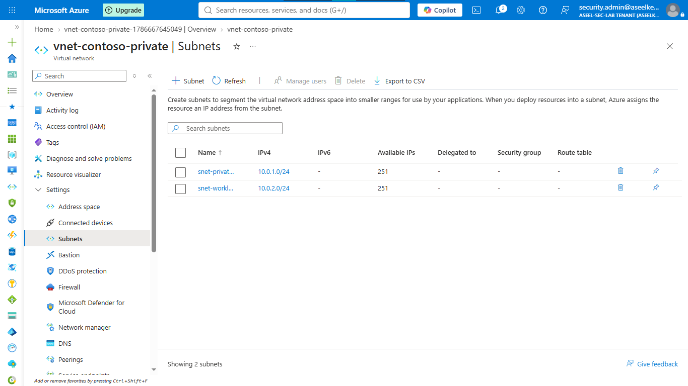
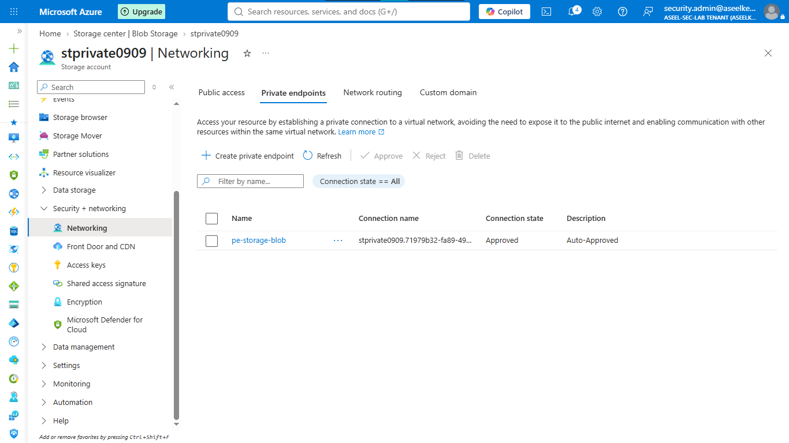
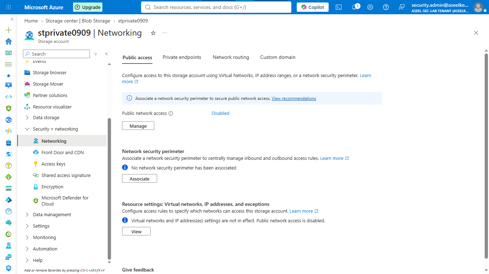
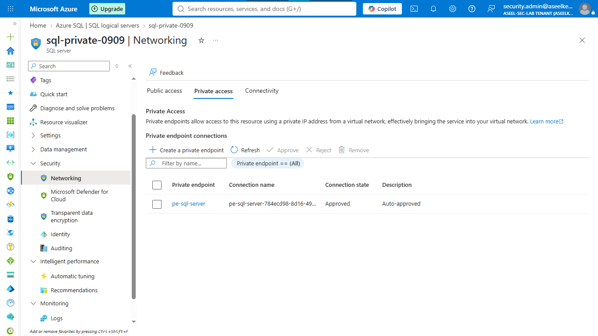
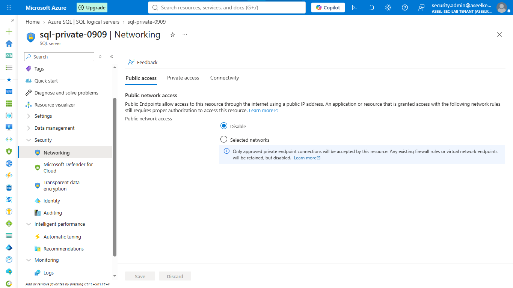
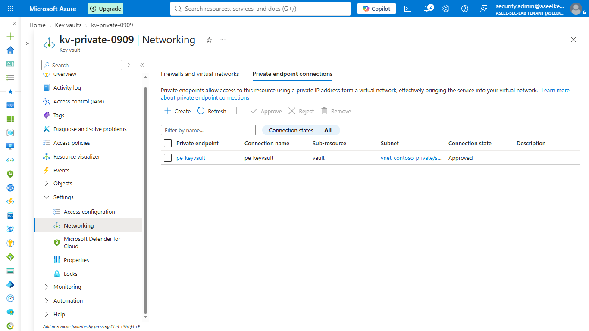
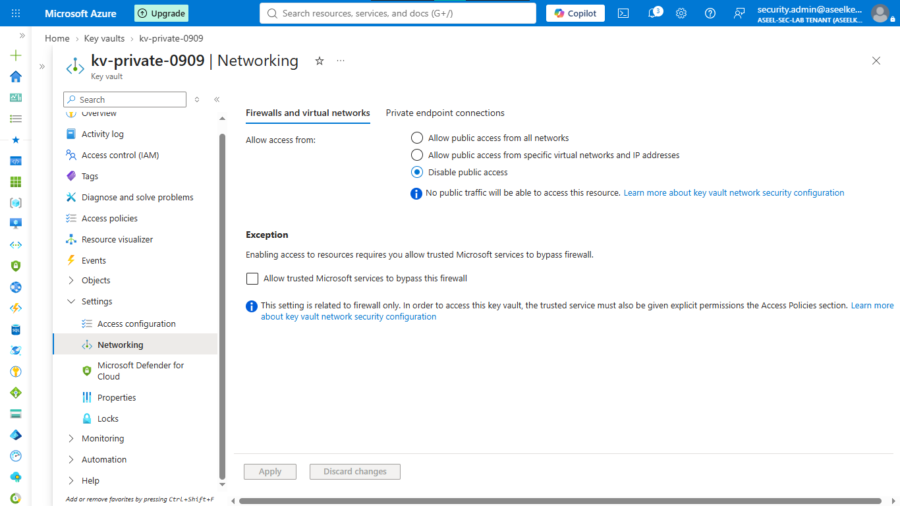
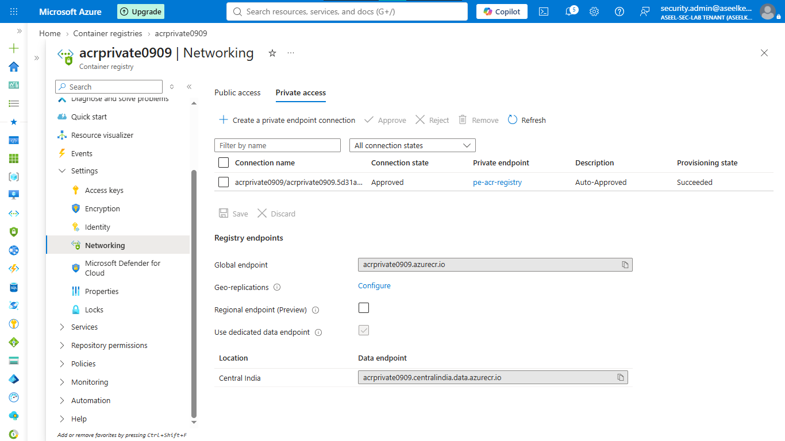
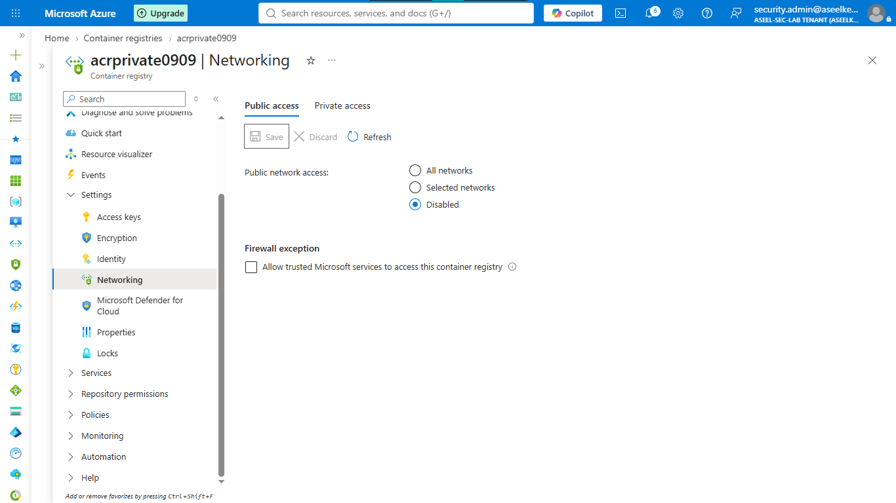
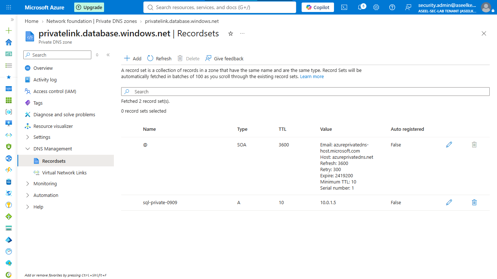

# Lab 21: Private Endpoints for PaaS Resources

## Objective
Implement network isolation for PaaS services (Storage, SQL, Key Vault, Container Registry) using Azure Private Endpoints to eliminate exposure to the public internet.

## Security Architecture Concepts
- PaaS Hardening: Moving PaaS resources into private virtual networks.
- Private Link: Projecting Azure service endpoints directly into the VNet.
- DNS Integration: Using Private DNS zones to resolve PaaS services locally.

**Tools/Services Used:** Azure Storage, SQL Database, Key Vault, Container Registry, Private Link, Private DNS.

## Prerequisites
- Active Azure Subscription.

## Implementation Guide
### Task 1: Private Networking Infrastructure Provisioning
1. Create Resource group `rg-sc500-private-endpoints`.
2. Create VNet `vnet-contoso-private` (10.0.0.0/16).
3. Add subnets: `snet-private-endpoints` (10.0.1.0/24) and `snet-workloads` (10.0.2.0/24).

### Task 2: Storage Account Private Link Configuration
1. Create Storage account (`stprivate[numbers]`).
2. Go to Storage Account > **Networking** > **Private endpoint connections** > **+ Private endpoint**.
3. Target sub-resource: `blob`.
4. Integrate with Private DNS Zone: `Yes`.
5. Disable public network access on the Storage Account.

### Task 3: SQL Database Private Link Configuration
1. Create SQL server and database.
2. Go to SQL Server > **Networking** > **Private access** > **+ Private endpoint**.
3. Target sub-resource: `sqlServer`.
4. Integrate with Private DNS Zone: `Yes`.
5. Disable public network access on the SQL Server.

### Task 4: Key Vault Private Link Configuration
1. Create Key Vault (`kv-private-[numbers]`).
2. Go to Key Vault > **Networking** > **Private endpoint connections** > **+ Create**.
3. Target sub-resource: `vault`.
4. Disable public access in the **Firewalls and virtual networks** tab.

### Task 5: Container Registry Private Link Configuration
1. Create Container Registry (`acrprivate[numbers]`), SKU: `Premium`.
2. Go to Registry > **Networking** > **Private access** > **+ Private endpoint**.
3. Target sub-resource: `registry`.
4. Disable public access in the **Public access** tab.

### Task 6: Verification and Resource Cleanup
1. Check **Private DNS zones** to confirm all resources have mapped private IP addresses.

2. Delete the `rg-sc500-private-endpoints` Resource group to remove all lab resources and prevent further costs.

## Testing and Verification
1. Confirm all PaaS resources have private IP addresses associated with the VNet.
2. Attempt access from the public internet to verify access is denied.

## References
- [Azure Private Link Documentation](https://learn.microsoft.com/en-us/azure/private-link/private-endpoint-overview)
