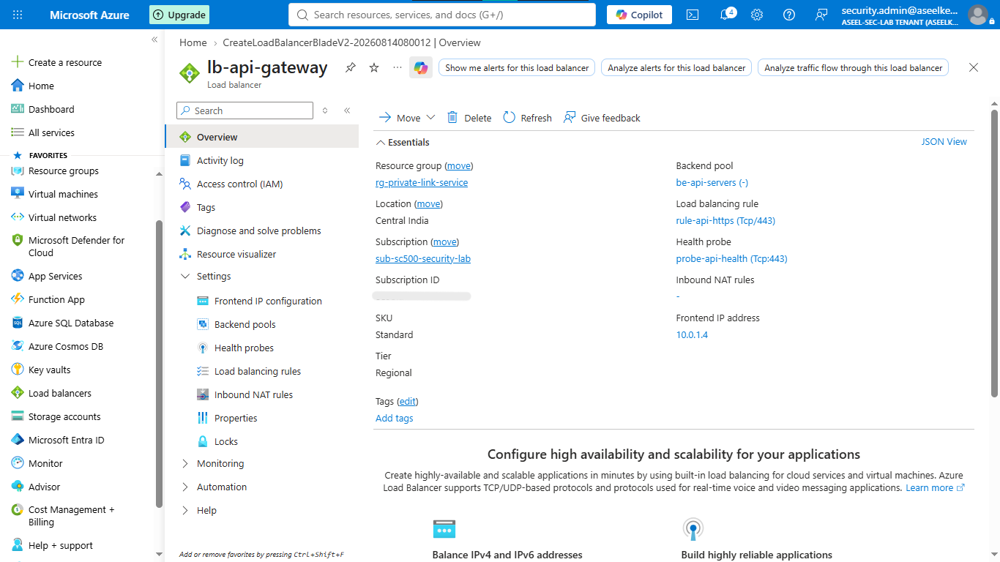
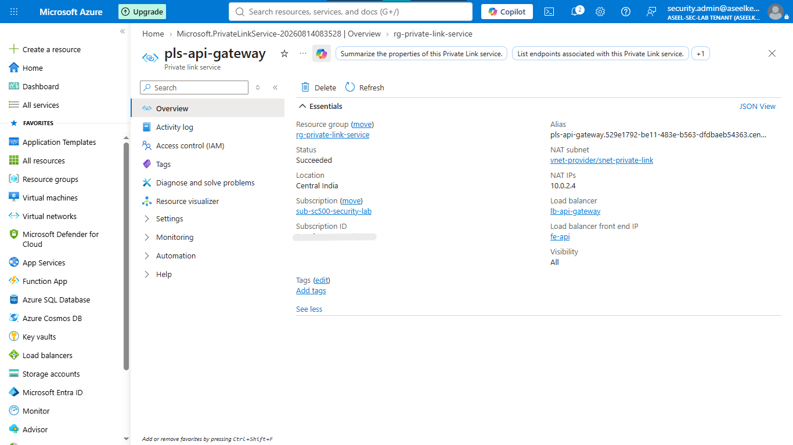
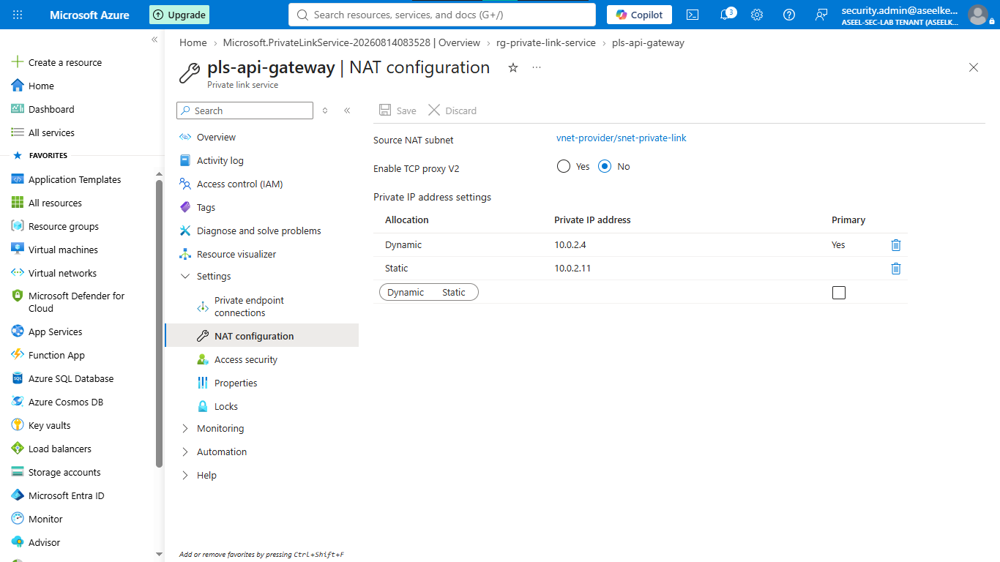
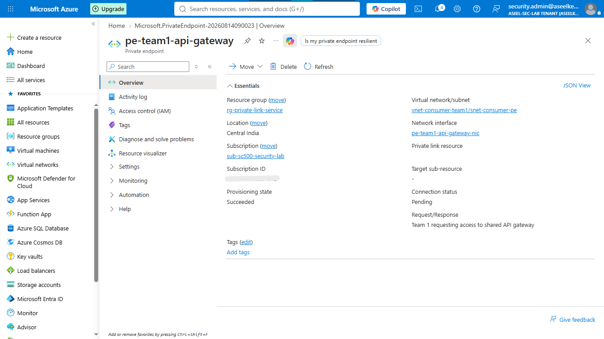
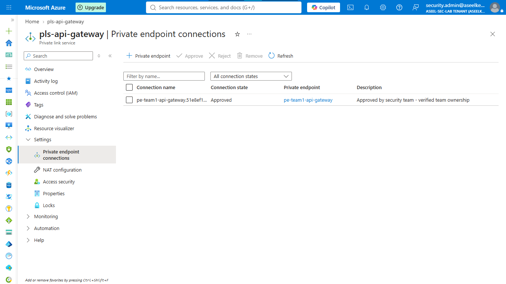
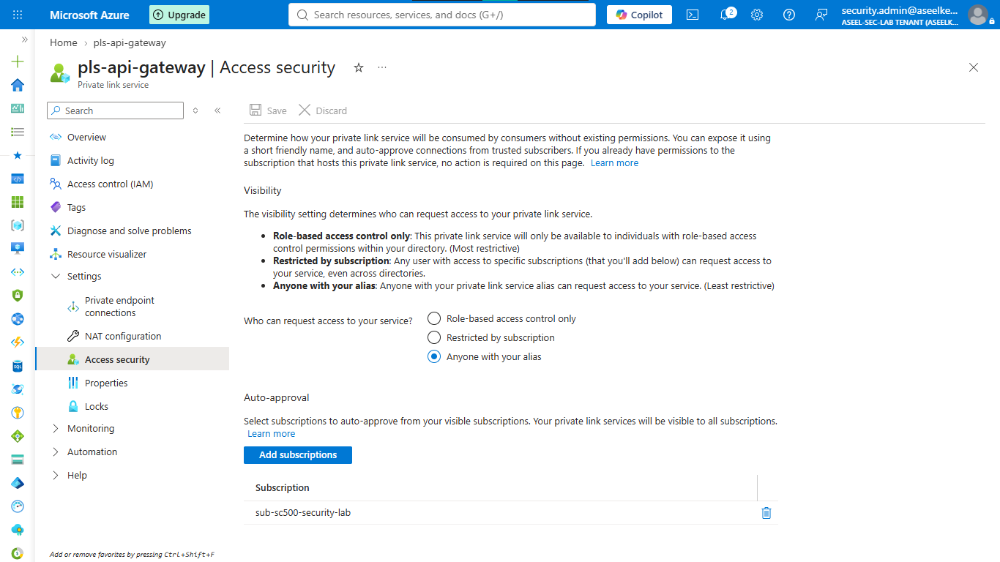

# Lab 22: Private Link Services

## Objective
Deploy a Private Link Service to securely expose internal services to other VNets or tenants without exposing them to the public internet.

## Security Architecture Concepts
- Secure Service Exposure: Using Private Link Service (PLS) to project internal services privately.
- Service Provider Model: Managing access requests via Private Link Service connections.
- Network Isolation: Ensuring traffic between consumer and provider VNets is fully private.

**Tools/Services Used:** Load Balancer, Private Link Service, Private Endpoints.

## Prerequisites
- Basic knowledge of Azure Networking.

## Implementation Guide
### Task 1: Network Infrastructure Provisioning
1. Create Resource group `rg-sc500-private-link-service`.
2. Create VNet `vnet-provider` (10.0.0.0/16) with `snet-backend` and `snet-private-link` subnets.
3. Create VNet `vnet-consumer-team1` (172.16.0.0/16) with `snet-consumer-pe` subnet.

### Task 2: Private Link Service Configuration
1. Create a **Standard Internal Load Balancer** (`lb-api-gateway`) in `vnet-provider`.
2. Configure frontend IP in `snet-backend` and backend pool.
3. Search for **Private Link** > **Private link services** > **+ Create**.
    - Link to `lb-api-gateway` and frontend IP.
    - NAT subnet: `snet-private-link`.

### Task 3: NAT IP Configuration
1. On the Private Link Service screen, go to **NAT configuration**.
2. Add a static NAT IP (e.g., `10.0.2.11`) to handle traffic mapping.

### Task 4: Endpoint Access Request Configuration
1. In the Consumer VNet (`vnet-consumer-team1`), create a **Private Endpoint**.
2. For connection method, select `Connect by resource ID or alias` and paste the Private Link Service alias from the Provider.

### Task 5: Endpoint Access Approval
1. Go to the Provider Private Link Service > **Private endpoint connections**.
2. Review the pending request from the Consumer and click **Approve**.

### Task 6: VIP Access Management
1. To automate approval for trusted tenants, go to the Private Link Service > **Access security**.
2. Add authorized Subscription IDs to the "Auto-approved subscriptions" list.
3. Enable **TCP proxy V2** for improved identity visibility.

## Testing and Verification
1. Verify endpoint status is "Approved".
2. Confirm connectivity from the consumer VNet.

## References
- [Azure Private Link Service Documentation](https://learn.microsoft.com/en-us/azure/private-link/private-link-service-overview)
