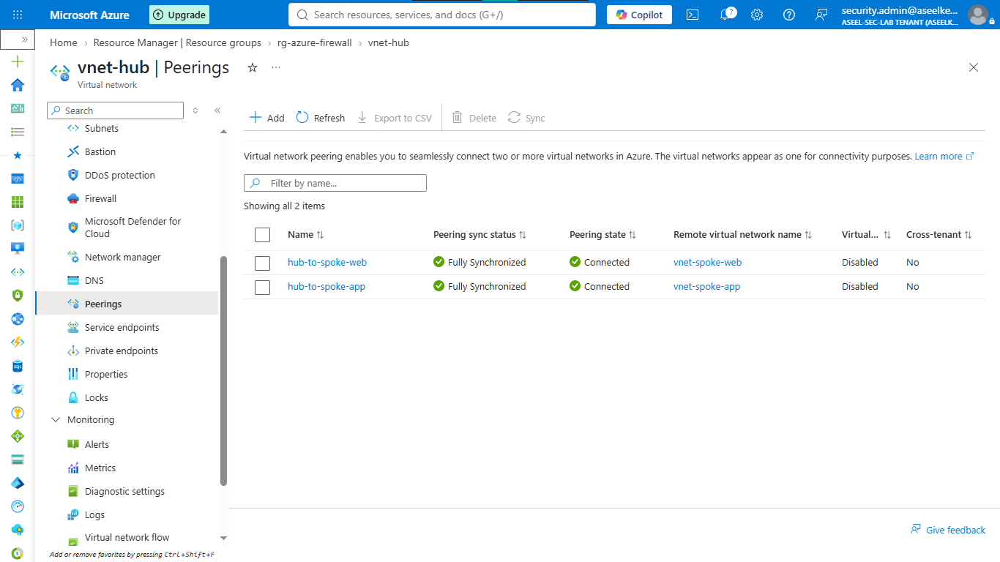
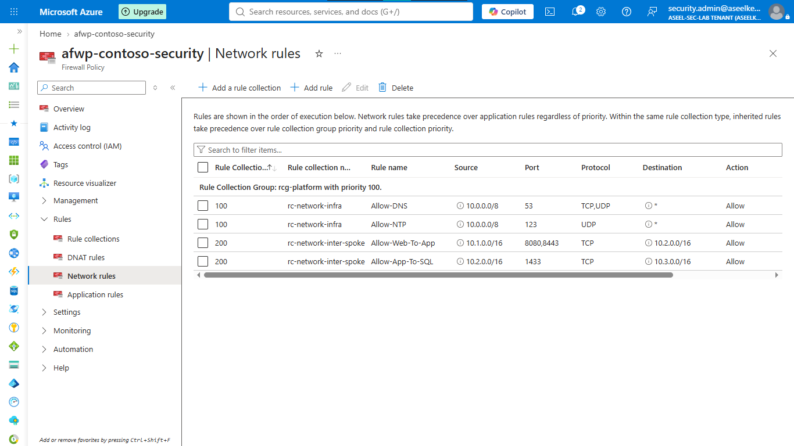
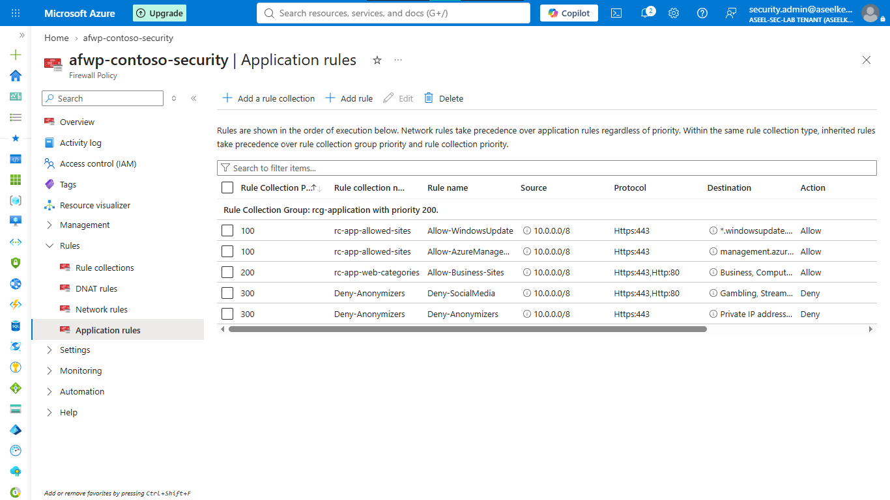
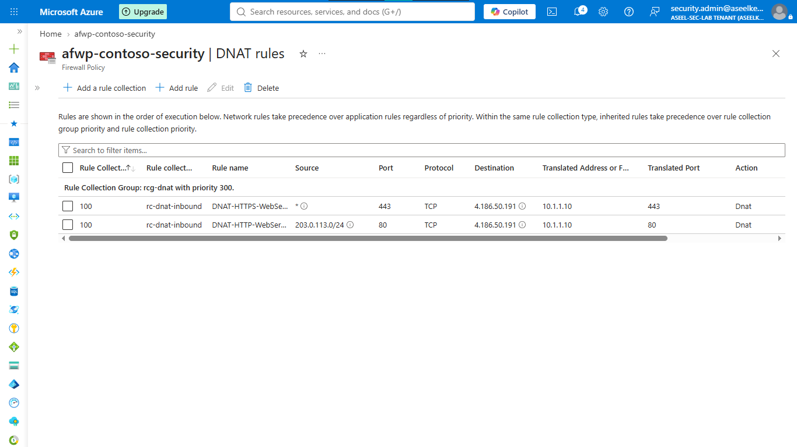
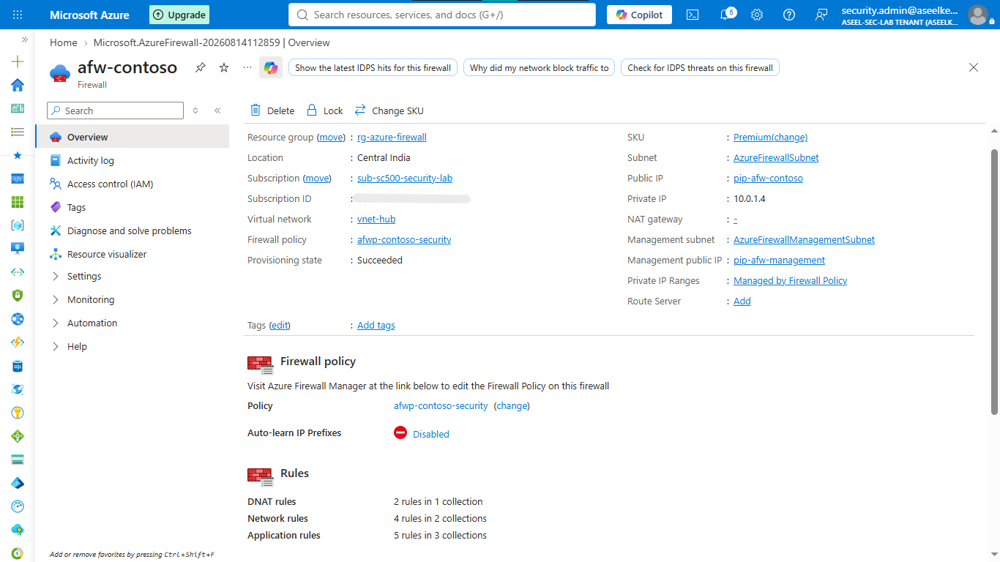
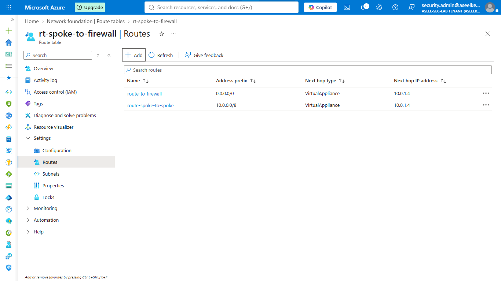
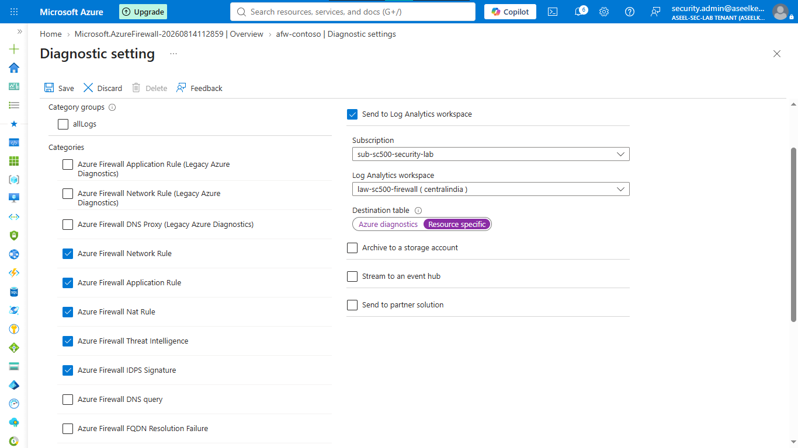

# Lab 23: Azure Firewall

## Objective
Deploy and configure a centralized, premium-tier Azure Firewall to inspect and filter all traffic across virtual network spokes, enforcing perimeter security.

## Security Architecture Concepts
- Centralized Inspection: Forcing all traffic through a hub-and-spoke firewall topology.
- Application Filtering: Allowing/blocking traffic based on FQDN and Web Categories.
- IDPS: Intrusion Detection and Prevention to stop known malicious traffic.

**Tools/Services Used:** Azure Firewall Premium, Firewall Policy, Route Tables.

## Prerequisites
- Basic understanding of hub-and-spoke network topologies.

## Implementation Guide
### Task 1: Network Infrastructure Provisioning
1. Create Resource group `rg-student-firewall`.
2. Create Hub VNet (`vnet-hub`: 10.0.0.0/16) with subnets: `AzureFirewallSubnet` (10.0.1.0/26) and `AzureFirewallManagementSubnet` (10.0.2.0/26).
3. Create Spoke VNets (`vnet-spoke-web`, `vnet-spoke-app`) and establish Peering to `vnet-hub`.

### Task 2: Firewall Policy Configuration
1. Search for **Firewall Policies** > **+ Create**. Select Premium tier.
2. Enable **IDPS** (Alert and deny) and **Threat intelligence**.

### Task 3: Application Filtering Rule Configuration
1. In Firewall Policy > **Rule collections**, create collection `rcg-application`.
2. Create an Application rule to allow `SearchEnginesAndPortals` and `Business` web categories for the spoke network ranges.

### Task 4: Firewall Deployment
1. Search for **Firewalls** > **+ Create**. Select `Premium` tier and `afwp-my-security` policy.
2. Associate with `vnet-hub`.
3. Provision Public IPs for the firewall and management interface.

### Task 5: Routing Table Implementation
1. Search for **Route tables** > **+ Create** (`rt-force-firewall`).
2. Add route: `0.0.0.0/0` to `Virtual appliance` (Firewall private IP).
3. Associate route table with `snet-web` and `snet-app` subnets in the spoke VNets.

### Task 6: Diagnostic Logging Configuration
1. Create **Log Analytics workspace** (`law-security-logs`).
2. Go to Firewall > **Diagnostic settings** > **+ Add**.
3. Select all firewall log categories and send to the workspace.

## Testing and Verification
1. Attempt to access blocked vs. allowed websites from a VM in the spoke network.
2. Monitor firewall logs in Log Analytics to confirm traffic hits.

## References
- [Azure Firewall Documentation](https://learn.microsoft.com/en-us/azure/firewall/overview)
