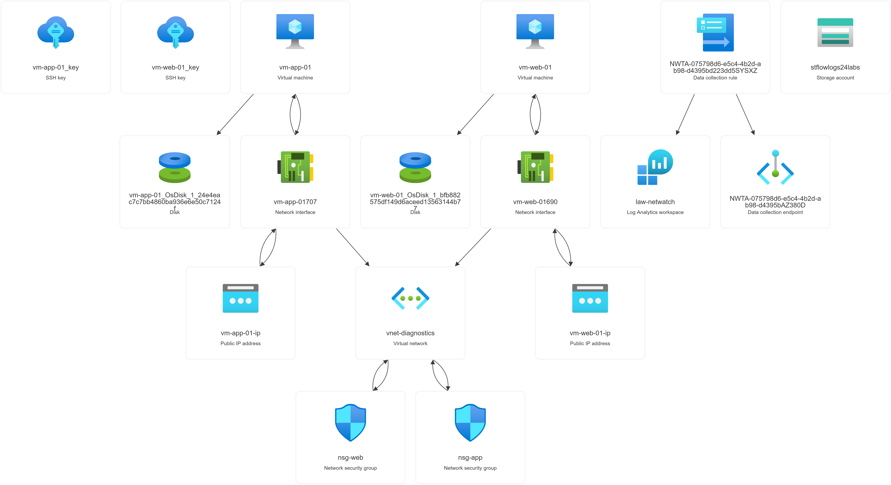
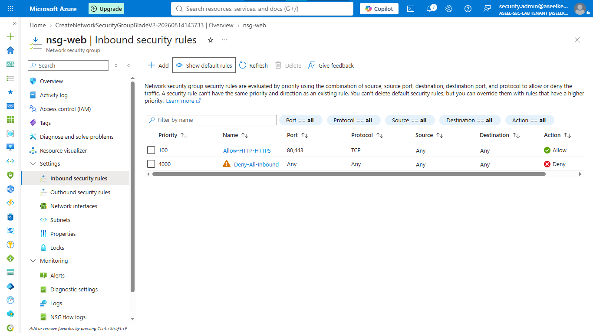
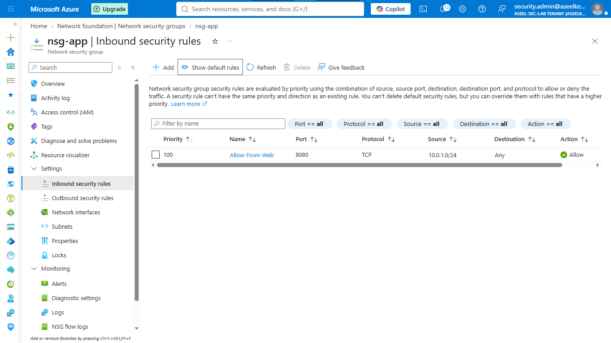
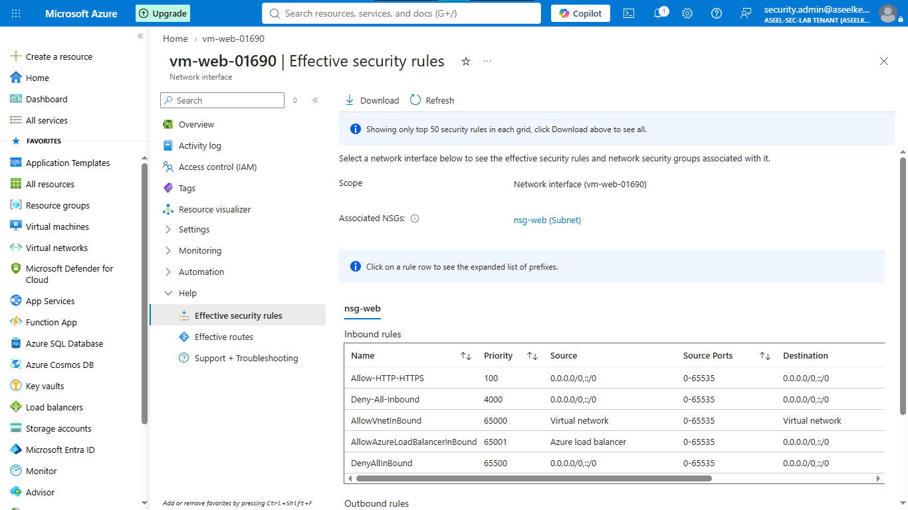
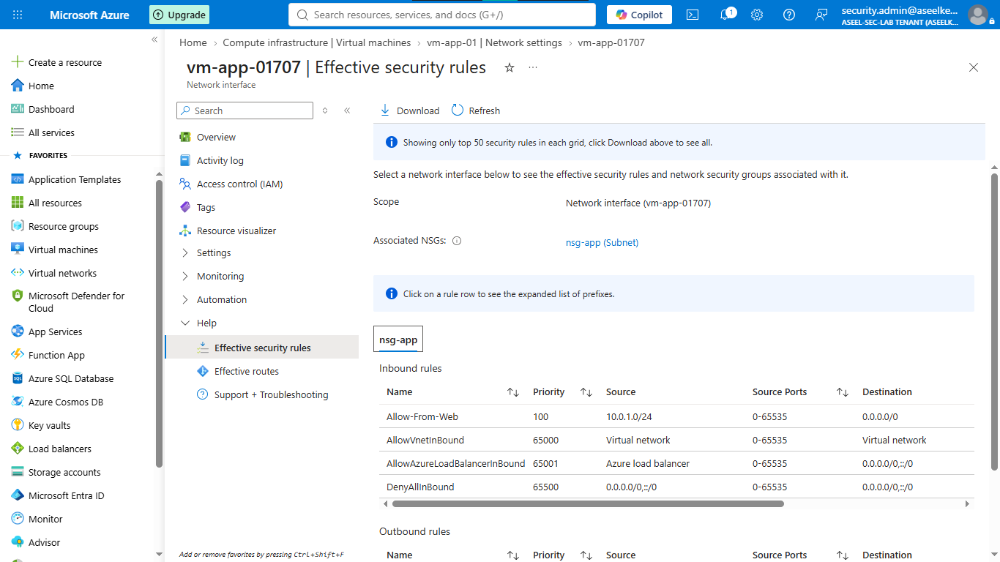
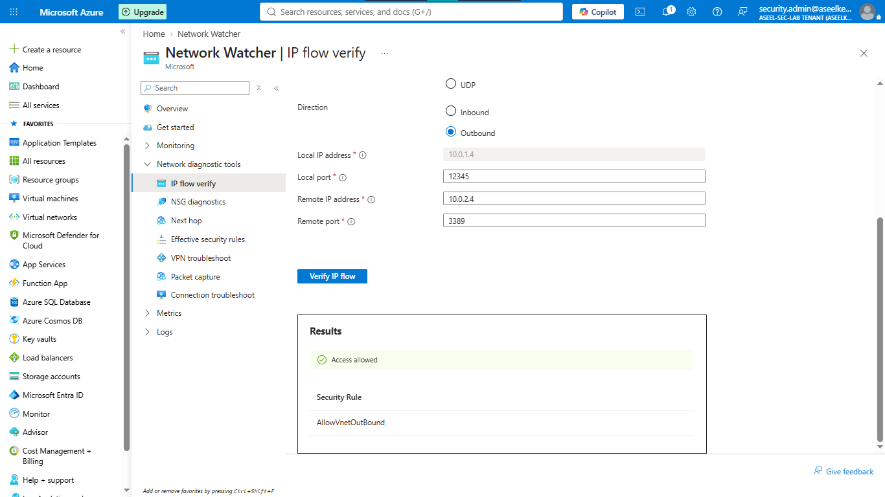
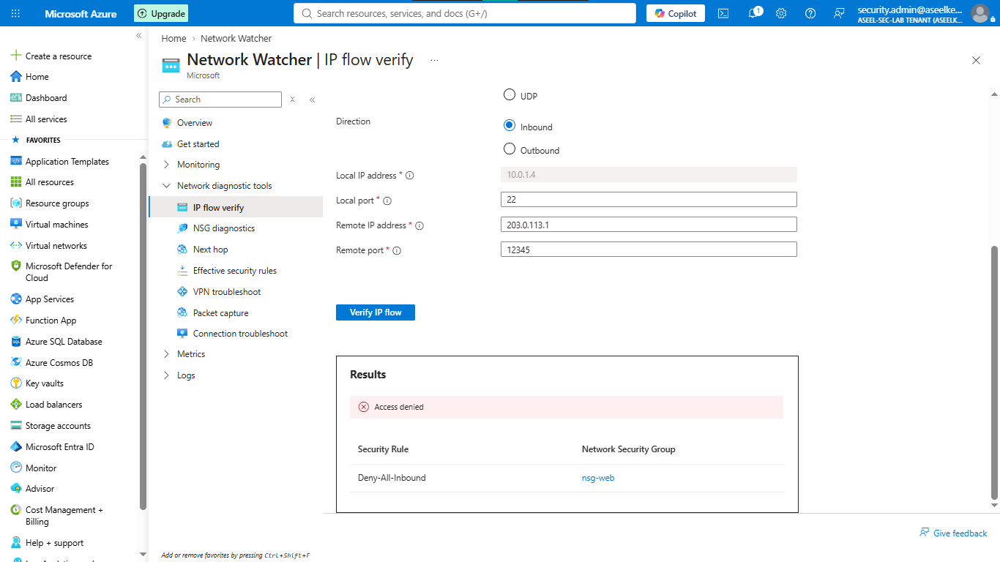
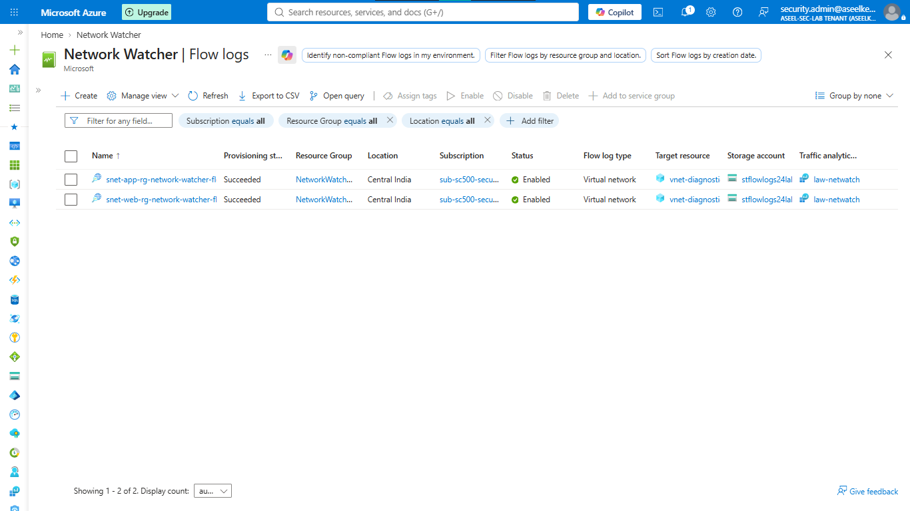
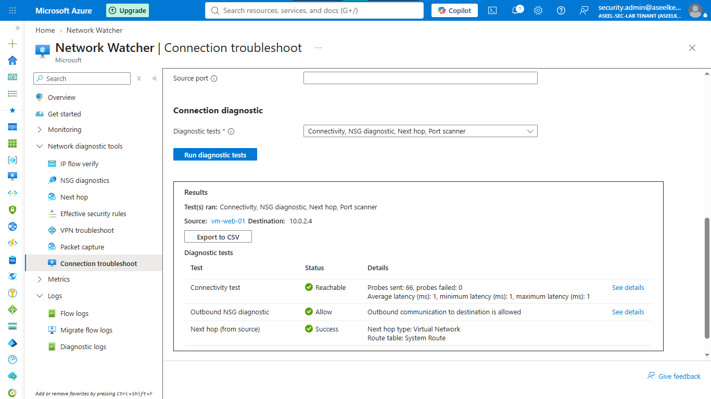
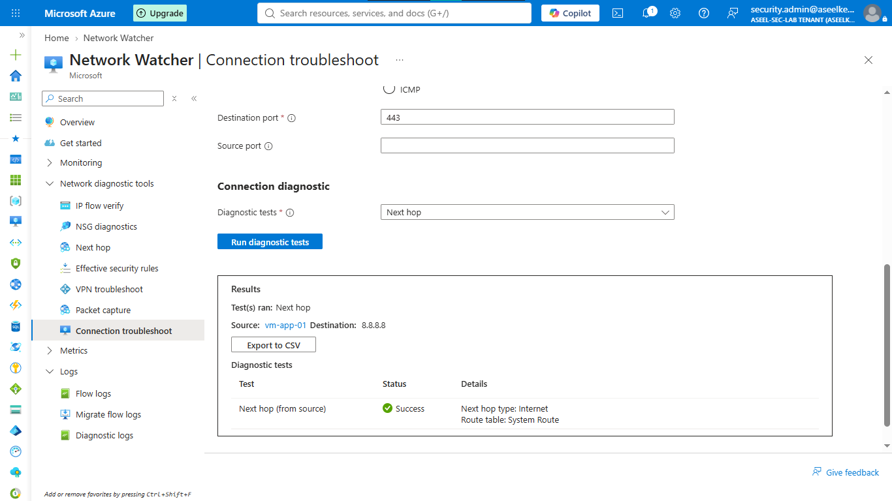

# Lab 24: Network Watcher Diagnostics

## Objective
Utilize Network Watcher tools (IP flow verify, Effective security rules, Flow logs, Connection troubleshoot) to audit network security configurations and troubleshoot connectivity issues.

## Security Architecture Concepts
- Network Observability: Gaining deep visibility into traffic patterns and security rule evaluation.
- Proactive Diagnostics: Validating network path connectivity and rule enforcement.
- Traffic Analysis: Using Flow Logs for forensic auditing of network traffic.

**Tools/Services Used:** Network Watcher, Log Analytics, NSGs.

## Prerequisites
- Active Azure subscription.

## Implementation Guide
### Task 1: Network Infrastructure Provisioning
1. Create Resource group `rg-sc500-network-watcher`.
2. Create VNet `vnet-diagnostics` (10.0.0.0/16) with subnets `snet-web` and `snet-app`.
3. Create NSGs (`nsg-web`, `nsg-app`) with specific inbound/outbound rules.
4. Provision two Linux VMs (`vm-web-01`, `vm-app-01`) without NSGs attached directly to the NICs (relying on subnet-level NSGs).

### Task 2: Effective Security Rule Verification
1. Navigate to `vm-web-01` > **Networking** > **Network Interface**.
2. Click **Effective security rules**.
3. Verify that custom and default security rules are correctly propagated to the VM.

### Task 3: IP Flow Verification
1. Search for **Network Watcher** > **IP flow verify**.
2. Test traffic flow from `vm-web-01` to `vm-app-01` on specific ports.
3. Observe and analyze the simulation result (Allowed/Denied) against existing NSG rules.

### Task 4: Flow Log Configuration
1. Create a Storage Account (`stflowlogs[numbers]`) and Log Analytics workspace (`law-sc500-netwatch`).
2. In Network Watcher > **Flow logs** > **+ Create**.
3. Select subnets `snet-web` and `snet-app`.
4. Configure logging to the storage account and enable **Traffic Analytics** linked to the workspace.

### Task 5: Connection Troubleshooting
1. Add the "Network Watcher Agent" extension to both VMs.
2. Search for **Network Watcher** > **Connection troubleshoot**.
3. Test connectivity between `vm-web-01` and `vm-app-01` on port 22.
4. Analyze the hop-by-hop results.

### Task 6: Resource Cleanup
1. Delete the `rg-sc500-network-watcher` Resource group to remove all lab resources.

## Testing and Verification
1. Verify rule application using effective security rules.
2. Confirm flow logs are active in the storage account.
3. Validate connection troubleshooting results.

## References
- [Azure Network Watcher Documentation](https://learn.microsoft.com/en-us/azure/network-watcher/network-watcher-overview)
