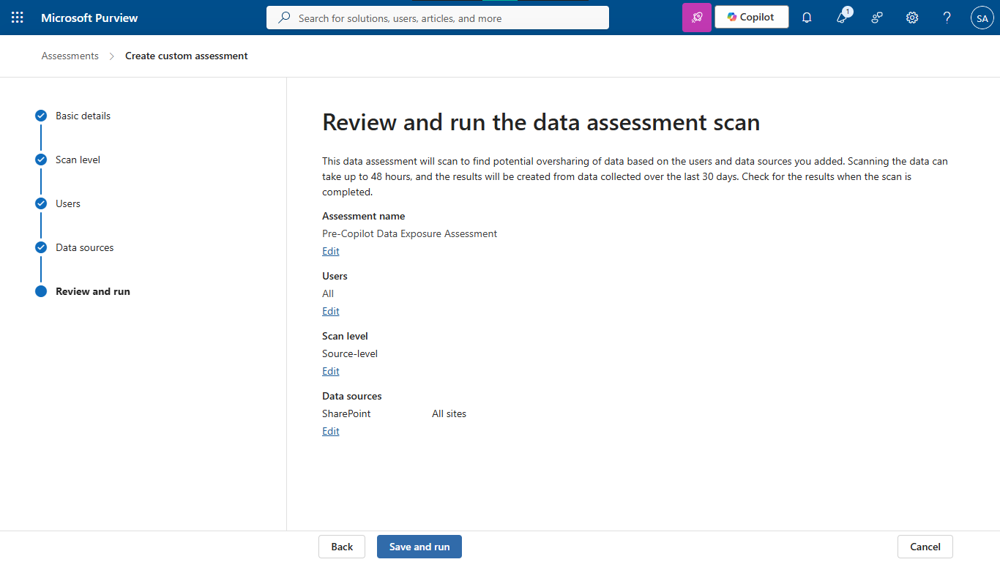
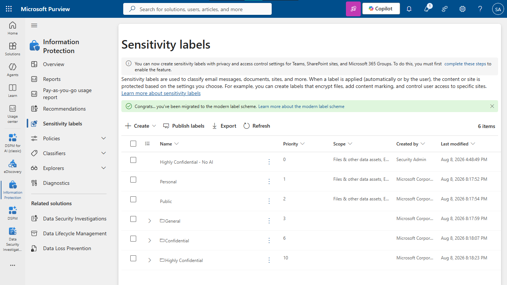
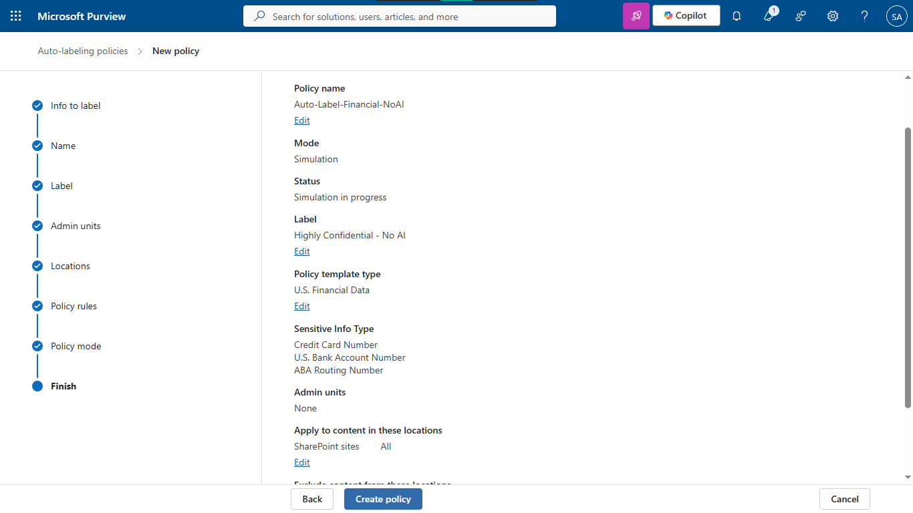
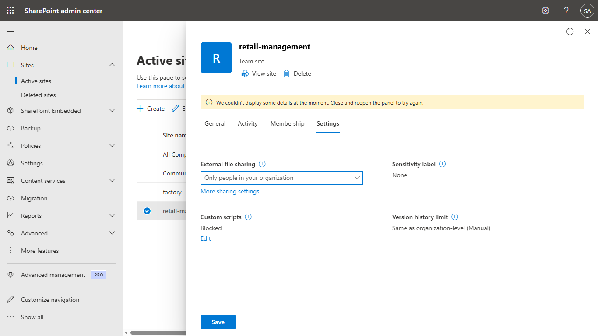
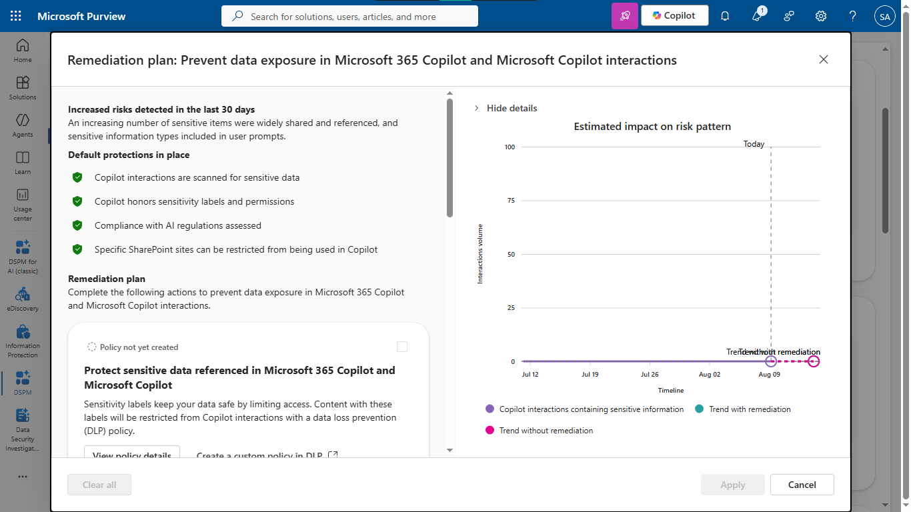
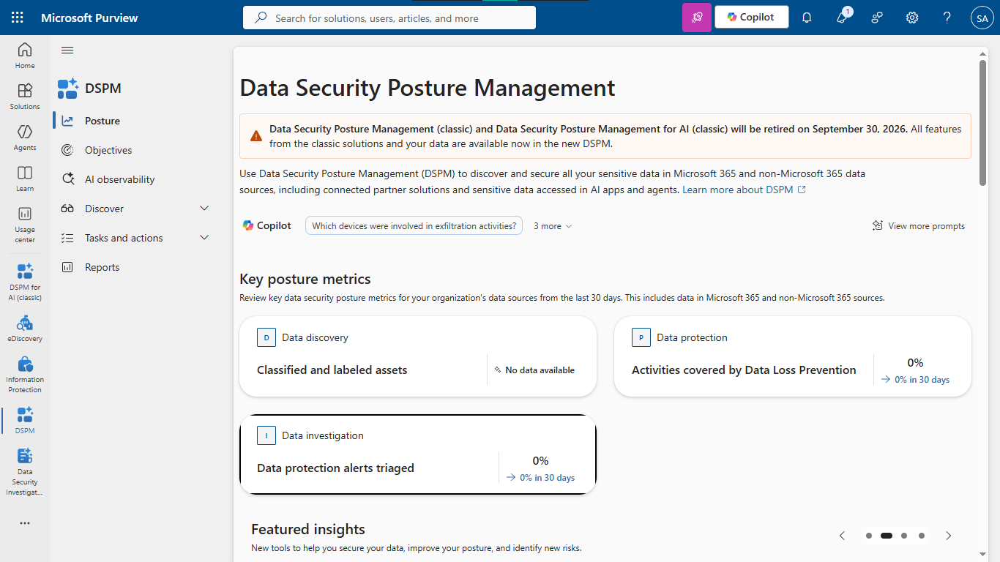

# Lab 25: Securing Microsoft 365 Copilot with Microsoft Purview & DSPM

## Objective
Implement Data Security Posture Management (DSPM) and Microsoft Purview Information Protection to identify, scope, label, and remediate overshared sensitive data prior to deploying Microsoft 365 Copilot.

## Security Architecture Concepts
- **Data Security Posture Management (DSPM):** Proactive identification of sensitive data exposure.
- **Information Protection:** Automated classification and labeling of sensitive assets.
- **Least Privilege Access:** Enforcing restricted sharing policies in collaboration spaces.

**Tools/Services Used:** Microsoft Purview Portal, SharePoint Online, Microsoft Teams, Microsoft 365 Copilot, Exchange Online Management PowerShell Module (EXO V3).

## Prerequisites
- Active Microsoft 365 Tenant with administrative access.
- Access to the Microsoft Purview Portal.
- SharePoint Online environment for testing.

## Implementation Guide
### Task 1: Run a Pre-Copilot Data Exposure Assessment
1. Navigate to the **Microsoft Purview Portal**.
2. Go to **Data Security Posture Management (DSPM)** > **Assessments**.
3. Create a custom assessment named `Pre-Copilot Data Exposure Assessment`.
4. Scope the scan level to **Source-level**.
5. Target **All Users** and select **All sites** under the SharePoint data source.
6. Run the scan to collect data exposure metrics from the past 30 days.

### Task 2: Create an Information Protection Sensitivity Label
1. In Purview, navigate to **Information Protection** > **Sensitivity labels**.
2. Click **Create a label** and name it `Highly Confidential - No AI`.
3. Set the scope strictly to **Files & emails**.
4. Under Protection settings, check **Control access** (or Apply encryption).
5. Assign permissions to your administrative account and set offline access to expire after **30 days**.
6. Save and publish the label. (Ensure client-side auto-labeling is toggled *off* during creation, as a service-side policy is configured in the next step).

### Task 3: Deploy a Service-Side Auto-Labeling Policy
1. In Purview, navigate to **Information Protection** > **Policies** > **Auto-labeling policies**.
2. Click **Create auto-labeling policy** and select **Automatically apply labels only**.
3. Choose **Financial** > **U.S. Financial Data** to target credit cards and routing numbers.
4. Name the policy `Auto-Label-Financial-NoAI`.
5. Scope the location strictly to **SharePoint sites**.
6. Select your `Highly Confidential - No AI` label.
7. Crucially, select **Run policy in simulation mode** and create the policy.

### Task 4: Remediate SharePoint Oversharing
1. Navigate to the **SharePoint Admin Center** (`admin.sharepoint.com`).
2. Go to **Sites** > **Active sites** and select a target communication or team site.
3. Open the **Settings** tab in the side panel.
4. Under **External file sharing**, change the permission to **Only people in your organization** and save.
5. In the left-hand navigation, go to **Policies** > **Access control**.
6. Click **Unmanaged devices** and set it to **Allow limited, web-only access**.

### Task 5: Mitigate AI Risks via DSPM Objectives
1. Return to the **Microsoft Purview Portal**.
2. Navigate to the unified **DSPM** solution > **Objectives**.
3. Review the high-priority data security objectives (e.g., "Prevent data exposure in Microsoft 365 Copilot").
4. Click into the objective to view the detailed **Remediation plan**.
5. Review the recommended actions and click **Apply** to enforce the suggested protections.

### Task 6: Generate an Executive Readiness Report
1. In the **DSPM** menu, click on **Posture**.
2. Review the Key posture metrics, including Data discovery (classified assets) and Data protection (activities covered by DLP).
3. Export or screenshot this dashboard as your final readiness report for executive stakeholders.

## Testing and Verification
1. Verify the DSPM scan results identify high-risk assets correctly.
2. Confirm the auto-labeling policy is applying correctly in simulation mode.
3. Validate that SharePoint site access is restricted to organization-internal only.

## References
- [Microsoft Purview Data Security Posture Management](https://learn.microsoft.com/en-us/purview/dspm)
- [Microsoft 365 Copilot Security Overview](https://learn.microsoft.com/en-us/microsoft-365-copilot/microsoft-365-copilot-privacy)

