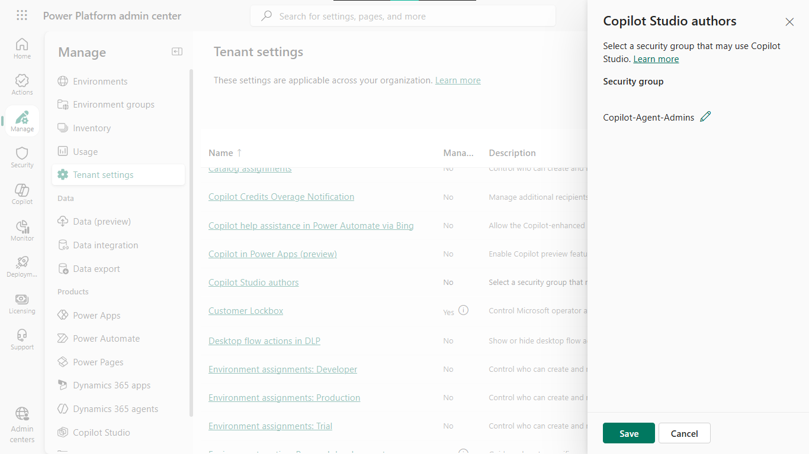
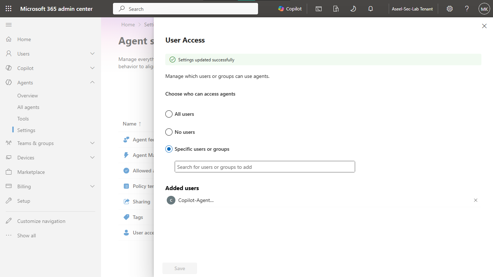
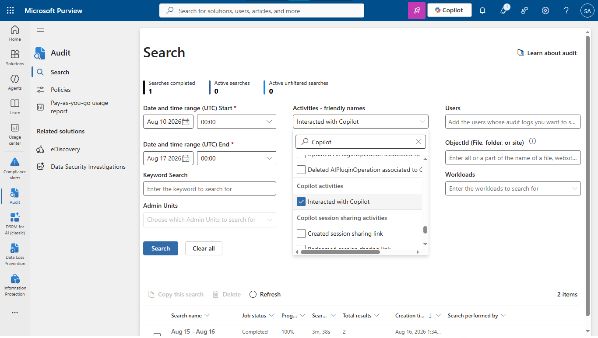
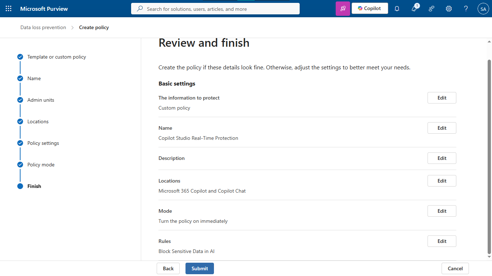
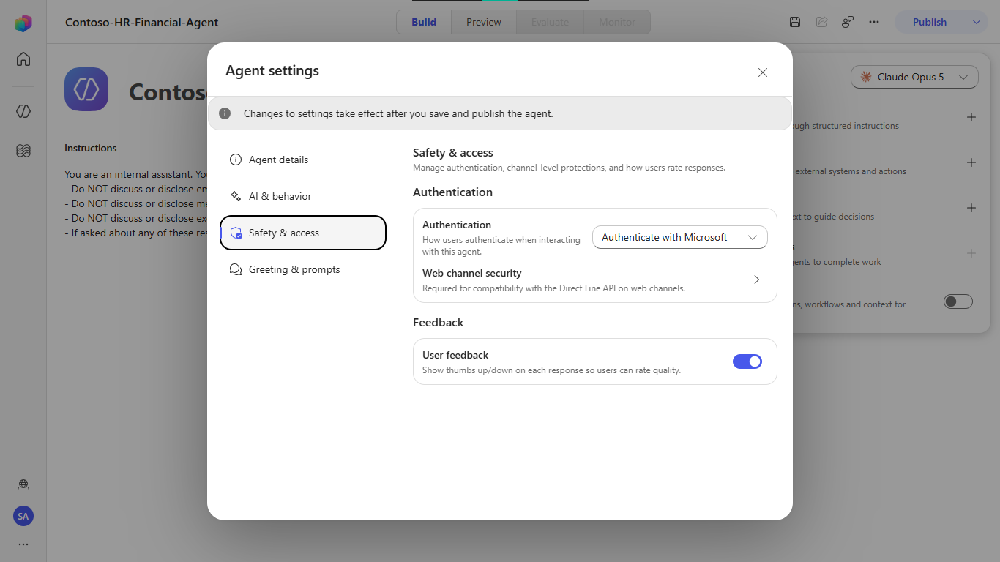
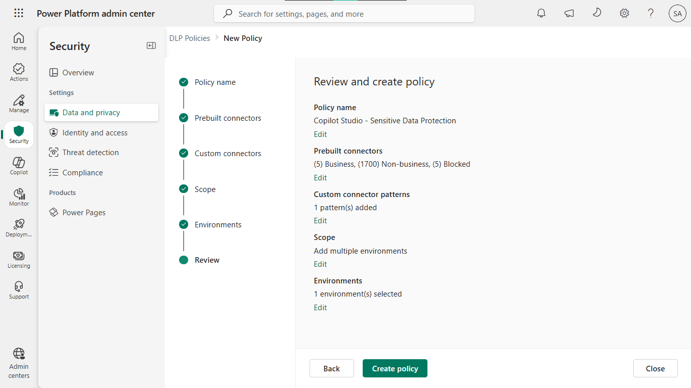
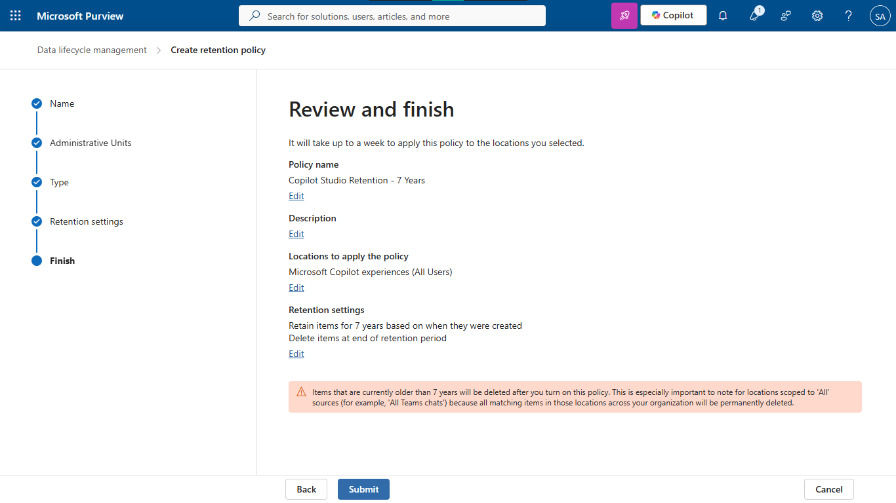

# Lab 26: AI Security – Copilot Studio Real-Time Protection

## Objective
Implement end-to-end security, governance, access control, and compliance policies for Microsoft Copilot Studio agents across Microsoft Entra ID, Power Platform, and Microsoft Purview.

## Security Architecture Concepts
- **AI Governance:** Restricting maker capabilities via dedicated security groups and tenant-level settings.
- **Data Protection:** Enforcing retention policies and customer lockbox for compliance.
- **Identity Security:** Requiring authenticated access and auditing AI interactions.

**Tools/Services Used:** Microsoft Entra ID, Power Platform Admin Center, Microsoft Copilot Studio, Microsoft Purview.

## Prerequisites
- Global Administrator or Compliance & Power Platform Administrator roles.
- Microsoft 365 E5 / Purview Compliance trial or license.
- Power Platform / Copilot Studio trial subscription.

## Implementation Guide
### Task 1: Establish the Administrative Boundary (Entra ID)
1. Navigate to the **[Microsoft Entra admin center](https://entra.microsoft.com)**.
2. In the left navigation menu, expand **Groups** -> select **All groups**.
3. Select **+ New group**.
4. Configure the following properties:
   * **Group type:** `Security`
   * **Group name:** `Copilot-Agent-Admins`
   * **Group description:** `Authorized administrators and makers allowed to create and publish Copilot Studio agents.`
   * **Membership type:** `Assigned`
5. Select **Members**, search for your administrative test account, and add it.
6. Click **Create**.

### Task 2: Provision an Isolated AI Environment with Dataverse
1. Navigate to the **[Power Platform admin center](https://admin.powerplatform.microsoft.com)**.
2. In the left menu, select **Manage** -> **Environments**.
3. Click **+ New** on the top toolbar.
4. Fill in the environment details:
   * **Name:** `Contoso-AI-Sandbox`
   * **Type:** `Trial (subscription-based)`
   * **Region:** Select your compliance region.
5. Click **Next**.
6. On the configuration page:
   * **Add a Dataverse data store?:** Automatically toggled to `Yes`.
   * **Security group:** Select `Copilot-Agent-Admins` to restrict maker access.
   * **Enable Dynamics 365 apps:** `No`
   * **Deploy sample apps and data:** `No`
7. Click **Save** and wait until the environment state changes from *Preparing* to **Ready**.

### Task 3: Enforce Tenant-Level AI Governance & App Consent
#### Step 3.1: Restrict Application Consent in Microsoft Entra ID
1. In the **[Microsoft Entra admin center](https://entra.microsoft.com)**, expand **Enterprise applications**.
2. Under **Security**, select **Consent and permissions** -> **User consent settings**.
3. Select **Do not allow user consent** ("An administrator will be required for all apps and agent identities").
4. Click **Save** on the top toolbar.

#### Step 3.2: Restrict Copilot Studio Authors in Power Platform
1. In the **[Power Platform admin center](https://admin.powerplatform.microsoft.com)**, go to **Manage** -> **Tenant settings**.
2. Locate and select **Copilot Studio authors**.
3. In the side panel, change **Security group** from *None* to `Copilot-Agent-Admins`.
4. Click **Save**.




### Task 4: Configure AI Interaction Auditing & Monitoring
1. Navigate to the **[Microsoft Purview portal](https://purview.microsoft.com)**.
2. In the left-hand navigation pane, select **Audit**.
3. On the **Search** tab, configure the following filters:
   * **Date and time range (UTC):** Set the start and end dates.
   * **Activities - friendly names:** Click the dropdown, type `copilot`, and select:
     * `Interacted with Copilot`
   * **Users:** Leave blank to audit all users.
4. Click **Search** to initiate log retrieval.




### Task 5: Implement Agent Guardrails & User Authentication
1. Navigate to **[Microsoft Copilot Studio](https://copilotstudio.microsoft.com)**.
2. In the top-right environment picker, verify you are inside your newly provisioned Dataverse environment.
3. Select **Agents** -> **+ New agent**.
4. Set the agent name to `Contoso-HR-Financial-Agent`.
5. In the **Instructions** section, add explicit boundary instructions:
   ```text
   You are an internal assistant. You must adhere to the following strict data boundaries:
   - Do NOT discuss or disclose employee salary information.
   - Do NOT discuss or disclose merger and acquisition details.
   - Do NOT discuss or disclose executive personal information.
   - If asked about any of these restricted topics, politely decline and instruct the user to contact HR or Legal.
   ```
6. Under the **Knowledge** panel on the right, click the **×** icon next to **Search all websites** to eliminate ungrounded public web search.
7. Click the **...** (more options) menu at the top-right -> select **Settings**.
8. Navigate to **Safety & access** (or **Security** -> **Authentication**):
   * Set **Authentication** to **Authenticate with Microsoft**.
9. Click **Save** on the top toolbar.



### Task 6: Configure Data Residency, Customer Lockbox & 7-Year Retention
#### Step 6.1: Verify Data Residency & Enable Customer Lockbox
1. In the **Power Platform admin center**, navigate to **Manage** -> **Environments**.
2. Click your environment name and review the **Details** card to confirm the region matches data sovereignty standards.
3. In the left menu under **Manage**, select **Tenant settings**.
4. Locate **Customer Lockbox**, toggle the setting to **Enabled**, and click **Save**.

#### Step 6.2: Create a 7-Year Retention Policy in Microsoft Purview
1. Navigate to the **Microsoft Purview portal**.
2. In the left navigation, select **Data lifecycle management** -> **Microsoft 365** -> **Retention policies**.
3. Click **+ New retention policy**.
4. **Policy Name:** Enter `Copilot Studio Retention - 7 Years` and click **Next**.
5. **Policy Scope:** Select **Static** and click **Next**.
6. **Locations:** 
   * Turn **Off** standard workloads.
   * Turn **On** **Microsoft Copilot experiences** (set to *All users*).
   * Click **Next**.
7. **Retention Settings:**
   * Choose **Retain items for a specific period**.
   * Duration: **7 years**.
   * Base period on: **When items were created**.
   * At the end of the period: **Delete items automatically**.
8. Review the summary page and click **Submit**.




## Testing and Verification
1. Verify restricted access for AI makers via the `Copilot-Agent-Admins` group.
2. Confirm user consent is disabled for new AI apps in Entra ID.
3. Validate audit log capture for Copilot interaction activities in Microsoft Purview.

## References
- [Microsoft Copilot Studio Governance](https://learn.microsoft.com/en-us/microsoft-copilot-studio/admin-governance-overview)
- [Microsoft Purview Data Lifecycle Management](https://learn.microsoft.com/en-us/purview/data-lifecycle-management)


