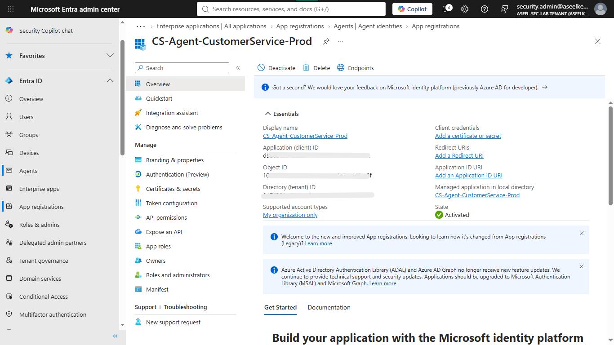
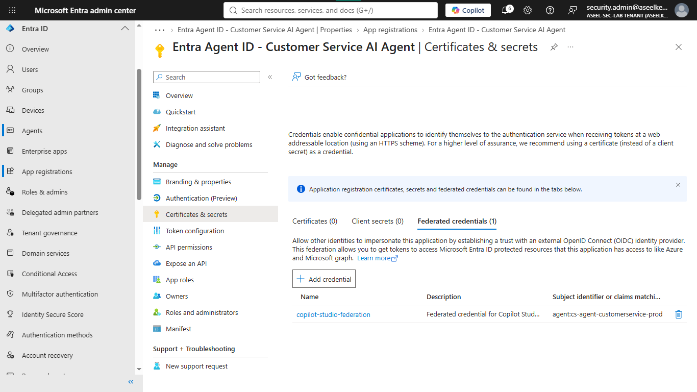
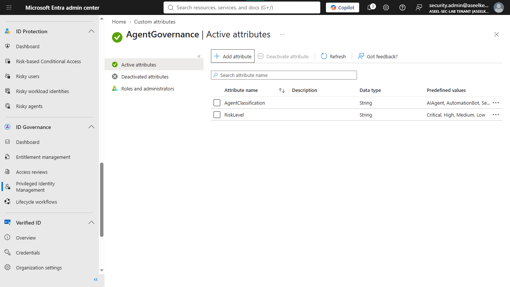
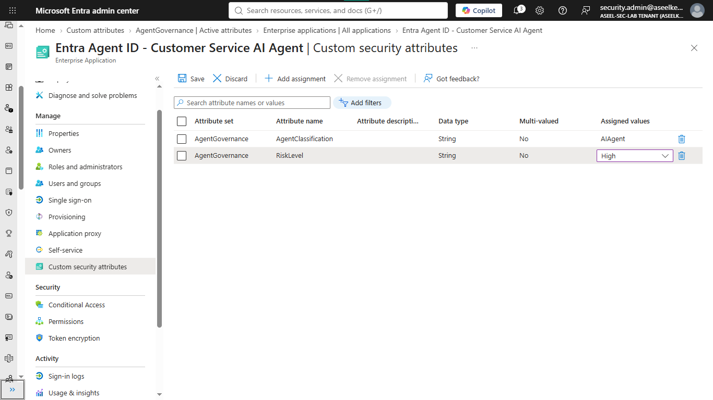
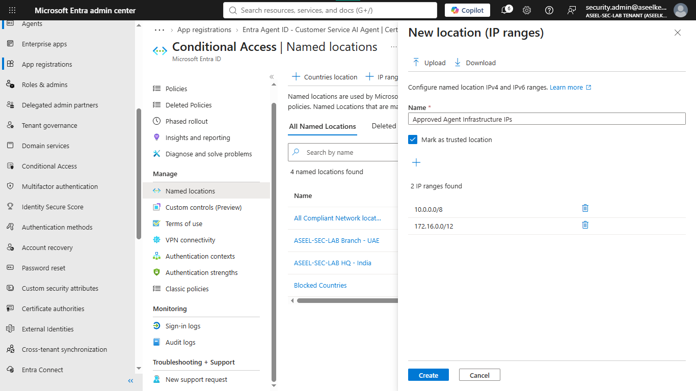
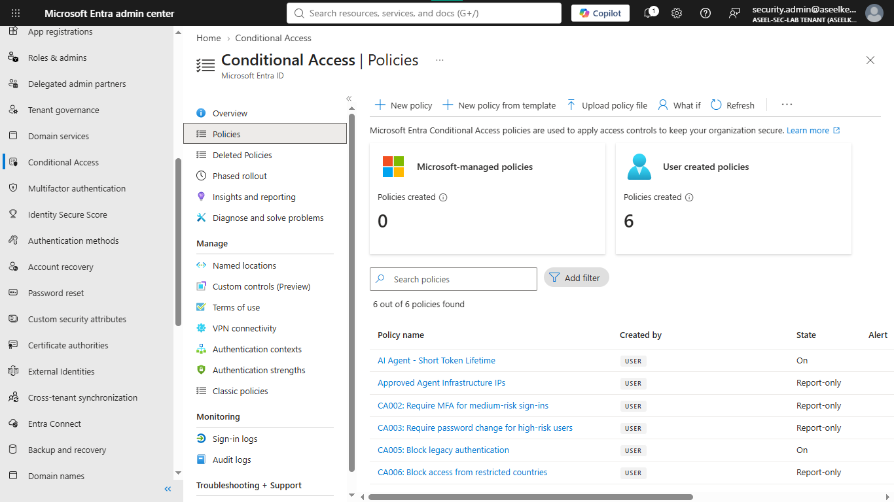
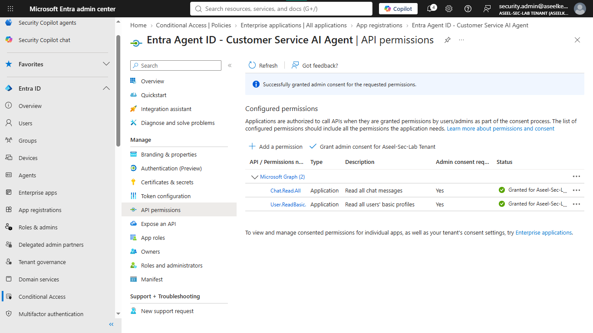
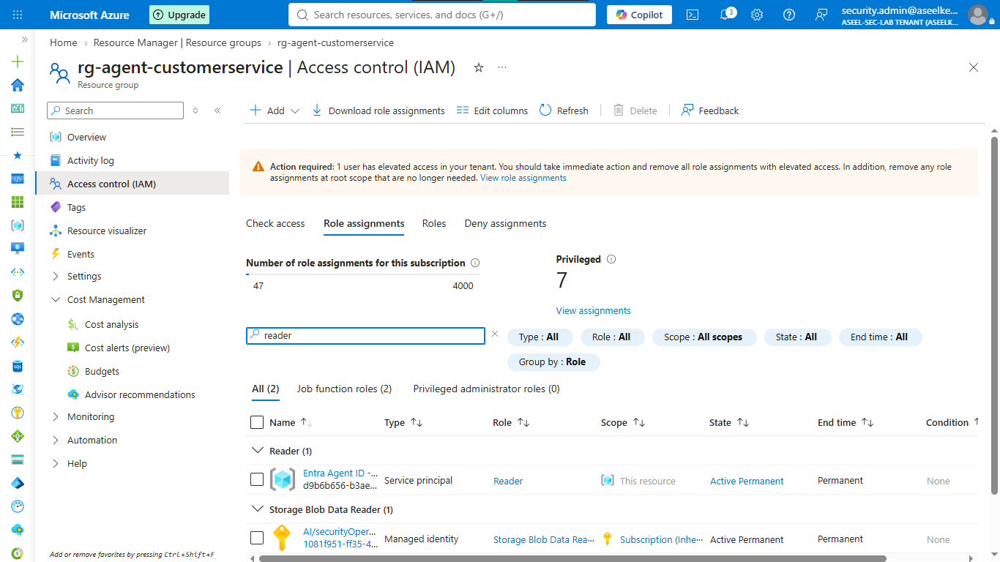
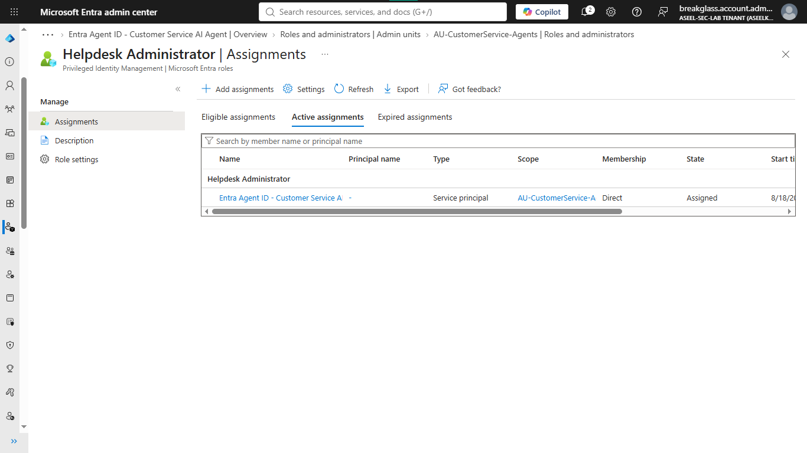

# Lab 27: AI Security – Entra Agent ID Governance

## Objective
Implement a secure, secretless, and sandboxed identity for an AI agent using Entra Workload ID, custom security attributes, and granular administrative scoping.

## Security Architecture Concepts
- **Secretless Workload Identity:** Utilizing OpenID Connect (OIDC) federated credentials for dynamic token issuance.
- **Attribute-Based Access Control (ABAC):** Using custom security attributes for dynamic governance.
- **Blast Radius Containment:** Scoping identity permissions to dedicated Administrative Units and Resource Groups.

**Tools/Services Used:** Microsoft Entra ID (Workload Identities, Conditional Access, Administrative Units), Azure RBAC, Azure Resource Groups.

## Prerequisites
- Microsoft Entra ID tenant with administrative access.
- Azure subscription for resource isolation.
- Microsoft Entra Workload ID Premium license.

## Implementation Guide
### Task 1: Workload Identity Registration & OIDC Federation
1. Navigate to **Microsoft Entra admin center** -> **App registrations** -> **+ New registration**.
2. Register `CS-Agent-CustomerService-Prod` for single-tenant access.
3. Under **Certificates & secrets** -> **Federated credentials**, add a credential:
   * **Issuer:** `https://login.microsoftonline.com/<Tenant-ID>/v2.0`
   * **Subject Identifier:** `agent:cs-agent-customerservice-prod`
   * **Audience:** `api://AzureADTokenExchange`

### Task 2: Attribute-Based Access Governance
1. Create attribute set `AgentGovernance` via **Custom security attributes**.
2. Define attributes: `AgentClassification` (`AIAgent`) and `RiskLevel` (`High`).
3. Assign attributes to the `CS-Agent-CustomerService-Prod` application identity.

### Task 3: Zero-Trust Conditional Access Enforcement
1. Define **Named locations** for trusted infrastructure IPs.
2. Create **Conditional Access Policy** for location and risk restriction:
   * Target workload identities based on custom attribute `AgentClassification` equals `AIAgent`.
   * Apply access controls, including block conditions based on location and risk state.
3. Configure **Continuous Access Evaluation** for real-time revocation enforcement.

### Task 4: Scoped API Permissions & Consent
1. Assign minimal required Microsoft Graph Application permissions: `User.ReadBasic.All` and `Chat.Read`.
2. Perform **Grant admin consent** for the application identity.

### Task 5: Blast Radius Containment
1. **Azure Isolation:** Provision dedicated resource group `rg-agent-customerservice` and assign the agent the **Reader** role via IAM.
2. **Directory Isolation:** Create Administrative Unit `AU-CustomerService-Agents` and assign the agent the **Helpdesk Administrator** role scoped only to users within that unit.

### Task 6: Identity Monitoring & Auditing
1. Track token issuance and source IPs via **Entra ID Sign-in logs**.
2. Monitor anomalous identity behavior via **Identity Protection** (Risky workload identities).

## Testing and Verification
1. Verify the OIDC federated credential successfully authenticates the agent.
2. Confirm Conditional Access policies block unauthorized location-based access.
3. Validate that Administrative Unit scoping correctly limits the agent's directory management capabilities.

## References
- [Microsoft Entra Workload ID](https://learn.microsoft.com/en-us/entra/workload-id/workload-identities-overview)
- [Conditional Access for workload identities](https://learn.microsoft.com/en-us/entra/identity/conditional-access/workload-identity)

