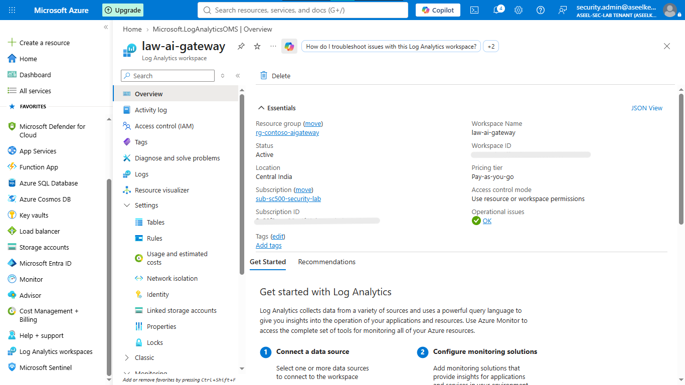
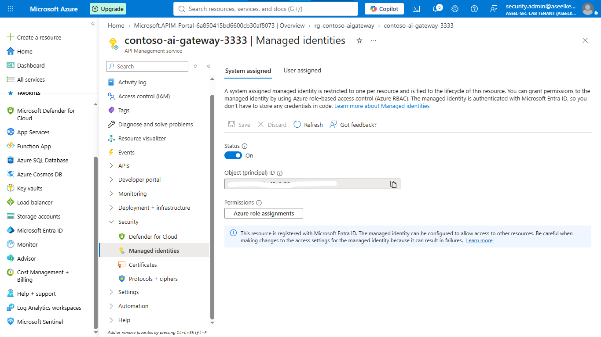
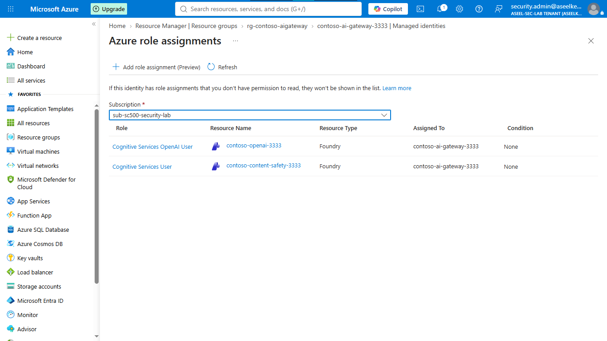
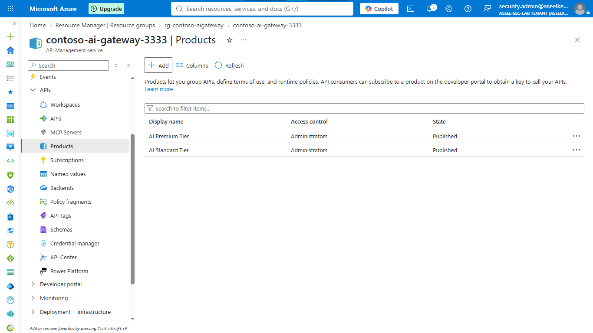
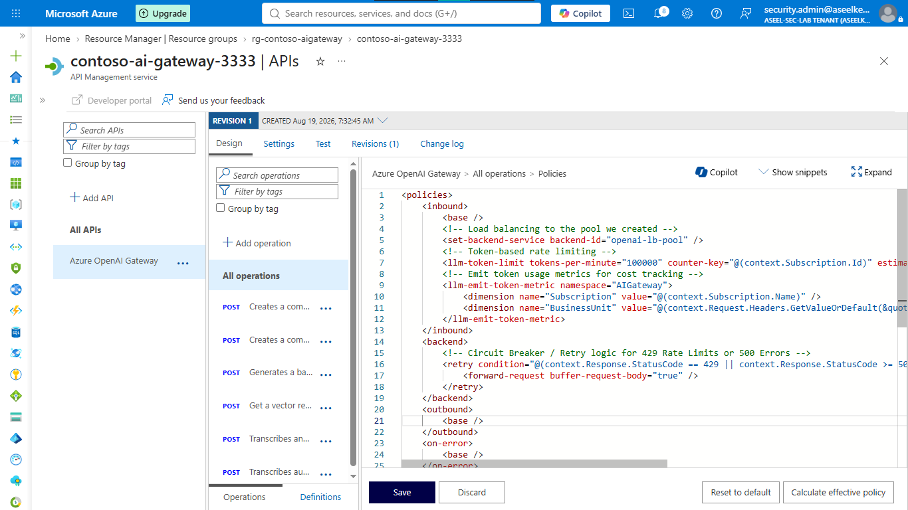
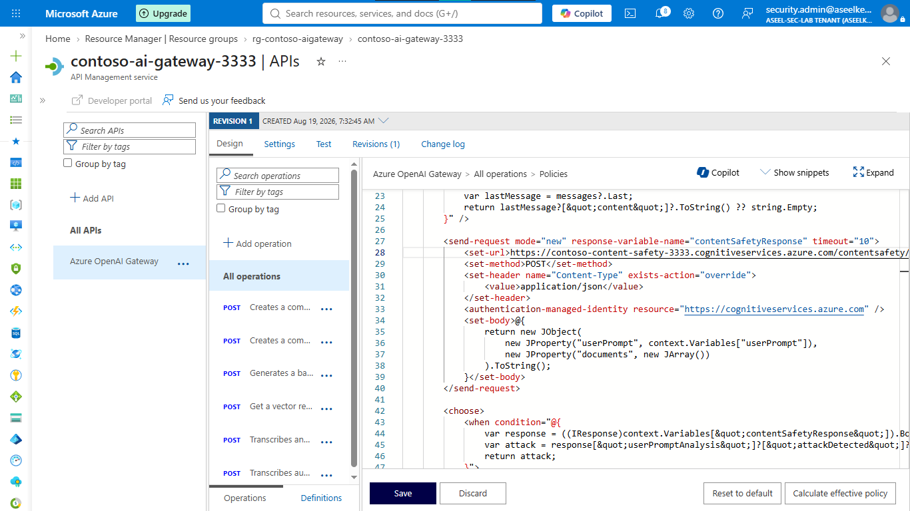
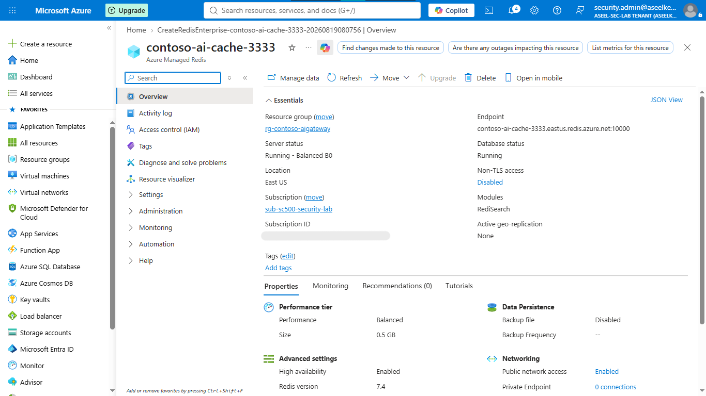

# Lab 28: AI Security – AI Gateway in Azure API Management

## Objective
Implement a centralized AI Gateway using Azure API Management (APIM) Standard v2 to front-end Large Language Model (LLM) endpoints, enforcing Zero-Trust identity, token-based rate limiting, inline threat analysis, and cost optimization.

## Security Architecture Concepts
- **AI Gateway Pattern:** Centralized traffic inspection, routing, and policy enforcement for AI workloads.
- **Zero-Trust Identity:** Secretless authentication using Managed Identities and Azure RBAC.
- **Threat Mitigation:** Inline prompt analysis for jailbreak detection via Azure AI Content Safety.
- **FinOps Governance:** Token consumption monitoring and rate limiting per business unit.
- **Operational Resilience:** Load balancing across multi-region backends with circuit breaker failovers.

**Tools/Services Used:** Azure API Management (Standard v2), Azure OpenAI, Azure AI Content Safety, Azure Cache for Redis (Enterprise), Azure Monitor/Log Analytics.

## Prerequisites
- Azure subscription with administrative access.
- Azure OpenAI resource.

## Implementation Guide
### Task 1: Scaffolding, APIM AI Gateway Deployment & Identity Governance
1. Create resource group `rg-contoso-aigateway`.
2. Provision a centralized **Log Analytics Workspace** (`law-ai-gateway`) for telemetry.
3. Deploy Azure API Management (`contoso-ai-gateway`) using **Standard v2** SKU.
4. Activate **System-assigned Managed Identity** on the APIM resource.
5. Grant the APIM identity `Cognitive Services OpenAI User` and `Cognitive Services User` roles on backend cognitive services.

### Task 2: API Ingestion & Backend Load Balancing
1. Import Azure OpenAI OpenAPI specification (`2024-06-01`).
2. Create **Backends** for `openai-primary` and `openai-secondary` endpoints.
3. Configure a **Load balanced pool** (`openai-lb-pool`) distributing requests across backends with failover.

### Task 3: Token Rate Limiting & Product Packaging
1. Define **Products** (`AI Standard Tier`, `AI Premium Tier`) with subscription/approval requirements.
2. Inject `<llm-token-limit>` policy to calculate token consumption dynamically.
3. Configure `<llm-emit-token-metric>` for token attribution tracking.

### Task 4: Content Safety & Jailbreak Mitigation
1. Provision **Azure AI Content Safety** resource (`contoso-content-safety`).
2. Implement APIM inbound policy using `<send-request>` to submit prompts to `shieldPrompt` API.
3. Terminate requests (`HTTP 400`) if `attackDetected` returns `true`.

### Task 5: Semantic Caching via Redis Enterprise
1. Deploy **Azure Cache for Redis** (Enterprise/Balanced SKU) with `RediSearch` enabled.
2. Integrate `<llm-semantic-cache-lookup>` and `<llm-semantic-cache-store>` policies to reduce latency and redundant token costs.

### Task 6: SOC Monitoring, Telemetry & Threat Alerting
1. Configure APIM Diagnostic Settings streaming logs/metrics to `law-ai-gateway`.
2. Implement **Denial-of-Wallet Detection** alert for anomalous token consumption.
3. Deploy **Jailbreak Detection Rule** (Scheduled Query Alert) in Sentinel for prompt injection attempts.

## Testing and Verification
1. Validate APIM backend failover by simulating a backend service outage.
2. Test jailbreak mitigation by submitting adversarial prompts against the gateway.
3. Verify successful token metric emission and cached response retrieval in Redis.

## References
- [Azure API Management GenAI Gateway](https://learn.microsoft.com/en-us/azure/api-management/genai-gateway)
- [Azure AI Content Safety](https://learn.microsoft.com/en-us/azure/ai-services/content-safety/overview)

