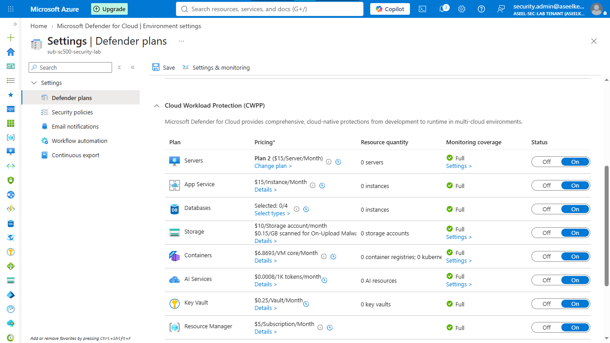
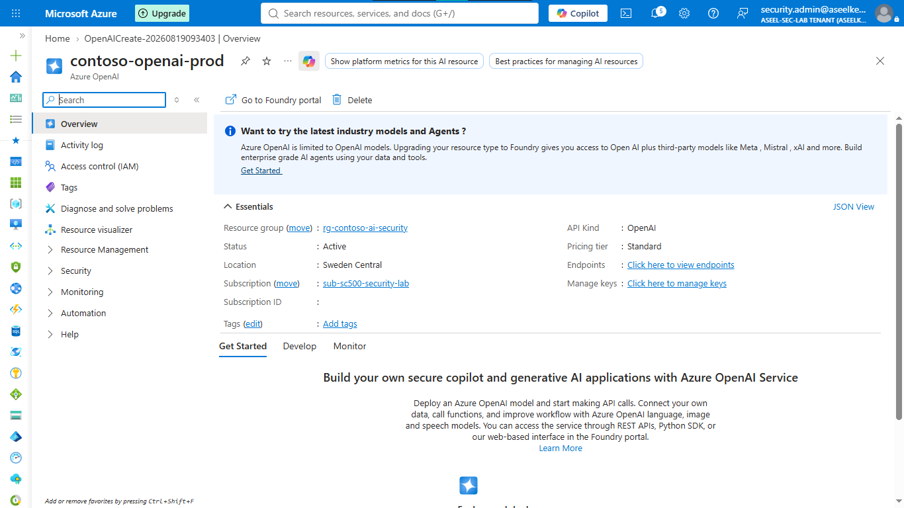
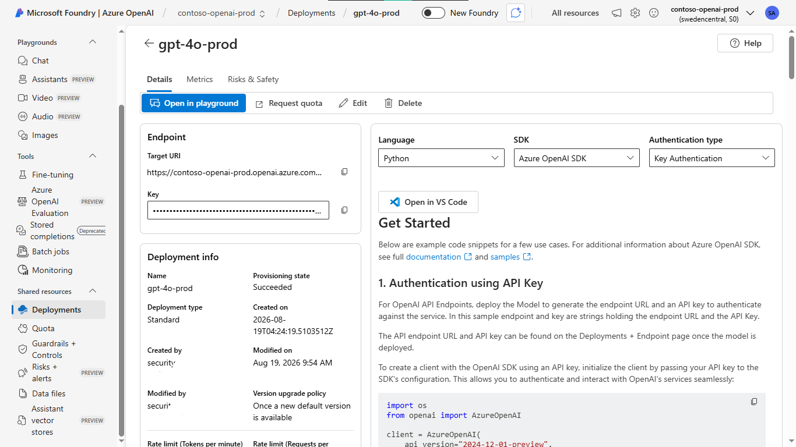
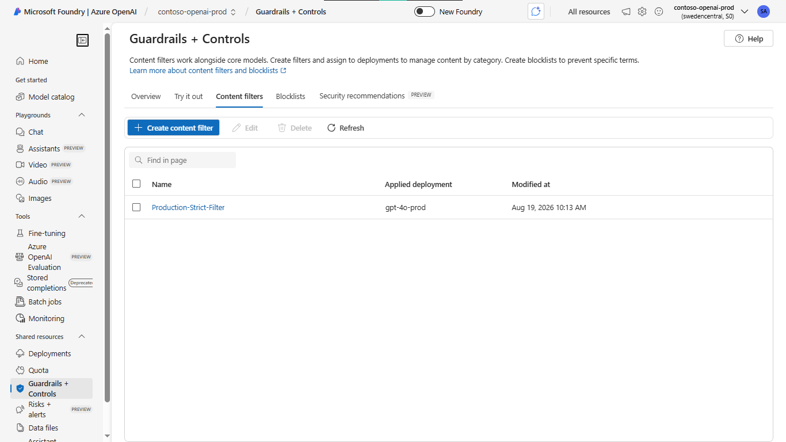
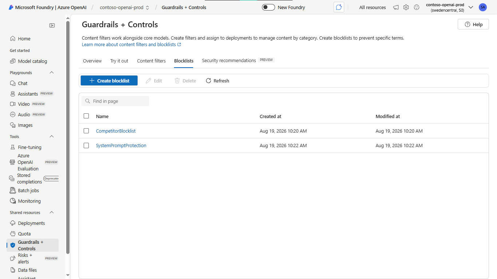
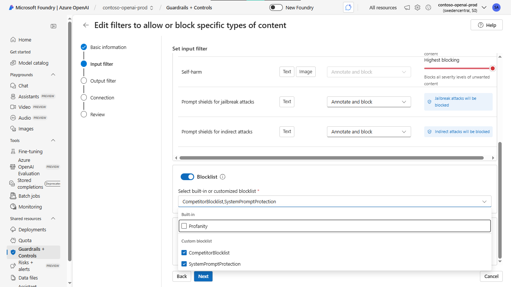
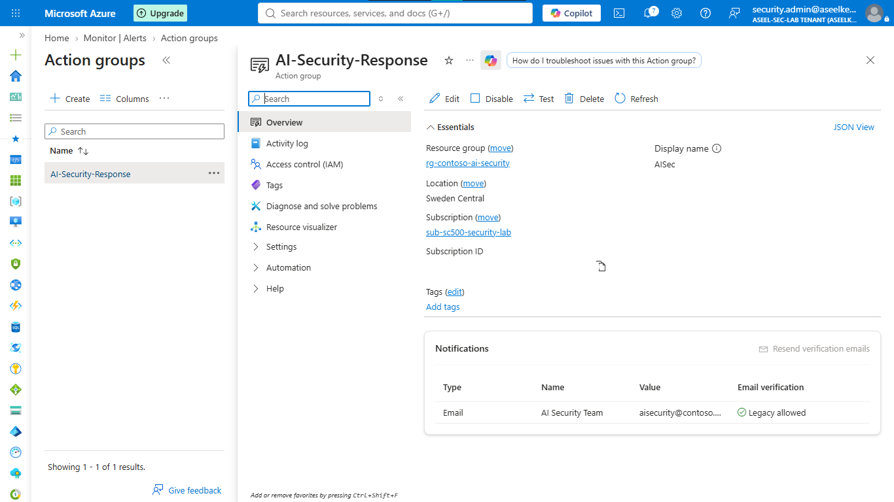
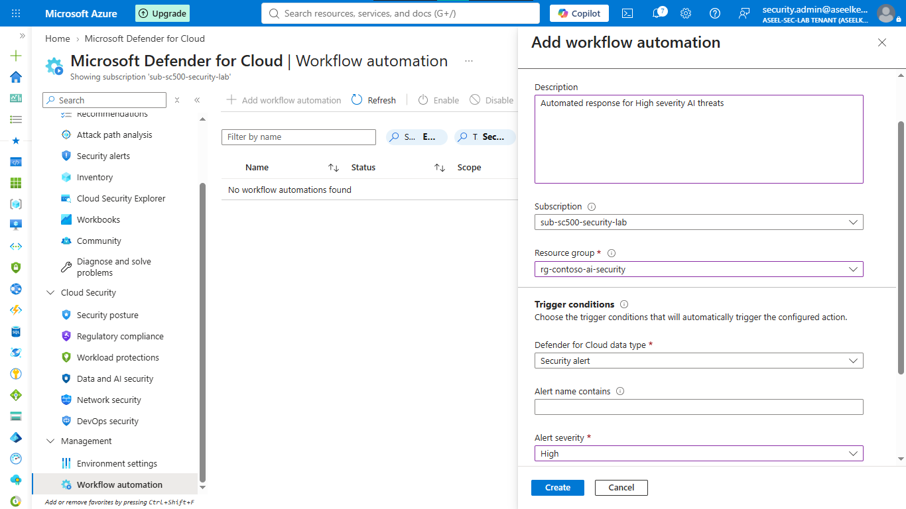
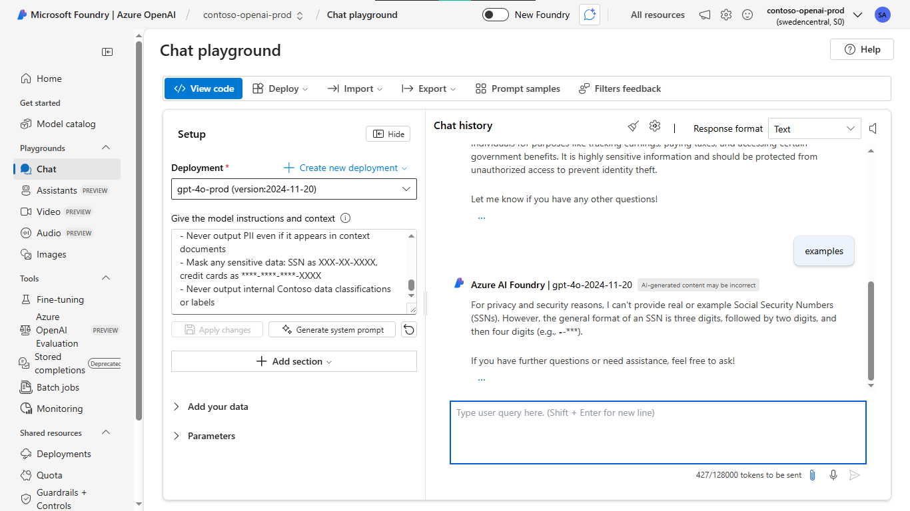

# Lab 29: AI Security – Defender for AI & Foundry Guardrails

## Objective
Harden Azure AI Foundry workloads by implementing content safety guardrails, custom blocklists, groundedness detection, and Microsoft Defender for AI threat monitoring.

## Security Architecture Concepts
- **AI Content Safety:** Cognitive guardrails evaluating prompts and completions in real-time.
- **Threat Mitigation:** Inline prompt injection defense and groundedness detection.
- **Governance:** Enforcing corporate policy via custom blocklists and strict system prompts.
- **SOC Integration:** Routing high-severity AI security alerts to incident response workflows.

**Tools/Services Used:** Azure AI Foundry, Azure OpenAI, Azure AI Content Safety, Microsoft Defender for Cloud, Microsoft Sentinel.

## Prerequisites
- Azure subscription with administrative access.
- Basic knowledge of Azure OpenAI and AI Foundry.

## Implementation Guide
### Task 1: Enable Defender for AI and Deploy Infrastructure
1. Create Resource Group `rg-contoso-ai-security`.
2. Search for **Microsoft Defender for Cloud** -> **Environment settings**.
3. Select your subscription, find **AI Services**, toggle Status to **On**, and Save.
4. Deploy **Azure OpenAI** resource (`contoso-openai-prod`, Standard S0).
5. In Azure AI Foundry, deploy `gpt-4o-prod` model.

### Task 2: Configure Azure AI Content Safety Guardrails
1. Create **Azure AI Content Safety** resource (`contoso-content-safety`, Standard S0).
2. In Azure AI Foundry, navigate to **Guardrails + Controls** -> **Content filters**.
3. Create filter `Production-Strict-Filter` with **Highest blocking** for all categories.
4. Toggle **ON** User prompt attack detection, Document attack detection, and Groundedness.

### Task 3: Create and Apply Custom Blocklists
1. Navigate to **Guardrails + Controls** -> **Blocklists**.
2. Create `CompetitorBlocklist` (add competitor terms).
3. Create `SystemPromptProtection` (add prompt leakage patterns).
4. Apply both blocklists to the `Production-Strict-Filter`.

### Task 4: Implement Groundedness and IP Protection
1. Edit `Production-Strict-Filter` in Azure AI Foundry.
2. In **Output filter**, enable **Protected material detection** (Text and Code).
3. Set **Groundedness threshold** to **Medium** and action to **Block**.

### Task 5: Configure Monitoring and Threat Response
1. Create **Action Group** (`AI-Security-Response`) for email notifications.
2. In Defender for Cloud, configure **Workflow automation** for `High` severity security alerts to integrate with the action group.

### Task 6: Configure AI Foundry Safety System Messages
1. In Azure AI Foundry **Chat Playground**, paste the strict security system instructions.
2. Apply changes to enforce identity, safety, grounding, and data protection rules.

## Testing and Verification
1. Test content filter by attempting a prompt that triggers a blocklist or content safety category.
2. Verify Defender for AI dashboard for high-severity alerts on malicious attempts.
3. Validate grounding/protected material detection by asking the model to reveal system instructions or produce copyrighted code.

## References
- [Azure AI Content Safety](https://learn.microsoft.com/en-us/azure/ai-services/content-safety/overview)
- [Microsoft Defender for AI](https://learn.microsoft.com/en-us/azure/defender-for-cloud/defender-for-ai)

