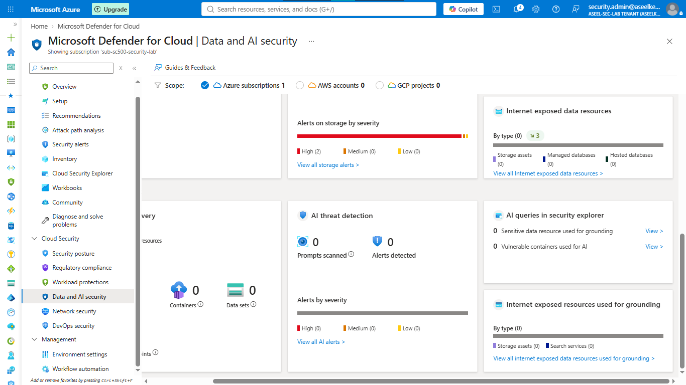
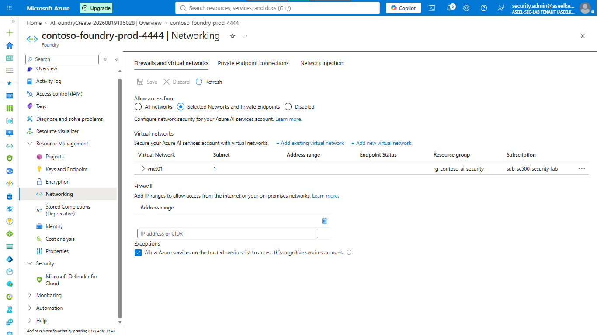
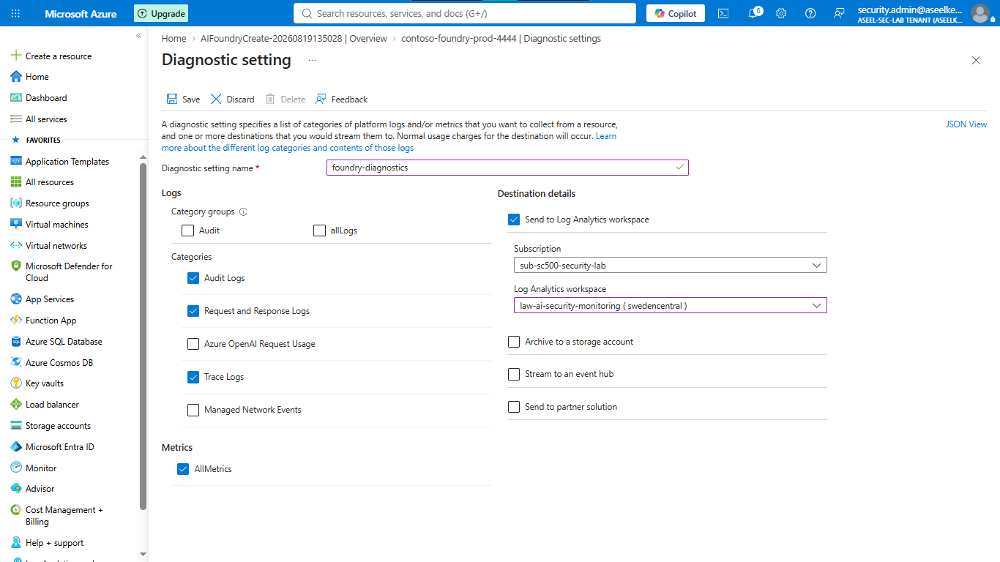
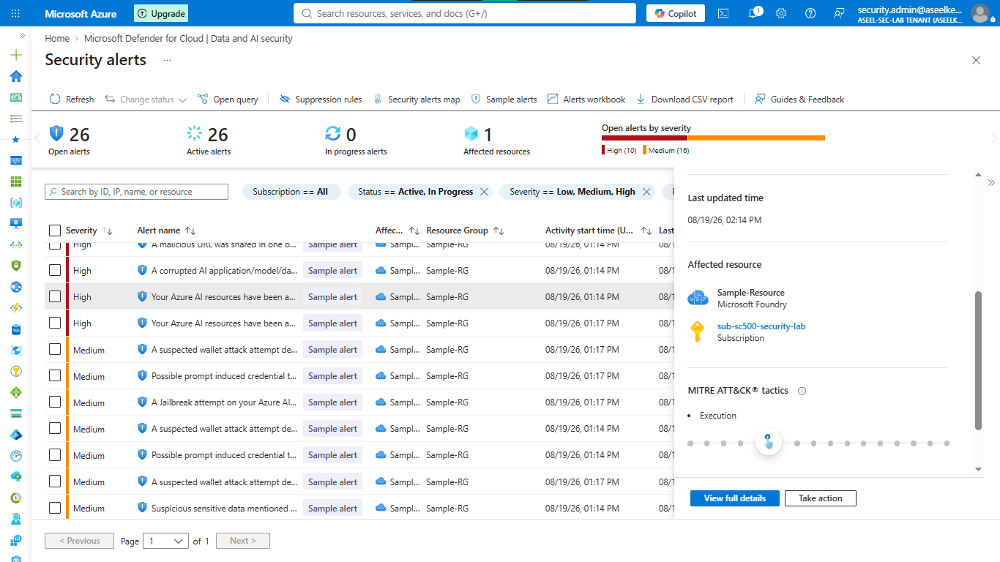
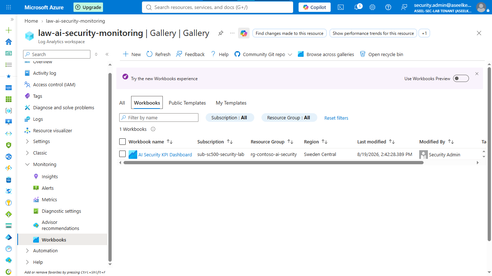
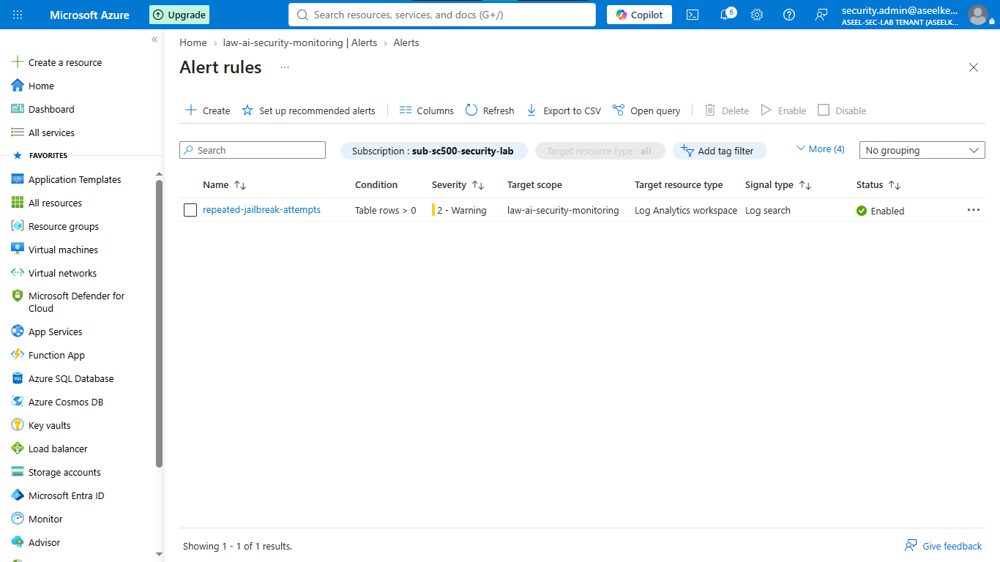
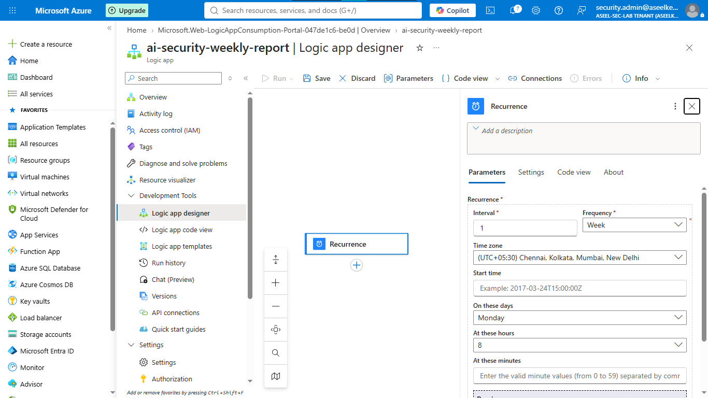

# Lab 30: AI Security – Data and AI Security Monitoring

## Objective
Establish a unified security monitoring capability for AI workloads (Copilot, Azure AI Foundry) to provide visibility into data exposure risks, agent authentication anomalies, and prompt injection threats.

## Security Architecture Concepts
- **Posture Management (CSPM):** Validating and enforcing security configurations across cloud-based AI resources.
- **Secure by Design:** Provisioning AI workloads with restricted network access and Enforced Microsoft Entra ID authentication.
- **Telemetry & Threat Hunting:** Centralizing diagnostic logs into Log Analytics for proactive threat hunting using KQL.
- **Cross-Signal Correlation:** Custom alert rules to detect multi-stage AI attacks.

**Tools/Services Used:** Microsoft Defender for Cloud, Azure AI Foundry, Azure OpenAI, Azure Monitor, Log Analytics, Azure Logic Apps.

## Prerequisites
- Azure subscription with administrative access.
- Microsoft Defender for Cloud (Defender CSPM plan enabled).
- Log Analytics Workspace (`law-ai-security-monitoring`).

## Implementation Guide
### Task 1: Access the Data and AI Security Dashboard
1. Navigate to **Microsoft Defender for Cloud** -> **Environment settings**.
2. Select your subscription and ensure **Defender CSPM** plan is **On**.
3. In the Defender main menu, navigate to **Data and AI Security**.
4. Review the AI Security Posture, Active Threats, Data Exposure Risks, and Agent Activity panels.

### Task 2: Configure AI Security Posture Assessments
1. Search for **Azure AI Foundry** (or Azure OpenAI) and deploy a new resource.
2. On the **Inbound Networking** tab, select **Disable public network access**.
3. On the **Identity** tab, set **Local authentication** to **Disabled**.
4. Enable **Diagnostic settings** streaming **Audit**, **RequestResponse**, **Trace** logs, and **AllMetrics** to the security Log Analytics workspace.

### Task 3: Monitor AI Threat Detections
1. In Defender for Cloud, navigate to **Security alerts**.
2. Generate sample alerts to populate the dashboard.
3. Review active threats in the **Data and AI Security** dashboard and investigate high-severity alerts.

### Task 4: Create Custom Monitoring Workbooks
1. Navigate to Log Analytics Workspace -> **Workbooks** -> **+ New**.
2. Add a query block to track AI model usage (requests, token consumption).
3. Add a second query block to track prompt injection/jailbreak attempts.
4. Save the workbook as `AI Security KPI Dashboard`.

### Task 5: Configure Cross-Signal Correlation Alerts
1. Create a **Custom log search** alert rule in Log Analytics.
2. Use KQL to detect multi-stage jailbreak attempts (e.g., >20 blocked requests from a single IP within 10 minutes).
3. Configure the alert logic, set severity to `Warning`, and name it `repeated-jailbreak-attempts`.

### Task 6: Automate AI Security Posture Reporting
1. Deploy a **Logic App** (Consumption plan).
2. Configure **Schedule - Recurrence** trigger (e.g., run every Monday at 8:00 AM).
3. Save the workflow to automate the weekly delivery of the security posture report.

## Testing and Verification
1. Verify AI security dashboard populates with posture data after resource deployment.
2. Test alert rule functionality by simulating threat conditions.
3. Ensure the weekly reporting Logic App is scheduled correctly.

## References
- [Microsoft Defender for AI](https://learn.microsoft.com/en-us/azure/defender-for-cloud/defender-for-ai)
- [Azure Monitor Workbooks](https://learn.microsoft.com/en-us/azure/azure-monitor/visualize/workbooks-overview)

