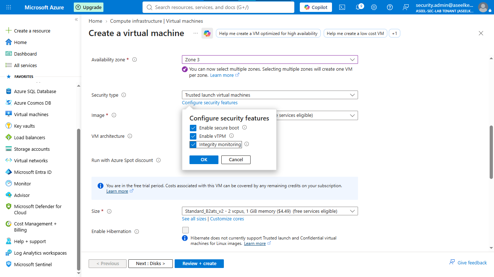
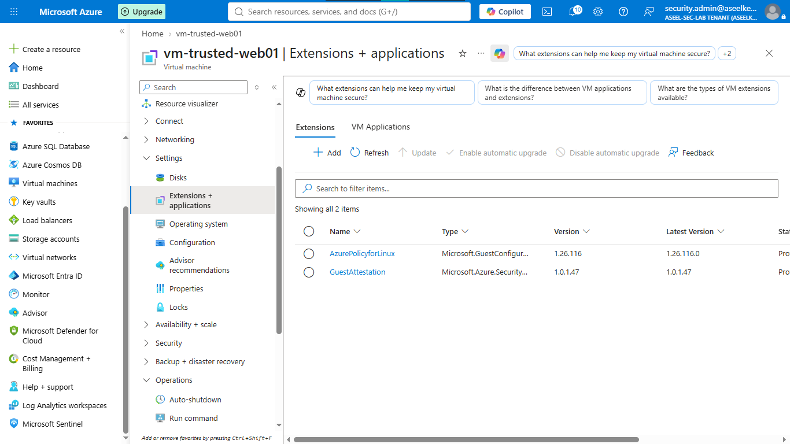
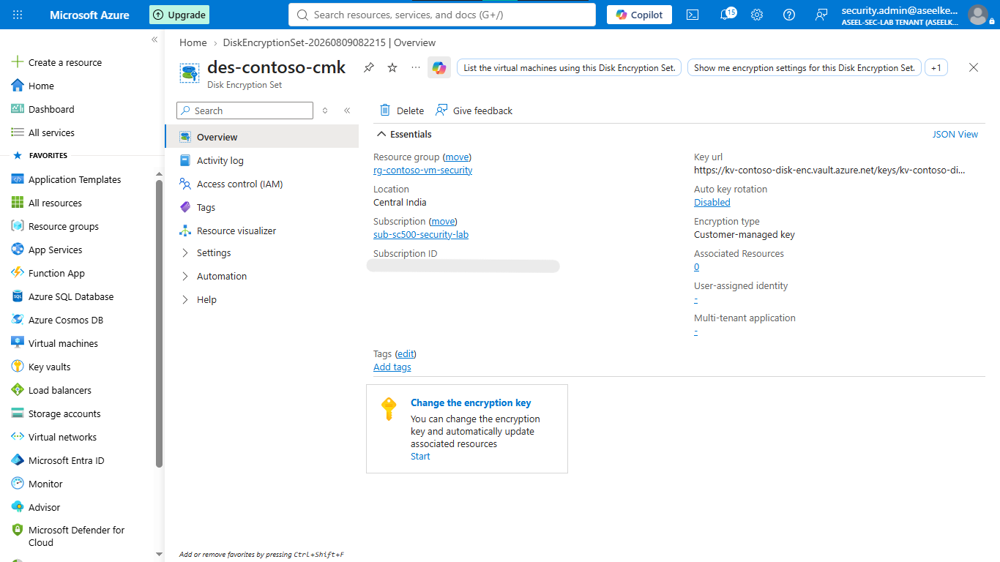
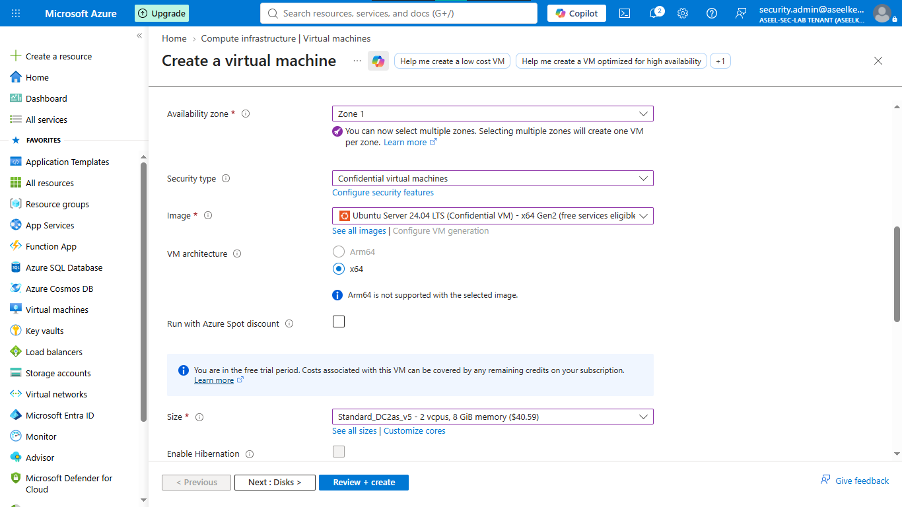
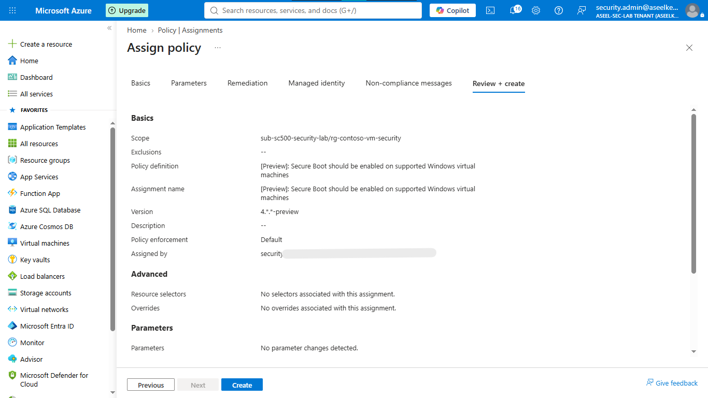

# Lab 31: VM Security – Disk Encryption & Secure Boot

## Objective
Implement defense-in-depth compute security by transitioning from platform-managed keys to customer-controlled encryption, and enforcing attestation via Secure Boot and vTPM.

## Security Architecture Concepts
- **Trusted Launch:** Enforcing Secure Boot and vTPM for OS integrity.
- **Customer-Managed Keys (CMK):** Using Azure Key Vault and Disk Encryption Sets (DES) for data-at-rest protection.
- **Confidential Computing:** Utilizing hardware-based memory encryption for sensitive workloads.
- **Continuous Compliance:** Enforcing security baselines through Azure Policy.

**Tools/Services Used:** Azure Virtual Machines (Trusted Launch/Confidential), Azure Key Vault, Disk Encryption Sets, Microsoft Defender for Cloud, Azure Policy.

## Prerequisites
- Azure subscription with administrative access.
- Basic understanding of Virtual Machine security.

## Implementation Guide
### Task 1: Provision Trusted Launch VM with Integrity Monitoring
1. Create resource group `rg-contoso-vm-security`.
2. Provision a new Virtual Machine (`vm-trusted-web01`, Ubuntu Server Gen2).
3. Select **Trusted launch virtual machines** security type.
4. Enable **Secure boot**, **vTPM**, and **Integrity monitoring**.
5. Validate **Boot integrity monitoring** in Defender for Cloud.

### Task 2: Configure Customer-Managed Keys (CMK)
1. Deploy **Azure Key Vault** (`kv-contoso-disk-enc`, Premium tier).
2. Generate RSA 4096-bit key `disk-encryption-key`.
3. Create **Disk Encryption Set** (`des-contoso-cmk`) linked to the key vault and generated key.
4. Grant the DES managed identity access to the Key Vault.

### Task 3: Apply Disk Encryption & Confidential VMs
1. Provision a new VM (`vm-cmk-db01`) with OS disk encryption managed by `des-contoso-cmk`.
2. Provision a **Confidential VM** (`vm-confidential-hr01`, Ubuntu Confidential) using DC-series size for hardware memory encryption.

### Task 4: Monitor Compliance with Azure Policy
1. Search for **Policy** -> **Assignments** -> **Assign policy**.
2. Assign `[Preview]: Secure Boot should be enabled on supported virtual machines` to `rg-contoso-vm-security`.

## Testing and Verification
1. Verify the integrity monitoring extension is successfully provisioning and reporting metrics.
2. Confirm the Confidential VM utilizes hardware-based memory encryption.
3. Check the Azure Policy compliance dashboard for enforced boot security baselines.

## References
- [Azure Trusted Launch](https://learn.microsoft.com/en-us/azure/virtual-machines/trusted-launch)
- [Azure Disk Encryption for VMs](https://learn.microsoft.com/en-us/azure/virtual-machines/disk-encryption-overview)
- [Azure Confidential Computing](https://learn.microsoft.com/en-us/azure/confidential-computing/overview)

