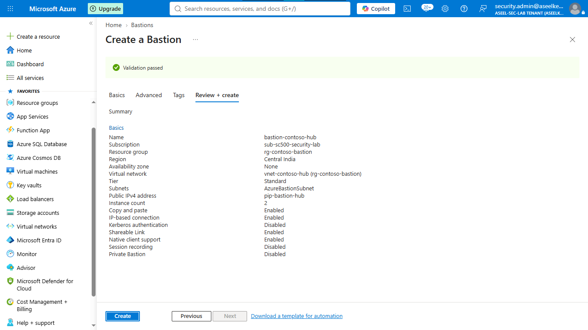
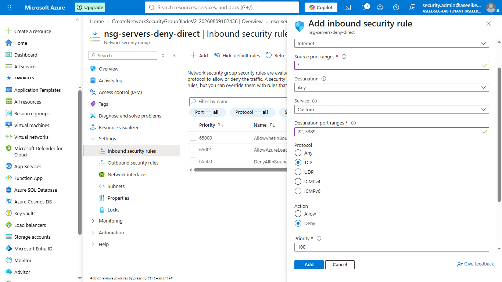
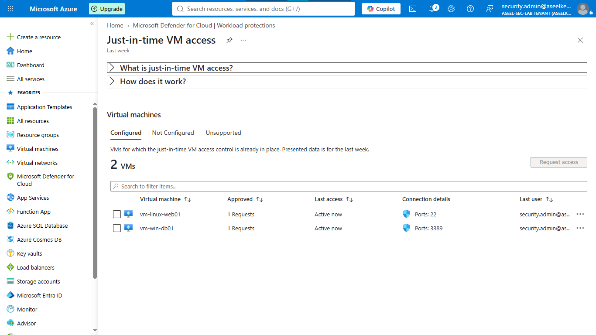
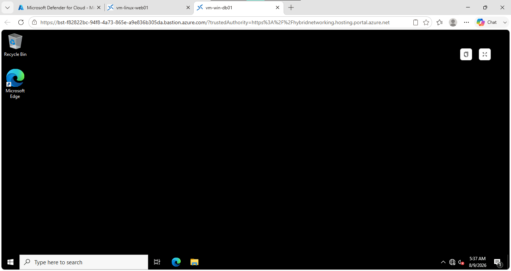
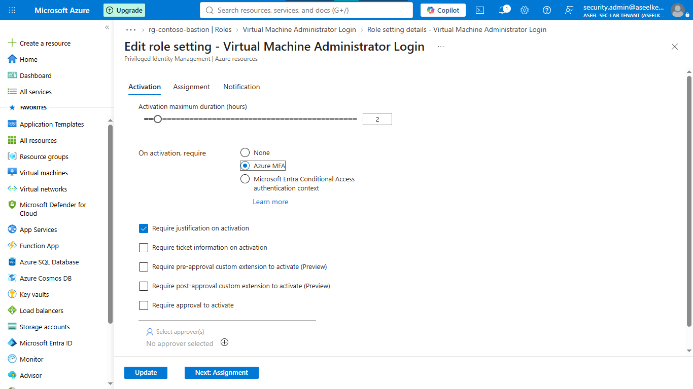
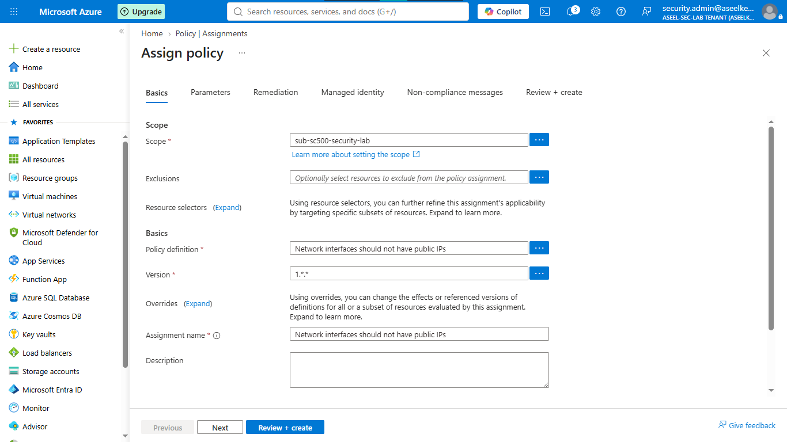

# Lab 32: Azure Bastion and JIT VM Access

## Objective
Remediate direct internet exposure of virtual machine management ports (SSH/RDP) by implementing a Zero-Trust management plane using Azure Bastion, Just-In-Time (JIT) access, and Privileged Identity Management (PIM).

## Security Architecture Concepts
- **ZTNA (Zero-Trust Network Access):** Eliminating public IPs and enforcing secure traversal.
- **JIT Access:** Dynamically opening management ports only when explicitly requested and approved.
- **Identity Governance:** Enforcing time-bound, approval-based access via PIM.
- **Posture Management:** Preventing configuration drift via Azure Policy.

**Tools/Services Used:** Azure Bastion, Virtual Machines, Network Security Groups, Microsoft Defender for Cloud (JIT Access), Microsoft Entra ID (PIM).

## Prerequisites
- Azure subscription.
- Basic understanding of Virtual Network (VNet) and NSG configurations.

## Implementation Guide
### Task 1: Deploy Network Infrastructure and Azure Bastion
1. Create VNet (`vnet-contoso-hub`) with subnets `AzureBastionSubnet` and `subnet-servers`.
2. Provision **Azure Bastion** (Standard SKU) with native client support enabled.

### Task 2: Provision Secure VMs and Configure NSGs
1. Deploy `vm-linux-web01` and `vm-win-db01` without Public IPs.
2. Create NSG (`nsg-servers-deny-direct`) and associate with `subnet-servers`.
3. Configure inbound security rule to explicitly **Deny** traffic from `Internet` on ports `22` and `3389`.

### Task 3: Enable Just-In-Time (JIT) VM Access
1. Navigate to **Microsoft Defender for Cloud** -> **Just-in-time VM access**.
2. Enable JIT for both VMs.
3. Configure policies to restrict access duration (max 3 hours) and require request approval.

### Task 4: Validate Secure Operational Connectivity
1. Request JIT access for port 3389 on `vm-win-db01`.
2. Establish a browser-based RDP session via the Bastion web client.

### Task 5: Configure Identity Governance (Entra ID & PIM)
1. Install **Microsoft Entra ID login** extension on target VMs.
2. Assign **Virtual Machine Administrator Login** RBAC role to admins.
3. Configure **PIM** for this role: 2-hour activation duration, justification required, MFA enforced.

### Task 6: Enforce Security Posture via Azure Policy
1. Assign built-in policy: `Network interfaces should not have public IPs`.
2. Set effect to `Deny` and scope to the resource group.

## Testing and Verification
1. Verify connectivity is blocked directly to VMs from the internet.
2. Confirm Bastion correctly traverses to VMs without public IPs.
3. Validate PIM activation workflow and JIT port request approval.

## References
- [Azure Bastion](https://learn.microsoft.com/en-us/azure/bastion/bastion-overview)
- [Just-in-time VM access](https://learn.microsoft.com/en-us/azure/defender-for-cloud/just-in-time-access-usage)
- [Privileged Identity Management (PIM)](https://learn.microsoft.com/en-us/entra/id-governance/pim-configure)

