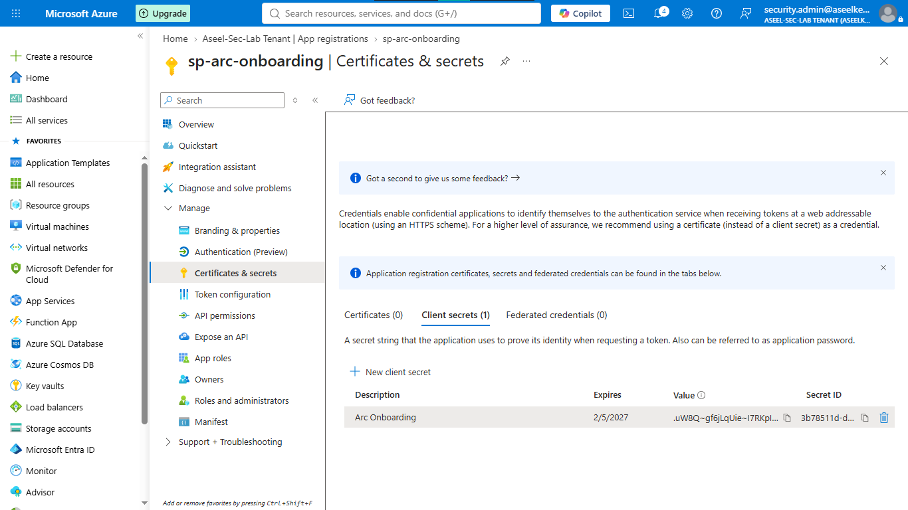
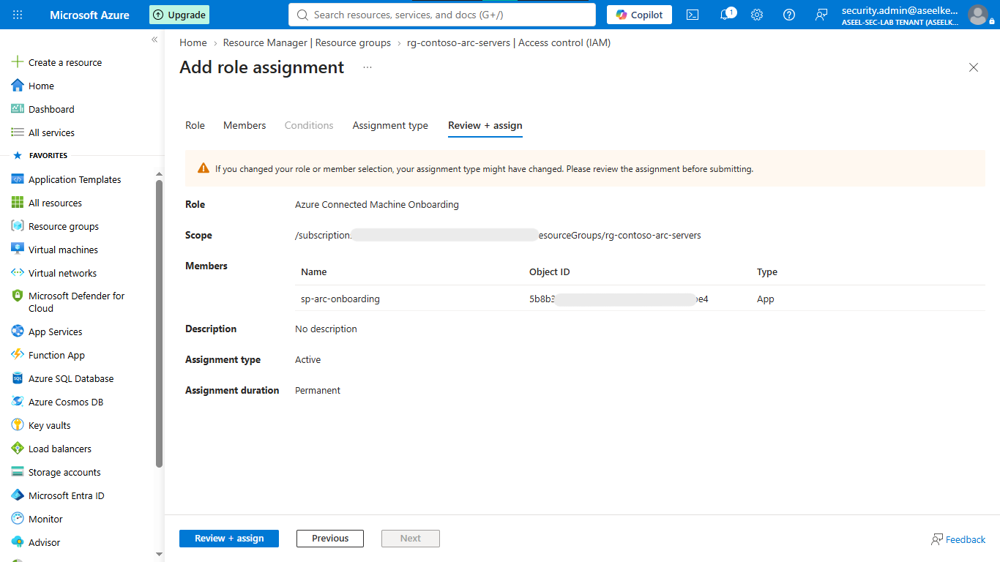
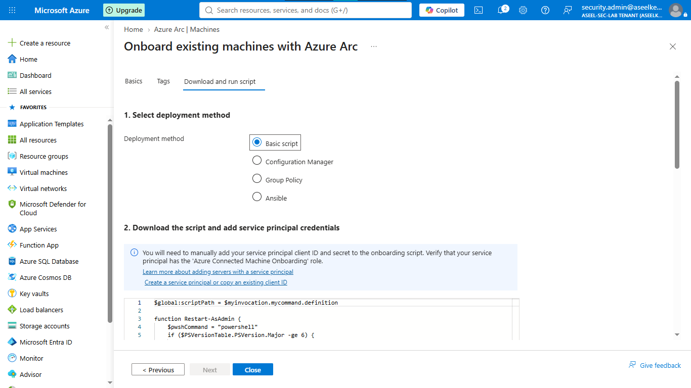
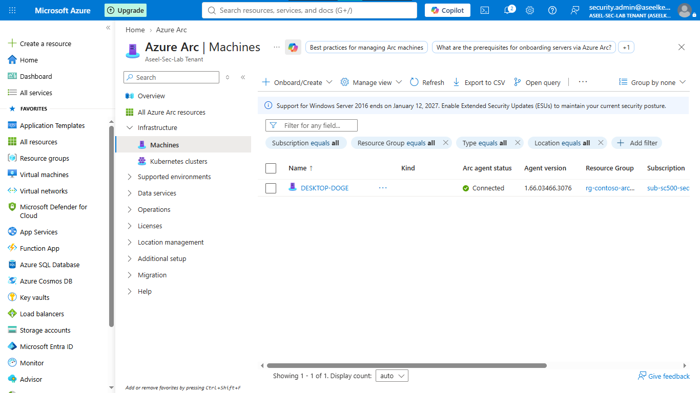
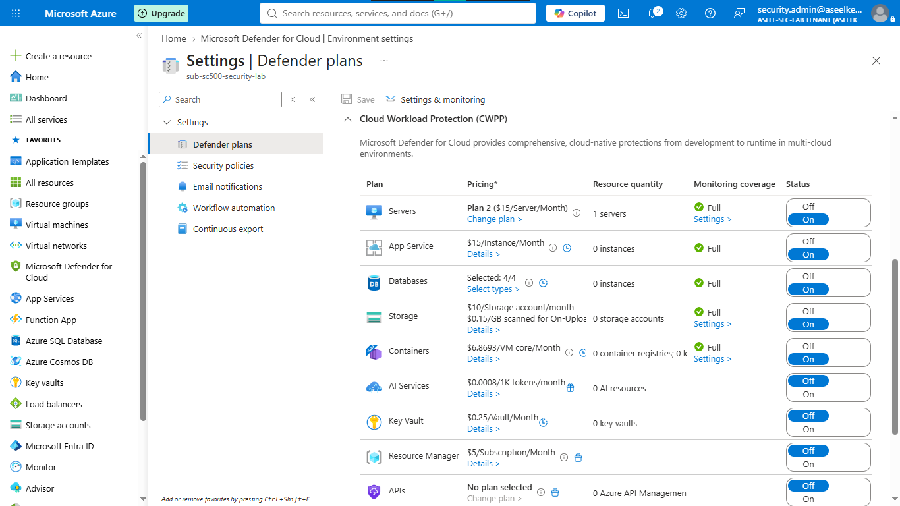
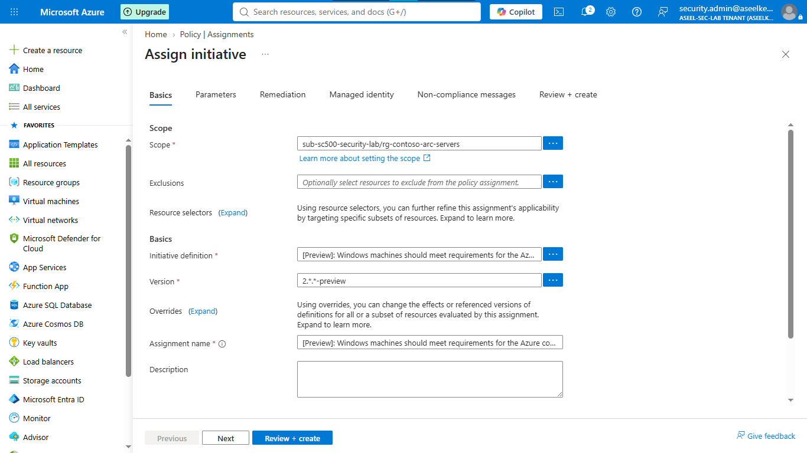

# Lab 33: Azure Arc for Hybrid Servers & Defender

## Objective
Establish a unified security posture for hybrid/multicloud infrastructure by projecting non-Azure servers into Azure Resource Manager (ARM) using Azure Arc and enforcing advanced security controls via Microsoft Defender for Servers Plan 2.

## Security Architecture Concepts
- **Hybrid Governance:** Centralized management of non-Azure infrastructure via Azure Arc.
- **Unified Threat Protection:** Integrated EDR capabilities (Defender for Endpoint) on hybrid servers.
- **Vulnerability Management:** Automated assessments via Microsoft Defender Vulnerability Management (MDVM).
- **Compliance Enforcement:** Applying security baselines across hybrid workloads via Azure Policy.

**Tools/Services Used:** Azure Arc, Microsoft Defender for Cloud (Servers Plan 2), Microsoft Entra ID (Service Principals), Azure Policy.

## Prerequisites
- Azure subscription with administrative access.
- Non-Azure machine (Windows/Linux) with outbound HTTPS connectivity.

## Implementation Guide
### Task 1: Identity Setup and Server Onboarding
1. Create Entra ID Service Principal (`sp-arc-onboarding`) and generate a client secret.
2. Assign the **Azure Connected Machine Onboarding** role to the Service Principal on the target resource group `rg-contoso-arc-servers`.
3. Generate the onboarding script from Azure Arc and execute it on the target machine.
4. Verify the machine appears as **Connected** in the Azure Arc inventory.

### Task 2: Enable Defender for Servers Plan 2 and Deploy EDR
1. In Microsoft Defender for Cloud, toggle the **Servers** plan to **On** (Plan 2).
2. Configure **Endpoint protection** (auto-provisioning) to deploy Microsoft Defender for Endpoint (MDE) to Arc-connected machines.
3. Verify the `MDE.Windows` (or Linux equivalent) extension status in the VM Extensions pane.

### Task 3: Vulnerability Assessment
1. Navigate to Defender for Cloud -> **Recommendations**.
2. Verify vulnerability assessment solution is active on the Arc machine.
3. Review software inventory and vulnerability findings in the **Defender Vulnerability Management** portal.

### Task 4: Governance and Security Baseline Compliance
1. Search for **Policy** -> **Assignments** -> **Assign initiative**.
2. Scope the assignment to `rg-contoso-arc-servers`.
3. Assign the initiative: `Windows machines should meet requirements for the Azure compute security baseline`.

## Testing and Verification
1. Confirm the hybrid server shows a **Connected** status in Azure Arc.
2. Verify Defender for Endpoint correctly reports the machine health.
3. Validate that Azure Policy enforcement is active and reporting on compliance status.

## References
- [Azure Arc-enabled servers](https://learn.microsoft.com/en-us/azure/azure-arc/servers/overview)
- [Microsoft Defender for Servers Plan 2](https://learn.microsoft.com/en-us/azure/defender-for-cloud/plan-defender-for-servers)

