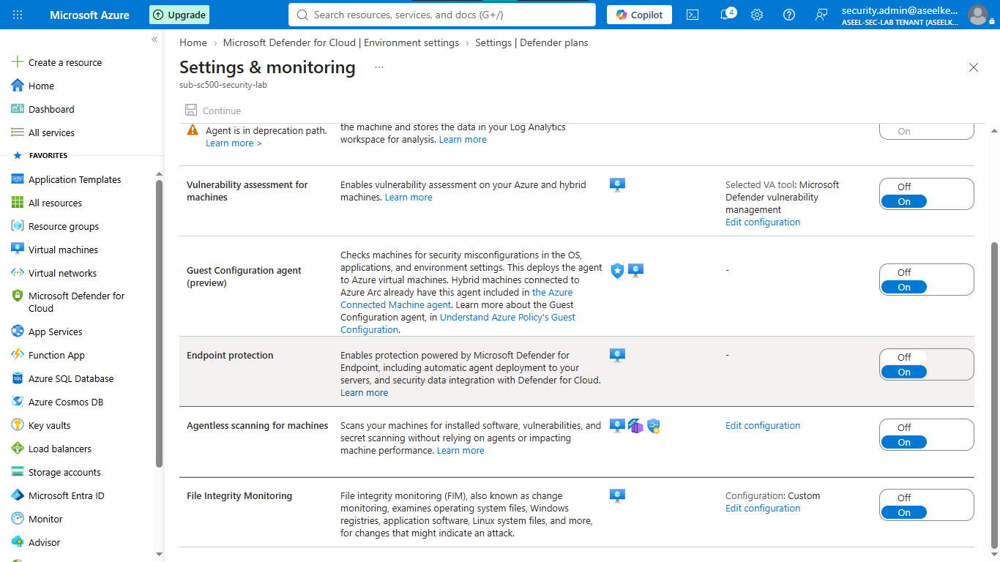
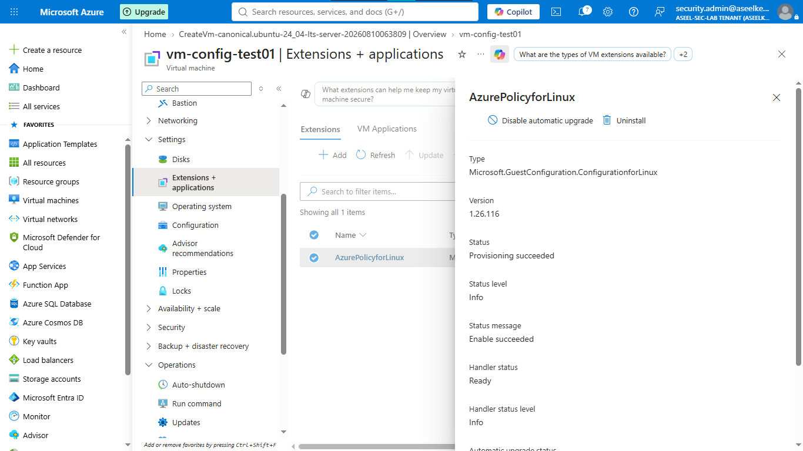
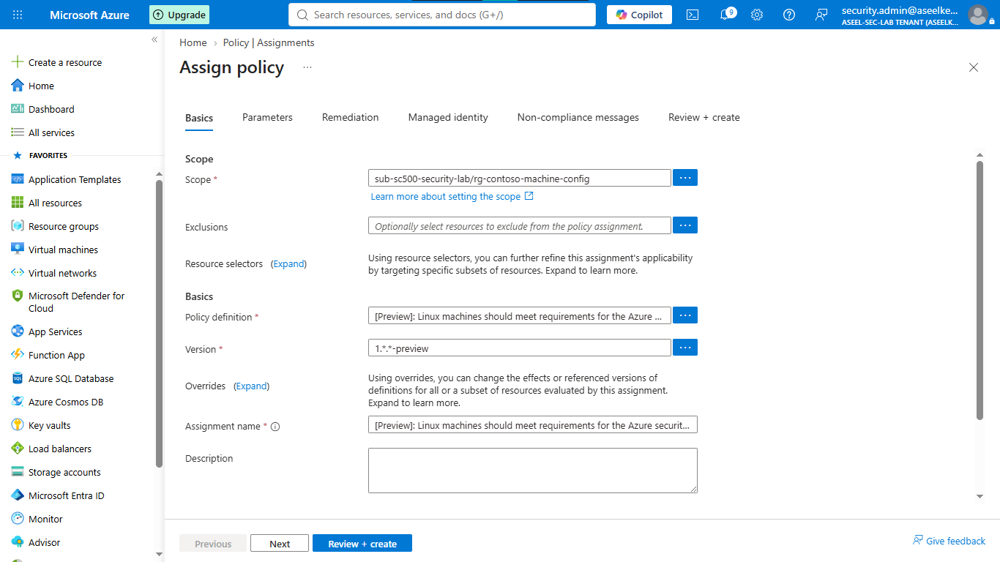
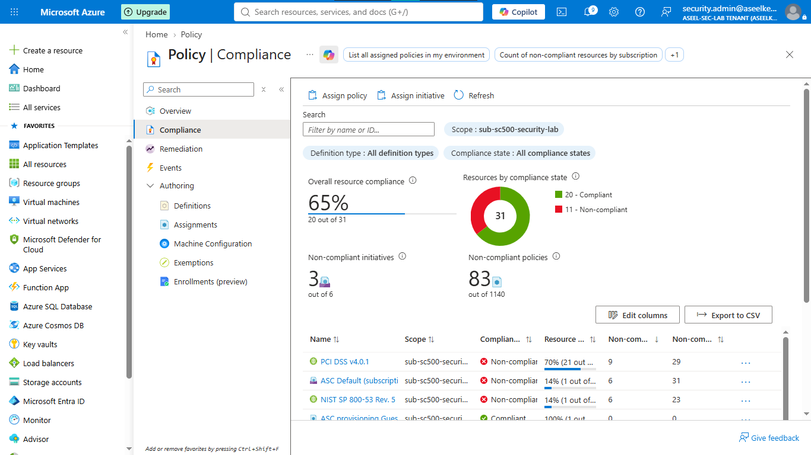
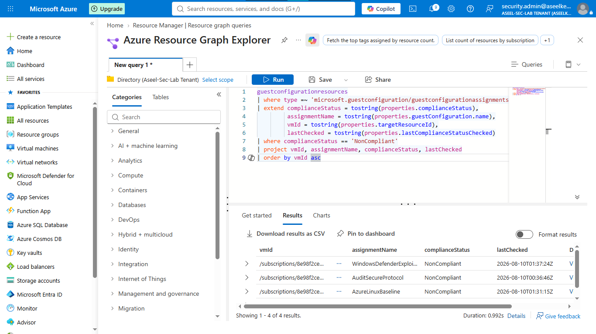

# Lab 34: Agentless Scanning & Machine Configuration

## Objective
Implement agentless vulnerability scanning and enforce security baseline compliance using Azure Machine Configuration (formerly Guest Configuration) to meet regulatory standards without installing traditional agents.

## Security Architecture Concepts
- **Agentless CSPM:** Performing vulnerability assessments and software inventory via snapshot-based scanning.
- **Machine Configuration:** Policy-driven auditing and enforcement of OS-level security settings.
- **Compliance Monitoring:** Continuous validation against CIS benchmarks and security baselines.
- **Drift Detection:** Proactive identification of non-compliant resources using Azure Resource Graph.

**Tools/Services Used:** Microsoft Defender for Cloud (Agentless Scanning), Azure Policy (Machine Configuration), Azure Resource Graph.

## Prerequisites
- Azure subscription with administrative access.
- Microsoft Defender CSPM enabled.
- Virtual machine for testing.

## Implementation Guide
### Task 1: Enable Agentless Scanning in Defender for Cloud
1. Navigate to **Microsoft Defender for Cloud** -> **Environment settings**.
2. Select your subscription, ensure **Defender CSPM** and **Servers** are `On`.
3. Click **Settings** (gear icon) on the **Servers** row.
4. Enable **Agentless scanning for machines**.

### Task 2: Provision Test VM and Machine Configuration Extension
1. Deploy test VM (`vm-config-test01`, Ubuntu Server 24.04 LTS).
2. Navigate to the VM -> **Extensions + applications** -> **+ Add**.
3. Search for and install **Azure Policy for Linux**.

### Task 3: Assign Built-in Machine Configuration Policies
1. Search for **Policy** -> **Assignments** -> **Assign policy**.
2. Set **Scope** to `rg-contoso-machine-config`.
3. Assign `Audit Linux machines that do not have the passwd file permissions set to 0644`.
4. Assign security baseline initiatives for Windows and Linux machines.
5. Create a Managed Identity (System assigned) for policy remediation.

### Task 4: Monitor Compliance and Remediate Configuration Drift
1. Navigate to **Azure Policy** -> **Compliance**.
2. Monitor compliance status of assigned policies.
3. Use **Azure Resource Graph Explorer** to run KQL queries for proactive drift detection.

## Testing and Verification
1. Validate that the Machine Configuration extension is successfully installed on target VMs.
2. Verify that non-compliant configurations (e.g., modified file permissions) are correctly flagged by Azure Policy.
3. Confirm the Resource Graph query effectively identifies non-compliant resources.

## References
- [Agentless scanning in Defender for Cloud](https://learn.microsoft.com/en-us/azure/defender-for-cloud/agentless-scanning)
- [Azure Policy Machine Configuration](https://learn.microsoft.com/en-us/azure/governance/policy/concepts/guest-configuration)

