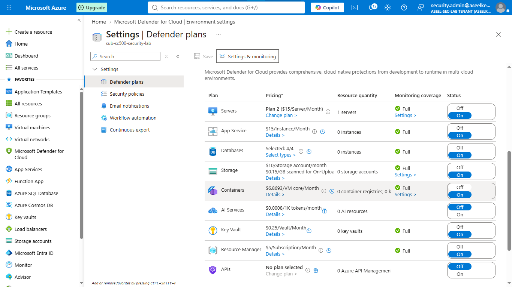
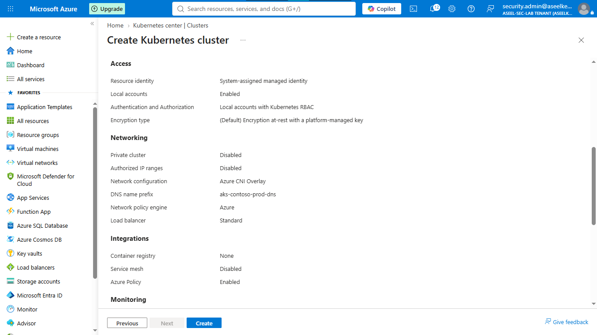
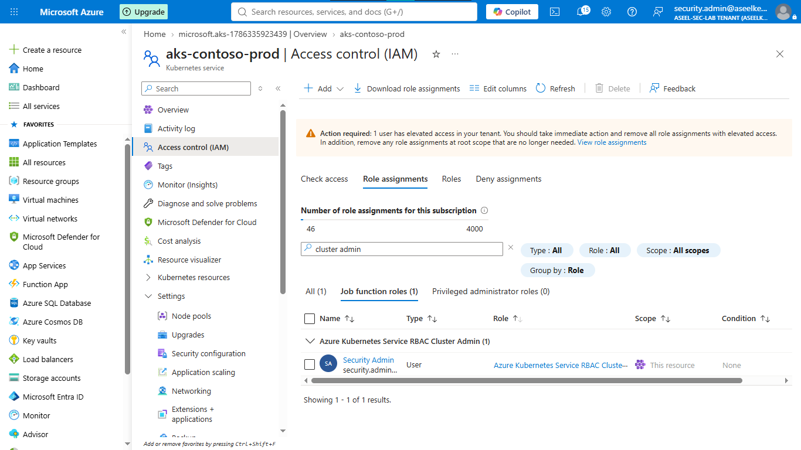
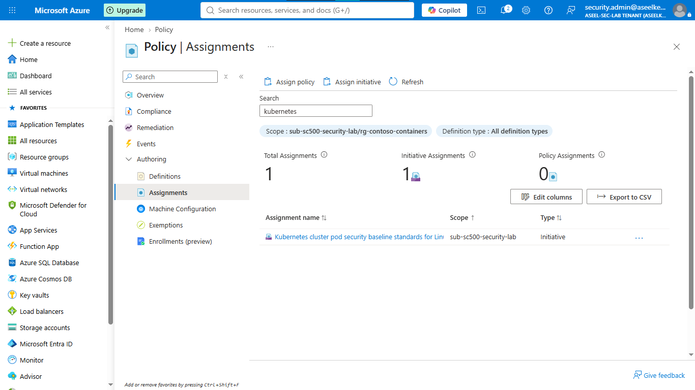
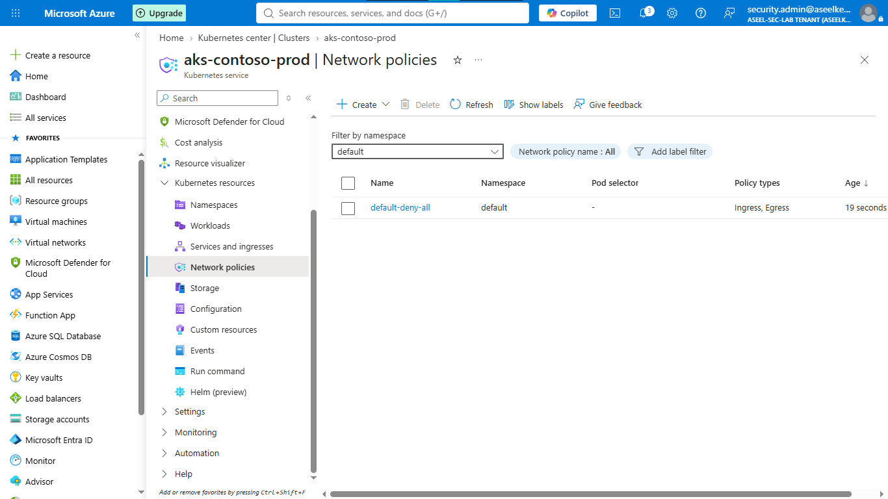
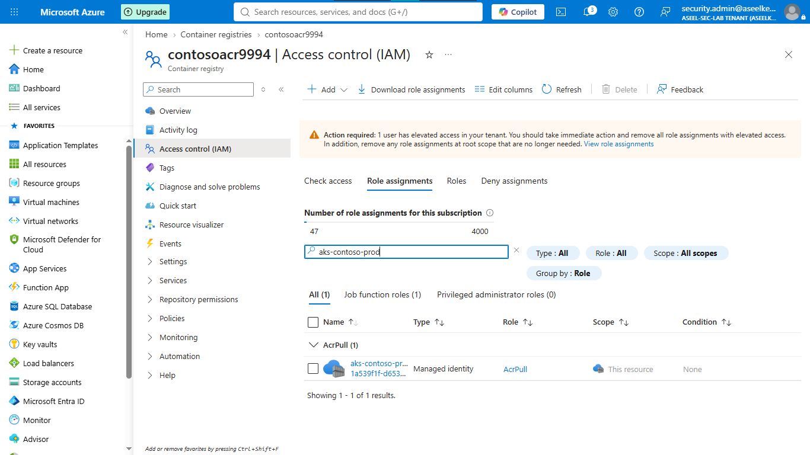
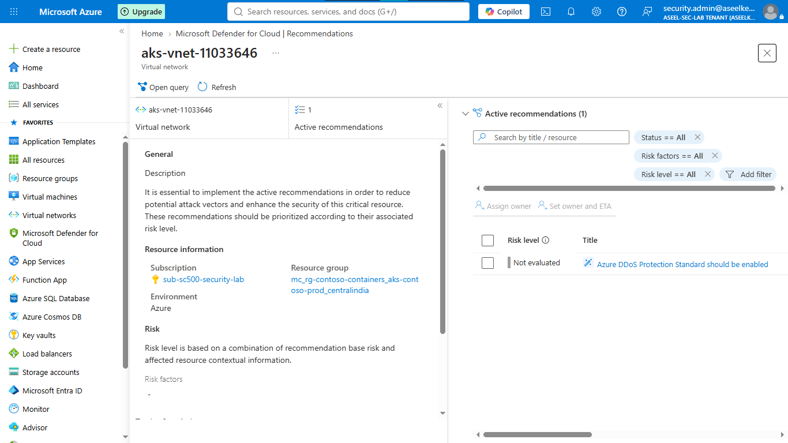
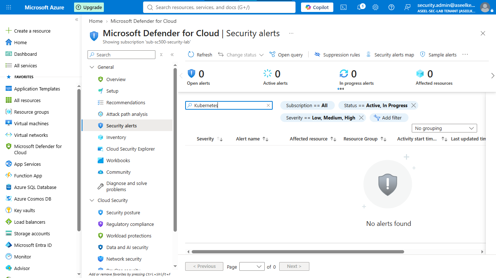

# Lab 35: Container Security – Defender for Containers & AKS Hardening

## Objective
Harden Azure Kubernetes Service (AKS) by implementing threat protection, identity governance, zero-trust network policies, and policy-based workload security.

## Security Architecture Concepts
- **Runtime Protection:** Continuous threat detection for containerized workloads via Defender for Containers.
- **Identity Governance:** Replacing local cluster accounts with Microsoft Entra ID and Azure RBAC.
- **API Server Hardening:** Restricting control plane access to authorized IP ranges.
- **Pod Security Standards:** Enforcing security baselines (e.g., preventing root privileges) via Azure Policy (Gatekeeper).
- **Network Segmentation:** Enforcing default-deny network policies within cluster namespaces.

**Tools/Services Used:** Azure Kubernetes Service (AKS), Azure Container Registry (ACR), Microsoft Defender for Containers, Azure Policy.

## Prerequisites
- Azure subscription with administrative access.
- Azure CLI or portal access.

## Implementation Guide
### Task 1: Enable Defender for Containers
1. Navigate to **Microsoft Defender for Cloud** -> **Environment settings**.
2. Enable the **Containers** plan for the subscription.

### Task 2: Provision Hardened AKS Cluster
1. Create AKS cluster with **Azure CNI Overlay** and **Azure** network policy.
2. Enable **Workload Identity**, **OIDC Issuer**, and **Azure Policy** during deployment.

### Task 3: Identity Governance and API Server Hardening
1. Configure AKS authentication to **Microsoft Entra ID with Azure RBAC**.
2. Assign **Azure Kubernetes Service RBAC Cluster Admin** role to security personnel.
3. Enable **Authorized IP ranges** for the API server.

### Task 4: Enforce Pod Security Standards via Azure Policy
1. Assign the **Kubernetes cluster pod security baseline standards for Linux-based workloads** initiative.
2. Set the initiative effect to **Deny** to block non-compliant deployments.

### Task 5: Network Microsegmentation & ACR Integration
1. Implement default-deny **Network policies** in the `contoso-production` namespace.
2. Grant **AcrPull** role to the AKS cluster's managed identity on the Azure Container Registry.

### Task 6: SOC Monitoring & Threat Detection
1. Review continuous compliance assessments in **Defender for Cloud**.
2. Monitor runtime security alerts in **Defender for Cloud** -> **Security alerts**.

## Testing and Verification
1. Validate policy enforcement by attempting to deploy a privileged (root) container.
2. Verify network segmentation blocks cross-namespace traffic by default.
3. Confirm Entra ID RBAC correctly restricts cluster management access.

## References
- [Defender for Containers](https://learn.microsoft.com/en-us/azure/defender-for-cloud/defender-for-containers-introduction)
- [AKS Security Hardening](https://learn.microsoft.com/en-us/azure/aks/security-hardening)

