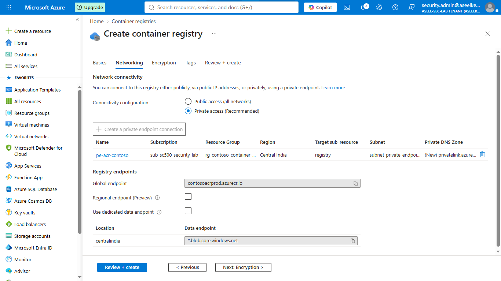
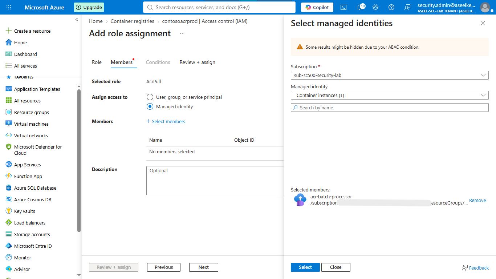
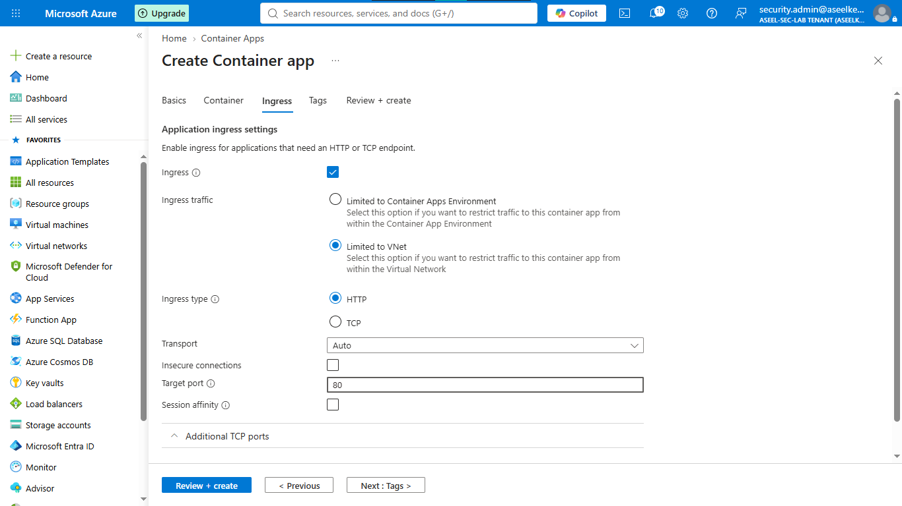
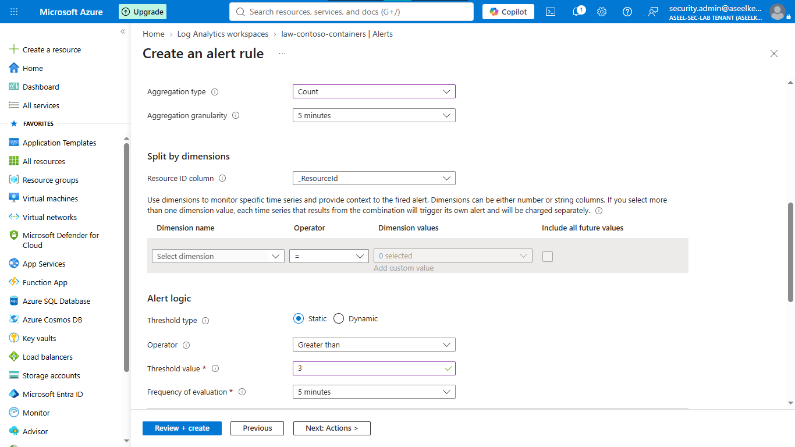

# Lab 36: Container Security – ACR, Container Instances, and Container Apps

## Objective
Implement a secure container supply chain and harden runtime environments for microservices and batch processing workloads by enforcing zero-trust networking, identity governance, and continuous monitoring.

## Security Architecture Concepts
- **ACR Hardening:** Premium SKU with private networking, automated retention, and credential-less access.
- **Identity Governance:** Utilizing Managed Identities for ACR image pulling (eliminating static secrets).
- **Network Isolation:** Deploying ACI and Container Apps within VNet-isolated subnets with internal ingress.
- **Threat Detection:** KQL-based monitoring for supply chain anomalies (image pull failures, unauthorized access).

**Tools/Services Used:** Azure Container Registry (ACR), Azure Container Instances (ACI), Azure Container Apps (ACA), Azure Virtual Network, Azure Log Analytics.

## Prerequisites
- Azure subscription with administrative access.
- Basic understanding of containerization and networking.

## Implementation Guide
### Task 1: Deploy Foundational Infrastructure
1. Create resource group `rg-contoso-container-platform`.
2. Provision VNet `vnet-container-platform` with subnets: `subnet-private-endpoints`, `subnet-aci`, `subnet-container-apps`.
3. Create Log Analytics Workspace `law-contoso-containers`.

### Task 2: Harden Azure Container Registry (ACR)
1. Deploy **ACR Premium** with public access disabled.
2. Link ACR to a **Private Endpoint** within `subnet-private-endpoints`.
3. Configure retention policy to purge untagged images after 7 days.
4. Implement scoped access using **Scope maps** and **Tokens** (`production-pull-token`).

### Task 3: Secure Azure Container Instances (ACI)
1. Deploy ACI in `subnet-aci` with VNet integration.
2. Enable **System-assigned managed identity**.
3. Assign **AcrPull** role to the managed identity on the ACR.

### Task 4: Secure Azure Container Apps (ACA)
1. Provision ACA Environment with internal ingress (VNet-isolated).
2. Configure container app with internal-only access.

### Task 5: SOC Monitoring & Threat Detection
1. Configure Diagnostic Settings to stream logs to `law-contoso-containers`.
2. Create KQL-based alert rule to monitor image pull failures (e.g., `ImagePullBackOff`).

## Testing and Verification
1. Verify ACR private endpoint connectivity within the VNet.
2. Confirm ACI and ACA can pull images from the ACR using Managed Identity without static secrets.
3. Validate alerting functionality for container image pull anomalies.

## References
- [Azure Container Registry Security](https://learn.microsoft.com/en-us/azure/container-registry/container-registry-security)
- [Secure Azure Container Apps](https://learn.microsoft.com/en-us/azure/container-apps/security)

