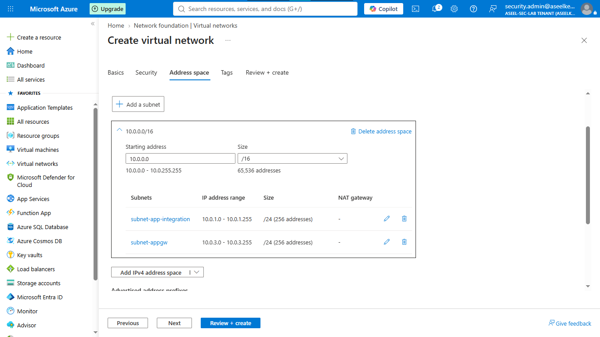
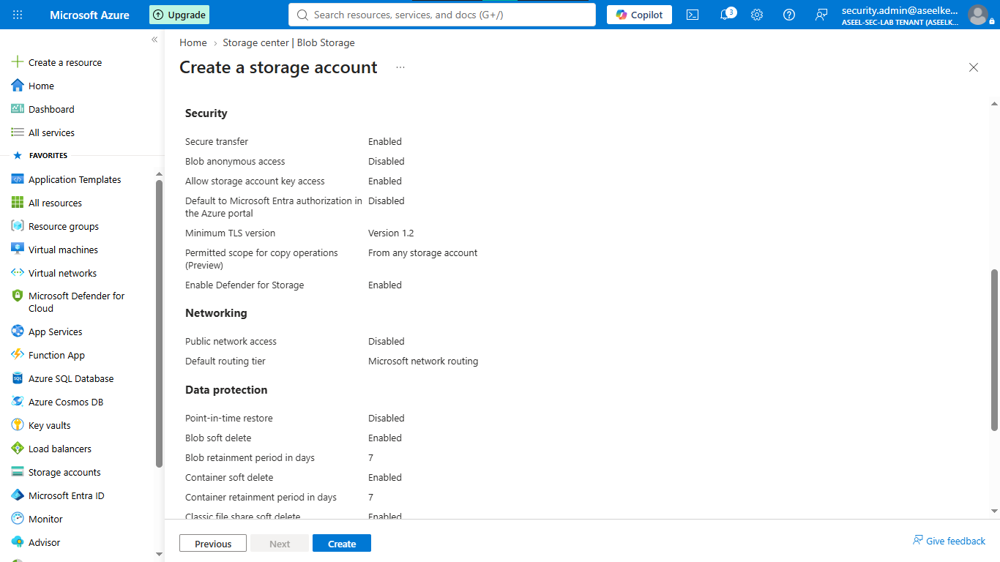
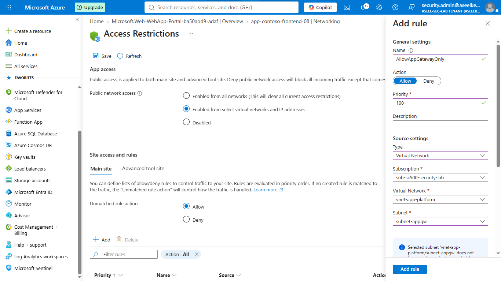
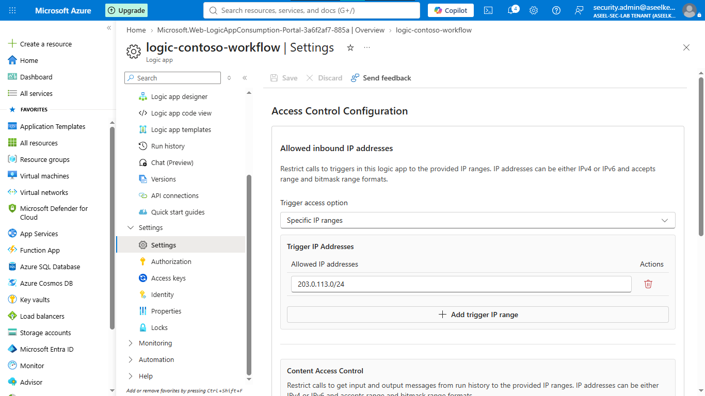
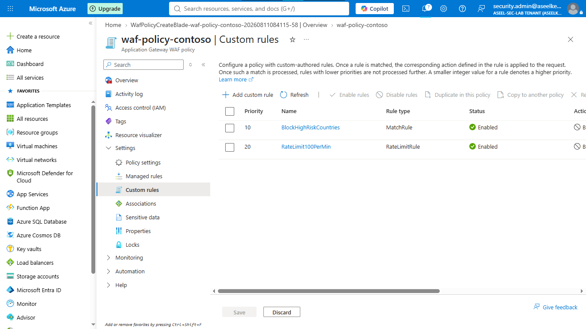
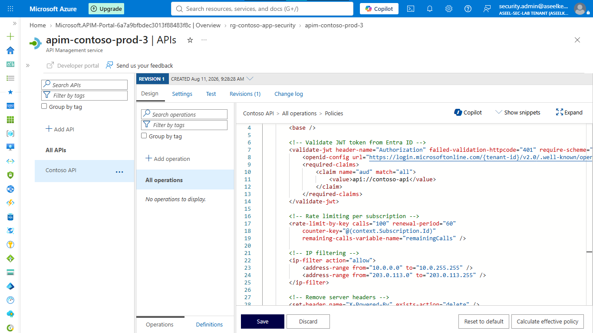
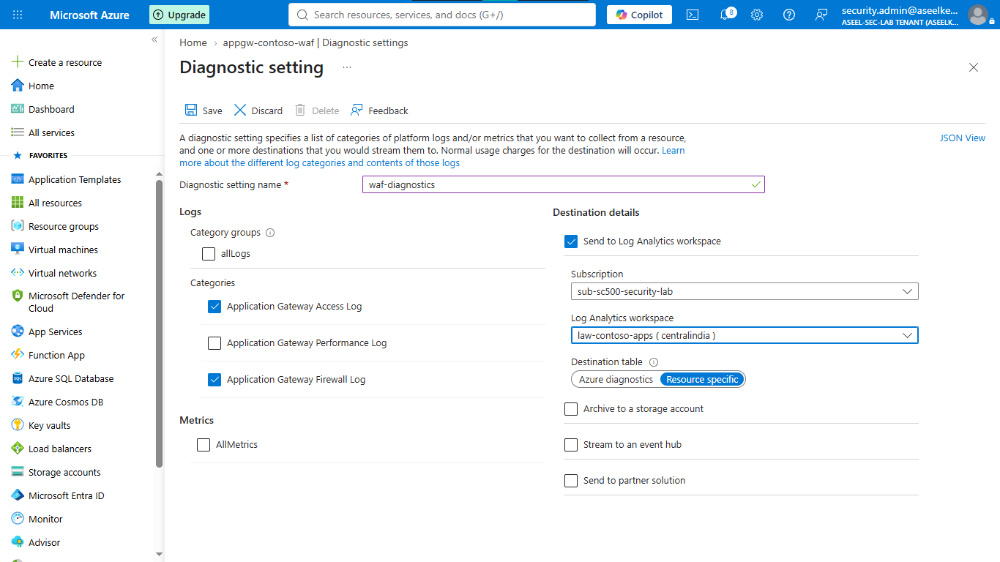

# Lab 37: App Platform Security – WAF, APIM, and VNet Integration

## Objective
Hardening a multi-tier Azure application platform using Zero Trust principles: implementing perimeter defense (WAF), VNet integration, identity governance, and continuous SOC monitoring.

## Security Architecture Concepts
- **Perimeter Defense:** WAF with OWASP rules and custom policies (Geo-blocking, rate limiting).
- **Network Isolation:** VNet-integrated compute with private-only ingress.
- **Identity Governance:** Secretless authentication using Managed Identities and Entra ID (OAuth/OIDC).
- **API Security:** Zero-Trust API policies (JWT validation, IP filtering, rate limiting).
- **SOC Observability:** Centralized diagnostic logging and threshold-based alerts.

**Tools/Services Used:** Azure App Service, Azure Logic Apps, Azure Application Gateway (WAF), Azure API Management (APIM), Azure Monitor, Log Analytics.

## Prerequisites
- Azure subscription with administrative access.
- Basic understanding of Azure networking and web hosting.

## Implementation Guide
### Task 1: Foundation Network and Storage
1. Deploy VNet `vnet-app-platform` with subnets `subnet-app-integration` and `subnet-appgw`.
2. Provision secured Storage Account (`stcontosofunc...`) with public access disabled and TLS 1.2 enforced.
3. Create Log Analytics Workspace `law-contoso-apps`.

### Task 2: Deploy and Harden Web App and Logic App
1. Deploy Web App (`app-contoso-frontend`) with System-assigned Managed Identity.
2. Hardened configs: Disable FTP, enable HTTPS Only (TLS 1.2).
3. Configure VNet integration and Access restrictions (Allow App Gateway ingress only).
4. Deploy Logic App (`logic-contoso-workflow`) with IP-restricted triggers and Service Bus RBAC access.

### Task 3: Perimeter Defense (WAF Deployment)
1. Provision WAF Policy (`waf-policy-contoso`) with `OWASP 3.2` and `BotManagerRuleSet`.
2. Apply custom rules: **Geo-blocking** and **Rate Limiting**.
3. Associate policy with Application Gateway (`appgw-contoso-waf`).

### Task 4: API Security & SOC Telemetry
1. Deploy APIM (`Standard v2`) and apply XML policies for JWT validation and IP filtering.
2. Enable Defender for App Service.
3. Configure Diagnostic settings for WAF and Web App to stream to `law-contoso-apps`.

## Testing and Verification
1. Validate WAF prevents unauthorized traffic (Geo-blocked regions).
2. Confirm APIM rejects requests lacking valid JWT tokens.
3. Verify diagnostic logs are successfully arriving in the Log Analytics workspace.

## References
- [Azure Web Application Firewall](https://learn.microsoft.com/en-us/azure/web-application-firewall/)
- [Azure API Management Policies](https://learn.microsoft.com/en-us/azure/api-management/api-management-policies)

