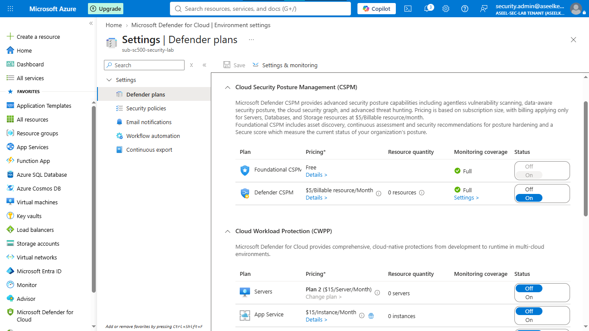
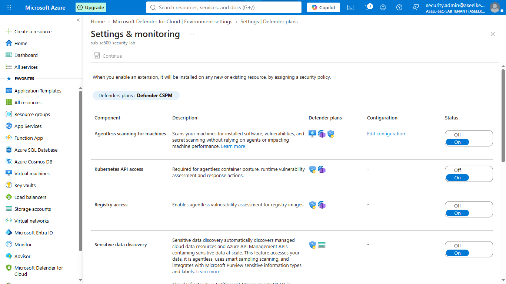
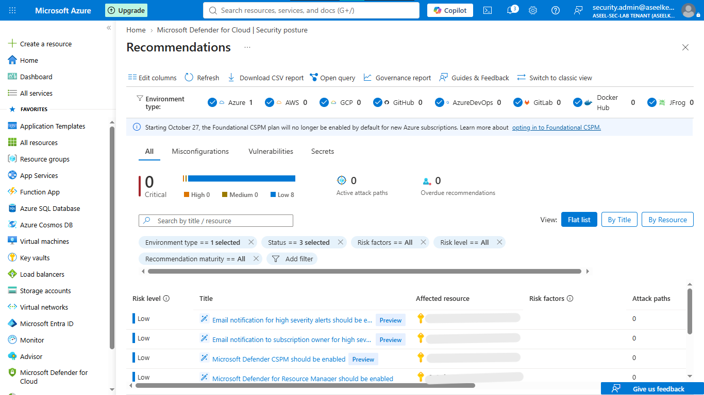
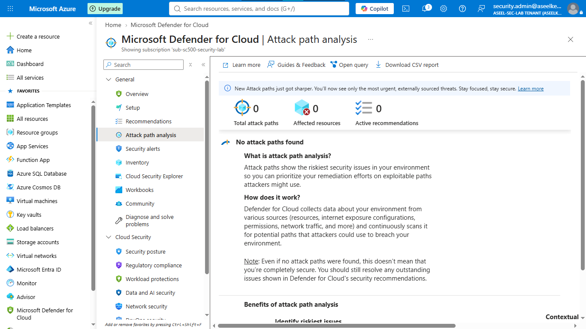
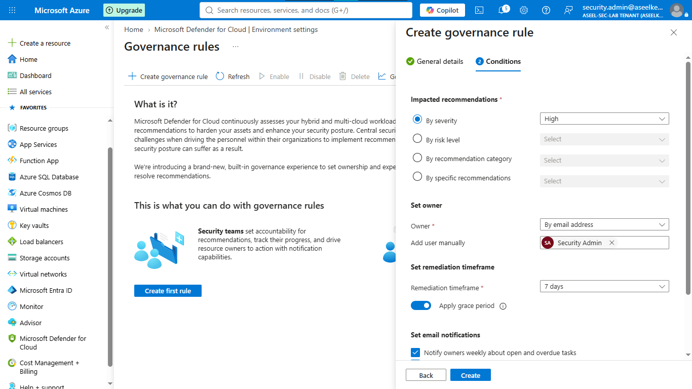

# Lab 38: Defender CSPM – Risk Identification & Attack Paths

## Objective
Configure Microsoft Defender for Cloud (CSPM) to evaluate security posture, analyze potential risks via attack paths, and automate remediation tracking using governance rules.

## Security Architecture Concepts
- **Cloud Security Posture Management (CSPM):** Continuous evaluation of cloud configurations against security benchmarks.
- **Attack Path Analysis:** Visualizing multi-step risk chains to identify potential exploit paths.
- **Governance:** Automating accountability and remediation timelines for security findings.

**Tools/Services Used:** Microsoft Defender for Cloud, Azure Policy, Azure Resource Graph.

## Prerequisites
- Azure subscription with administrative access.
- Basic understanding of Defender for Cloud posture management.

## Implementation Guide
### Task 1: Enable Defender CSPM Plan
1. Navigate to **Microsoft Defender for Cloud** -> **Environment settings**.
2. Select your subscription, locate the **CloudPosture** plan, set to **Standard**, and Save.

### Task 2: Configure CSPM Extensions
1. Navigate to **Environment settings** -> **Settings** (monitoring coverage).
2. Enable **Agentless scanning for VMs**, **Agentless discovery for Kubernetes**, **Sensitive data discovery**, and **Container registries vulnerability assessments**.

### Task 3: Review Secure Score and Recommendations
1. Navigate to **Microsoft Defender for Cloud** -> **Secure score**.
2. Review recommendations and filter by severity to prioritize security posture hardening.

### Task 4: Identify Attack Paths
1. Navigate to **Defender for Cloud** -> **Attack path analysis**.
2. Inspect detected multi-step risk chains to identify reachable vulnerabilities.

### Task 5: Query Cloud Security Graph
1. Open **Cloud Security Explorer** to query resource nodes and relationships.

### Task 6: Remediate via Governance Rules
1. Navigate to **Environment settings** -> **Governance rules** -> **+ Create**.
2. Create rule for **High** severity findings with a **7-day** remediation timeframe.

## Testing and Verification
1. Verify CSPM extensions are active in the dashboard.
2. Confirm that Secure Score updates dynamically based on hardening actions.
3. Validate that governance rules correctly assign high-severity findings to owners.

## References
- [Microsoft Defender for Cloud CSPM](https://learn.microsoft.com/en-us/azure/defender-for-cloud/concept-cspm)
- [Attack path analysis](https://learn.microsoft.com/en-us/azure/defender-for-cloud/concept-attack-path-analysis)

