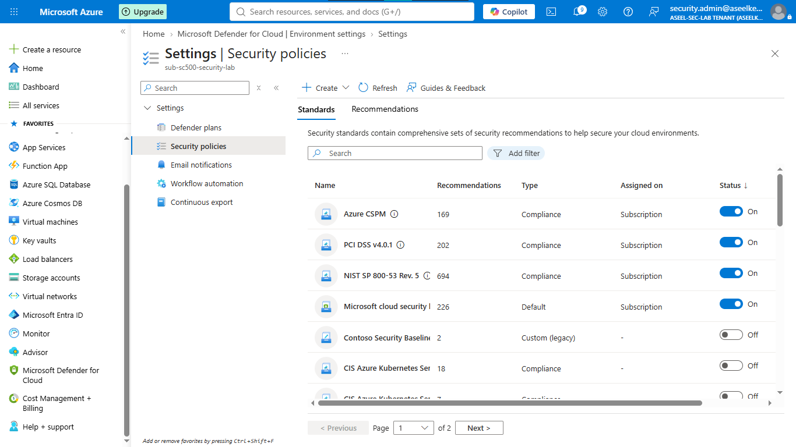
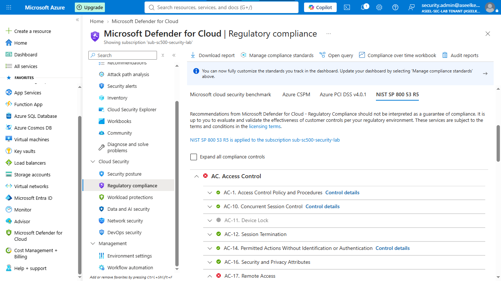
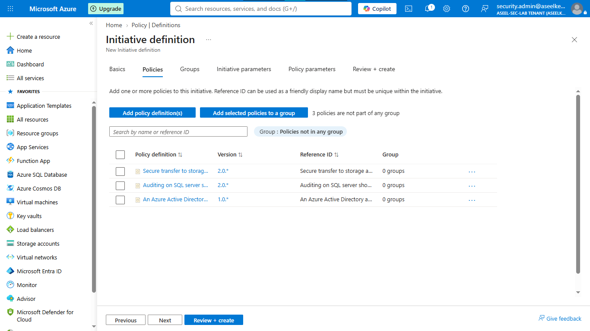
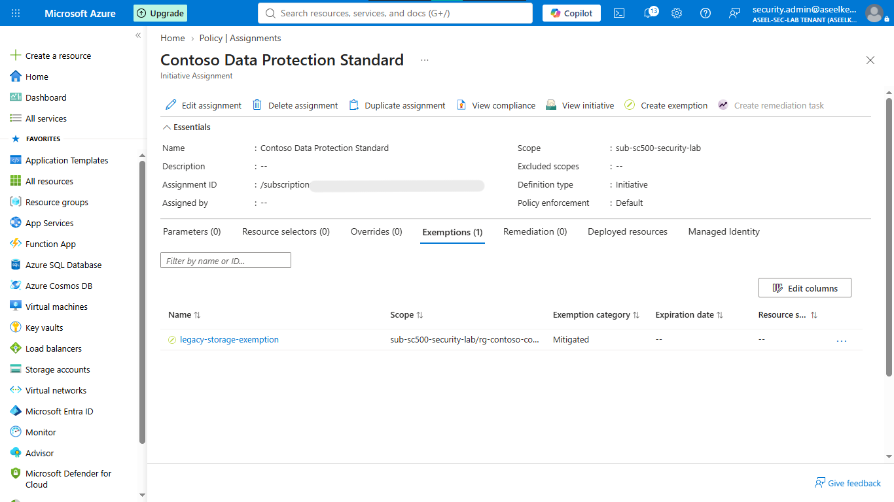
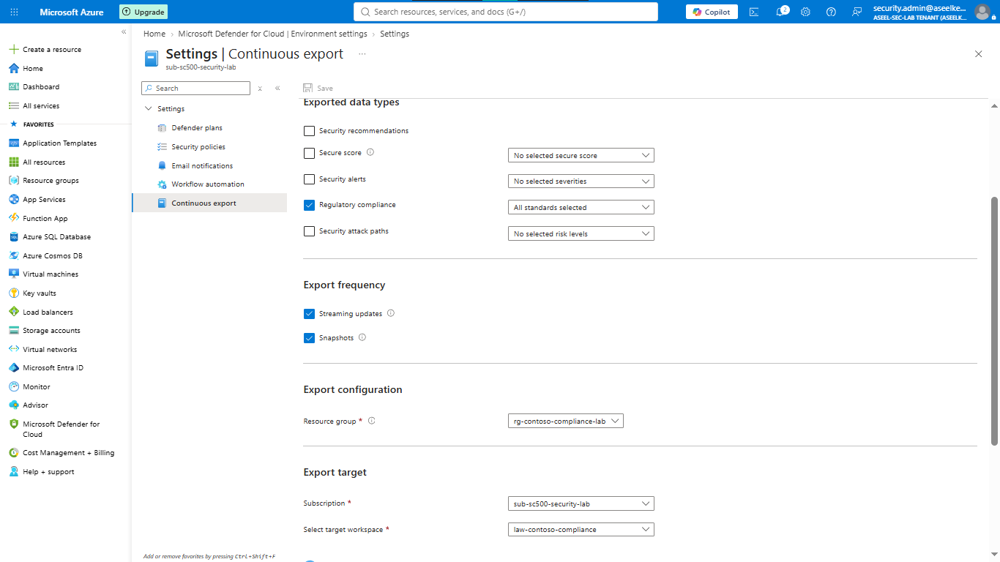

# Lab 39: Compliance Evaluation with Security Frameworks

## Objective
Evaluate cloud environments against NIST SP 800-53 and PCI-DSS v4.0, design custom Azure Policy initiatives, manage compliance exemptions, and establish continuous monitoring pipelines for audit reporting.

## Security Architecture Concepts
- **Cloud Security Posture Management (CSPM):** Continuous evaluation of cloud configurations against security benchmarks.
- **Regulatory Compliance:** Mapping technical configurations to industry frameworks (PCI-DSS, NIST).
- **Custom Governance:** Enforcing internal organizational standards via Azure Policy Initiatives.
- **Continuous Monitoring:** Exporting compliance state changes to Log Analytics for SOC visibility.

**Tools/Services Used:** Microsoft Defender for Cloud, Azure Policy, Azure Resource Graph, Log Analytics.

## Prerequisites
- Azure subscription with administrative access.
- Basic understanding of Azure Policy.

## Implementation Guide
### Task 1: Initialize Environment and Apply Standards
1. Create resource group `rg-contoso-compliance-lab`.
2. In Defender for Cloud -> **Environment settings**, enable **NIST SP 800-53** and **PCI-DSS v4.0** standards.

### Task 2: Review Compliance Posture
1. Navigate to **Defender for Cloud** -> **Regulatory compliance**.
2. Audit PCI-DSS v4.0 framework findings and identify non-compliant resources.

### Task 3: Architect Custom Security Initiative
1. Navigate to **Policy** -> **Definitions** -> **+ Initiative definition**.
2. Create initiative `Contoso Data Protection Standard`.
3. Add built-in policies: secure transfer for storage, SQL auditing, and Entra ID SQL admin.
4. Assign initiative to the subscription.

### Task 4: Configure Compliance Exemptions
1. Navigate to **Policy** -> **Assignments**.
2. Create exemption (`legacy-storage-exemption`) for the resource group using **Mitigated** category and documented justification.

### Task 5: Export Compliance Data for Auditors
1. Use **Resource Graph Explorer** to execute KQL queries aggregating compliance states.

### Task 6: Establish Continuous Compliance Monitoring
1. Deploy Log Analytics Workspace `law-contoso-compliance`.
2. Configure **Continuous export** in Defender for Cloud to stream **Regulatory compliance** data to the workspace.

## Testing and Verification
1. Trigger a non-compliant event (e.g., disable HTTPS on storage account) to verify Azure Policy detection.
2. Confirm compliance status is correctly updated in the regulatory dashboard.
3. Validate streaming of compliance data to Log Analytics for SOC audit.

## References
- [Azure Policy](https://learn.microsoft.com/en-us/azure/governance/policy/overview)
- [Regulatory compliance in Defender for Cloud](https://learn.microsoft.com/en-us/azure/defender-for-cloud/regulatory-compliance-dashboard)

