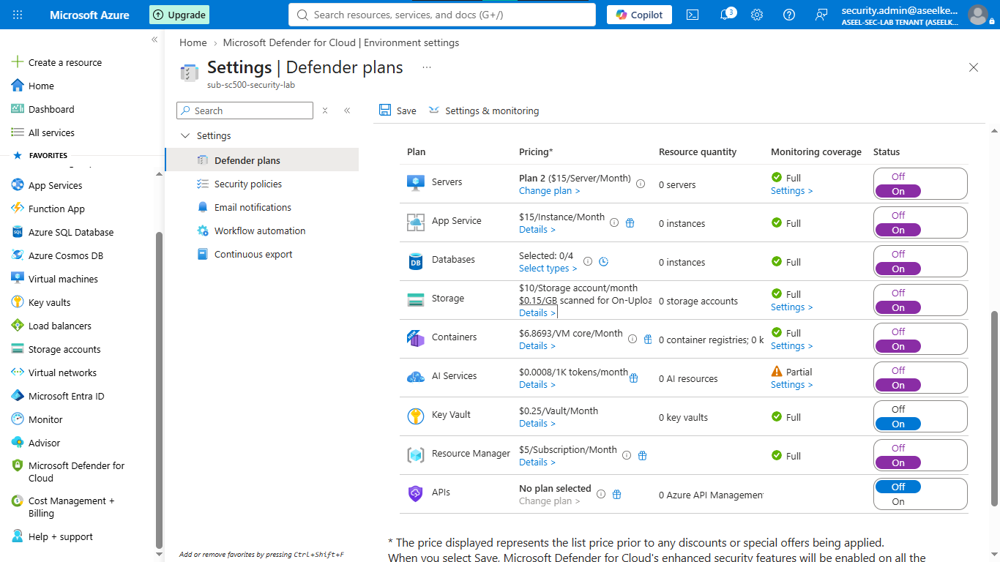
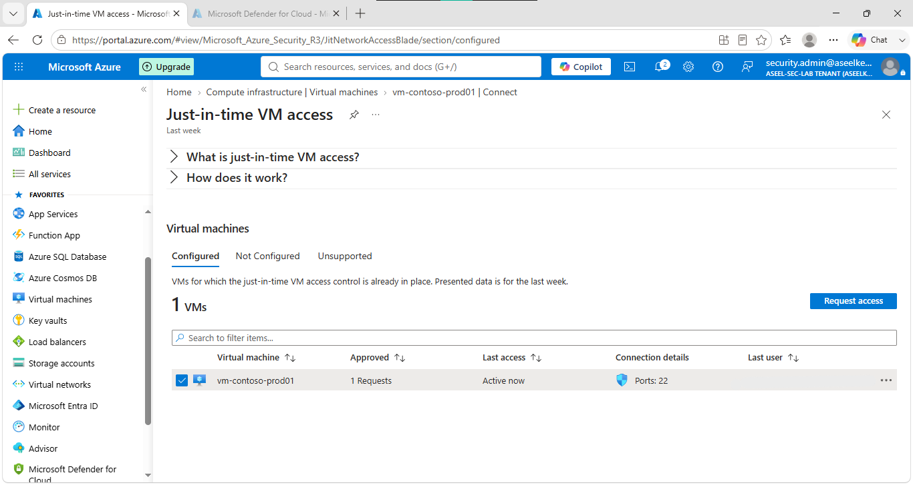
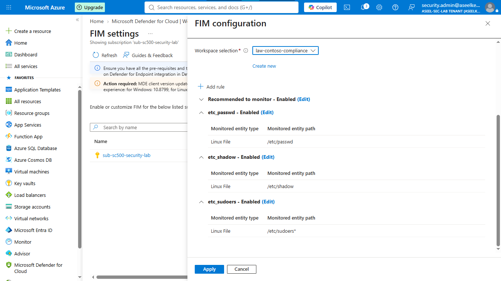

# Lab 40: Defender for Cloud Workload Protection

## Objective
Implement workload protection plans across compute and data tiers, harden management access using Just-In-Time (JIT) access, and configure File Integrity Monitoring (FIM).

## Security Architecture Concepts
- **Workload Protection:** Advanced threat detection for Servers, Storage, Databases, and Containers.
- **Access Hardening:** Dynamic management port restriction via JIT access.
- **Runtime Integrity:** Monitoring critical system files via File Integrity Monitoring (FIM).
- **Automated Vulnerability Assessment:** Agentless scanning and assessment of virtual machines.

**Tools/Services Used:** Microsoft Defender for Cloud, Virtual Machines, Azure Storage, Azure SQL, Azure Policy.

## Prerequisites
- Azure subscription with administrative access.
- Basic understanding of Defender for Cloud.

## Implementation Guide
### Task 1: Enable Defender for Servers Plan 2
1. Navigate to **Defender for Cloud** -> **Environment settings**.
2. Select your subscription, toggle **Servers** to **On** (Plan 2).
3. Enable **Endpoint protection**, **Vulnerability assessment**, and **File integrity monitoring**.

### Task 2: Configure Data Tier Protection
1. Enable Defender plans for **Storage**, **Azure SQL databases**, **Open-source relational databases**, and **Containers**.

### Task 3: Deploy Virtual Machine and Enable JIT
1. Provision VM (`vm-contoso-prod01`) and configure SSH port.
2. Enable **Just-in-time access** in VM configuration.

### Task 4: Configure File Integrity Monitoring (FIM)
1. Navigate to Defender for Cloud -> **Workload protections** -> **File integrity monitoring**.
2. Add tracking rules for `/etc/passwd`, `/etc/shadow`, and `/etc/sudoers*`.

## Testing and Verification
1. Validate JIT blocks management access until request approval.
2. Confirm FIM alerts on file modification events.
3. Check Defender dashboard for vulnerability assessment findings.

## References
- [Defender for Cloud Workload Protection](https://learn.microsoft.com/en-us/azure/defender-for-cloud/workload-protection)
- [File Integrity Monitoring](https://learn.microsoft.com/en-us/azure/defender-for-cloud/fim-overview)

