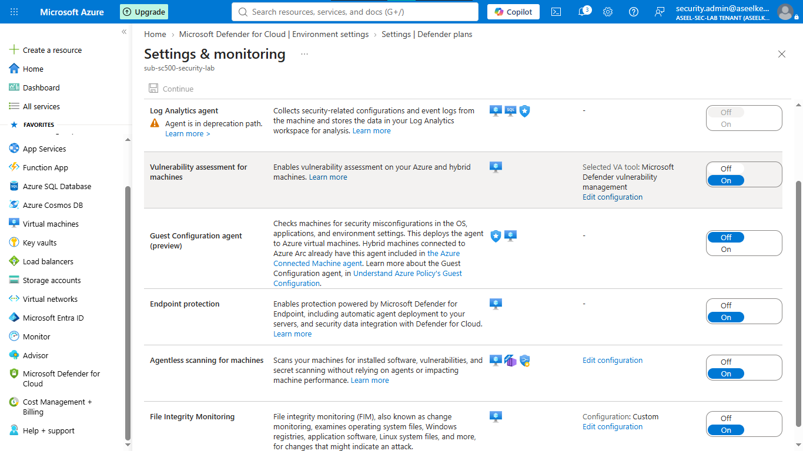
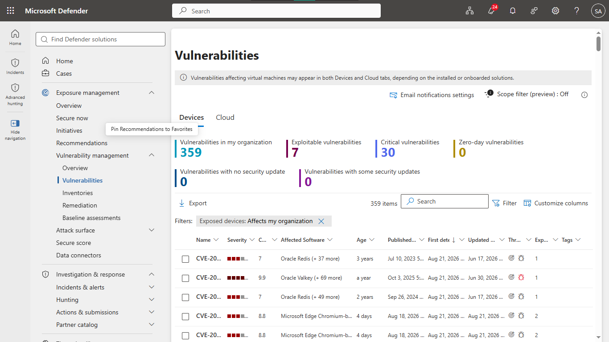
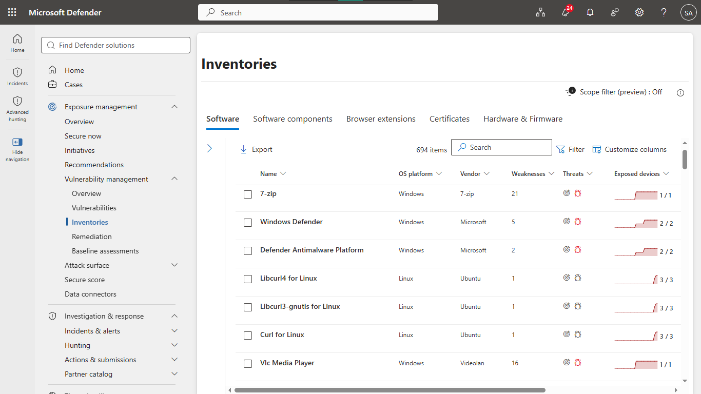
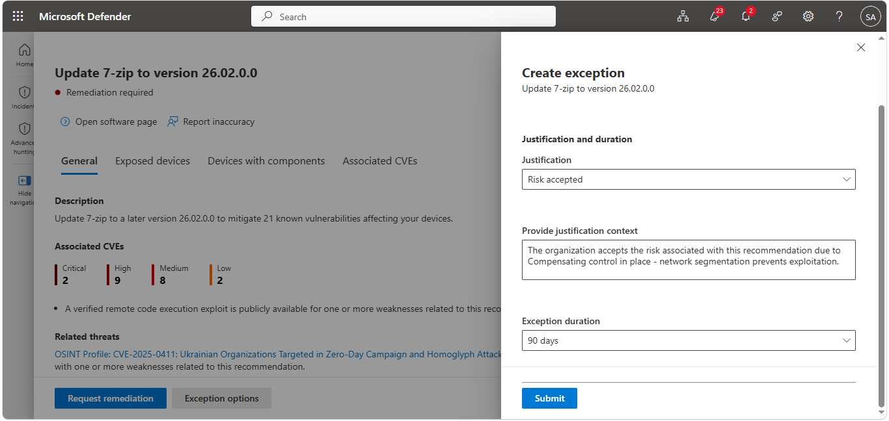
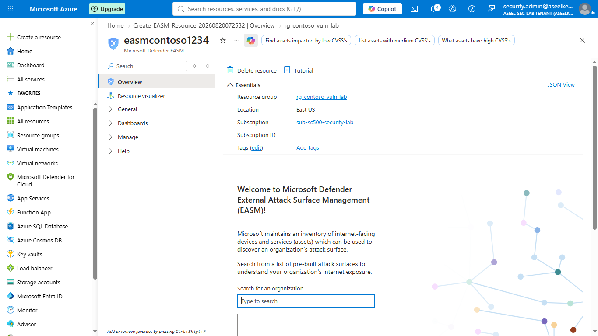
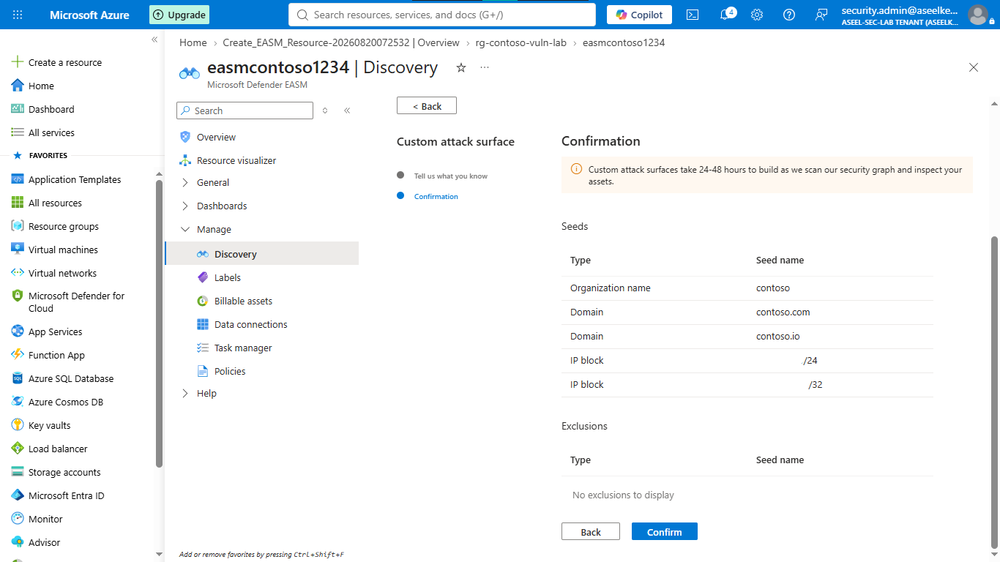
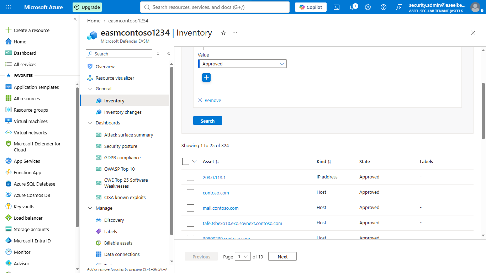

# Lab 41: Defender Vulnerability Management and EASM

## Objective
Implement Microsoft Defender Vulnerability Management (DVM) and External Attack Surface Management (EASM) to gain unified visibility into internal software vulnerabilities and external internet-facing attack surfaces.

## Security Architecture Concepts
- **Defender Vulnerability Management:** Continuous agentless/sensor-based software inventory discovery and CVE tracking.
- **EASM:** Adversary-perspective discovery and assessment of internet-facing digital footprint.
- **Risk Prioritization:** Using threat intelligence and vulnerability assessment findings for remediation prioritization.
- **Exception Governance:** Managing accepted risks with compensating controls and audit trails.

**Tools/Services Used:** Microsoft Defender for Cloud, Microsoft Defender Vulnerability Management, Defender External Attack Surface Management (EASM), Azure Virtual Machines.

## Prerequisites
- Azure subscription with administrative access.
- Microsoft Defender for Servers Plan 2 enabled.

## Implementation Guide
### Task 1: Defender Vulnerability Management Integration
1. Deploy `vm-contoso-linux-vuln` with unpatched software stack.
2. Enable **Defender for Servers Plan 2** and verify **Vulnerability assessment** solution.
3. Review recommendations in Defender for Cloud.

### Task 2: Software Inventory Analysis
1. Navigate to Microsoft Defender Portal -> **Vulnerability management** -> **Inventories** -> **Software**.
2. Analyze software inventory and identify vulnerable components.

### Task 3: Vulnerability Exception Governance
1. Select a high-priority recommendation and create a documented exception.
2. Provide justification (compensating control: network segmentation) and set an expiration date.

### Task 4: EASM Deployment
1. Register `Microsoft.Easm` Resource Provider.
2. Create EASM workspace `easm-contoso` in `rg-contoso-vuln-lab`.

### Task 5: Configure EASM Discovery Seeds
1. Define discovery seeds: Domains (`contoso.com`, `contoso.io`) and IP blocks (`203.0.113.0/24`).
2. Schedule discovery scans.

### Task 6: Review EASM Inventory and Posture
1. Inspect discovered assets in EASM Inventory (Domains, Hosts, IP addresses).
2. Analyze security posture dashboard for internet-exposed services.

## Testing and Verification
1. Confirm internal vulnerabilities appear in the Defender inventory.
2. Validate the exception rule successfully suppresses identified recommendations.
3. Verify the EASM crawler maps the organization's public-facing attack surface.

## References
- [Defender Vulnerability Management](https://learn.microsoft.com/en-us/defender-vulnerability-management/)
- [Defender EASM](https://learn.microsoft.com/en-us/azure/external-attack-surface-management/)

