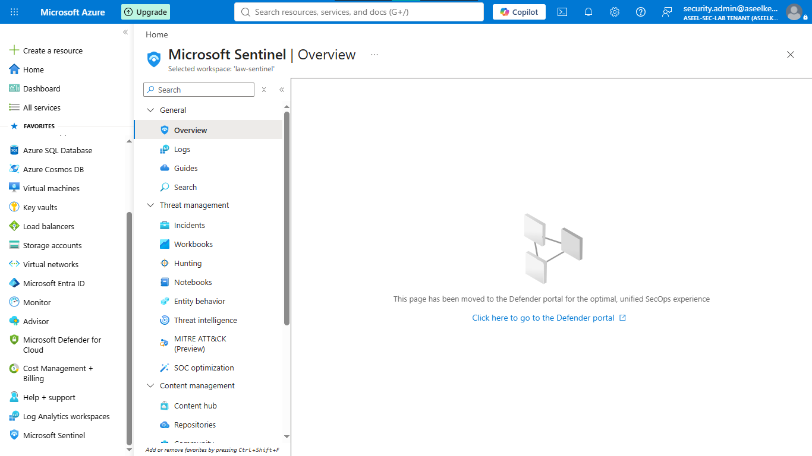
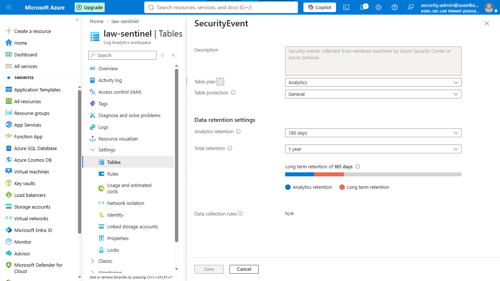
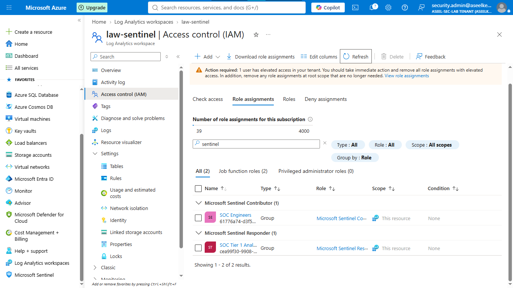
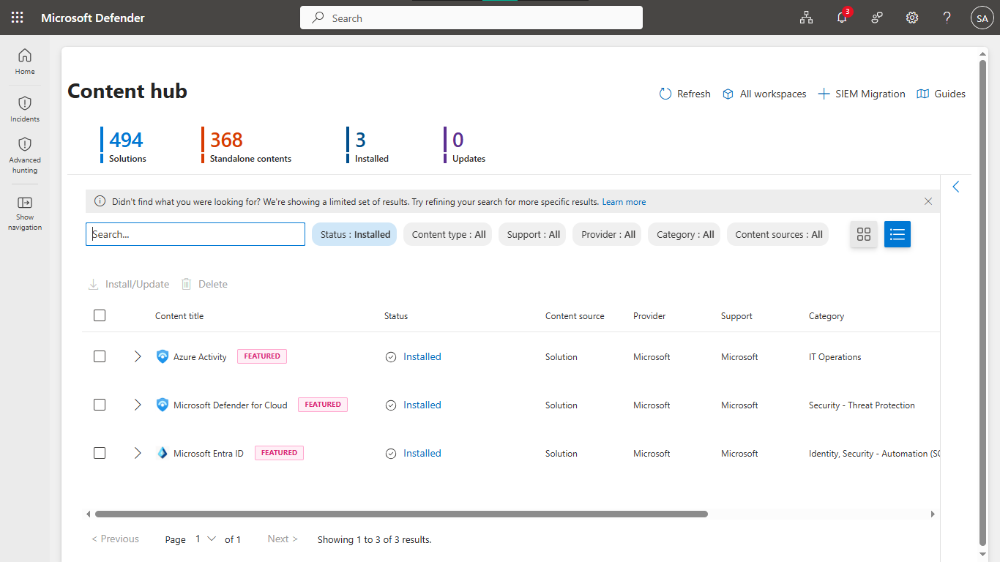
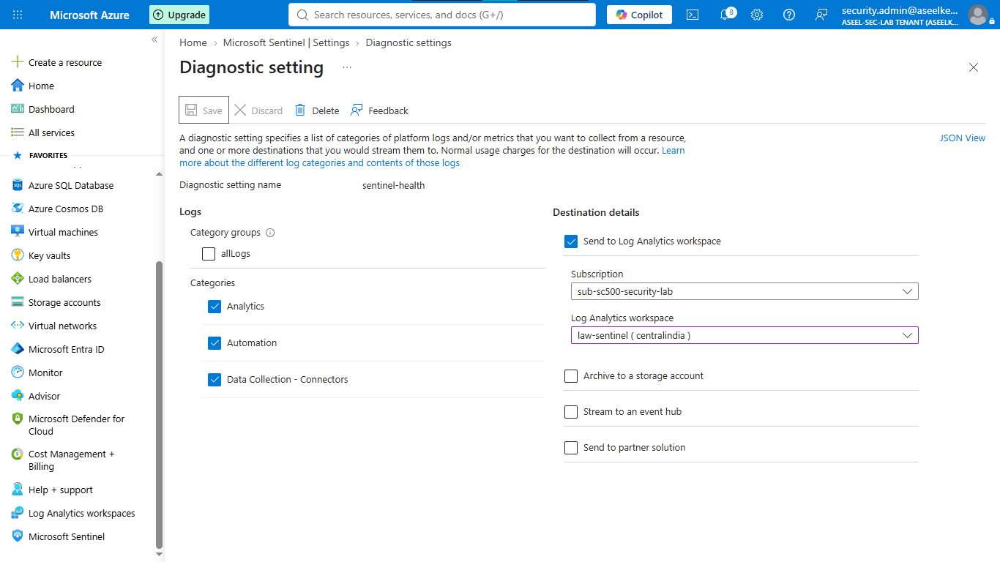

# Lab 42: Microsoft Sentinel – Workspace, Roles, and Content Hub

## Objective
Design and deploy a centralized Microsoft Sentinel SIEM workspace, configure RBAC for SOC teams, install Content Hub solutions, and establish data retention and health monitoring.

## Security Architecture Concepts
- **Unified SIEM:** Centralized log aggregation and threat detection.
- **Identity Governance:** Resource-context RBAC for tiered SOC access (Responder vs. Contributor).
- **Content Management:** Deploying purpose-built detection content via Content Hub.
- **Data Lifecycle Management:** Balancing storage costs with compliance requirements (retention policies).

**Tools/Services Used:** Microsoft Sentinel, Azure Log Analytics, Microsoft Entra ID (Diagnostic Settings), Microsoft Defender SecOps Portal.

## Prerequisites
- Azure subscription with administrative access.
- Basic understanding of SIEM architecture.

## Implementation Guide
### Task 1: Initialize Workspace and Sentinel
1. Deploy Log Analytics Workspace `law-contoso-sentinel`.
2. Activate **Microsoft Sentinel** on the workspace.

### Task 2: Configure Data Retention and Archiving
1. Configure Entra ID Diagnostic Settings (`SignInLogs`, `AuditLogs`) to stream to the workspace.
2. Set retention for `SecurityEvent` and `SigninLogs` tables.

### Task 3: Configure RBAC Roles and Access
1. Enable **Resource or workspace permissions** access control mode.
2. Assign **Microsoft Sentinel Responder** role to SOC Tier 1 Analysts.
3. Assign **Microsoft Sentinel Contributor** role to SOC Engineers.

### Task 4: Install Content Hub Solutions
1. Navigate to Defender portal -> **Content hub**.
2. Install solutions: **Microsoft Entra ID**, **Microsoft Defender for Cloud**, and **Azure Activity**.

### Task 5: Configure Health Monitoring
1. Enable diagnostic settings for `DataConnectors`, `Analytics`, and `Automation` health.

## Testing and Verification
1. Verify RBAC restricts access based on assigned roles.
2. Confirm Entra ID and Defender data connectors are actively ingesting logs.
3. Validate Sentinel health telemetry in the `SentinelHealth` table.

## References
- [Microsoft Sentinel Content Hub](https://learn.microsoft.com/en-us/azure/sentinel/content-hub)
- [Managing Workspace Permissions](https://learn.microsoft.com/en-us/azure/sentinel/roles)

