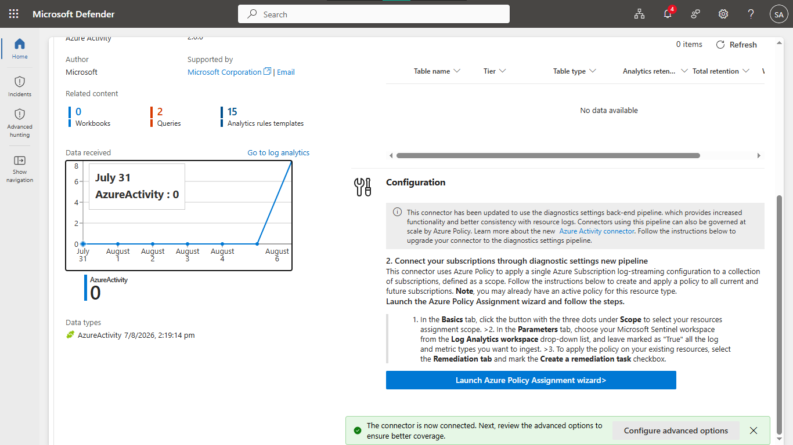
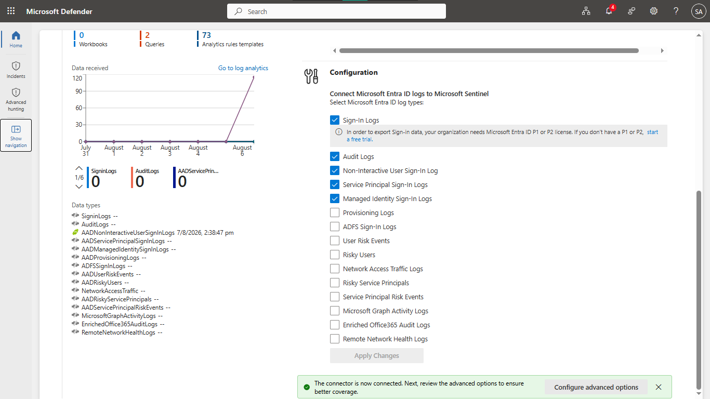
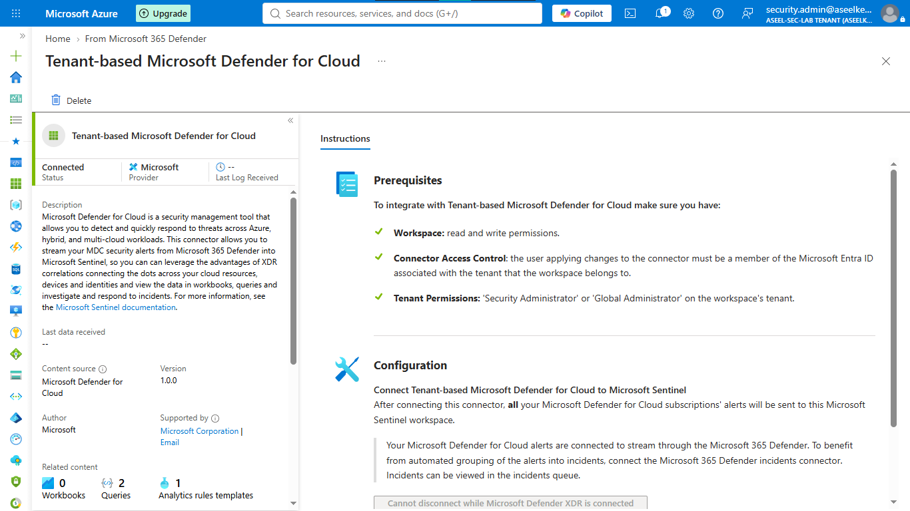
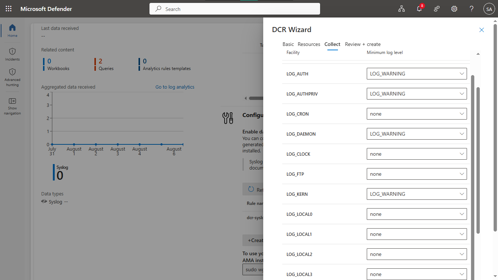

# Lab 43: Sentinel Data Connectors

## Objective
Configure Microsoft Sentinel data connectors to ingest logs from Azure Activity, Microsoft Entra ID, Microsoft Defender for Cloud, Linux Syslog, and network appliances (CEF), using modern Azure Monitor Agent (AMA) and Data Collection Rules (DCRs).

## Security Architecture Concepts
- **Unified Telemetry:** Centralized log aggregation for SOC operations.
- **Data Collection Rules (DCR):** Efficient, rule-based ingestion management using the Azure Monitor Agent (AMA).
- **Hybrid Log Ingestion:** Supporting both Azure resource logs and third-party appliance logs (CEF/Syslog) via an agent-based forwarder.

**Tools/Services Used:** Microsoft Sentinel, Azure Monitor Agent (AMA), Data Collection Rules (DCR), Log Analytics, Azure Entra ID.

## Prerequisites
- Azure subscription with administrative access.
- Microsoft Sentinel enabled in a Log Analytics workspace.
- Linux VM (acting as Syslog/CEF forwarder).

## Implementation Guide
### Task 1: Initialize Workspace and Sentinel
1. Deploy Log Analytics Workspace `law-contoso-soc`.
2. Enable **Microsoft Sentinel** on the workspace.

### Task 2: Connect Azure Activity Logs
1. Install **Azure Activity** solution via Content Hub.
2. Use **Azure Policy Assignment wizard** to configure streaming to `law-contoso-soc` and trigger remediation.

### Task 3: Connect Microsoft Entra ID Logs
1. Install **Microsoft Entra ID** solution via Content Hub.
2. Enable **Sign-in**, **Audit**, and **Managed Identity** logs in the data connector configuration.

### Task 4: Connect Microsoft Defender for Cloud
1. Install **Microsoft Defender for Cloud** solution via Content Hub.
2. Connect subscription and enable **Bi-directional sync**.

### Task 5: Configure Linux Syslog Collection (AMA)
1. Install **Syslog** solution via Content Hub.
2. Create **Data Collection Rule (DCR)** `dcr-syslog-contoso` targeting the Linux VM.
3. Configure facilities (`LOG_AUTH`, `LOG_AUTHPRIV`, etc.) to collect `LOG_WARNING` events.

### Task 6: Configure CEF Log Collection
1. Install **Common Event Format (CEF)** solution via Content Hub.
2. Create **Data Collection Rule (DCR)** `dcr-cef-contoso` targeting the Linux VM.
3. Configure `rsyslog` daemon on the Linux VM to listen on port 514.

## Testing and Verification
1. Validate data connector health in the Sentinel Data connectors page.
2. Run a query in Sentinel Logs (e.g., `SigninLogs | take 10`) to verify data ingestion.
3. Confirm syslog events are correctly received from the Linux forwarder.

## References
- [Connect data sources to Microsoft Sentinel](https://learn.microsoft.com/en-us/azure/sentinel/connect-data-sources)
- [Azure Monitor Agent (AMA)](https://learn.microsoft.com/en-us/azure/azure-monitor/agents/azure-monitor-agent-overview)

