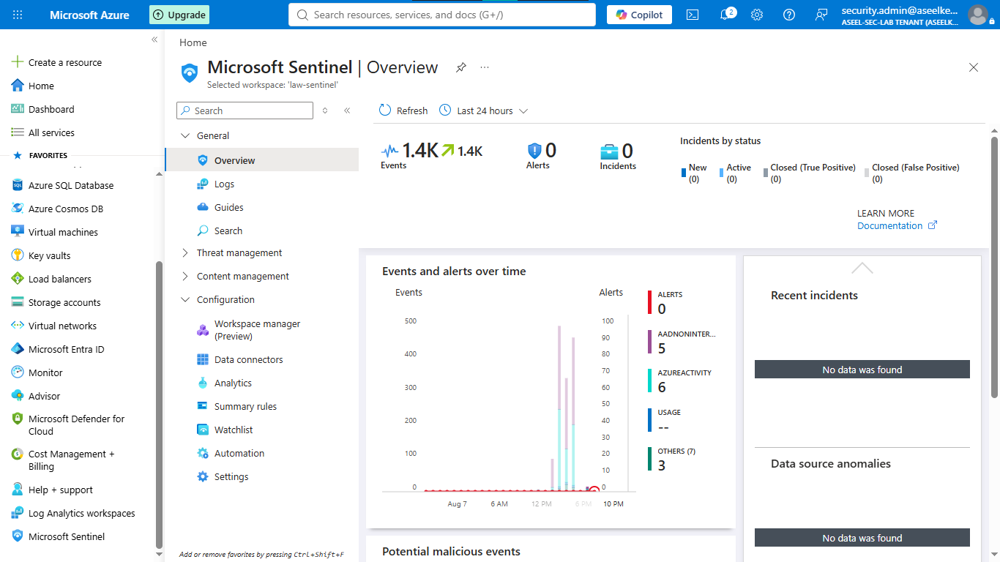
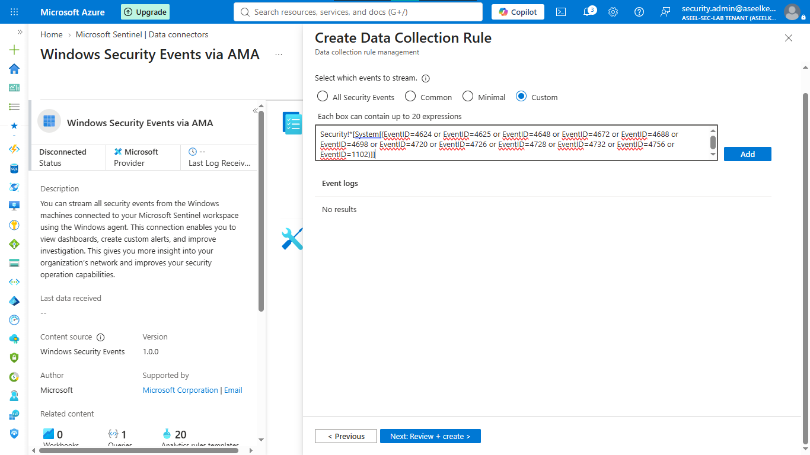
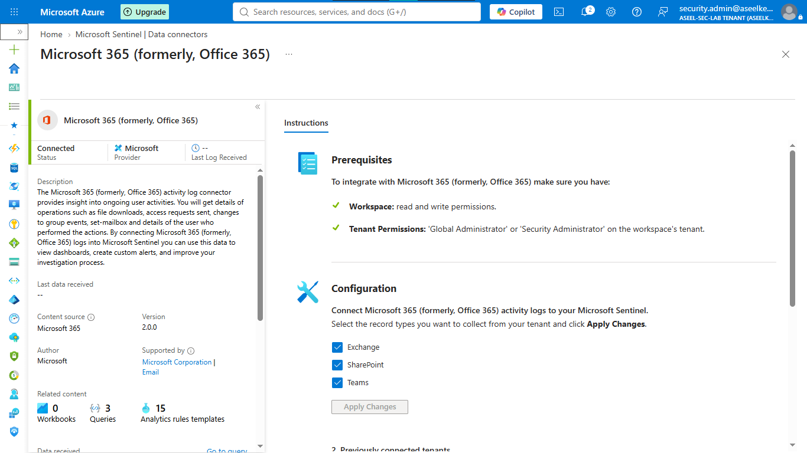

# Lab 44: Sentinel – Windows Security Events & Audit Logs

## Objective
Implement centralized log ingestion for Windows Security Events (via AMA/DCR) and custom application logs, and configure Microsoft Purview audit log collection for security governance.

## Security Architecture Concepts
- **Unified Telemetry:** Aggregating Windows Security, Custom App, and M365 audit logs.
- **Data Collection Rules (DCR):** Granular, rule-based ingestion management using AMA.
- **Log Transformation:** KQL-based data normalization during ingestion.
- **Retention Management:** Tiered retention policies to balance cost and compliance.

**Tools/Services Used:** Microsoft Sentinel, Azure Monitor Agent (AMA), Data Collection Rules (DCR), Log Analytics, Microsoft Purview Audit.

## Prerequisites
- Azure subscription with administrative access.
- Microsoft Sentinel workspace deployed.
- Windows Server Virtual Machine.

## Implementation Guide
### Task 1: Setup Workspace and Deploy Windows VM
1. Create Log Analytics workspace `law-contoso-events`.
2. Enable **Microsoft Sentinel** on the workspace.
3. Deploy Windows VM (`vm-dc-contoso01`).

### Task 2: Configure Windows Security Events (AMA/DCR)
1. Navigate to **Sentinel** -> **Data connectors** -> **Windows Security Events via AMA**.
2. Create DCR `dcr-windows-security`.
3. Add `vm-dc-contoso01` as a resource.
4. Use XPath query to filter for specific security event IDs (e.g., 4624, 4625, 1102).

### Task 3: Create Custom Log Table (`ContosoHRApp_CL`)
1. Create custom log table using DCR-based ingestion wizard.
2. Define schema using `task3-schema.json`.
3. Set retention policies (90 days interactive, 180 days total).

### Task 4: Configure DCR Transformation Pipeline
1. Create **Data Collection Endpoint (DCE)** `dce-contoso-custom`.
2. Update **DCR Transformation Editor** to ensure timestamp integrity.

### Task 5: Configure Microsoft Purview Audit Log Connector
1. Navigate to **Sentinel** -> **Data connectors** -> **Office 365**.
2. Enable log collection for **Exchange**, **SharePoint**, and **Teams**.
3. Click **Apply Changes**.

## Testing and Verification
1. Validate data ingestion using KQL queries (e.g., `SecurityEvent | take 10`).
2. Verify custom HR application logs are appearing in `ContosoHRApp_CL`.
3. Confirm Office 365 logs are streaming into the workspace.

## References
- [Azure Monitor Agent](https://learn.microsoft.com/en-us/azure/azure-monitor/agents/azure-monitor-agent-overview)
- [Microsoft Sentinel Office 365 Connector](https://learn.microsoft.com/en-us/azure/sentinel/connect-office-365)

