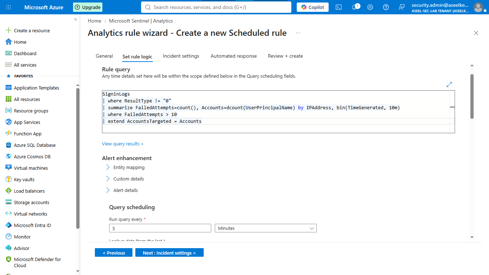
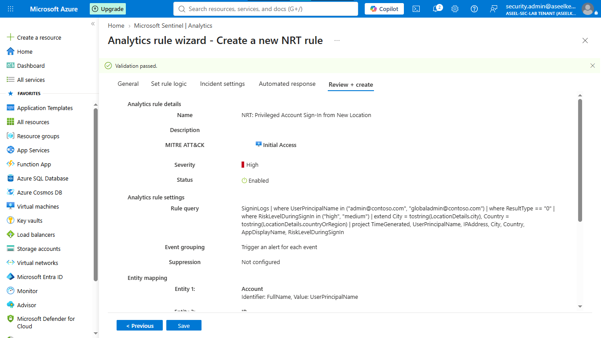
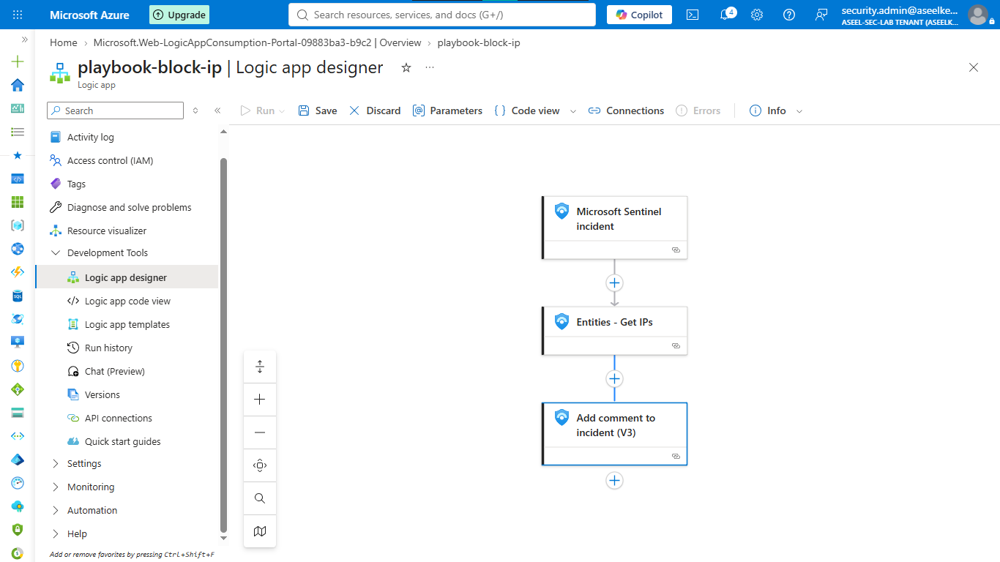
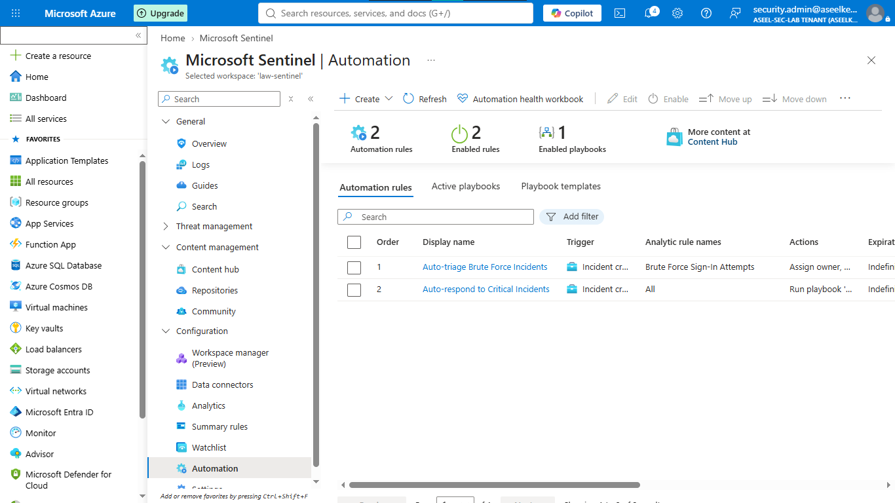
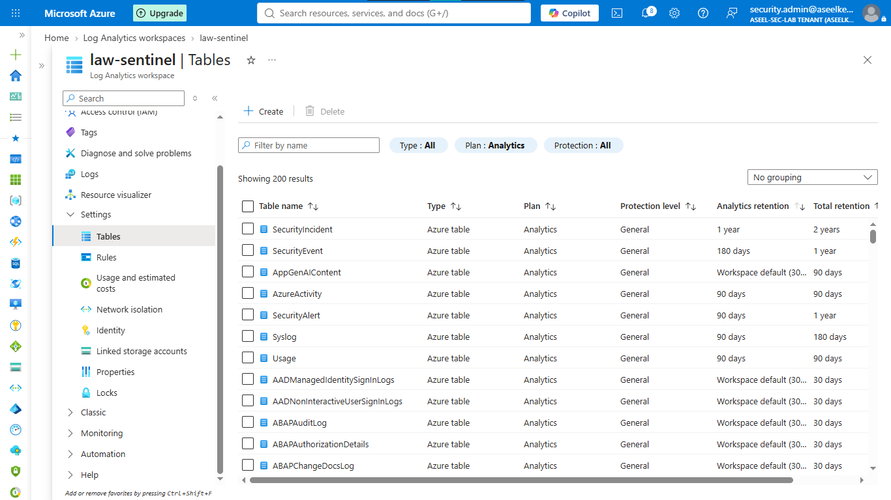

# Lab 45: Sentinel Automation – Rules, Playbooks, and Data Retention

## Objective
Implement SOC automation strategies by designing analytics rules, deploying response playbooks (SOAR) via Logic Apps, and managing log data retention lifecycles.

## Security Architecture Concepts
- **Threat Detection:** Engineering KQL queries for Scheduled and Near-Real-Time (NRT) analytics rules.
- **SOAR:** Automating response workflows using Logic Apps and System-assigned Managed Identities.
- **SOC Efficiency:** Automating triage, tagging, and incident escalation.
- **Data Lifecycle Management:** Balancing investigative depth with cost efficiency via tiered retention policies.

**Tools/Services Used:** Microsoft Sentinel, Azure Logic Apps, Log Analytics, KQL.

## Prerequisites
- Azure subscription with administrative access.
- Basic understanding of Sentinel analytics and automation.

## Implementation Guide
### Task 1: Initialize Workspace and Sentinel
1. Deploy Log Analytics Workspace `law-contoso-automation`.
2. Activate **Microsoft Sentinel** on the workspace.

### Task 2: Configure Scheduled Analytics Rules
1. Create scheduled rule `Brute Force Sign-In Attempts` targeting credential access.
2. Configure entity mapping for IP addresses.

### Task 3: Configure Near-Real-Time (NRT) Analytics Rules
1. Create NRT rule `NRT: Privileged Account Sign-In from New Location` for high-risk identity monitoring.

### Task 4: Deploy Response Playbooks
1. Create Logic App `playbook-block-ip` (Consumption plan).
2. Configure **System-assigned Managed Identity** and grant `Sentinel Responder` role.
3. Design playbook to trigger on Sentinel incident, extract IP entities, and add comment.

### Task 5: Streamline Triage with Automation Rules
1. Create automation rule for auto-triage (severity escalation, tagging).
2. Create automation rule for auto-response (triggering `playbook-block-ip`).

### Task 6: Configure Data Retention
1. Update retention policies for `SecurityIncident`, `SecurityAlert`, and `Syslog` tables.

## Testing and Verification
1. Simulate high-severity incident to trigger automation rules and playbook execution.
2. Verify automated tags and incident assignments.
3. Confirm data retention settings align with compliance requirements.

## References
- [Microsoft Sentinel Playbooks](https://learn.microsoft.com/en-us/azure/sentinel/automate-responses-with-playbooks)
- [Microsoft Sentinel Automation Rules](https://learn.microsoft.com/en-us/azure/sentinel/automate-incident-handling-with-automation-rules)

