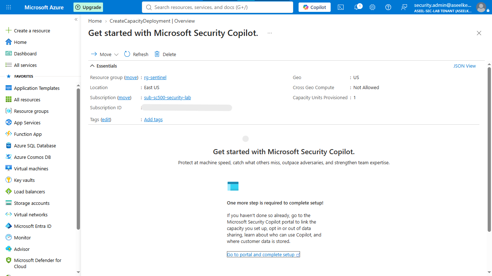
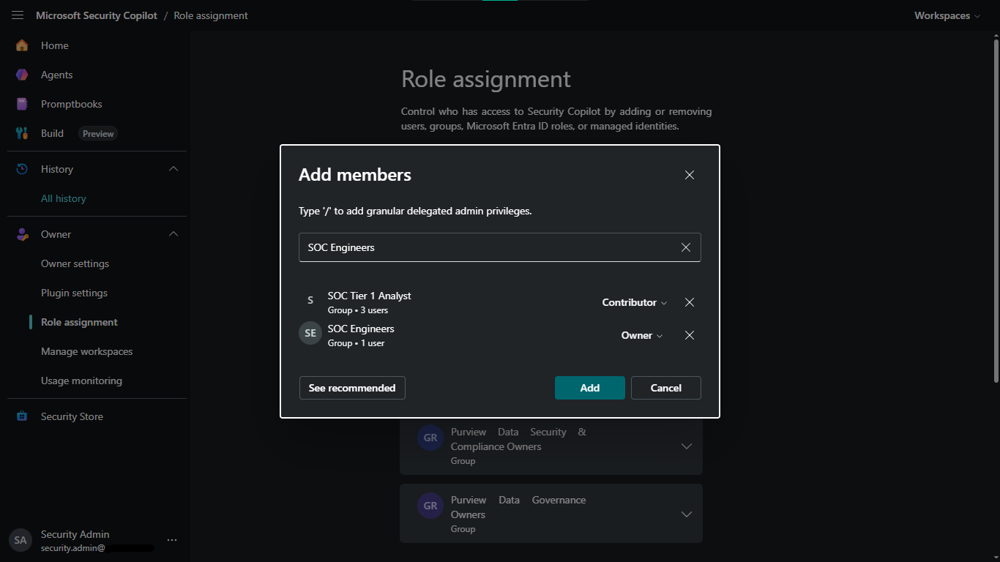
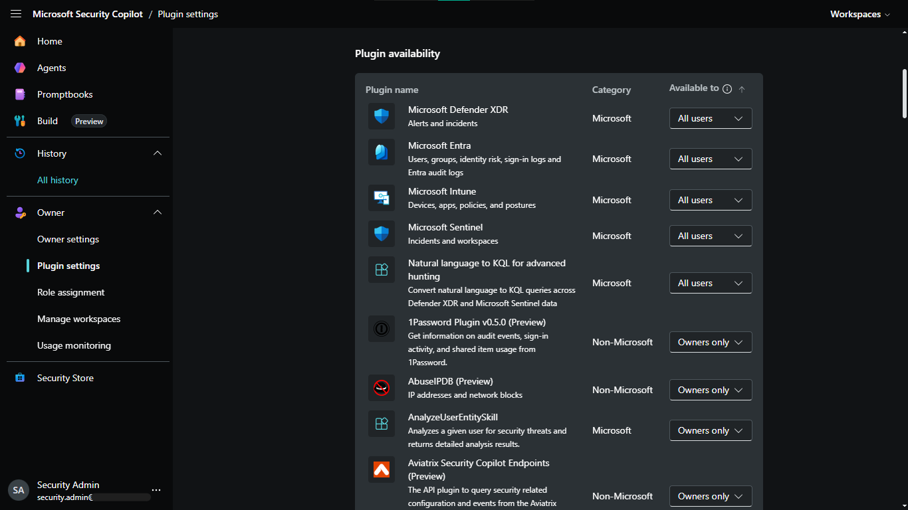
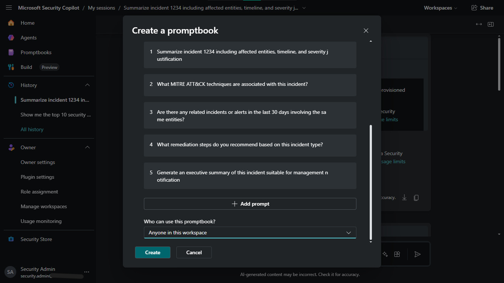
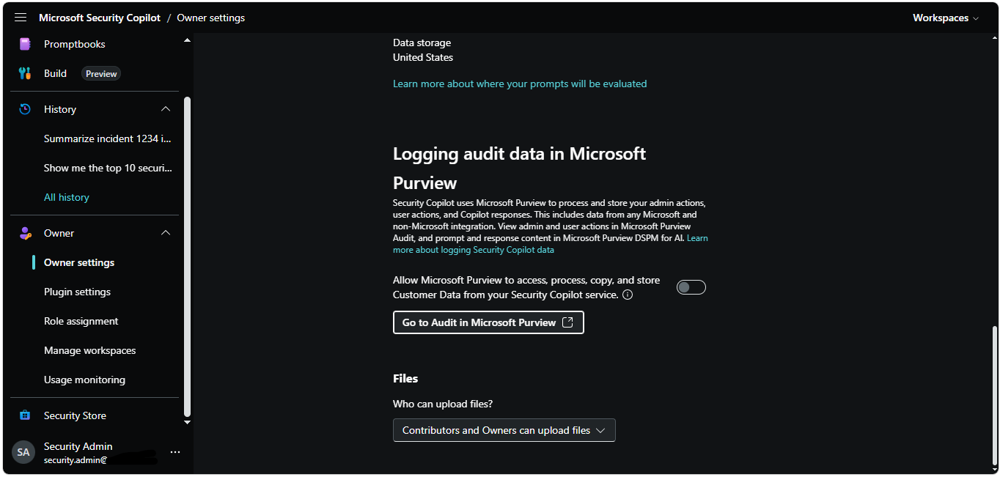

# Lab 46: Security Copilot – Workspace, Permissions, and Plugins

## Objective
Implement Microsoft Security Copilot, configure capacity, manage RBAC for SOC teams, enable integrations via plugins, and engineer automated promptbooks.

## Security Architecture Concepts
- **AI Governance:** Capacity management and data processing region constraints.
- **Identity Governance:** Tiered RBAC for SOC personas (Leads/Analysts).
- **Tool Integration:** Plugin-based context extension (Sentinel, XDR, Entra, Intune).
- **Operational Automation:** Reusable Promptbooks for incident triage standardization.
- **Data Privacy:** Audit logging and strict tenant data boundaries.

**Tools/Services Used:** Microsoft Security Copilot, Microsoft Sentinel, Microsoft Defender XDR, Microsoft Entra ID.

## Prerequisites
- Azure subscription with administrative access.
- Microsoft Sentinel workspace and Defender XDR enabled.

## Implementation Guide
### Task 1: Provision Security Copilot Capacity
1. Create **Security Copilot Capacity** (`scu-contoso-soc`, 3 SCUs).
2. Initialize workspace (`ws-contoso-soc`) and link to provisioned capacity.

### Task 2: Configure RBAC Roles for SOC Team
1. Assign **Owner** role to `SOC-Leads` security group.
2. Assign **Contributor** role to `SOC-Analysts-Tier1` security group.

### Task 3: Enable and Configure Plugins
1. Enable plugins for **Microsoft Defender XDR**, **Microsoft Entra**, and **Microsoft Intune** (set access to All users).
2. Configure **Microsoft Sentinel** plugin with default workspace settings (`law-contoso-sentinel`).

### Task 4: Configure SOC Promptbooks
1. Execute incident triage sequence (summarize, MITRE mapping, related incidents, remediation, summary).
2. Save session as a **Promptbook** (`Incident Triage - Initial Assessment`).
3. Parameterize the incident ID and share with the SOC team.

### Task 5: Configure Data Boundaries and Compliance
1. Verify **Data processing region** and **Tenant boundary** storage constraints.
2. Enable logging to **Microsoft Purview** for audit compliance.

## Testing and Verification
1. Verify SOC team access based on RBAC assignments.
2. Confirm plugins successfully fetch security context.
3. Validate logs appear in Microsoft Purview for audit review.

## References
- [Microsoft Security Copilot](https://learn.microsoft.com/en-us/security-copilot/)
- [Security Copilot Plugins](https://learn.microsoft.com/en-us/security-copilot/plugins-overview)

