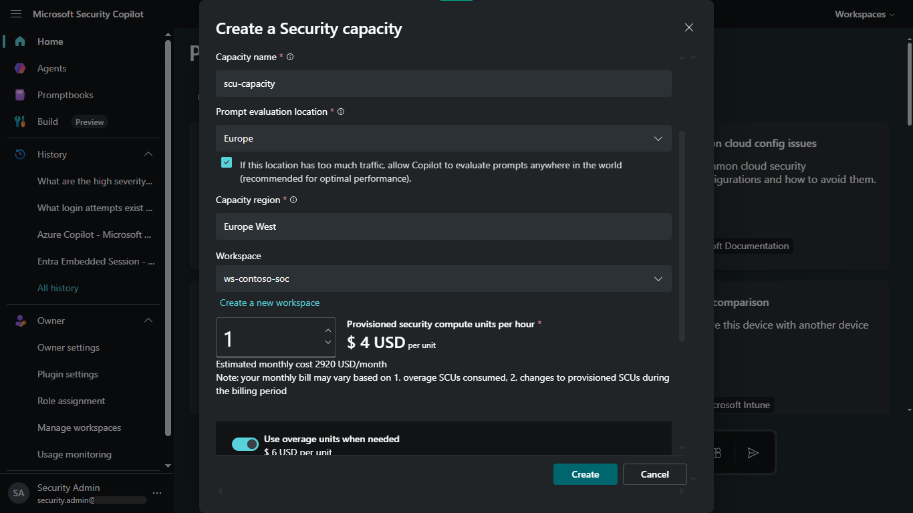
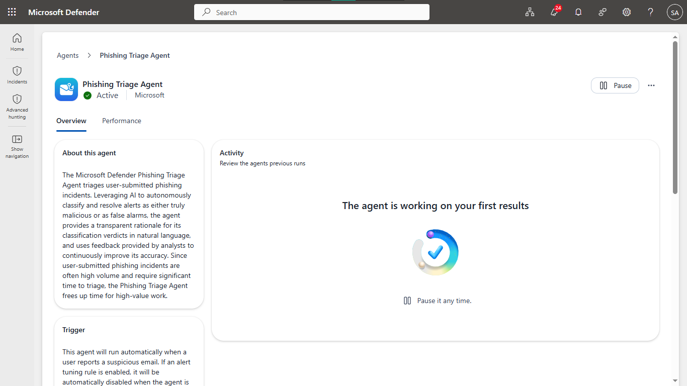
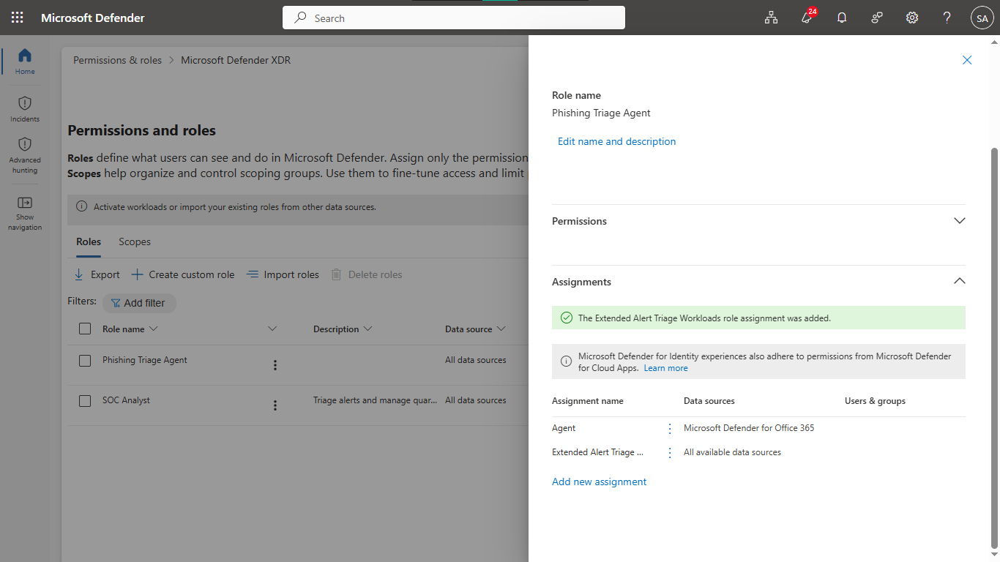
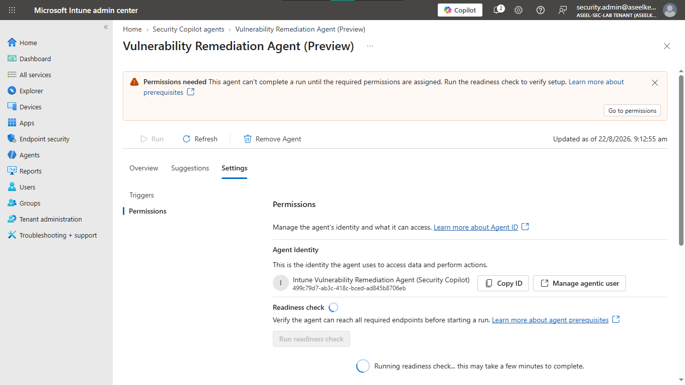
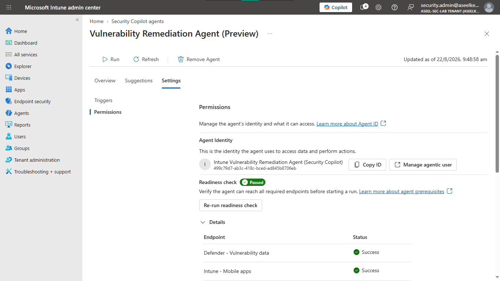
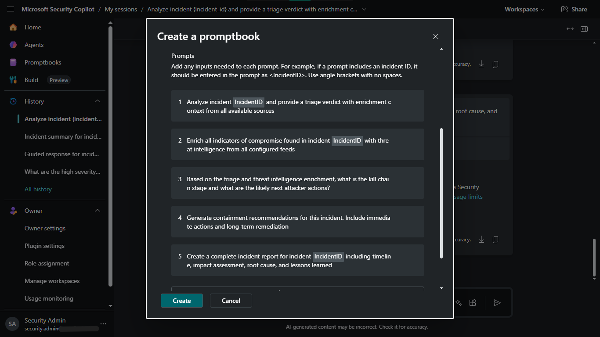

# Lab 47: Security Copilot – Microsoft Agents and Security Store

## Objective
Provision Microsoft Security Copilot compute capacity, configure autonomous agents (Phishing, Vulnerability Remediation), integrate Security Store solutions, and enforce governance guardrails.

## Security Architecture Concepts
- **Autonomous Agents:** AI-driven agents for specialized SOC tasks (phishing triage, vulnerability remediation).
- **Security Store:** Extending Copilot capabilities via integrated threat intelligence solutions.
- **Unified RBAC:** Scoping agent access across security workloads.
- **Governance Guardrails:** Defining plugin and agent availability policies.

**Tools/Services Used:** Microsoft Security Copilot, Microsoft Defender XDR, Microsoft Intune, Microsoft Purview.

## Prerequisites
- Azure subscription with administrative access.
- Microsoft Sentinel workspace and Defender XDR enabled.

## Implementation Guide
### Task 1: Provision Capacity and Phishing Agent
1. Provision **Security Compute Units (SCUs)** in Security Copilot.
2. Enable **Phishing Triage Agent** in the Microsoft Defender portal.

### Task 2: Expand Unified RBAC Scope
1. Configure Defender XDR roles for the agent identity to access Endpoints, Identity, and Cloud Apps telemetry.

### Task 3: Vulnerability Remediation Agent
1. Setup Vulnerability Remediation Agent in Intune.
2. Assign **Read Only Operator** role and run readiness check.

### Task 4: Security Store and Threat Intelligence
1. Install **Threat Intelligence Briefing Agent** from Security Store.
2. Verify active agents inventory.

### Task 5: Incident Response Promptbooks
1. Create a 5-step triage sequence (summarize, MITRE mapping, enrichment, remediation, summary).
2. Save as an enterprise **Promptbook**.

### Task 6: Governance and Audit Logging
1. Configure plugin/agent availability policies.
2. Enable audit logging in Microsoft Purview for compliance tracking.

## Testing and Verification
1. Validate phishing agent triages email incidents.
2. Ensure remediation agent identifies vulnerabilities.
3. Confirm all agent interactions are logged in Purview.

## References
- [Security Copilot Agents](https://learn.microsoft.com/en-us/security-copilot/agents-overview)
- [Security Copilot Promptbooks](https://learn.microsoft.com/en-us/security-copilot/promptbooks-overview)

