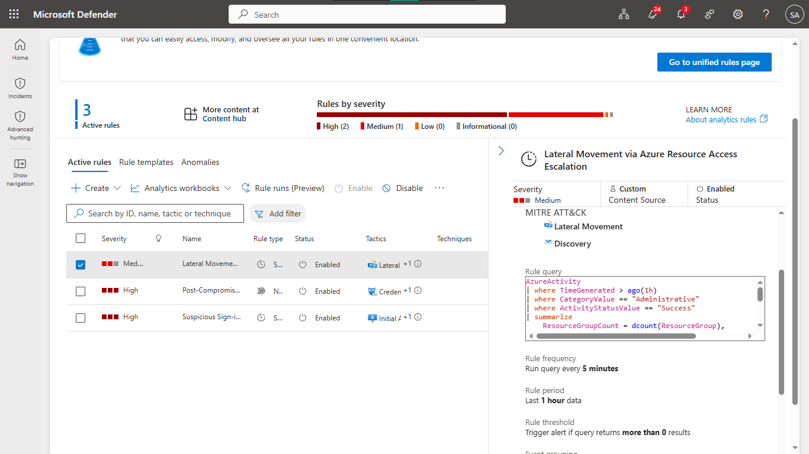
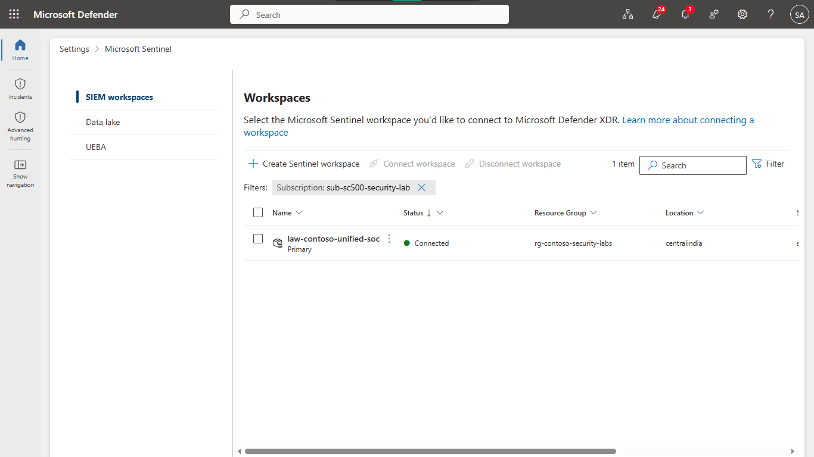
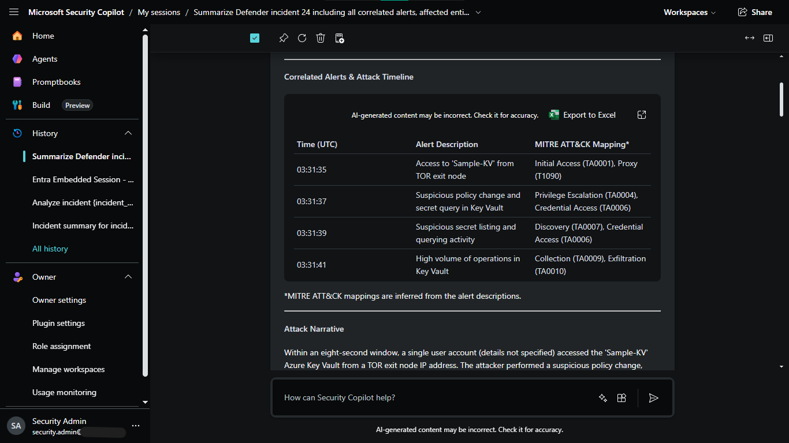
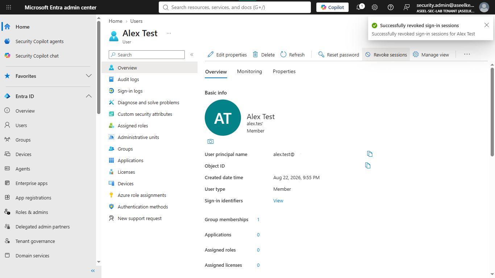
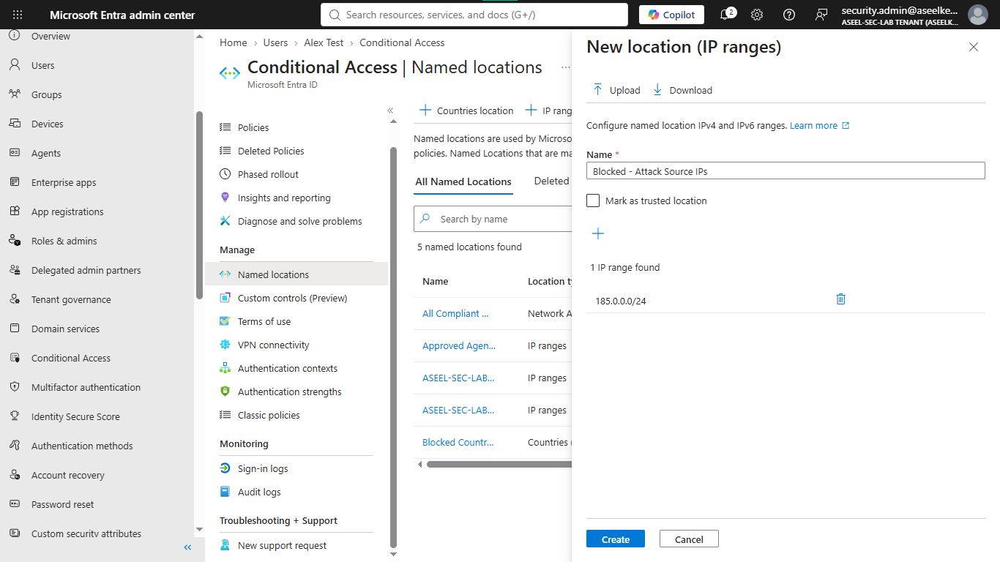
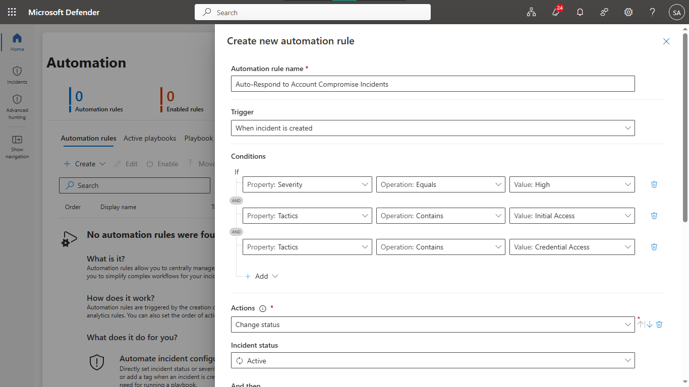

# Lab 48: Integrated Threat Response – Sentinel + Defender XDR + Security Copilot

## Objective
Design and implement an integrated threat detection, investigation, and automated response pipeline by correlating signals across Microsoft Sentinel, Defender XDR, and Security Copilot.

## Security Architecture Concepts
- **Detection Engineering:** KQL-based analytics (Scheduled and NRT) for multi-stage attack detection.
- **Unified SOC:** Correlating signals across Identity, Endpoint, and Cloud workloads.
- **AI-Powered Triage:** Accelerating incident investigation and remediation using Security Copilot.
- **Automated Response (SOAR):** Implementing automated containment (identity revocation, IP blocklists) and triage automation rules.

**Tools/Services Used:** Microsoft Sentinel, Microsoft Defender XDR, Microsoft Security Copilot, Log Analytics.

## Prerequisites
- Azure subscription with administrative access.
- Microsoft Sentinel, Defender XDR, and Security Copilot enabled.

## Implementation Guide
### Task 1: Sentinel Analytics Rules for Multi-Stage Attacks
1. Deploy Scheduled/NRT rules in Sentinel:
    - `Suspicious Sign-in Followed by Azure Resource Access`
    - `Post-Compromise Credential Access Attempt`
    - `Lateral Movement via Azure Resource Access Escalation`

### Task 2: Integrate Sentinel & Defender XDR
1. In the Microsoft Defender portal, verify Sentinel workspace connection for unified incident management.

### Task 3: Threat Hunting with Security Copilot
1. Execute KQL-based hunting queries to trace compromised identity activities and persistence mechanisms.
2. Leverage Security Copilot to summarize incidents, map MITRE ATT&CK tactics, and evaluate the blast radius.

### Task 4: Containment and Automation Rules
1. Implement identity containment (session revocation).
2. Configure network containment (Conditional Access Named Locations for malicious IPs).
3. Automate triage (severity adjustment, incident ownership) via Sentinel Automation Rules.

## Testing and Verification
1. Validate analytics rules trigger on simulated multi-stage attacks.
2. Confirm Security Copilot successfully enriches and summarizes incident data.
3. Test the automated triage and containment workflows (e.g., identity session revocation).

## References
- [Microsoft Sentinel Incidents](https://learn.microsoft.com/en-us/azure/sentinel/incidents)
- [Microsoft Security Copilot for SOC](https://learn.microsoft.com/en-us/security-copilot/get-started-copilot)

