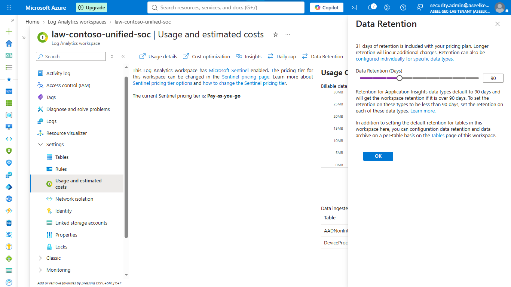
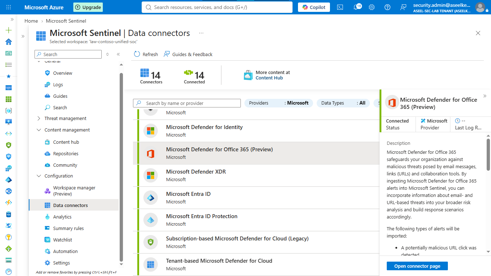
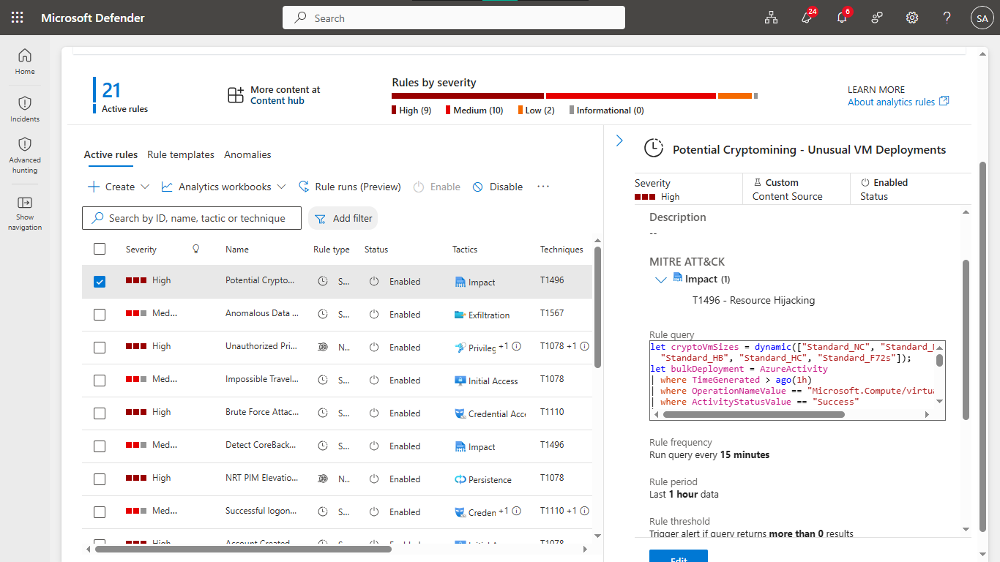
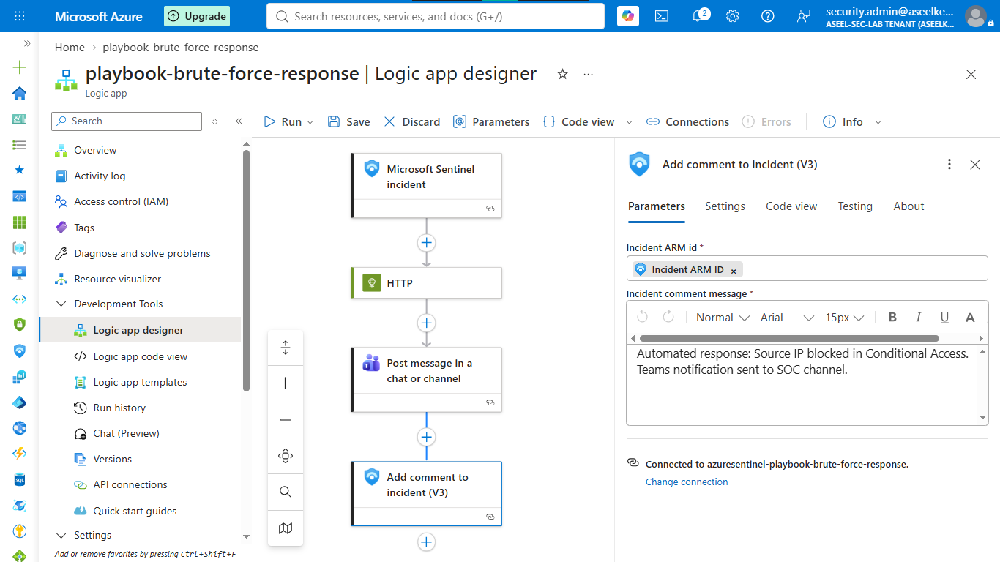
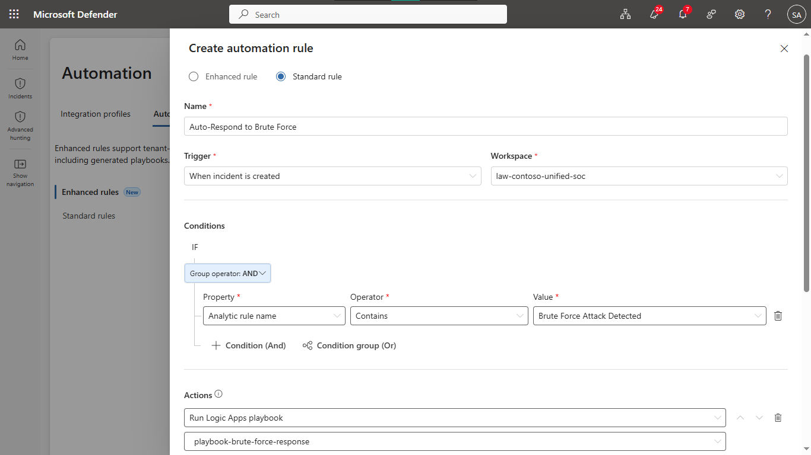
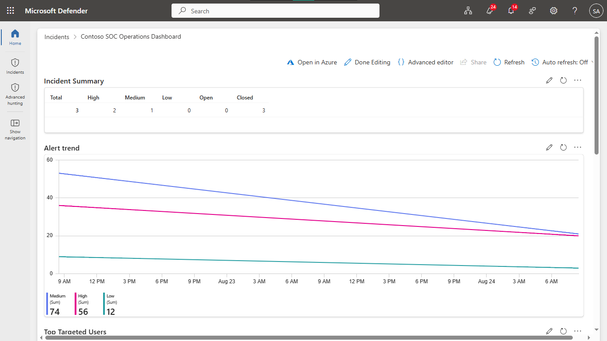
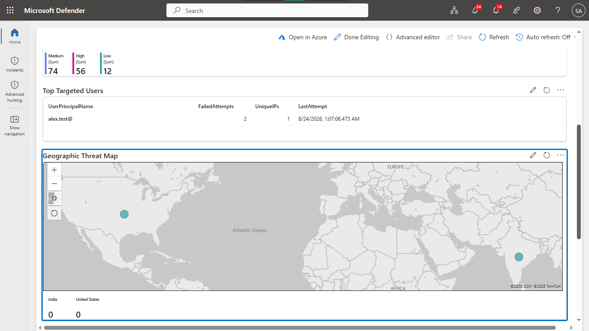
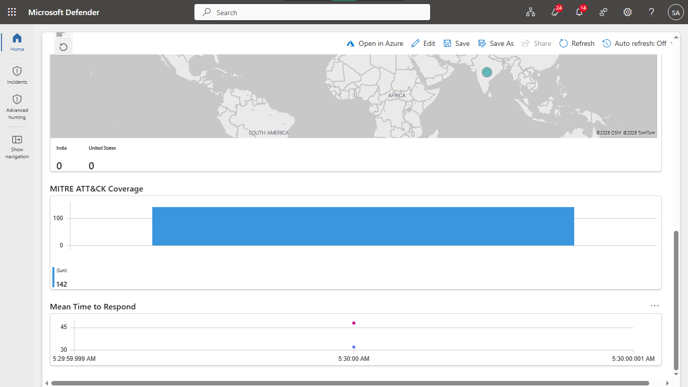
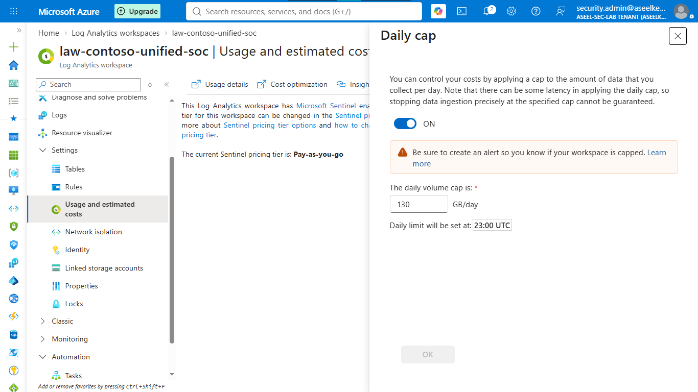
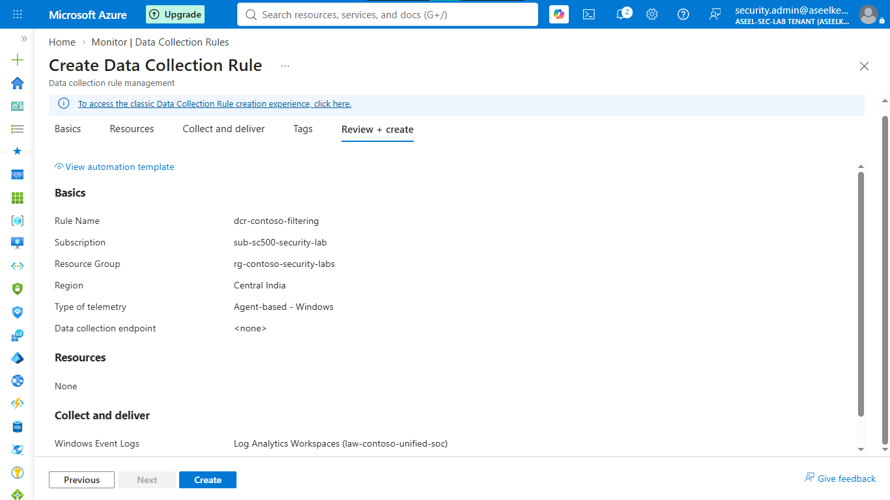

# Lab 49: Security Monitoring Architecture – End-to-End Detection Scenario

## Objective
Design and implement a comprehensive security monitoring architecture using Microsoft Sentinel, featuring log ingestion, detection engineering (MITRE ATT&CK mapping), SOAR automation, and cost-optimized data lifecycle management.

## Security Architecture Concepts
- **Unified SIEM:** Centralized log aggregation and threat detection.
- **Detection Engineering:** KQL-based analytics rules mapped to MITRE ATT&CK.
- **SOAR:** Automated incident response using Logic Apps (playbooks).
- **Cost Optimization:** Ingestion filtering (DCRs) and tiered data retention policies.

**Tools/Services Used:** Microsoft Sentinel, Azure Log Analytics, Microsoft Entra ID, Microsoft Defender XDR, Azure Logic Apps, Azure Policy.

## Prerequisites
- Azure subscription with administrative access.
- Basic understanding of SOC operations and KQL.

## Implementation Guide
### Task 1: Foundation and Workspace Setup
1. Deploy Log Analytics Workspace `law-contoso-unified-soc`.
2. Activate **Microsoft Sentinel** on the workspace.
3. Configure data retention (90 days interactive, 730 days archive).

### Task 2: Data Connector Configuration
1. Enable connectors for **Entra ID**, **Defender XDR**, **Defender for Cloud**, **Microsoft 365**, and **Azure Activity**.

### Task 3: Analytics Rule Engineering
1. Create detection rules:
    - `Suspicious Sign-in Followed by Azure Resource Access`
    - `Post-Compromise Credential Access Attempt`
    - `Lateral Movement via Azure Resource Access Escalation`

### Task 4: SOAR Automation (Logic Apps)
1. Design incident-triggered playbooks for automated response.
2. Configure automation rules to trigger playbooks on high-severity incidents.

### Task 5: SOC Operations Dashboard
1. Design custom workbooks for threat visibility, incident summary, and MTTR tracking.

### Task 6: Cost Optimization
1. Apply daily ingestion caps and DCR-based filtering (XPath queries) to manage data volume.

## Testing and Verification
1. Validate Sentinel ingestion and analytic rule triggers.
2. Confirm automated responses (e.g., blocking IPs) function as expected.
3. Verify dashboard visualizations accurately reflect threat activity.

## References
- [Microsoft Sentinel Documentation](https://learn.microsoft.com/en-us/azure/sentinel/overview)
- [Microsoft Sentinel SOAR](https://learn.microsoft.com/en-us/azure/sentinel/automation)

